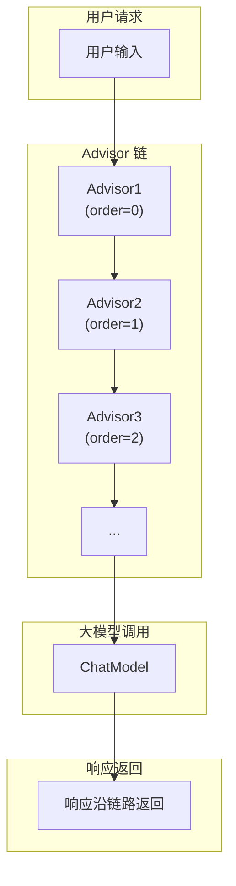
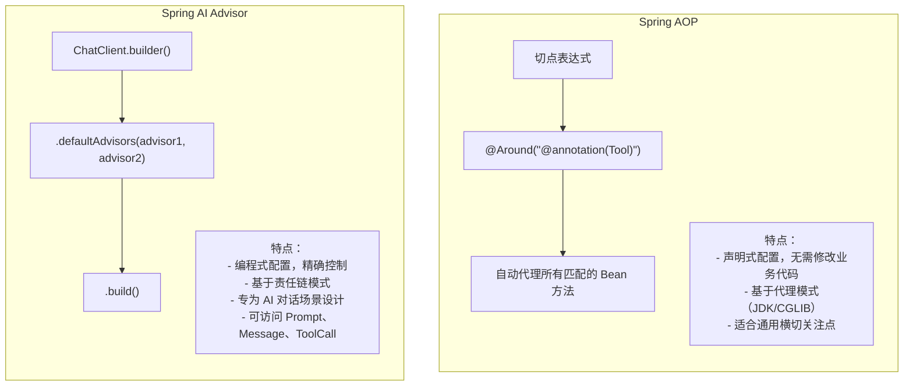
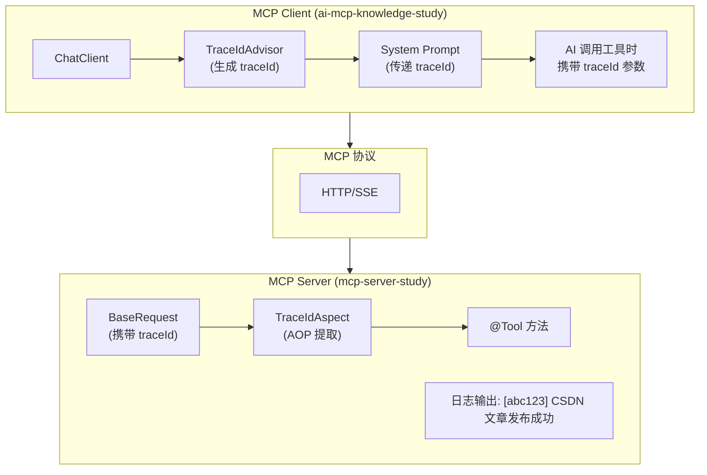

# Spring AI Advisor 机制详解

> 本文档详细介绍 Spring AI 的 Advisor 机制，包括核心概念、使用方式、与 AOP 的对比分析。

## 1. 什么是 Advisor

Advisor 是 Spring AI 提供的**请求拦截器机制**，用于在 ChatClient 调用大模型前后执行横切逻辑。

### 1.1 核心接口

```java
public interface CallAdvisor extends Advisor {

    // Advisor 名称，用于日志和调试
    String getName();

    // 执行顺序，值越小优先级越高
    int getOrder();

    // 核心方法：拦截请求并处理
    ChatClientResponse adviseCall(ChatClientRequest request, CallAdvisorChain chain);
}
```

### 1.2 执行流程



## 2. Advisor vs AOP 对比分析

### 2.1 核心区别

| 维度 | Spring AI Advisor | Spring AOP |
|------|-------------------|------------|
| **作用范围** | 仅作用于 ChatClient 调用链 | 作用于任意 Spring Bean 方法 |
| **拦截粒度** | 请求/响应级别 | 方法级别 |
| **配置方式** | 显式注入到 ChatClient | 通过切点表达式自动织入 |
| **侵入性** | 低（需手动注入） | 低（自动代理） |
| **上下文访问** | 可访问 ChatClientRequest/Response | 可访问 JoinPoint |
| **链式调用** | CallAdvisorChain | ProceedingJoinPoint.proceed() |
| **排序机制** | getOrder() 方法 | @Order 注解 |

### 2.2 设计理念对比



### 2.3 代码对比示例

#### AOP 方式（MCP Server 端）

```java
@Aspect
@Component
public class TraceIdAspect {

    @Around("@annotation(org.springframework.ai.tool.annotation.Tool)")
    public Object injectTraceId(ProceedingJoinPoint joinPoint) throws Throwable {
        // 前置：注入 traceId
        String traceId = extractTraceIdFromArgs(joinPoint.getArgs());
        MDC.put("traceId", traceId);

        try {
            // 执行目标方法
            return joinPoint.proceed();
        } finally {
            // 后置：清理
            MDC.remove("traceId");
        }
    }
}
```

#### Advisor 方式（MCP Client 端）

```java
@Component
public class TraceIdAdvisor implements CallAdvisor {

    @Override
    public ChatClientResponse adviseCall(ChatClientRequest request, CallAdvisorChain chain) {
        // 前置：生成 traceId
        String traceId = generateTraceId();
        MDC.put("traceId", traceId);
        log.info("[{}] 请求开始", traceId);

        try {
            // 调用下一个 Advisor 或 ChatModel
            return chain.nextCall(request);
        } finally {
            // 后置：清理
            log.info("[{}] 请求结束", traceId);
            MDC.remove("traceId");
        }
    }
}
```

### 2.4 何时使用哪种方式

| 场景 | 推荐方式 | 原因 |
|------|----------|------|
| MCP Server 工具方法拦截 | AOP | 工具方法分散在各处，AOP 可统一拦截 |
| ChatClient 请求/响应处理 | Advisor | 专为 AI 对话设计，可访问 AI 上下文 |
| 通用日志记录 | AOP | 适用于所有 Bean 方法 |
| 对话记忆管理 | Advisor | 需要访问 Message 历史 |
| 事务管理 | AOP | Spring 原生支持 |
| Prompt 增强/改写 | Advisor | 可直接修改 ChatClientRequest |

## 3. 内置 Advisor 介绍

Spring AI 提供了多个开箱即用的 Advisor：

| Advisor | 功能 | 使用场景 |
|---------|------|----------|
| `PromptChatMemoryAdvisor` | 对话记忆 | 多轮对话上下文保持 |
| `VectorStoreChatMemoryAdvisor` | 向量存储记忆 | 长期记忆检索 |
| `QuestionAnswerAdvisor` | RAG 问答 | 基于文档的问答 |
| `SafeGuardAdvisor` | 安全过滤 | 敏感内容过滤 |

## 4. 自定义 Advisor 实战

### 4.1 TraceIdAdvisor 完整实现

```java
@Slf4j
@Component
public class TraceIdAdvisor implements CallAdvisor {

    private static final String TRACE_ID_KEY = "traceId";

    @Override
    public String getName() {
        return "TraceIdAdvisor";
    }

    @Override
    public int getOrder() {
        // 最高优先级，确保 traceId 在其他 Advisor 之前注入
        return Ordered.HIGHEST_PRECEDENCE;
    }

    @Override
    public ChatClientResponse adviseCall(ChatClientRequest request, CallAdvisorChain chain) {
        // 1. 生成或获取 traceId
        String traceId = MDC.get(TRACE_ID_KEY);
        boolean generated = false;

        if (traceId == null || traceId.isEmpty()) {
            traceId = generateTraceId();
            MDC.put(TRACE_ID_KEY, traceId);
            generated = true;
        }

        // 2. 记录请求开始
        long startTime = System.currentTimeMillis();
        log.info("[{}] MCP 请求开始", traceId);

        try {
            // 3. 调用下一个 Advisor 或 ChatModel
            ChatClientResponse response = chain.nextCall(request);

            // 4. 记录请求完成
            long cost = System.currentTimeMillis() - startTime;
            log.info("[{}] MCP 请求完成, 耗时: {}ms", traceId, cost);

            return response;
        } catch (Exception e) {
            // 5. 记录请求失败
            long cost = System.currentTimeMillis() - startTime;
            log.error("[{}] MCP 请求失败, 耗时: {}ms, 错误: {}", traceId, cost, e.getMessage());
            throw e;
        } finally {
            // 6. 清理 MDC（仅清理自己生成的）
            if (generated) {
                MDC.remove(TRACE_ID_KEY);
            }
        }
    }

    private String generateTraceId() {
        return UUID.randomUUID().toString().replace("-", "").substring(0, 16);
    }
}
```

### 4.2 使用方式

```java
// 方式一：构建时注入
var chatClient = ChatClient.builder(chatModel)
        .defaultAdvisors(traceIdAdvisor, memoryAdvisor)
        .build();

// 方式二：请求时注入
chatClient.prompt()
        .advisors(traceIdAdvisor)
        .user("你好")
        .call();
```

## 5. 端到端链路追踪架构

本项目实现了 MCP Client → MCP Server 的端到端链路追踪：



### 5.1 关键实现点

1. **Client 端**：TraceIdAdvisor 生成 traceId，通过 System Prompt 告知 AI
2. **AI 行为**：AI 在调用工具时，将 traceId 作为参数传递
3. **Server 端**：TraceIdAspect (AOP) 从请求参数中提取 traceId，注入 MDC
4. **日志关联**：Client 和 Server 的日志都带有相同的 traceId，便于问题排查

## 6. 总结

| 技术 | 适用层 | 核心机制 | 典型场景 |
|------|--------|----------|----------|
| Spring AI Advisor | MCP Client | 责任链模式 | 对话拦截、记忆管理、Prompt 增强 |
| Spring AOP | MCP Server | 代理模式 | 工具方法拦截、日志、事务 |

**最佳实践**：
- Client 端使用 Advisor 处理 AI 对话相关的横切逻辑
- Server 端使用 AOP 处理工具方法的通用横切逻辑
- 两者配合实现端到端的链路追踪
