# Spring AI Gemini 模型 MCP 工具调用完整执行流程

> 本文档详细梳理了 `test_gemini_tool()` 测试方法中，从用户输入到最终输出的完整执行流程。

## 1. 整体架构概览

### 1.1 核心组件架构图

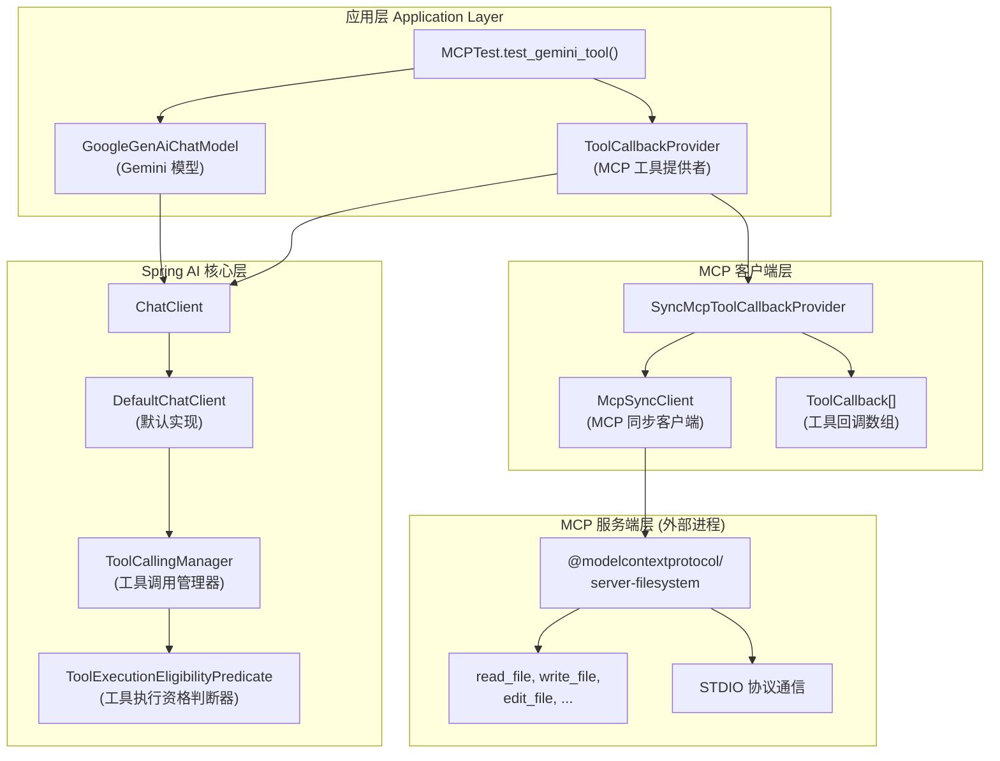

### 1.2 依赖关系

| 组件 | Maven 依赖 | 作用 |
|------|-----------|------|
| Gemini 模型 | `spring-ai-starter-model-google-genai` | 提供 Gemini AI 模型能力 |
| MCP 客户端 | `spring-ai-starter-mcp-client-webflux` | 连接 MCP Server |
| MCP 服务端 | `spring-ai-starter-mcp-server` | 暴露本地工具服务 |

---

## 2. 启动阶段：Spring Boot 自动配置

### 2.1 MCP 客户端自动配置流程

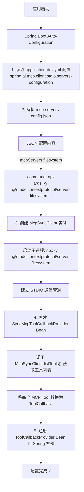

### 2.2 MCP 工具发现时序图

当 `McpSyncClient` 初始化时，会通过 MCP 协议向服务端发送请求：

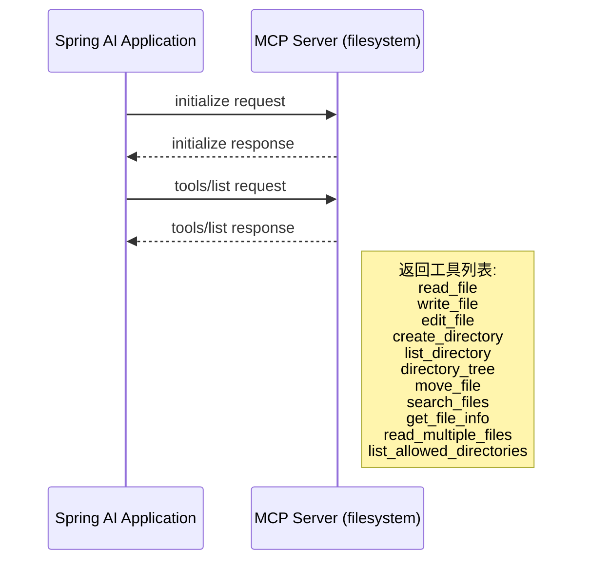

### 2.3 返回的工具列表

| 工具名称 | 功能描述 |
|---------|----------|
| `read_file` | 读取文件的完整内容 |
| `read_multiple_files` | 同时读取多个文件的内容 |
| `write_file` | 建立新文件或完全覆写现有文件 |
| `edit_file` | 对文本文件进行基于行的编辑 |
| `create_directory` | 建立新目录或确保目录存在 |
| `list_directory` | 取得指定路径中所有文件和目录的详细清单 |
| `directory_tree` | 取得文件和目录的递归树状检视 |
| `move_file` | 移动或重新命名文件和目录 |
| `search_files` | 递归搜索符合模式的文件和目录 |
| `get_file_info` | 检索有关文件或目录的详细元数据 |
| `list_allowed_directories` | 返回此服务器允许访问的目录清单 |

---

## 3. 测试执行阶段：完整调用流程

### 3.1 主时序图（本例：询问工具列表）

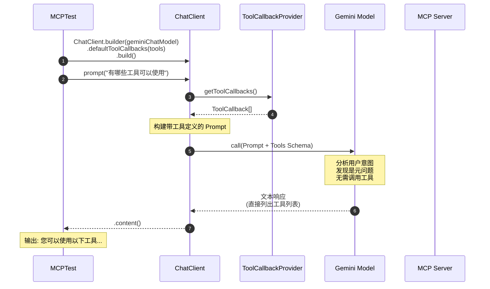

### 3.2 详细执行步骤

#### 步骤 1：创建 ChatClient 实例

```java
var chatClient = ChatClient.builder(geminiChatModel)
        .defaultToolCallbacks(tools)  // 注入 MCP 工具回调
        .build();
```

**内部处理流程：**

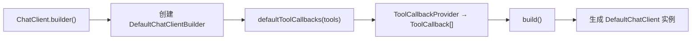

#### 步骤 2：发起 Prompt 请求

```java
chatClient.prompt(userInput).call().content()
```

**内部处理流程：**

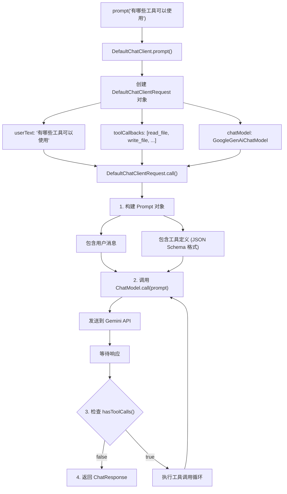

#### 步骤 3：Gemini API 请求构建

`GoogleGenAiChatModel` 将请求转换为 Gemini API 格式：

```json
{
  "contents": [
    {
      "role": "user",
      "parts": [
        { "text": "有哪些工具可以使用" }
      ]
    }
  ],
  "tools": [
    {
      "functionDeclarations": [
        {
          "name": "read_file",
          "description": "读取文件的完整内容",
          "parameters": {
            "type": "object",
            "properties": {
              "path": {
                "type": "string",
                "description": "文件路径"
              }
            },
            "required": ["path"]
          }
        }
      ]
    }
  ],
  "generationConfig": {
    "temperature": 0.7
  }
}
```

#### 步骤 4：Gemini 模型响应

由于用户问的是 "有哪些工具可以使用"，Gemini 模型并未发起工具调用，而是直接基于请求中的工具定义信息，生成了工具列表的文本描述：

```
您可以使用以下工具：

`read_file`: 讀取檔案的完整內容。
`read_multiple_files`: 同時讀取多個檔案的內容。
`write_file`: 建立新檔案或完全覆寫現有檔案。
...
```

---

## 4. 带工具执行的完整流程（假设场景）

如果用户输入的是需要实际调用工具的请求（如："读取 /Users/xiexu/Desktop 目录下的文件列表"），则会触发完整的工具调用流程：

### 4.1 工具调用时序图

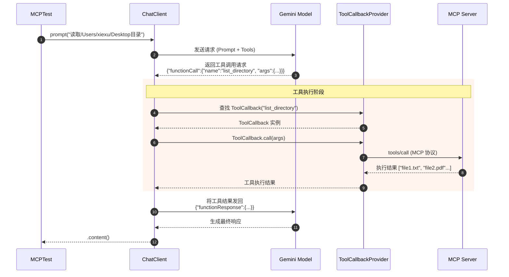

### 4.2 工具调用内部处理流程

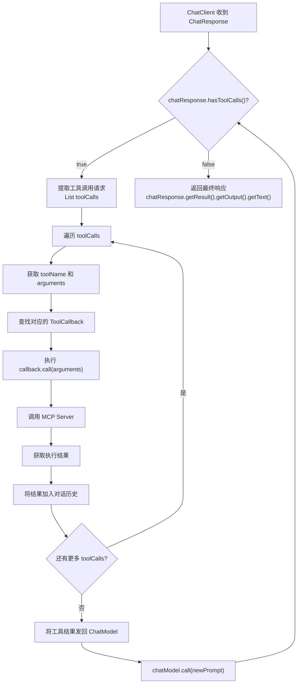

---

## 5. 核心类与接口

### 5.1 类图

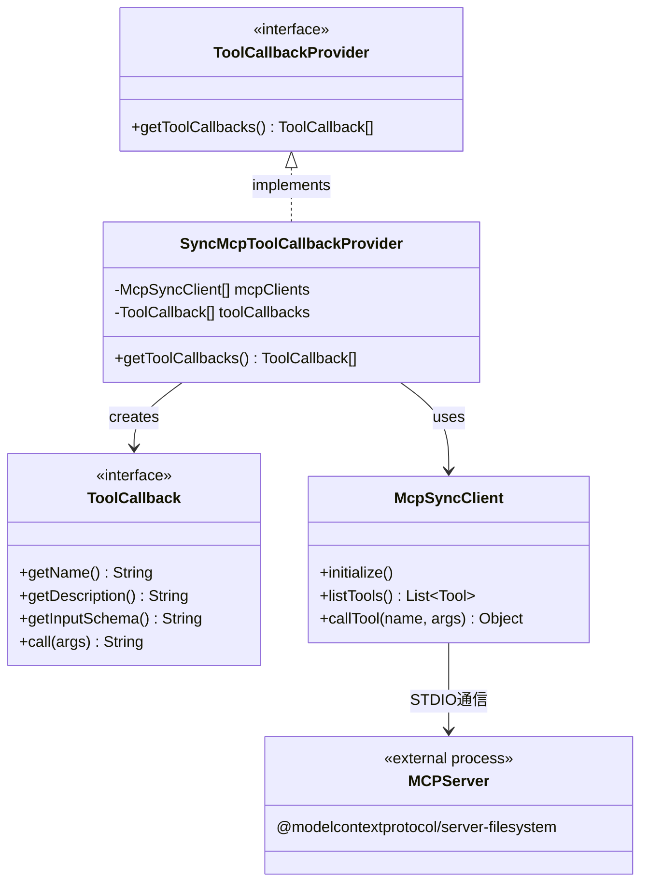

### 5.2 核心配置类

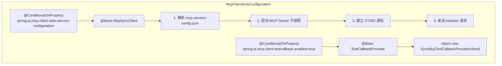

---

## 6. 配置文件说明

### 6.1 application-dev.yml

```yaml
spring:
  ai:
    mcp:
      client:
        request-timeout: 360s                                    # MCP 请求超时时间
        stdio:
          servers-configuration: classpath:/config/mcp-servers-config.json  # MCP 服务配置
    google:
      genai:
        api-key: ${GOOGLE_AI_API_KEY}                           # Google AI API Key
        chat:
          options:
            model: gemini-2.0-flash                              # 使用的模型
```

### 6.2 mcp-servers-config.json

```json
{
  "mcpServers": {
    "filesystem": {
      "command": "npx",
      "args": [
        "-y",
        "@modelcontextprotocol/server-filesystem@2025.3.28",
        "/Users/xiexu/Desktop",
        "/Users/xiexu/Desktop"
      ]
    }
  }
}
```

### 6.3 配置解析流程

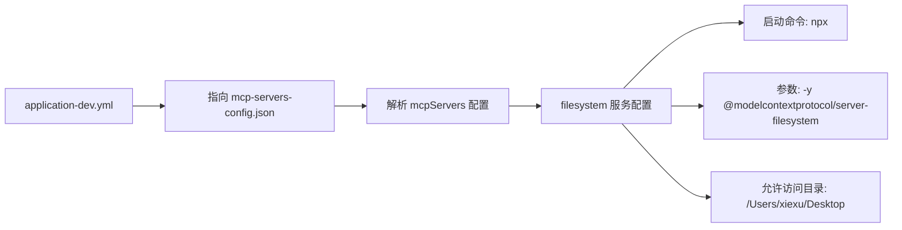

---

## 7. 关键概念总结

### 7.1 MCP 协议 (Model Context Protocol)

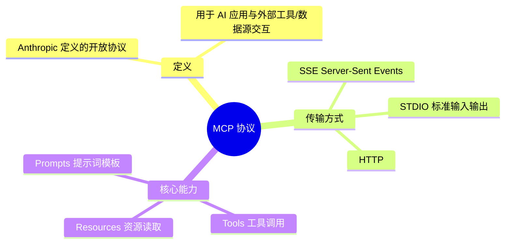

### 7.2 Function Calling / Tool Calling 流程

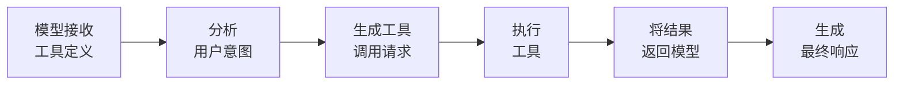

### 7.3 为什么本例没有触发实际工具调用？

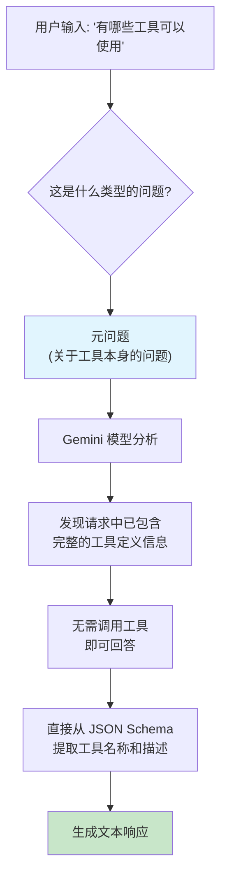

---

## 8. 完整数据流图

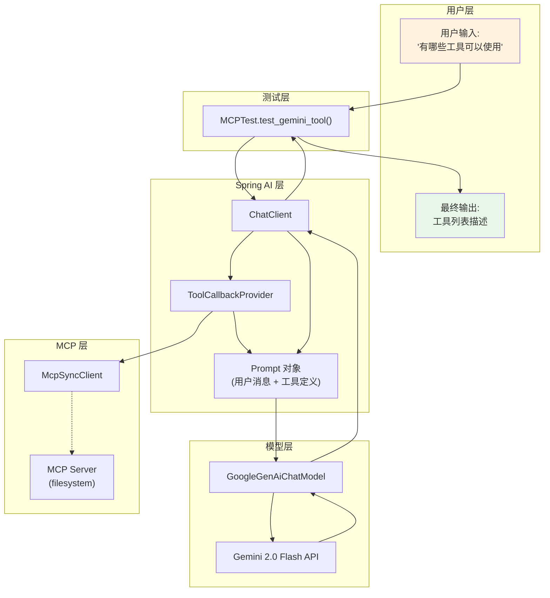

---

## 9. 参考资料

- [Spring AI 官方文档 - MCP Client](https://docs.spring.io/spring-ai/reference/api/mcp/mcp-client-boot-starter-docs.html)
- [Spring AI 官方文档 - Tools](https://docs.spring.io/spring-ai/reference/api/tools.html)
- [Model Context Protocol 规范](https://modelcontextprotocol.io/)
- [Google AI Gemini API 文档](https://ai.google.dev/gemini-api/docs)

---

**文档作者**: xiexu
**创建日期**: 2026-01-17
**适用版本**: Spring AI 1.1.2 / Spring Boot 3.4.3
