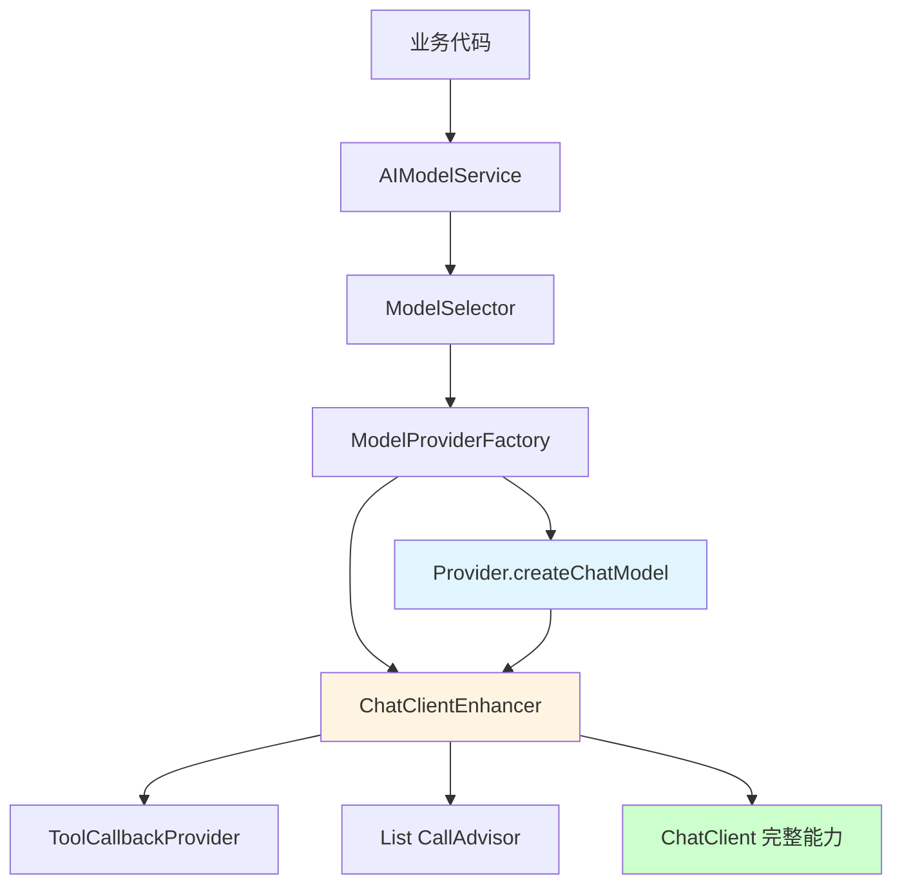
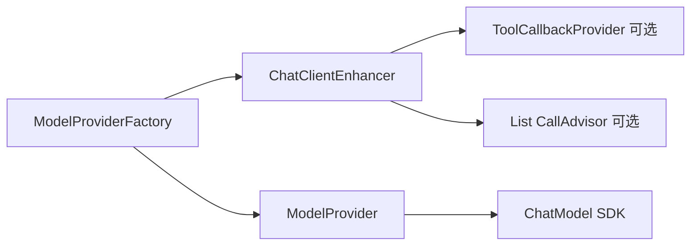

# MCP 工具集成重构计划 - 方案 B（Factory 统一装配）

> **开始时间**：2026-01-28
> **任务名称**：集成 MCP 工具到编排层（方案 B）
> **状态**：待批准

---

## 方案选择

经过 Codex 深度分析，从架构完整性和长期维护性角度，选择**方案 B：Factory 统一装配**。

### 方案 B 优势

| 维度 | 优势 |
|------|------|
| **职责划分** | Provider 专注模型创建，Factory 负责装配 |
| **扩展性** | 新增 Provider 无需关心增强逻辑 |
| **一致性** | Factory 强制统一增强，避免遗漏 |
| **测试性** | 测试集中在 Factory/Enhancer |
| **代码重复** | 增强逻辑集中，无重复 |
| **架构原则** | 更符合 DDD 和 SOLID 原则 |

---

## 架构设计

### 当前调用链（问题）

```
AIModelService
  → ModelSelector
  → ModelProviderFactory.getProvider(type)
  → Provider.createChatClient()  ❌ 未注入工具和 Advisors
```

### 目标调用链（方案 B）

```
AIModelService
  → ModelSelector
  → ModelProviderFactory.createChatClient(config)
  → ChatClientEnhancer.enhance(chatModel)
  → ChatClient（完整能力：编排 + MCP + Advisors）
```

### 职责划分



---

## 文件结构设计

### 新增文件

- `ai-mcp-knowledge-orchestration/src/main/java/com/xbk/knowledge/orchestration/config/ChatClientEnhancer.java`

### 修改文件

- `ai-mcp-knowledge-orchestration/src/main/java/com/xbk/knowledge/orchestration/provider/ModelProvider.java`（接口）
- `ai-mcp-knowledge-orchestration/src/main/java/com/xbk/knowledge/orchestration/provider/ModelProviderFactory.java`
- `ai-mcp-knowledge-orchestration/src/main/java/com/xbk/knowledge/orchestration/provider/OpenAIModelProvider.java`
- `ai-mcp-knowledge-orchestration/src/main/java/com/xbk/knowledge/orchestration/provider/AnthropicModelProvider.java`
- `ai-mcp-knowledge-orchestration/src/main/java/com/xbk/knowledge/orchestration/provider/GeminiModelProvider.java`

### 检查文件

- `ai-mcp-knowledge-orchestration/src/main/java/com/xbk/knowledge/orchestration/service/impl/AIModelServiceImpl.java`
- `ai-mcp-knowledge-orchestration/src/main/java/com/xbk/knowledge/orchestration/fallback/FallbackHandler.java`

### 测试文件

- `ai-mcp-knowledge-app/src/test/java/com/xbk/knowledge/test/MCPTest.java`

---

## 接口变更方案（向后兼容）

### 策略

- **保留** `ModelProvider.createChatClient` 方法（避免编译失败）
- **标记为过渡**：内部不再包含增强逻辑
- **统一入口**：所有调用方通过 `ModelProviderFactory.createChatClient` 获取 ChatClient

### 兼容性保证

- ✅ 不强制删除 `createChatClient`
- ✅ 现有调用点不会编译失败
- ✅ 统一推荐使用 `ModelProviderFactory.createChatClient`

---

## 类设计概述

### ChatClientEnhancer

**职责**：接收 `ChatModel`，注入工具和 Advisors，返回增强后的 `ChatClient`

**依赖**：
- `ToolCallbackProvider`（可选注入，`@Autowired(required=false)`）
- `List<CallAdvisor>`（可选注入）

**注入方式**：`@RequiredArgsConstructor`

**核心方法**：
```java
public ChatClient enhance(ChatModel chatModel)
```

### ModelProvider（接口）

**保留方法**：
- `createChatModel(ModelConfig config)` - 核心职责
- `createChatClient(ModelConfig config)` - 过渡接口（不再包含增强逻辑）

### ModelProviderFactory

**新增依赖**：`ChatClientEnhancer`

**核心方法**：
```java
public ChatClient createChatClient(ModelConfig config)
```

**实现**：
1. 根据 ModelType 获取 Provider
2. 调用 Provider.createChatModel 创建模型
3. 使用 ChatClientEnhancer.enhance 增强
4. 返回完整的 ChatClient

### Provider 实现类

**职责简化**：
- 仅负责创建各自的 `ChatModel`
- `createChatClient`（如保留）内部委托 Factory/Enhancer

---

## 依赖关系



---

## 实施步骤

### 步骤 1：创建 ChatClientEnhancer
- [ ] 创建 `ChatClientEnhancer.java`
- [ ] 实现构造器注入（`@RequiredArgsConstructor`）
- [ ] 实现 `enhance(ChatModel)` 方法
- [ ] 处理 `ToolCallbackProvider` 可选注入
- [ ] 处理 `List<CallAdvisor>` 可选注入

### 步骤 2：调整 ModelProvider 接口
- [ ] 保留 `createChatModel` 方法
- [ ] 保留 `createChatClient` 方法（标记为过渡）
- [ ] 添加 Javadoc 说明推荐使用 Factory

### 步骤 3：修改 ModelProviderFactory
- [ ] 注入 `ChatClientEnhancer`
- [ ] 添加 `createChatClient(ModelConfig)` 方法
- [ ] 实现统一装配逻辑

### 步骤 4：修改 Provider 实现类
- [ ] 修改 `OpenAIModelProvider`
- [ ] 修改 `AnthropicModelProvider`
- [ ] 修改 `GeminiModelProvider`
- [ ] 去除直接构建增强逻辑
- [ ] 保留模型创建能力

### 步骤 5：检查调用方
- [ ] 检查 `AIModelServiceImpl`
- [ ] 检查 `FallbackHandler`
- [ ] 确认均使用 `ModelProviderFactory.createChatClient`

### 步骤 6：更新测试代码
- [ ] 修改 `MCPTest.java`
- [ ] 添加使用编排层的测试方法
- [ ] 验证 MCP 工具和 Advisor 同时生效

### 步骤 7：编译验证
- [ ] 执行 `mvn clean compile -DskipTests`
- [ ] 确保所有模块编译通过
- [ ] 修复任何编译错误

---

## 测试验证方案

### 单元测试

- [ ] 验证 `ChatClientEnhancer` 在有/无 `ToolCallbackProvider` 时创建正常
- [ ] 验证 Advisor 列表的注入顺序
- [ ] 验证 Advisor 列表为空时的容错

### 集成测试

- [ ] 使用 `AIModelService` 发起调用，验证工具可用
- [ ] 验证 `TraceIdAdvisor` 生效
- [ ] 验证 `FallbackHandler` 降级路径也具备 MCP 工具能力

### 回归测试

- [ ] 验证现有 Provider 的 `createChatModel` 保持原行为
- [ ] 验证现有调用链不因接口调整而编译失败

---

## 验收标准

1. ✅ 所有 ChatClient 创建逻辑集中在 Factory
2. ✅ Provider 职责清晰，仅负责模型创建
3. ✅ 通过 AIModelService 创建的 ChatClient 自动支持 MCP 工具
4. ✅ 通过 AIModelService 创建的 ChatClient 自动支持 Advisors
5. ✅ 编译通过，无错误
6. ✅ 测试代码验证功能正常
7. ✅ 向后兼容，现有代码不受影响

---

## 风险与注意事项

### 风险 1：MCP 客户端初始化失败

- **问题**：如果 MCP 配置错误，应用可能启动失败
- **解决**：使用 `@Autowired(required=false)` 避免 Bean 缺失
- **建议**：在配置层增加开关或延迟初始化

### 风险 2：TraceId 传递不完整

- **问题**：TraceIdAdvisor 只负责链路日志，不会自动注入 System Prompt
- **影响**：工具侧可能拿不到 traceId
- **建议**：评估是否需要补充"TraceId System Prompt 注入"策略

### 风险 3：接口变更影响

- **问题**：虽然保留了 createChatClient，但调用方需要适配
- **解决**：统一推荐使用 `ModelProviderFactory.createChatClient`
- **验证**：回归测试确保兼容性

---

## 进度记录

| 时间 | 步骤 | 状态 | 备注 |
|------|------|------|------|
| 2026-01-28 02:30 | 方案选择 | ✅ 完成 | 选择方案 B |
| 2026-01-28 02:35 | 详细规划 | ✅ 完成 | Codex 生成实施计划 |
| 2026-01-28 10:25 | 步骤 1 | ✅ 完成 | 创建 ChatClientEnhancer |
| 2026-01-28 10:26 | 步骤 2 | ✅ 完成 | 调整 ModelProvider 接口 |
| 2026-01-28 10:27 | 步骤 3 | ✅ 完成 | 修改 ModelProviderFactory |
| 2026-01-28 10:27 | 步骤 4 | ✅ 完成 | 修改 Provider 实现类 |
| 2026-01-28 10:28 | 步骤 7 | ✅ 完成 | 编译验证通过 |
| | 步骤 5 | ⏳ 待执行 | 检查调用方 |
| | 步骤 6 | ⏳ 待执行 | 更新测试代码 |

---

## 下一步

等待用户批准后，使用 Codex 执行代码实现。
