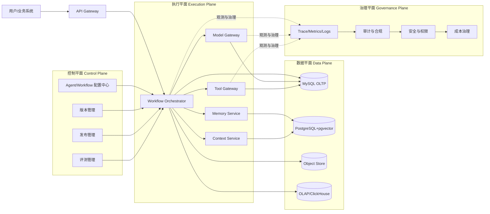
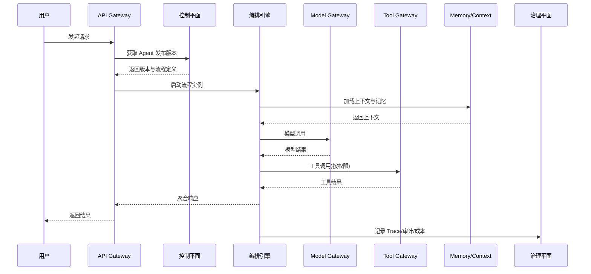
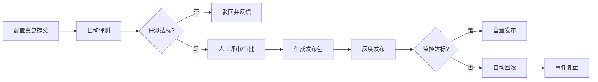
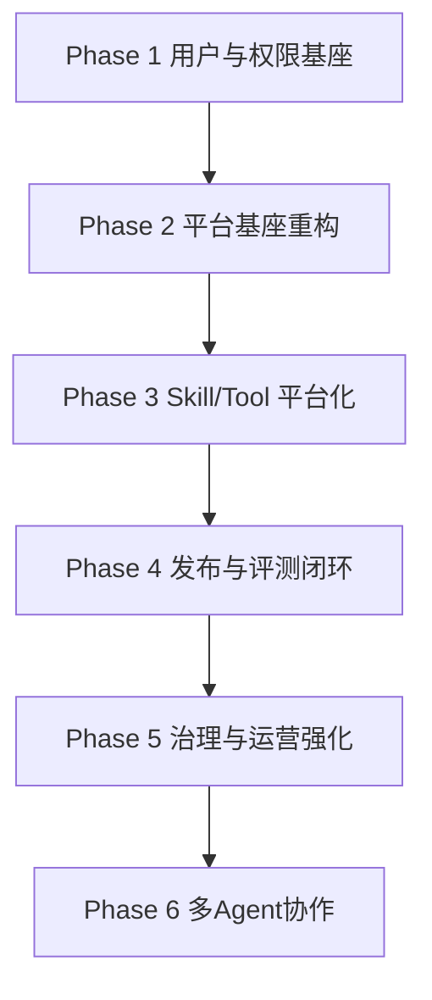

# AI Agent 平台最终态蓝图

## 1. 文档定位

本文档定义 `ai-mcp-knowledge-study` 的最终目标形态：从“具备 Agent 能力的业务编排系统”，升级为“企业级可运营 Agent 平台”。

适用对象：

1. 架构与研发团队（确定技术边界与演进路径）
2. 平台与运维团队（建设发布、治理、观测、可靠性体系）
3. 产品与业务团队（理解可配置能力与交付能力边界）

---

## 2. 总体目标

### 2.1 终局目标

构建一个同时满足以下条件的平台：

1. 高灵活：支持配置化组装 Agent（模型、Prompt、Tool、Memory、Workflow、Policy）
2. 高稳定：具备熔断、降级、重试、补偿、可恢复执行能力
3. 高治理：全链路审计、指标、追踪、安全策略、成本治理
4. 高运营：版本化、审批、灰度、回滚、A/B、评测闭环
5. 高扩展：支持多 Agent 协作与多租户隔离

### 2.2 成果判断标准

1. 新增一个业务 Agent，不改代码也可上线
2. 任意线上执行失败可定位到具体节点、工具、模型、版本
3. 发布可灰度、可回滚、可审计、可复盘
4. 模型与工具成本可统计、可限额、可告警

---

## 3. 目标架构

采用“四平面 + 双运行时”架构。

### 3.0 架构总览图

### 3.1 四平面

1. 控制平面（Control Plane）
2. 执行平面（Execution Plane）
3. 数据平面（Data Plane）
4. 治理平面（Governance Plane）

### 3.2 双运行时

1. 同步对话运行时：低时延请求（聊天、问答、工具调用）
2. 异步任务运行时：长流程任务（RAG 构建、批处理、定时作业、审批流）

### 3.3 平面职责

#### 控制平面

1. Agent/Workflow/Skill/Prompt/Tool 配置中心
2. 版本管理（草稿、发布、历史）
3. 发布管理（审批、灰度、回滚）
4. 评测管理（离线、回放、A/B）

#### 执行平面

1. Workflow Orchestrator（流程执行引擎）
2. Model Gateway（路由、熔断、降级、预算）
3. Tool Gateway（MCP/HTTP/DB/SDK 工具统一接入）
4. Memory Service（会话记忆、长期记忆）
5. Context Service（上下文聚合与裁剪）

#### 数据平面

1. OLTP（MySQL）：配置、运行状态、审计、发布
2. Vector Store（PostgreSQL+pgvector）：知识与记忆向量
3. Object Store（MinIO/S3）：原始文档、回放快照
4. OLAP（ClickHouse 或同类）：指标分析与成本分析

#### 治理平面

1. 可观测：Trace、Metrics、Logs、事件总线
2. 安全：RBAC、租户隔离、工具权限、敏感数据脱敏
3. 合规：操作审计、执行审计、数据血缘
4. 成本：Token 预算、模型配额、调用限流

---

## 4. 核心子系统设计

## 4.1 Agent 配置中心

职责：

1. 管理 Agent 逻辑定义（入口、能力、策略、输出约束）
2. 管理 Agent 版本（草稿、已发布、归档）
3. 绑定工作流模板与运行策略

关键能力：

1. 可视化编排（节点、分支、并行、重试、审批）
2. 参数模板与环境变量注入
3. 版本差异对比与一键回滚

## 4.2 Workflow 编排引擎

职责：

1. 执行有向无环图（DAG）或状态机流程
2. 支持节点级重试、超时、补偿、人工介入
3. 支持长任务持久化和断点恢复

关键能力：

1. 节点类型：Prompt、ModelCall、ToolCall、RAG、Router、HumanApproval、Script
2. 路由类型：条件路由、规则路由、模型路由
3. 执行语义：至少一次 + 幂等约束

## 4.3 Skill 系统

定义：Skill 是“可复用能力包”，不是单条 Prompt。

组成：

1. 输入契约
2. Prompt 模板
3. 工具清单与权限
4. 输出约束
5. 评测样例
6. 版本与变更记录

目标：

1. 将“经验配置”升级为“可复用资产”
2. 提高不同 Agent 的复用率与一致性

## 4.4 Model Gateway

职责：

1. 模型路由（任务类型、质量、成本、时延、可用性）
2. 模型治理（熔断、降级、重试、超时、限流）
3. 成本治理（租户预算、项目预算、调用配额）

升级方向：

1. 从“静态策略”升级到“策略 + 实时健康分”联合路由
2. 从“单请求最佳模型”升级到“多阶段不同模型”

## 4.5 Tool Gateway

职责：

1. 统一 MCP/HTTP/SDK/DB 工具接入
2. 统一工具调用鉴权、审计、限流、隔离
3. 支持工具 Schema 管理、版本管理、灰度发布

关键能力：

1. 工具权限矩阵：租户/Agent/Skill/用户 四级授权
2. 工具风险等级：低风险自动执行，高风险审批执行
3. 工具沙箱：文件、网络、命令执行边界

## 4.6 Memory 与 Context

分层设计：

1. 会话记忆：短期上下文
2. 用户记忆：偏好、约束、画像
3. 任务记忆：中间结果与决策轨迹

关键能力：

1. 记忆提取策略（何时写入）
2. 记忆检索策略（何时读取）
3. 记忆压缩策略（长期成本控制）

## 4.7 评测与质量平台

能力边界：

1. 离线评测：固定数据集 + 指标评分
2. 回放评测：线上真实请求回放
3. 对比评测：版本 A/B 输出对比
4. 红队评测：越权、注入、幻觉场景压测

评测结果直接接入发布门禁：

1. 达标才允许发布
2. 灰度异常自动回滚

## 4.8 发布与运营平台

发布流水线：

1. 草稿
2. 评审
3. 测试环境验证
4. 小流量灰度
5. 全量发布
6. 自动或手动回滚

运行运营能力：

1. Agent 健康看板
2. 工具健康看板
3. 成本与质量看板
4. 风险事件中心

---

## 5. 领域模型（逻辑）

建议按以下核心域拆分。

### 5.1 配置域

1. agent_definition
2. workflow_definition
3. workflow_node_definition
4. skill_definition
5. prompt_template
6. tool_definition
7. policy_definition

### 5.2 版本域

1. agent_version
2. workflow_version
3. skill_version
4. tool_version
5. release_plan
6. release_record

### 5.3 执行域

1. run_instance
2. node_instance
3. tool_call_record
4. model_call_record
5. human_task_instance
6. compensation_record

### 5.4 质量与评测域

1. eval_dataset
2. eval_case
3. eval_run
4. eval_result
5. score_detail

### 5.5 治理域

1. audit_event
2. security_event
3. quota_config
4. quota_consumption
5. alert_rule
6. alert_event

---

## 6. 关键流程（最终态）

## 6.1 对话请求流程

1. 请求进入 API Gateway
2. 控制平面解析 Agent 发布版本
3. 执行平面加载 Workflow
4. Context Service 聚合上下文与记忆
5. Model Gateway 选择模型并执行
6. Tool Gateway 按权限执行工具
7. 聚合结果返回
8. 全链路落审计与追踪

## 6.2 发布流程

1. 提交配置变更
2. 触发自动评测
3. 评审通过后生成发布包
4. 灰度发布（租户/流量/场景维度）
5. 监控达标自动转全量
6. 指标异常自动回滚

## 6.3 长任务流程

1. 提交异步任务
2. 任务入队
3. 编排引擎分布式执行
4. 失败节点重试/补偿
5. 人工节点等待处理
6. 任务完成或失败归档

---

## 7. 非功能目标（SLO）

1. 同步请求 P95 延迟：< 2.5s（不含外部工具慢响应）
2. 平台可用性：>= 99.9%
3. 任务恢复时间（节点失败）：< 1 分钟
4. 审计完整性：100% 关键操作可追踪
5. 灰度回滚时长：< 5 分钟

---

## 8. 安全与合规策略

## 8.1 权限模型

1. 平台级权限（系统管理员）
2. 租户级权限（租户管理员）
3. 应用级权限（Agent Owner）
4. 运行级权限（执行者/审批者）

## 8.2 工具安全

1. 白名单工具注册
2. 工具调用签名与来源校验
3. 高风险工具必须审批
4. 文件系统与命令执行沙箱

## 8.3 数据安全

1. 敏感字段加密存储
2. 日志脱敏
3. 多租户数据隔离
4. 关键操作不可抵赖审计

## 8.4 身份与租户演进策略（先用户后多租户）

原则：先完成“完整用户体系”，再开启“多租户隔离”，但第一阶段就预埋多租户扩展点，避免二次重构。
Phase 1 默认采用 `Sa-Token` 作为认证鉴权内核。

### 阶段 A：用户体系先行（单租户运行）

1. 基于 `Sa-Token` 建设统一认证（登录、令牌、会话、刷新）
2. 建设用户、角色、权限（RBAC）
3. 关键操作全量审计（operator_id、来源、时间、变更）
4. 工具调用与发布流程绑定身份主体

### 阶段 B：租户就绪化改造（仍可单租户对外）

1. 核心领域表预留 `tenant_id`（可为空或默认值）
2. 上下文统一传递 `operator_id`、`tenant_id`
3. 权限判断改为“用户 + 角色 + 资源 + 租户上下文”策略层
4. 审计与指标预留租户维度聚合能力

### 阶段 C：多租户正式启用

1. 开启租户维度数据隔离（逻辑隔离优先）
2. 开启租户级配额、预算、限流、告警
3. 开启租户管理员模型与跨租户审计视图
4. 发布灰度支持按租户分批生效

### Sa-Token 职责边界（必须明确）

1. `Sa-Token` 负责认证鉴权内核（登录状态、会话、权限校验、拦截器）
2. 平台自建用户中心负责业务域（用户资料、组织关系、角色模型、审批关系、审计视图）
3. 业务代码禁止直接散落调用 Sa-Token API，统一经“身份与权限中间层”封装
4. 后续若替换身份内核（如 OIDC/IAM 平台），上层业务不应大规模改动

### 多租户预埋约束清单（Phase 1 必做）

1. 核心业务表预留 `tenant_id` 字段（先默认值，后启用强约束）
2. 请求上下文统一包含 `operator_id`、`tenant_id`、`request_id`
3. 仓储层统一提供“按租户过滤”的查询入口，禁止绕过
4. 审计、指标、告警字段预留租户维度，确保后续可聚合可追踪
5. 权限策略层必须接受租户上下文参数，避免把租户逻辑写死在 Controller/Service

### 阶段 A/B/C 路线图

---

## 9. 技术实现建议

## 9.1 编排与执行

1. 首选持久化工作流引擎（Temporal/Cadence 同类）
2. 对同步低时延路径保留轻量执行器
3. 通过统一执行协议打通两套运行时

## 9.2 数据层

1. MySQL：配置、事务、审计
2. PostgreSQL+pgvector：RAG、记忆
3. ClickHouse：高吞吐指标分析
4. Redis：缓存、短期状态、限流

## 9.3 可观测

1. OpenTelemetry 统一 Trace
2. Prometheus 指标采集
3. Loki/ELK 日志聚合
4. 告警联动发布系统

## 9.4 身份与权限（Phase 1 默认 Sa-Token）

1. 认证鉴权内核：`Sa-Token`（登录、会话、权限、路由拦截）
2. 用户中心：自建 `user / role / permission / organization / audit_event` 域模型
3. 鉴权接入：统一身份中间层 + 注解式权限 + 资源级权限校验
4. 迁移策略：保留协议适配层，支持后续对接外部 IAM（不破坏上层业务）

---

## 10. 组织与研发模式建议

建议采用平台化组织方式。

1. Control Plane 小队（配置、发布、评测）
2. Runtime 小队（编排引擎、模型网关、工具网关）
3. Data & Governance 小队（数据、观测、安全、审计）
4. Agent Solution 小队（行业 Agent 模板与最佳实践）

---

## 11. 分阶段建设路线（不追求最小改造）

## Phase 1：用户与权限基座

1. 以 `Sa-Token` 落地统一认证体系（登录、令牌、会话、权限拦截）
2. 建设用户中心（用户/角色/权限/组织）与 RBAC 授权模型
3. 打通身份审计链路（操作人、来源、时间、变更）
4. 核心表与上下文预埋 `tenant_id` 扩展点（先单租户运行）
5. 建立身份与权限中间层，隔离上层业务与 Sa-Token 细节

## Phase 2：平台基座重构

1. 完成控制平面与执行平面的工程拆分
2. 完成统一配置模型和版本模型
3. 完成统一执行协议

## Phase 3：Skill 与 Tool 平台化

1. Skill 资产化管理
2. Tool 权限矩阵与风险等级
3. 工具版本与灰度发布

## Phase 4：发布与评测闭环

1. 发布流水线全链路打通
2. 评测门禁接入发布
3. 自动回滚策略上线

## Phase 5：治理与运营强化

1. 成本中心与预算治理
2. 全链路观测与根因分析
3. 多租户正式启用与安全合规增强

## Phase 6：多 Agent 协作

1. Planner/Executor/Reviewer 协作模式
2. 跨 Agent 任务编排
3. 协作质量评测体系

---

## 12. 风险与应对

1. 风险：系统复杂度显著上升  
应对：分层解耦，先定义协议再做实现

2. 风险：团队学习曲线变陡  
应对：先落地平台脚手架和开发规范

3. 风险：线上迁移期间稳定性波动  
应对：双跑迁移、灰度切流、自动回滚

4. 风险：工具与模型侧依赖不稳定  
应对：网关隔离、超时熔断、回放复测

---

## 13. 成功标志（最终验收）

1. 配置新增 Agent 从需求到上线小于 1 天
2. 线上异常可在 10 分钟内定位到具体节点与版本
3. 版本发布失败可在 5 分钟内回滚
4. 先完成完整用户体系并稳定运行，再平滑升级到多租户
5. 平台支持多租户并保持治理能力一致
6. Agent 能力沉淀为可复用 Skill 资产库

---

## 14. 与当前项目的关系

当前项目已有以下优势，可直接作为新平台基座：

1. 模型调用治理（降级、熔断、重试）
2. 审计与指标统计体系
3. MCP Gateway 与工具管理基础
4. RAG 任务化处理基础

本蓝图的核心思想不是推翻重写，而是把现有优势升级为平台标准能力，并在其上构建“可配置、可发布、可评测、可运营”的完整控制面。

---

## 15. Phase 1 配套产物索引与执行顺序

### 15.1 配套文档与脚本

1. 数据模型草案：`.codex/Phase1用户体系数据模型草案.md`
2. 表结构初稿：`.codex/Phase1用户体系MySQL-DDL初稿.sql`
3. 增量迁移脚本：`.codex/Phase1用户体系MySQL-增量迁移.sql`
4. 初始化数据脚本：`.codex/Phase1用户体系初始化数据.sql`
5. 接口权限矩阵：`.codex/Phase1用户体系接口与权限矩阵.md`
6. 回滚脚本：`.codex/Phase1用户体系MySQL-回滚脚本.sql`

### 15.2 推荐执行顺序

执行说明：

1. 新环境可先执行 DDL 再执行初始化；存量环境优先使用增量迁移脚本。
2. 初始化脚本中的管理员密码哈希必须在上线前替换为真实值。
3. 若需回退，优先按发布批次回退应用，再评估是否执行数据库回滚脚本。
