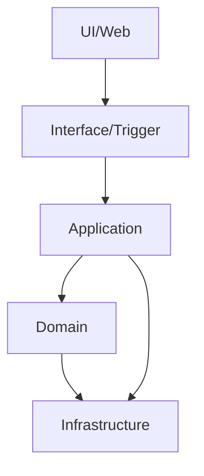
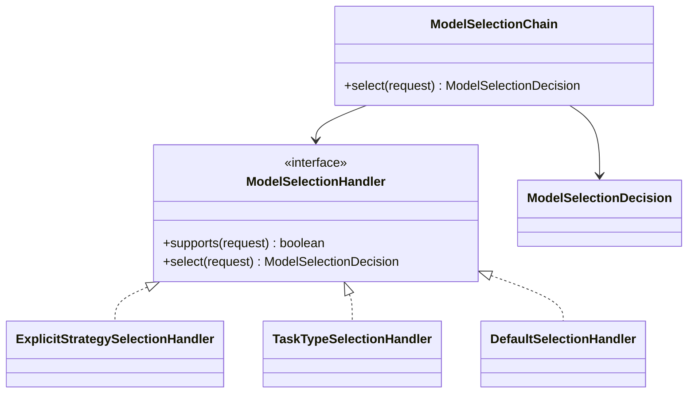
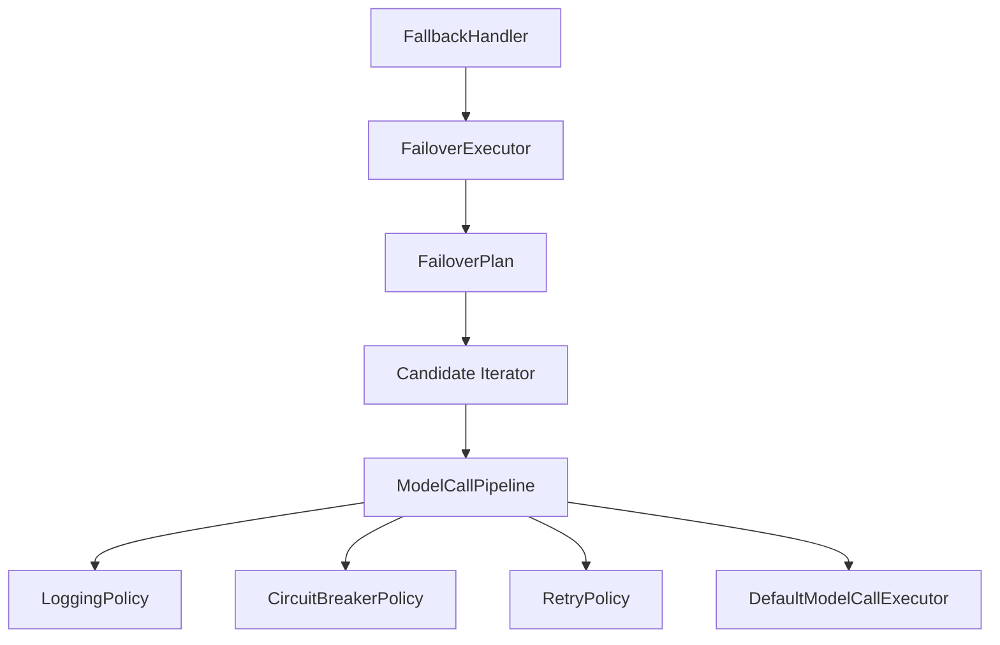
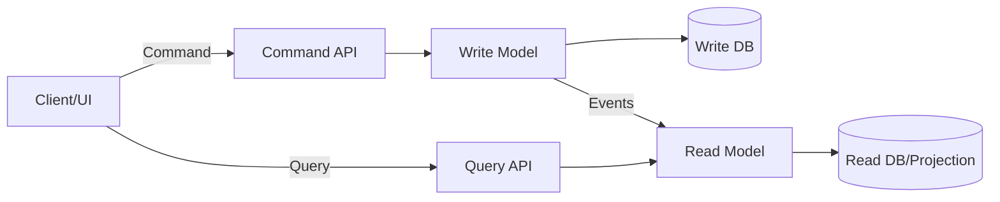
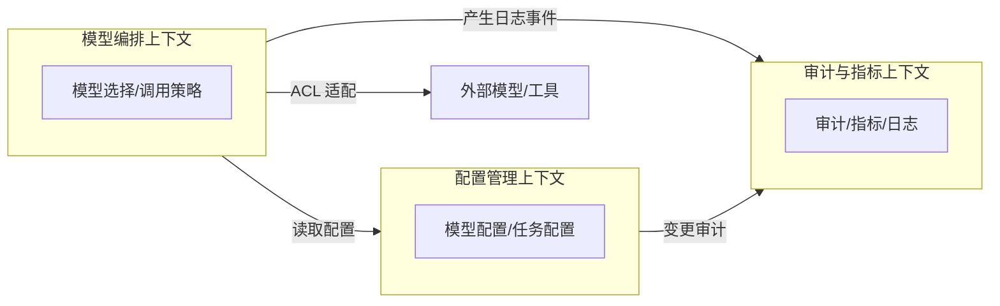
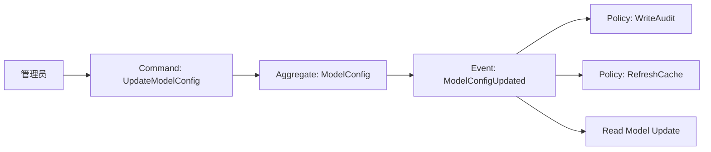
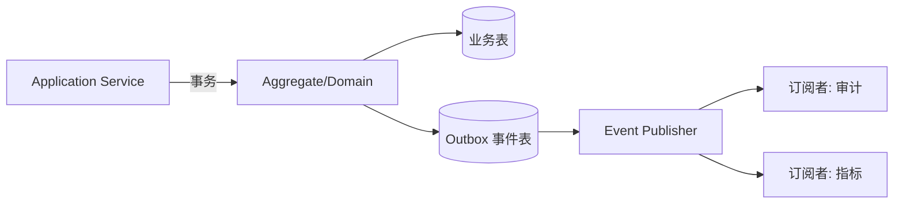

# DDD 从 0 到 1：结合 ai-mcp-knowledge-study 的完整实战指南

> 目标：让你不仅“知道 DDD 是什么”，还能**看懂本项目的 DDD 架构、理解为什么这样分层、知道新增业务时该改哪里**，并具备把 DDD 落地到真实项目的能力。

## 1. DDD 不是“多写几层”

DDD（Domain-Driven Design）的核心不是分层本身，而是**用业务语言组织系统**。  
你在代码里看到的 `ModelConfig`、`TaskType`、`ConfigAudit` 不只是类名，它们是业务语言（Ubiquitous Language）。

DDD 解决的是**复杂业务的可演进性**：
- 让业务模型成为系统主干，而不是数据库表或框架 API。
- 让协作沟通有统一语言，降低歧义与返工。
- 让功能扩展有清晰边界与演进路径。

一句话理解：**DDD 让技术结构服务于业务演进，而不是反过来。**

## 2. DDD 核心概念速览（建立直觉）

> 先不要纠结术语，抓住直觉：DDD 在关心“业务是什么”。

1) **领域（Domain）**  
业务本身，比如“模型配置”“任务策略”“调用审计”。

2) **统一语言（Ubiquitous Language）**  
业务讨论和代码中使用同一词汇，例如：模型配置 / 任务类型 / 调用日志。

3) **边界上下文（Bounded Context）**  
同一个词在不同场景可能含义不同，必须有边界。

4) **模型驱动（Model-Driven）**  
代码结构围绕业务模型，而不是围绕表、接口或框架习惯。  
简言之：先定义业务模型与规则，再映射到表、接口与实现细节。

## 3. DDD 四层架构（本项目的落地）

本项目的 DDD 分层结构：

```
Interface/Trigger  →  Application  →  Domain  →  Infrastructure
```

### 3.1 分层架构图（Mermaid）



### 3.2 本项目的严格分层约束

本项目已按严格分层执行调用链：

```
Trigger → Application → Domain → Infrastructure
```

要点：
- **Trigger 不再直接依赖 Domain**  
- **Application 负责用例编排与事务边界**  
- **Domain 只承载业务规则与模型**  
- **Infrastructure 只做技术实现与适配**

模块映射关系：

| DDD 层 | 模块 | 作用 |
| --- | --- | --- |
| Interface Adapter | `ai-mcp-knowledge-trigger` | Controller 接口、DTO 转换 |
| Application | `ai-mcp-knowledge-application` | 用例编排、策略选择、事务边界 |
| Domain | `ai-mcp-knowledge-domain` | 领域模型、领域服务、仓储接口 |
| Infrastructure | `ai-mcp-knowledge-infrastructure` | 技术实现、第三方调用、持久化 |

外部辅助模块：
- `ai-mcp-knowledge-api`：接口 DTO 定义（请求/响应模型）
- `ai-mcp-knowledge-types`：通用类型、枚举、Result、TraceId
- `ai-mcp-knowledge-app`：Spring Boot 启动与装配

## 4. 术语落地：本项目里每个概念是什么

### 4.1 Entity（实体）
有唯一身份，需要生命周期管理。

在本项目中：
- `ModelConfig`
- `ModelCapability`
- `TaskType`
- `CallLog`
- `ConfigAudit`

定位路径：  
`ai-mcp-knowledge-domain/src/main/java/com/xbk/knowledge/domain/model/entity/`

### 4.2 Value Object（值对象）
没有唯一身份，用值表达含义。

在本项目中主要是枚举与 VO：
- `ModelSelectionStrategy`
- `ModelType`
- `CallStatus`
- `CallMetrics` / `ModelUsage` / `ResponseTime` / `SuccessRate`

定位路径：  
`ai-mcp-knowledge-types/src/main/java/com/xbk/knowledge/types/enums/`  
`ai-mcp-knowledge-domain/src/main/java/com/xbk/knowledge/domain/model/vo/`

VO 子包按业务语义拆分：
- `vo/model`：模型相关查询对象
- `vo/task`：任务相关查询对象
- `vo/metrics`：指标统计相关对象
- `vo/audit`：审计相关查询对象
- `vo/common`：通用查询对象

### 4.3 Aggregate（聚合）
保证一致性边界。

本项目典型聚合：
- `ModelConfigAggregate`：`ModelConfig` + `ModelCapability`
  - `ModelConfig` 是聚合根，能力配置随其变化。
- `TaskTypeAggregate`：`TaskType`
- `CallLogAggregate`：`CallLog`
- `ConfigAuditAggregate`：`ConfigAudit`

定位路径：  
`ai-mcp-knowledge-domain/src/main/java/com/xbk/knowledge/domain/model/aggregate/`

### 4.4 Domain Service（领域服务）
不适合放在实体里的业务规则，放在领域服务。

本项目：
- `IModelConfigService`
- `ITaskTypeService`
- `IMetricsDomainService`
- `IAuditService`

定位路径：  
`ai-mcp-knowledge-domain/src/main/java/com/xbk/knowledge/domain/service/`

### 4.5 Repository（仓储）
领域层对数据存储的抽象接口。

定义在 Domain，实现在 Infrastructure：

| 接口 | 定义位置 | 实现位置 |
| --- | --- | --- |
| ModelConfigRepository | domain | infrastructure/repository |
| TaskTypeRepository | domain | infrastructure/repository |

## 5. Application 与 Domain 的区别（最容易混淆）

| 层 | 关注点 | 本项目示例 |
| --- | --- | --- |
| Application | 用例编排、事务边界、跨聚合协作 | `AIModelService`, `ModelSelector` |
| Domain | 领域规则、业务约束 | `IModelConfigService`, `ITaskTypeService` |

理解方式：
- Application 是“流程导演”
- Domain 是“业务规则库”

### 5.3 应用层的模型编排设计（本项目落地）

本项目在 Application 层将“模型选择 + 调用容错”拆分为多个可组合的模式，避免 if-else 与循环驱动分散在业务代码中：

1) **模型选择责任链（Chain of Responsibility）**
   - 目标：按优先级处理“显式策略 > 任务类型 > 默认策略”
   - 关键类：
     - `ModelSelectionChain`
     - `ExplicitStrategySelectionHandler`
     - `TaskTypeSelectionHandler`
     - `DefaultSelectionHandler`

2) **降级排序策略（Strategy）**
   - 目标：统一主/备模型顺序规则，避免硬编码排序逻辑
   - 关键类：
     - `FailoverStrategy`
     - `PriorityFailoverStrategy`

3) **降级流程模板 + 迭代器（Template Method + Iterator）**
   - 目标：将“循环尝试模型”的流程封装为模板方法，调用方不感知循环细节
   - 关键类：
     - `AbstractFailoverExecutor`
     - `DefaultFailoverExecutor`
     - `FailoverPlan`
     - `DefaultFailoverPlan`

4) **调用管道责任链（Chain of Responsibility）**
   - 目标：把熔断、重试、日志等横切能力模块化
   - 关键类：
     - `ModelCallPipeline`
     - `ModelCallPolicy`
     - `RetryPolicy`
     - `CircuitBreakerPolicy`
     - `LoggingPolicy`

这样做的直接收益：
- 阅读成本低：业务代码只看到“选择 -> 执行”，不需要维护细节流程。
- 扩展成本低：新增策略/拦截器只加类，不改核心流程。

#### 5.3.1 模型选择责任链（类图）



#### 5.3.2 调用管道 + 降级执行（流程图）



## 6. DDD 的“从 0 到 1”学习路径（结合本项目）

建议你按照以下路径阅读代码，形成完整闭环理解：

1) **先看 Trigger（Controller）**  
位置：`ai-mcp-knowledge-trigger/src/main/java/com/xbk/knowledge/trigger/http/`  
目标：知道外部请求如何进入系统。

2) **再看 Application（用例编排）**  
位置：`ai-mcp-knowledge-application/src/main/java/com/xbk/knowledge/application/service/`  
目标：理解“业务流程的主干在哪”。

3) **再看 Domain（业务规则）**  
位置：`ai-mcp-knowledge-domain/src/main/java/com/xbk/knowledge/domain/service/`  
目标：知道业务规则与实体在哪里。

4) **最后看 Infrastructure（技术实现）**  
位置：`ai-mcp-knowledge-infrastructure/src/main/java/com/xbk/knowledge/infrastructure/`  
目标：知道存储与外部调用如何落地。

## 7. DDD 设计思维（如何判断“放哪层”）

### 7.1 判断题模板

问自己三个问题：
1) 这是业务规则吗？  
   - 是 → Domain  
2) 这是业务流程编排吗？  
   - 是 → Application  
3) 这是技术细节实现吗？  
   - 是 → Infrastructure  

### 7.2 常见反例

反例 1：Controller 里写业务规则  
→ 规则应在 Domain / Application

反例 2：Domain 里调用数据库、HTTP  
→ 技术实现应在 Infrastructure

反例 3：Application 直接 new 外部 SDK  
→ SDK 调用应在 Infrastructure

## 8. DDD 与 MCP 的结合（本项目特色）

在本项目中，MCP 工具调用属于“外部能力协同”，当前实现为：
- **MCP 调用示例** 位于 Trigger 的定时任务中（`MCPServerCSDNJob`），直接编排 ChatClient 与工具调用
- **MCP Tool 的具体实现** 仍属于 Infrastructure（外部系统适配）
- **调用链路日志与审计** 属于 Domain 规则（存储模型）

说明：
- 如需更严格的分层，可将 MCP 调用编排迁移到 Application，用 Trigger 仅做适配

## 9. DDD 实战练习（建议按顺序完成）

### 练习 1：新增任务类型
目标：新增“摘要”任务，首选模型为 Gemini  
涉及层：Trigger → Application → Domain → Infrastructure → DB

### 练习 2：新增模型策略
目标：新增策略 `BALANCED_PRIORITY`  
涉及层：types（枚举）+ application（策略选择）

### 练习 3：新增审计字段
目标：在审计记录中添加 `source`  
涉及层：Domain Entity + DB + Mapper + DTO + Controller

## 10. DDD 常见误区

1) **把 DDD 当成“多写几层”**  
→ DDD 是建模思想，不是层数越多越好。

2) **把 DTO 当成领域模型**  
→ DTO 是接口层概念，不应污染 Domain。

3) **Domain 直接依赖框架**  
→ Domain 是核心业务，应避免框架依赖。

4) **没有统一语言**  
→ 没统一语言，DDD 价值会迅速下降。

## 11. 本项目里的 DDD 结构地图（快速定位）

| 层 | 目录 | 关注点 |
| --- | --- | --- |
| Trigger | `ai-mcp-knowledge-trigger` | Controller、DTO 转换 |
| Application | `ai-mcp-knowledge-application` | 用例编排、策略选择 |
| Domain | `ai-mcp-knowledge-domain` | 实体、领域服务、仓储接口 |
| Infrastructure | `ai-mcp-knowledge-infrastructure` | 仓储实现、模型调用 |
| API DTO | `ai-mcp-knowledge-api` | 请求/响应模型 |
| Types | `ai-mcp-knowledge-types` | Result、枚举、TraceId |

### 11.1 应用层服务在本项目中的具体落点

已在 Application 层新增并承担用例编排职责的服务：
- `ModelConfigAppService`
- `TaskTypeAppService`
- `AuditAppService`
- `MetricsAppService`

这些应用层服务对接 Domain Service，Trigger 只依赖 Application。

## 12. 领域事件（Domain Event）

### 12.1 什么是领域事件
领域事件是“领域内**已经发生**的事情”，用于表达业务变化并驱动后续动作。  
它不是命令（Command），而是**事实**（Fact）。

例子：
- “模型配置已更新”
- “任务类型已创建”
- “调用日志已写入”

### 12.2 为什么需要领域事件
- **解耦**：发起方不需要知道后续所有动作
- **可扩展**：新增订阅方不影响已有业务
- **可观测**：事件可追踪业务变化链路

### 12.3 本项目的落地思路
候选领域事件：
- `ModelConfigUpdatedEvent`
- `TaskTypeCreatedEvent`
- `CallLogRecordedEvent`

可能订阅：
- 写审计表
- 触发指标统计
- 触发缓存刷新

### 12.4 事务内/外发布
- **事务内发布**：保证一致，但可能耦合过深
- **事务后发布**：用 Outbox / 事件表保证最终一致

在本项目中，如果要扩展为异步处理，建议使用“事务后 + 事件表”的模式。

## 13. CQRS（Command Query Responsibility Segregation）

### 13.1 CQRS 是什么
读写分离：  
- **命令（Command）**：写模型  
- **查询（Query）**：读模型

### 13.2 什么时候适合 CQRS
- 读多写少
- 查询模型复杂、聚合统计多
- 需要独立扩展读/写性能

### 13.3 本项目的落地场景
适用：
- 指标统计（Metrics）
- 调用日志查询（CallLog）
- 审计查询（ConfigAudit）

写模型仍由 Domain 负责，读模型可用独立 DTO/视图模型。

### 13.4 误区
- 不需要为了“高大上”强行上 CQRS
- 小项目 CQRS 会增加心智负担

### 13.5 CQRS 示意图（Mermaid）



## 14. 上下文映射（Context Map）

### 14.1 上下文是什么
一个“语言一致、模型一致”的边界。  
上下文外的东西不一定用同一种语言。

### 14.2 常见上下文关系
- **合作（Partnership）**
- **遵从（Customer/Supplier）**
- **防腐层（ACL）**

### 14.3 本项目的上下文映射
可抽象为：
- **模型编排上下文**（模型选择、调用策略）
- **配置管理上下文**（模型配置、任务配置）
- **审计与指标上下文**（日志、审计、统计）

其中 Infrastructure Provider 属于“防腐层”。

### 14.4 Context Map 图（Mermaid）



## 15. 聚合设计（Aggregate Design）

### 15.1 聚合边界原则
- 聚合内强一致
- 聚合间最终一致
- 聚合尽量小，不要“把所有东西放一起”

### 15.2 本项目的聚合
典型聚合：
- `ModelConfig` + `ModelCapability`

不建议将 `CallLog` / `ConfigAudit` 纳入聚合，避免过度耦合。

### 15.3 常见反例
- 一个聚合下塞十几个实体
- 聚合根无任何规则，只是“DTO 复制”

### 15.4 聚合边界示意图（Mermaid）

```mermaid
flowchart TB
  subgraph Agg["Aggregate: ModelConfig"]
    Root["ModelConfig (聚合根)"]
    Cap["ModelCapability"]
    Rule["不变量/规则"]
    Root --> Cap
    Root --> Rule
  end
  Other["其他聚合"] -.|"事件/ID"|.-> Root
```

## 16. 贫血模型 vs 充血模型

### 16.1 贫血模型
实体只存数据，所有规则都在 Service。

### 16.2 充血模型
实体带业务行为与规则，Service 只负责协作。

### 16.3 本项目建议
本项目当前更偏贫血模型。  
如果要演进：
- 将模型有效性校验、策略选择规则逐步下沉到实体/VO  
- Application 只负责编排

## 17. 领域服务 vs 应用服务（进阶对比）

| 维度 | 领域服务 | 应用服务 |
| --- | --- | --- |
| 关注点 | 业务规则 | 业务流程编排 |
| 粒度 | 细 | 粗 |
| 依赖 | 领域模型 | 多个领域/基础设施 |
| 示例 | 校验/计算/策略规则 | 调用链路、事务边界 |

## 18. DDD 与数据库建模的关系

### 18.1 常见误区
“数据库表就是领域模型”——这是错的。  
领域模型应该独立于表结构。

### 18.2 实践建议
- 先建领域模型，再映射数据库
- 聚合边界优先于表结构
- 读模型可以与写模型不同

## 19. DDD 与微服务

### 19.1 关系
DDD 是建模方法，微服务是部署方式。  
不是一定要拆微服务才能用 DDD。

### 19.2 拆分建议
当边界上下文足够稳定、团队可以独立维护时，再拆服务。

## 20. 领域模型演进策略

1) 先建立统一语言  
2) 确定核心聚合  
3) 逐步将规则从 Service 下沉到模型  
4) 用领域事件驱动解耦  
5) 通过 CQRS 优化读性能

## 21. Event Storming（事件风暴）

### 21.1 目的
Event Storming 是一种**快速发现领域知识**的协作方法。  
它帮助团队用“事件”驱动的方式发现流程、边界、痛点与依赖。

### 21.2 基本元素
- **领域事件**（橙色）：已经发生的事实  
- **命令**（蓝色）：触发事件的动作  
- **聚合**（黄色）：承载一致性规则  
- **用户/角色**（绿色）：是谁发起命令  
- **外部系统**（紫色）：依赖或交互方  
- **痛点/风险**（红色）：流程问题

### 21.3 典型流程
1) 先贴事件（发生了什么）  
2) 再找命令（是什么导致事件）  
3) 再补聚合（这些事件属于谁）  
4) 再补读模型/查询  
5) 标出风险与改造点

### 21.4 本项目的示例
以“模型配置变更”为例：
- 事件：`ModelConfigUpdated`  
- 命令：`UpdateModelConfig`  
- 聚合：`ModelConfig`  
- 外部系统：数据库 / 审计系统  
- 后续事件：`ConfigAuditRecorded`

### 21.5 事件风暴流程图（Mermaid）



## 22. 一致性与 CAP（DDD 必须理解的权衡）

### 22.1 一致性的层次
- **强一致**：事务内保证  
- **最终一致**：异步保证  

### 22.2 CAP 简述
分布式系统无法同时保证：
- 一致性（C）
- 可用性（A）
- 分区容错性（P）

现实中要在 C 与 A 之间取舍。  
DDD 关心的是：**哪个业务必须强一致，哪些可以最终一致**。

### 22.3 本项目建议
- 模型配置/任务配置变更：需要强一致  
- 调用日志/指标统计：可以最终一致  
- 审计记录：通常最终一致即可

## 23. Saga / Process Manager（长事务与跨聚合协作）

### 23.1 为什么需要
多个聚合或多个系统参与同一业务流程时，无法使用单库事务。

### 23.2 Saga
通过一系列局部事务 + 补偿事务保证一致性。
- 优点：分布式可用  
- 缺点：补偿逻辑复杂

### 23.3 Process Manager
类似“流程协调器”，管理跨聚合状态与流程推进。
- 适合“多步业务流程”
- 本质是“业务流程编排器”

### 23.4 本项目的应用想象
若未来引入“多模型并行评测 + 自动切换策略”，可以用 Process Manager 来协调：
- 触发评测  
- 记录结果  
- 更新模型选择策略  
- 触发审计与指标更新

## 24. 领域事件建模模板（可直接套用）

一个规范的领域事件应该包含：
- 事件名
- 发生时间
- 聚合 ID
- 版本号
- 业务字段
- 唯一事件 ID（用于幂等）

事件结构示例（伪结构）：

```
EventName: ModelConfigUpdated
EventId: 2c1f...
AggregateId: 10086
OccurredAt: 2026-01-29T12:00:00
Version: 1
Payload:
  modelName: "Gemini"
  enabled: true
  priority: 10
```

### 24.1 幂等与重放
- 事件可能重复投递  
- 消费方必须基于 `EventId` 做幂等处理  
- 需要可重放的事件存档

### 24.2 领域事件流转（Outbox）示意图（Mermaid）



## 25. 结尾：如何真正学会 DDD

DDD 真正难的不是概念，而是**坚持用业务语言组织代码**。  
建议你边看本项目边实践下面三件事：

1) **每新增一个功能，先写出业务语言与边界**  
2) **先确定聚合与实体，再决定表结构**  
3) **让 Controller 只做适配，不做业务**

当你能通过业务语言“画出系统”，DDD 就已经落地了。  
如果你希望，我可以进一步帮你规划“DDD 实战训练路线 + 代码改造计划”。
