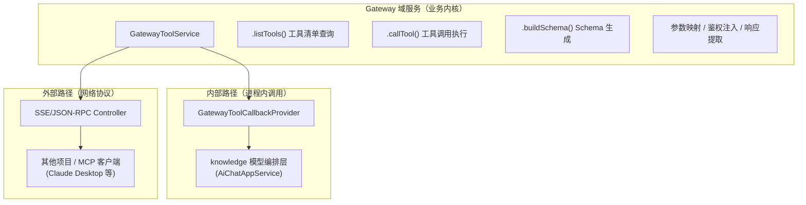

# Knowledge 融合 Gateway 实施清单（v2）

## 1. 文档目标与范围

### 1.1 目标
- 将 `ai-mcp-gateway-study` 的网关核心能力作为内部业务域并入 `ai-mcp-knowledge-study`。
- 模型编排层通过进程内调用直接消费 gateway 工具，无需网络回环。
- 同时保留 SSE/JSON-RPC 对外接口，供其他项目通过标准 MCP 协议消费。
- 前端提供可视化的网关工具管理台，支持配置、调试、发布、绑定模型的完整闭环。

### 1.2 范围
- 后端：域服务提取、GatewayToolCallbackProvider 实现、SSE 对外入口保留、响应提取引擎、工具绑定机制。
- 前端：网关工具管理台（可视化表单配置参数映射）。
- 运维治理：鉴权、审计、可观测性。

### 1.3 非目标
- 本文不包含具体代码实现细节。
- 本文不直接约束某个模型厂商或特定 Provider，只定义统一接入能力。

## 2. 关键设计决策

| 决策项       | 结论                                                 | 理由                                     |
| ------------ | ---------------------------------------------------- | ---------------------------------------- |
| 数据库策略   | gateway 表合并到 knowledge 同一个库                  | 运维简单，一个数据源搞定                 |
| SSE 对外接口 | 第一阶段就保留                                       | 其他项目可能需要消费 gateway 工具        |
| 网关实例     | 保留多实例（mcp_gateway 多条记录）                   | 不同业务域可独立管理工具集               |
| 参数映射前端 | 可视化表单                                           | 用户友好，非研发角色也能操作             |
| 响应提取     | 第一阶段实现                                         | 原文返回对模型不友好，需要结构化提取     |
| 工具可见性   | 按模型/会话维度绑定                                  | 精细控制，避免无关工具干扰模型决策       |
| 内部消费路径 | GatewayToolCallbackProvider（进程内）                | 零网络开销，与现有 Spring AI 体系统一    |
| 包名策略     | gateway 代码统一到 com.xbk.knowledge.*.gateway 子包  | 避免包名冲突，保持域边界清晰             |

## 3. 目标架构（融合后）

### 3.1 架构定位
- `knowledge`：统一系统入口（前端 + 模型编排 + 业务应用）。
- `gateway 域`：knowledge 内部独立业务域，负责外部 HTTP 接口接入与 MCP 工具暴露。

### 3.2 双路径消费模型



- 内部路径：模型编排层通过 `GatewayToolCallbackProvider`（实现 Spring AI `ToolCallbackProvider` 接口）在进程内直接调用域服务，零网络开销。
- 外部路径：SSE/JSON-RPC Controller 调用同一个域服务，对外暴露标准 MCP 协议（`initialize`/`tools/list`/`tools/call`），供其他项目消费。
- 两条路径共享同一个域服务实例，业务逻辑只有一份。

### 3.3 核心调用链（内部路径）
1. 前端在 knowledge 配置网关工具（接口元数据、参数映射、鉴权策略、响应提取规则）。
2. 用户发起对话，模型请求到达编排层。
3. 编排层通过 `GatewayToolCallbackProvider.getToolCallbacks()` 获取当前模型/会话绑定的工具集。
4. 模型决定调用某个工具，Spring AI 自动触发 `ToolCallback.call()`。
5. `ToolCallback.call()` 内部调用 `GatewayToolService.callTool()`：参数映射 → 鉴权注入 → HTTP 请求 → 响应提取。
6. 结构化结果返回给模型，模型继续推理。

### 3.4 核心调用链（外部路径）
1. 外部客户端通过 `GET /{gatewayId}/mcp/sse` 建立 SSE 连接。
2. 客户端发送 `initialize` 请求，获取网关能力声明。
3. 客户端发送 `tools/list`，Controller 调用 `GatewayToolService.listTools()` 返回工具清单。
4. 客户端发送 `tools/call`，Controller 调用 `GatewayToolService.callTool()` 执行并返回结果。

## 4. 实施阶段与里程碑

### 阶段一：后端核心闭环
- 目标：打通内部路径（模型 → GatewayToolCallbackProvider → 域服务 → 外部 HTTP 接口），同时保留外部 SSE 路径。
- 里程碑：
  1. gateway 代码并入 knowledge，包名统一，编译通过。
  2. 域服务提取完成，`GatewayToolService.listTools()` 和 `callTool()` 可用。
  3. `GatewayToolCallbackProvider` 实现，模型可通过进程内调用执行 gateway 工具。
  4. SSE/JSON-RPC 对外入口迁移完成，外部客户端可正常访问。
  5. 响应提取引擎实现，支持按配置提取响应字段。
  6. 工具绑定机制实现，支持按模型/会话维度控制工具可见性。
  7. 至少 1 个真实业务接口工具完成内部路径 + 外部路径的端到端验证。

### 阶段二：前端管理台
- 目标：提供可视化的网关工具管理台，形成配置 → 调试 → 发布 → 绑定模型 → 观测的闭环。
- 里程碑：
  1. 网关实例管理页可用。
  2. 工具配置页（可视化表单编辑参数映射）可用。
  3. 工具联调页可用。
  4. 工具-模型绑定配置页可用。
  5. 非研发角色可通过界面完成工具全生命周期管理。

### 阶段三：治理与收口
- 目标：补齐权限、审计、告警与运维流程。
- 里程碑：
  1. 鉴权与权限矩阵落地。
  2. 可观测性指标与告警规则上线。
  3. gateway 旧项目停止维护，knowledge 成为唯一入口。

## 5. 详细任务清单（后端）

### 5.1 基线与分支治理
1. 冻结 knowledge 主干，创建融合分支。
2. 固化 gateway 当前可运行版本、配置与数据库快照作为回滚基线。

验收标准：
- 两项目基线版本可复现启动。
- 出现问题可按版本快速回退。

### 5.2 包名统一与模块并入
1. 将 gateway 代码按域并入 knowledge 对应模块：
   - `com.xbk.domain.*` → `com.xbk.knowledge.domain.gateway.*`
   - `com.xbk.application.*` → `com.xbk.knowledge.application.gateway.*`
   - `com.xbk.infrastructure.*` → `com.xbk.knowledge.infrastructure.gateway.*`
   - `com.xbk.trigger.*` → `com.xbk.knowledge.trigger.gateway.*`
2. 保持依赖方向单向：gateway 域不反向依赖模型编排域。
3. 清理 gateway 中与 knowledge 重复的基础能力（如通用 Result、异常定义），统一使用 knowledge-types。

验收标准：
- 编译通过且无循环依赖。
- gateway 域边界清晰，类职责不与现有模块重叠。

### 5.3 数据模型迁移
1. 将 gateway 的 5 张表增量迁移到 knowledge 数据库：
   - `mcp_gateway` — 网关实例定义
   - `mcp_gateway_auth` — 网关认证（API Key、速率限制，供外部路径使用）
   - `mcp_protocol_registry` — 工具注册（HTTP URL、方法、超时、重试）
   - `mcp_protocol_mapping` — 参数映射（嵌套树形结构，支持 request/response 双向）
   - `mcp_tool_schema` — Schema 缓存（SHA-256 hash 判断是否需重新生成）
2. 新增工具绑定关系表 `mcp_tool_binding`：
   - 字段：`gateway_id`、`tool_id`、`bind_type`（MODEL/SESSION）、`bind_target_id`、`enabled`
   - 用途：控制哪些工具对哪些模型/会话可见
3. 输出增量 DDL 脚本与回滚脚本。

验收标准：
- 所有表在 knowledge 库中可正常读写。
- 工具绑定关系可按模型/会话维度查询。

### 5.4 域服务提取
1. 从 gateway 现有的 `ToolsListHandler` 中提取 Schema 生成逻辑为 `GatewayToolService.listTools(gatewayId)`。
2. 从 `ToolsCallHandler` 中提取 HTTP 调用逻辑为 `GatewayToolService.callTool(toolName, arguments)`。
3. 从 `InitializeHandler` 中提取能力声明逻辑为 `GatewayToolService.initialize(gatewayId)`。
4. 域服务入参为 Java 对象，不依赖 JSON-RPC 协议结构。
5. 保留 WebClient 作为 gateway 域内部的 HTTP 客户端，不强制统一为同步模型。

验收标准：
- 域服务方法可独立单元测试，不依赖 SSE/JSON-RPC 上下文。
- `listTools()` 返回的工具清单与原 gateway 一致。
- `callTool()` 成功调用外部 HTTP 接口并返回结果。

### 5.5 响应提取引擎实现
1. 基于 `mcp_protocol_mapping`（`mapping_type='response'`）实现响应字段提取。
2. 支持 JSONPath 或嵌套路径表达式提取指定字段（如 `data.result`、`data.list[*].name`）。
3. 提取失败时降级返回原始响应体，并记录告警日志。

验收标准：
- 配置了响应提取规则的工具，返回结构化提取结果。
- 未配置提取规则的工具，返回原始响应体（向后兼容）。
- 提取失败不阻断调用链路。

### 5.6 GatewayToolCallbackProvider 实现
1. 实现 Spring AI `ToolCallbackProvider` 接口。
2. `getToolCallbacks()` 方法：
   - 根据当前模型/会话的绑定关系，查询可用工具集。
   - 为每个工具创建 `ToolCallback` 实例。
   - `ToolCallback.call()` 内部调用 `GatewayToolService.callTool()`。
   - WebClient 响应式结果通过 `.block()` 转同步（Spring AI ToolCallback 接口为同步）。
3. 与现有 `DynamicMcpToolCallbackProvider` 并行工作：
   - `DynamicMcpToolCallbackProvider`：提供外部 MCP Server 的工具。
   - `GatewayToolCallbackProvider`：提供 gateway 配置的 HTTP 工具。
   - 模型编排层同时注入两个 Provider，工具集合并。

验收标准：
- 模型对话时可同时使用外部 MCP 工具和 gateway HTTP 工具。
- 新增 gateway 工具无需修改模型编排主流程代码。
- 工具可见性受绑定关系控制。

### 5.7 SSE/JSON-RPC 对外入口迁移
1. 将 gateway 的 `McpGatewayController` 迁移到 knowledge 的 trigger 层。
2. 路由统一到 knowledge 的服务路由体系下（如 `/api/gateway/{gatewayId}/mcp/sse`）。
3. Controller 内部调用 `GatewayToolService` 域服务（与内部路径共享同一实例）。
4. 保留 `mcp_gateway_auth` 的 API Key 鉴权，仅作用于外部路径。
5. 砍掉责任链框架，SSE 连接建立逻辑简化为 `GatewaySessionService.establishSseConnection(gatewayId)` 单方法：
   - 砍掉的类（共 7 个）：`RootNode`、`VerifyNode`、`SessionNode`、`EndNode`、`AbstractMcpSessionSupport`、`AbstractMultiThreadStrategyRouter`、`StrategyHandler`、`DefaultMcpSessionFactory`。
   - 保留 `SessionConfigVO`（会话状态：Sink、心跳、过期判断）。
   - 保留 SSE Flux 构建逻辑（心跳 ping + doOnCancel/doOnTerminate 连接清理），从 `EndNode` 中提取到 `GatewaySessionService`。
   - 鉴权校验逻辑从 `VerifyNode` 的预留扩展点补齐到 `GatewaySessionService` 中。
6. 保留 `IRequestHandler` + 枚举路由的消息分发机制（`InitializeHandler`/`ToolsListHandler`/`ToolsCallHandler`），Handler 内部改为调用 `GatewayToolService` 域服务。

验收标准：
- 外部 MCP 客户端可通过 SSE 连接并完成 initialize → tools/list → tools/call 全流程。
- 外部路径与内部路径调用同一个域服务，工具行为一致。
- 责任链相关类不出现在迁移后的代码中。

### 5.8 工具绑定机制
1. 新增 `mcp_tool_binding` 表，支持按模型/会话维度绑定工具。
2. `GatewayToolCallbackProvider` 根据当前上下文（modelId/sessionId）过滤可用工具。
3. 提供默认策略：未配置绑定关系时，已发布工具对所有模型可见（向后兼容）。
4. 前端提供绑定配置入口（模型配置页 / 会话设置中选择可用工具集）。

验收标准：
- 不同模型可看到不同的工具集。
- 绑定关系变更后立即生效，无需重启。

### 5.9 模型编排接入改造
1. `AiChatAppService` 同时注入 `DynamicMcpToolCallbackProvider` 和 `GatewayToolCallbackProvider`。
2. 构建 ChatClient 时合并两个 Provider 的工具集。
3. 模型层只依赖 `ToolCallbackProvider` 接口，不感知工具来源差异。

验收标准：
- 模型对话中可同时调用 MCP 外部工具和 gateway HTTP 工具。
- 新增工具来源无需改模型主流程代码。

## 6. 详细任务清单（前端）

### 6.1 风格与技术约束
1. 严格复用现有 Gemini 深色主题（`src/styles/gemini.scss`），所有新页面使用 `.gemini-container`、`.gemini-card`、`.gemini-table`、`.gemini-dialog` 等已有样式类。
2. 组件库统一使用 Element Plus，不引入额外 UI 库。
3. 页面布局、表格、表单、对话框的交互模式与现有 MCP 配置页（`views/mcp/index.vue`）和模型配置页（`views/model/index.vue`）保持一致。
4. API 调用遵循现有 `src/api/` 目录的 `request.post()` 模式，类型定义统一放 `src/types/entity.d.ts`。

### 6.2 页面改造目标
1. 在现有 MCP 配置页旁新增"网关工具管理台"入口（路由：`/gateway-tools`）。
2. 形成"配置 → 调试 → 发布 → 绑定模型 → 观测"的闭环。

### 6.3 新增文件清单

```
src/
├── api/gateway.ts                              # Gateway API 接口层
├── views/gateway/
│   ├── index.vue                               # 网关实例管理页
│   ├── tools/
│   │   ├── index.vue                           # 工具列表页
│   │   └── components/
│   │       ├── ToolEditForm.vue                # 工具编辑表单（基本信息 + 鉴权）
│   │       ├── ParamMappingTree.vue            # 参数映射可视化树形表单（核心组件）
│   │       ├── ParamMappingNode.vue            # 参数映射单节点（递归组件）
│   │       ├── ResponseExtractForm.vue         # 响应提取规则配置
│   │       └── ToolDebugPanel.vue              # 联调面板（请求预览 + 响应预览）
│   └── binding/
│       └── ToolBindingDialog.vue               # 工具-模型绑定对话框
├── views/model/components/
│   └── ModelToolBinding.vue                    # 模型配置页内嵌的工具绑定区域
└── types/gateway.d.ts                          # Gateway 相关类型定义
```

### 6.4 页面与功能清单

1. 网关实例管理页（`gateway/index.vue`）：
   - 复用 MCP 列表页的 `el-table` + 分页 + 操作按钮模式。
   - 字段：网关 ID、名称、版本、状态、工具数量、操作。

2. 工具列表页（`gateway/tools/index.vue`）：
   - 复用同上模式。
   - 字段：工具名称、HTTP 方法、URL、状态、最近调用结果摘要、操作。
   - 操作：编辑、联调、启用/禁用、删除。

3. 工具编辑页（`ToolEditForm.vue` + 子组件）：
   - 基本信息区：工具名称、描述、HTTP URL、方法、超时、重试次数。使用 `el-form` 标准布局。
   - 请求参数映射区（`ParamMappingTree.vue`，详见 6.5）。
   - 响应提取规则区（`ResponseExtractForm.vue`）：配置提取路径（如 `data.result`），支持预览提取效果。
   - 鉴权配置区：HTTP Headers 模板（`el-input` textarea），认证方式下拉选择。

4. 联调面板（`ToolDebugPanel.vue`）：
   - 左侧：基于参数 Schema 自动生成输入表单。
   - 右上：请求预览（URL + Headers + Body，只读）。
   - 右下：响应预览（原始响应 + 提取结果对比）、错误信息展示。

5. 工具-模型绑定（`ToolBindingDialog.vue` + `ModelToolBinding.vue`）：
   - 在模型配置页新增"绑定工具"区域，使用 `el-transfer` 穿梭框选择可用工具。
   - 未配置绑定时显示"全局可见"默认状态。

6. 审计日志：复用现有 `views/audit/` 页面，扩展 gateway 相关操作类型字段即可。

### 6.5 参数映射可视化树形表单（核心组件）

技术方案：

1. `ParamMappingTree.vue`（容器组件）：
   - 顶层渲染一个根节点（type=object），子节点列表通过 `v-for` 渲染 `ParamMappingNode`。
   - 提供"添加参数"按钮，新增一级字段。
   - 管理整棵树的数据模型（数组结构，每个节点包含 children）。

2. `ParamMappingNode.vue`（递归组件）：
   - 单行渲染一个参数节点，使用 `el-form-item` 行内布局：
     - 字段名（`el-input`，短宽度）
     - 类型（`el-select`：string/number/boolean/object/array）
     - 描述（`el-input`）
     - 是否必填（`el-switch`）
     - HTTP 路径（`el-input`，如 `company.name`）
     - 参数位置（`el-select`：body/query/path/header）
   - 当类型为 object 时，展开子节点区域，递归渲染 `ParamMappingNode`，缩进一级。
   - 当类型为 array 时，显示"元素类型"配置（基础类型直接选择，object 类型展开子节点定义）。
   - 每行末尾提供"添加子字段"（仅 object/array）和"删除"按钮。
   - 通过 `margin-left` 递增实现层级缩进，最大支持 5 层嵌套。

3. 数据模型：
   ```typescript
   interface ParamMappingNode {
     fieldName: string
     mcpType: 'string' | 'number' | 'boolean' | 'object' | 'array'
     mcpDesc: string
     isRequired: boolean
     httpPath: string
     httpLocation: 'body' | 'query' | 'path' | 'header'
     itemType?: string        // array 元素类型
     children?: ParamMappingNode[]  // object/array 子节点
   }
   ```

4. 提交时将树形结构转换为 `mcp_protocol_mapping` 表的扁平记录（带 parent_id），后端接口接收扁平数组或嵌套 JSON 均可。

验收标准：
- 所有新页面视觉风格与现有 MCP 配置页、模型配置页一致（Gemini 深色主题）。
- 非研发角色可通过界面完成工具配置、调试、发布。
- 工具发布后模型侧可直接可见并可调用。
- 参数映射的可视化表单支持至少 3 层嵌套，object 和 array 类型可正确展开/折叠。

## 7. 安全、治理与运维

### 7.1 鉴权与权限
1. 内部路径：复用 knowledge 现有用户权限体系，无需额外鉴权。
2. 外部路径：保留 `mcp_gateway_auth` 的 API Key + 速率限制机制。
3. 外部接口鉴权能力标准化（API Key、Bearer、签名等），通过工具配置注入。
4. 敏感配置（API Key、Token）脱敏展示与加密存储。

验收标准：
- 敏感字段不明文暴露。
- 外部路径有 API Key 校验与速率限制。
- 高风险操作有权限控制与审计。

### 7.2 可观测性
1. 统一 traceId，贯穿前端 → 编排层 → gateway 域服务 → 外部接口。
2. 指标覆盖：请求量、成功率、P95/P99 延迟、错误分布、工具级 SLA。
3. 告警规则：超时激增、错误码异常、单工具连续失败。
4. 内部路径与外部路径共享同一套指标采集（在域服务层埋点）。

验收标准：
- 单次失败可快速定位到具体工具与上游接口。
- 关键指标可支持容量与稳定性评估。

## 8. 测试与验收方案

### 8.1 测试分层
1. 单元测试：参数映射、Schema 生成、响应提取、错误映射。
2. 集成测试（内部路径）：`GatewayToolCallbackProvider` → 域服务 → Mock HTTP Server 全链路。
3. 集成测试（外部路径）：SSE 连接 → `initialize` → `tools/list` → `tools/call` 全链路。
4. 联调测试：至少 1 个真实外部业务接口，内部路径 + 外部路径各跑一遍。
5. 回归测试：模型编排主流程与历史功能不回退。

### 8.2 最小验收清单
1. 模型对话中可通过 `GatewayToolCallbackProvider` 成功调用外部业务接口。
2. 外部 MCP 客户端可通过 SSE 成功调用同一个工具。
3. 两条路径返回结果一致。
4. `tools/list` 与配置管理一致，工具绑定关系生效。
5. `tools/call` 成功/失败/超时路径均有可观测日志。
6. 响应提取规则生效，返回结构化结果。
7. 前端可完成工具全生命周期管理。

## 9. 风险清单与应对

| 风险                               | 严重度 | 应对策略                                                                         |
| ---------------------------------- | ------ | -------------------------------------------------------------------------------- |
| 双路径行为不一致                   | 高     | 两条路径共享同一个域服务实例，业务逻辑只有一份                                   |
| WebClient 响应式与同步模型共存     | 中     | gateway 域内部保持 WebClient，ToolCallback.call() 中 .block() 转同步，不强制统一 |
| 包名批量重命名引入编译错误         | 中     | IDE 批量重构 + 编译验证，一次性完成                                              |
| 参数映射可视化表单开发量大         | 中     | 分步实现：先支持扁平参数，再支持嵌套 object/array                                |
| 历史配置迁移不完整                 | 低     | 迁移前全量校验与抽样回放，提供回滚 SQL                                           |
| 外部接口质量不稳定影响模型体验     | 中     | 统一重试、超时控制、降级返回错误模板                                             |
| 工具绑定关系配置复杂               | 低     | 提供默认策略（未绑定 = 全局可见），降低初始配置成本                               |

## 10. 交付物清单

1. 架构设计文档（双路径消费模型、域服务边界、调用链）。
2. 数据库增量 DDL 脚本与回滚脚本（含 `mcp_tool_binding` 新表）。
3. 后端接口契约文档（内部 ToolCallbackProvider + 外部 SSE/JSON-RPC）。
4. 前端页面原型与字段定义（重点：参数映射可视化表单）。
5. 测试报告（内部路径 + 外部路径）。
6. 上线手册与回滚手册。

## 11. 建议执行顺序

1. 基线固化 → 包名统一 → 模块并入 → 编译通过。
2. 域服务提取 → 响应提取引擎 → 单元测试通过。
3. `GatewayToolCallbackProvider` 实现 → 内部路径端到端验证。
4. SSE/JSON-RPC 入口迁移 → 外部路径端到端验证。
5. 工具绑定机制 → 模型编排接入改造。
6. 并行推进前端管理台，先做工具配置 + 联调页面。
7. 补齐审计与可观测性，收口旧 gateway 项目。
