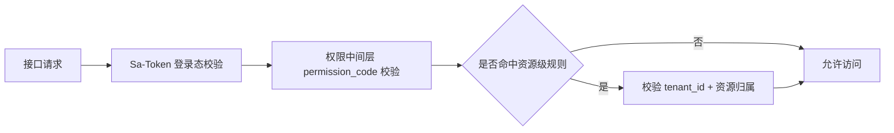

# Phase 1 用户体系接口与权限矩阵

## 1. 文档目标

本文件定义 Phase 1 的接口分组、权限码、默认角色授权关系，并标注后续多租户启用后的隔离策略。

---

## 2. 权限分层图

---

## 3. 角色与权限覆盖

| 角色 | 说明 | 默认权限覆盖 |
|---|---|---|
| `PLATFORM_ADMIN` | 平台级超管 | 全部权限 |
| `TENANT_ADMIN` | 租户管理员 | 用户、角色、Agent、Workflow、Tool、发布审批、审计读取 |
| `AGENT_OWNER` | Agent 负责人 | Agent/Workflow 读写发布、Tool 调用、审计读取 |
| `AUDITOR` | 审计员 | 审计读取 + 核心资源只读 |
| `VIEWER` | 观察者 | 核心资源只读 |

---

## 4. 接口与权限矩阵（Phase 1）

| 模块 | 方法 | 路径示例 | 权限码 | 默认可访问角色 | 多租户启用后隔离策略 |
|---|---|---|---|---|---|
| 认证 | `POST` | `/api/auth/login` | `public` | 全部用户 | 不隔离 |
| 认证 | `POST` | `/api/auth/logout` | `authenticated` | 全部登录用户 | 按当前会话 |
| 认证 | `GET` | `/api/auth/me` | `authenticated` | 全部登录用户 | 按当前会话 |
| 用户 | `GET` | `/api/users` | `user:read` | `PLATFORM_ADMIN` `TENANT_ADMIN` | 强制 `tenant_id` 过滤 |
| 用户 | `POST` | `/api/users` | `user:write` | `PLATFORM_ADMIN` `TENANT_ADMIN` | 创建时写入 `tenant_id` |
| 用户 | `PUT` | `/api/users/{id}` | `user:write` | `PLATFORM_ADMIN` `TENANT_ADMIN` | 仅同租户可改 |
| 用户 | `PUT` | `/api/users/{id}/status` | `user:write` | `PLATFORM_ADMIN` `TENANT_ADMIN` | 仅同租户可改 |
| 角色 | `GET` | `/api/roles` | `role:read` | `PLATFORM_ADMIN` `TENANT_ADMIN` | 强制 `tenant_id` 过滤 |
| 角色 | `POST` | `/api/roles` | `role:write` | `PLATFORM_ADMIN` `TENANT_ADMIN` | 创建时写入 `tenant_id` |
| 角色 | `PUT` | `/api/roles/{id}` | `role:write` | `PLATFORM_ADMIN` `TENANT_ADMIN` | 仅同租户可改 |
| 角色 | `POST` | `/api/roles/{id}/permissions` | `role:write` | `PLATFORM_ADMIN` `TENANT_ADMIN` | 仅同租户可改 |
| 组织 | `GET` | `/api/orgs/tree` | `user:read` | `PLATFORM_ADMIN` `TENANT_ADMIN` `VIEWER` | 强制 `tenant_id` 过滤 |
| 组织 | `POST` | `/api/orgs` | `user:write` | `PLATFORM_ADMIN` `TENANT_ADMIN` | 创建时写入 `tenant_id` |
| API Key | `GET` | `/api/apikeys` | `user:read` | `PLATFORM_ADMIN` `TENANT_ADMIN` | 强制 `tenant_id` 过滤 |
| API Key | `POST` | `/api/apikeys` | `user:write` | `PLATFORM_ADMIN` `TENANT_ADMIN` | 创建时写入 `tenant_id` |
| 审计 | `GET` | `/api/audit/events` | `audit:read` | `PLATFORM_ADMIN` `TENANT_ADMIN` `AUDITOR` | 强制 `tenant_id` 过滤 |
| Agent | `GET` | `/api/agents` | `agent:read` | 全角色（除未登录） | 强制 `tenant_id` 过滤 |
| Agent | `POST` | `/api/agents` | `agent:write` | `PLATFORM_ADMIN` `TENANT_ADMIN` `AGENT_OWNER` | 创建时写入 `tenant_id` |
| Agent | `POST` | `/api/agents/{id}/publish` | `agent:publish` | `PLATFORM_ADMIN` `TENANT_ADMIN` `AGENT_OWNER` | 发布对象需同租户 |
| Workflow | `GET` | `/api/workflows` | `workflow:read` | 全角色（除未登录） | 强制 `tenant_id` 过滤 |
| Workflow | `POST` | `/api/workflows` | `workflow:write` | `PLATFORM_ADMIN` `TENANT_ADMIN` `AGENT_OWNER` | 创建时写入 `tenant_id` |
| Tool | `GET` | `/api/tools` | `tool:read` | 全角色（除未登录） | 强制 `tenant_id` 过滤 |
| Tool | `POST` | `/api/tools` | `tool:write` | `PLATFORM_ADMIN` `TENANT_ADMIN` | 创建时写入 `tenant_id` |
| Tool | `POST` | `/api/tools/{id}/invoke` | `tool:invoke` | `PLATFORM_ADMIN` `TENANT_ADMIN` `AGENT_OWNER` | 调用时校验租户与资源归属 |
| 发布 | `POST` | `/api/releases/{id}/approve` | `release:approve` | `PLATFORM_ADMIN` `TENANT_ADMIN` | 审批对象需同租户 |

---

## 5. 落地约束

1. Controller 只写 `permission_code`，不写角色判断。
2. 角色与权限映射集中在 `sys_role_permission`，避免写死在代码。
3. 资源级鉴权统一走“权限中间层”，入参必须包含 `tenant_id`、`operator_id`、`request_id`。
4. `PLATFORM_ADMIN` 允许跨租户查询，其余角色默认禁止跨租户访问。

---

## 6. 与 SQL 脚本对应关系

1. 表结构：`.codex/Phase1用户体系MySQL-DDL初稿.sql`
2. 增量迁移：`.codex/Phase1用户体系MySQL-增量迁移.sql`
3. 初始化数据：`.codex/Phase1用户体系初始化数据.sql`
4. 回滚脚本：`.codex/Phase1用户体系MySQL-回滚脚本.sql`
