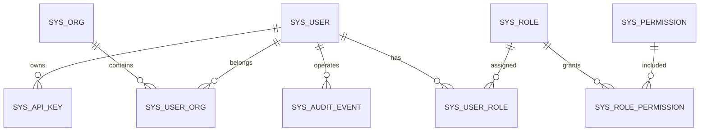

# Phase 1 用户体系数据模型草案

## 1. 目标与范围

本草案用于支撑 `Agent平台最终态蓝图.md` 中的 Phase 1：

1. 以 `Sa-Token` 作为认证鉴权内核
2. 自建用户中心（用户/角色/权限/组织）
3. 打通审计链路
4. 为后续多租户预埋 `tenant_id`

本阶段默认“单租户运行”，但结构上“租户就绪”。

---

## 2. 设计原则

1. 认证与业务解耦：`Sa-Token` 只做认证鉴权内核，业务表独立维护
2. 先单租户后多租户：`tenant_id` 先默认值，后续可升级强约束
3. 统一审计：关键变更必须记录 `operator_id`、`request_id`、来源
4. 最小可用闭环：登录、授权、组织归属、审计先跑通
5. 防后期重构：所有主数据和关系表预留扩展字段

---

## 3. 逻辑模型总览

---

## 4. 核心表清单

## 4.1 `sys_user`（用户主表）

用途：存储平台用户基础信息与状态。

关键字段：

1. `id`：主键
2. `tenant_id`：租户预留字段（Phase 1 可默认 `default`）
3. `username`：登录名（唯一）
4. `display_name`：显示名
5. `email` / `mobile`：联系方式
6. `password_hash`：密码哈希
7. `status`：状态（启用/禁用/锁定）
8. `last_login_at`：最后登录时间
9. `created_at` / `updated_at`

建议索引：

1. `uk_username(tenant_id, username)`
2. `idx_status(tenant_id, status)`

## 4.2 `sys_role`（角色表）

用途：定义角色，承载权限集合。

关键字段：

1. `id`
2. `tenant_id`
3. `role_code`（如 `ADMIN`、`AGENT_OWNER`）
4. `role_name`
5. `role_scope`（平台级/租户级/项目级）
6. `status`
7. `created_at` / `updated_at`

建议索引：

1. `uk_role_code(tenant_id, role_code)`

## 4.3 `sys_permission`（权限资源表）

用途：定义资源动作权限点。

关键字段：

1. `id`
2. `permission_code`（如 `agent:publish`）
3. `resource_type`（agent/tool/workflow/release）
4. `action`（read/write/publish/approve）
5. `description`
6. `status`

建议索引：

1. `uk_permission_code(permission_code)`

## 4.4 `sys_user_role`（用户-角色关系表）

用途：给用户授予角色。

关键字段：

1. `id`
2. `tenant_id`
3. `user_id`
4. `role_id`
5. `granted_by`
6. `granted_at`

建议索引：

1. `uk_user_role(tenant_id, user_id, role_id)`
2. `idx_role(tenant_id, role_id)`

## 4.5 `sys_role_permission`（角色-权限关系表）

用途：给角色绑定权限点。

关键字段：

1. `id`
2. `tenant_id`
3. `role_id`
4. `permission_id`
5. `granted_by`
6. `granted_at`

建议索引：

1. `uk_role_perm(tenant_id, role_id, permission_id)`

## 4.6 `sys_org`（组织表）

用途：组织/部门层级，支持后续租户管理员模型。

关键字段：

1. `id`
2. `tenant_id`
3. `org_code`
4. `org_name`
5. `parent_id`
6. `status`
7. `created_at` / `updated_at`

建议索引：

1. `uk_org_code(tenant_id, org_code)`
2. `idx_parent(tenant_id, parent_id)`

## 4.7 `sys_user_org`（用户-组织关系表）

用途：记录用户组织归属（可多归属）。

关键字段：

1. `id`
2. `tenant_id`
3. `user_id`
4. `org_id`
5. `is_primary`
6. `joined_at`

建议索引：

1. `uk_user_org(tenant_id, user_id, org_id)`

## 4.8 `sys_api_key`（服务账号/密钥表）

用途：给系统集成与自动化任务使用，避免共用用户密码。

关键字段：

1. `id`
2. `tenant_id`
3. `owner_user_id`
4. `access_key`
5. `secret_hash`
6. `scopes`
7. `status`
8. `expire_at`

建议索引：

1. `uk_access_key(access_key)`
2. `idx_owner(tenant_id, owner_user_id)`

## 4.9 `sys_audit_event`（统一审计事件表）

用途：记录用户操作与关键业务变更，作为合规与排查依据。

关键字段：

1. `id`
2. `tenant_id`
3. `operator_id`
4. `operator_type`（user/api_key/system）
5. `event_type`（authz/publish/config/tool_call）
6. `resource_type`
7. `resource_id`
8. `action`
9. `request_id`
10. `source_ip`
11. `user_agent`
12. `old_value` / `new_value`
13. `result`（success/failed）
14. `occurred_at`

建议索引：

1. `idx_operator_time(tenant_id, operator_id, occurred_at)`
2. `idx_resource(tenant_id, resource_type, resource_id)`
3. `idx_request_id(request_id)`

---

## 5. 与 Sa-Token 的集成边界

## 5.1 Sa-Token 负责

1. 登录态管理与会话管理
2. 权限校验入口（注解/拦截器）
3. token 生命周期管理

## 5.2 用户中心负责

1. 用户、角色、权限、组织数据管理
2. 用户与资源的授权关系维护
3. 审计日志落库与查询
4. 权限中间层封装（避免业务代码散落调用 Sa-Token）

---

## 6. 预埋多租户约束（Phase 1 立即执行）

1. 主业务表统一包含 `tenant_id`
2. 服务层统一通过上下文获取 `tenant_id`
3. 仓储层必须提供“按租户过滤”的查询方法
4. 审计、指标、告警保留租户维度字段
5. 管理接口默认仅访问当前租户数据（平台管理员例外）

---

## 7. 建议的初始角色与权限

建议最小角色集：

1. `PLATFORM_ADMIN`：平台级全权限
2. `TENANT_ADMIN`：租户内管理权限
3. `AGENT_OWNER`：Agent 配置/发布权限
4. `AUDITOR`：审计只读
5. `VIEWER`：只读访问

建议最小权限点：

1. `agent:read` `agent:write` `agent:publish`
2. `workflow:read` `workflow:write`
3. `tool:read` `tool:write` `tool:invoke`
4. `release:approve`
5. `audit:read`

---

## 8. 实施顺序（Phase 1 内）

1. 建表：`sys_user`、`sys_role`、`sys_permission` 及关系表
2. 接入 Sa-Token 登录与权限拦截
3. 落地统一身份中间层（身份上下文、权限检查、审计封装）
4. 打通管理端用户与角色维护接口
5. 全链路接入 `operator_id`、`request_id`、`tenant_id`
6. 建立审计查询页与操作追踪

---

## 9. 验收标准

1. 用户可登录、登出、刷新会话并稳定运行
2. 角色权限可正确控制 Agent/Tool/发布操作
3. 所有关键写操作均记录审计事件
4. 核心业务表均已预埋 `tenant_id`
5. 代码中无散落式 Sa-Token 权限判断（统一走中间层）

---

## 10. 与现有工程的对接建议

建议新增模块（可按现有多模块结构拆分）：

1. `ai-mcp-knowledge-identity`：身份与用户中心领域
2. `ai-mcp-knowledge-authz`：权限中间层与 Sa-Token 适配
3. `ai-mcp-knowledge-audit`：统一审计事件服务（可并入现有审计模块）

建议保留现有能力并对接：

1. 现有 `AuditAspect` 继续使用，但统一注入 `operator_id` 与 `tenant_id`
2. 网关、模型、任务、发布相关 Controller 统一接入权限注解
3. 后端响应与日志统一透传 `request_id`

