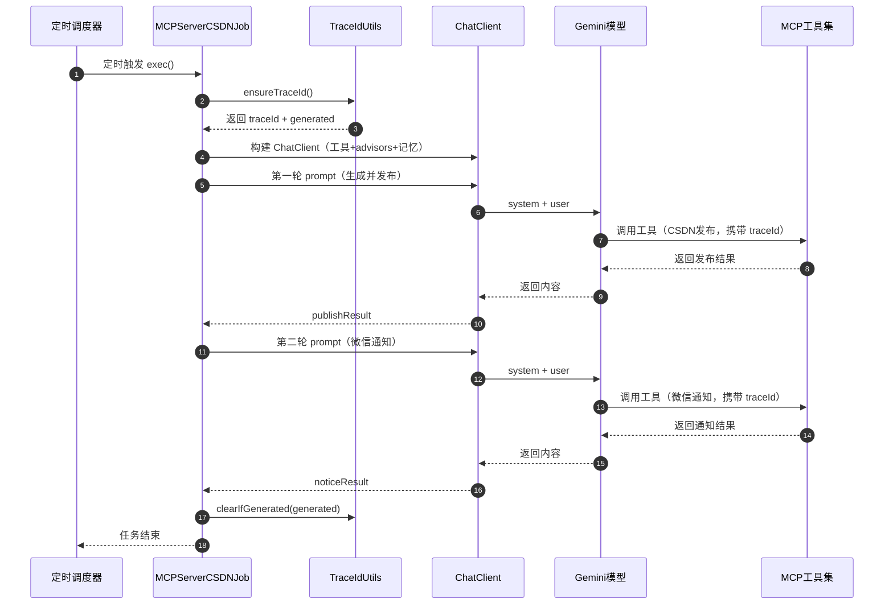
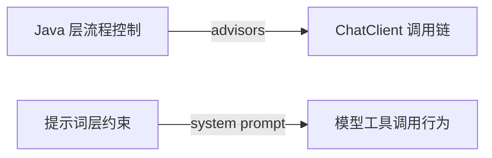

# MCPServerCSDNJob 链路全流程梳理（含代码片段与图表）

> 目的：让你从“定时触发 → 生成文章 → 发布 → 通知”的整条链路中，快速理解每一步是怎么串起来的。

---

## 1. 整体目标

该任务负责自动化完成：

1. 生成 AI 学习主题文章
2. 发布到 CSDN
3. 使用上一轮结果发送微信公众号通知

---

## 2. 时序视图（总体流程）



---

## 3. 核心代码片段（按链路拆解）

> 以下代码片段直接来自当前实现，按流程顺序整理。

### 3.1 traceId 统一封装（共享内核模块）

公共工具类位置：
- `ai-mcp-knowledge-types/src/main/java/com/xbk/knowledge/types/trace/TraceIdUtils.java`

```java
public final class TraceIdUtils {

    public static final String TRACE_ID_KEY = "traceId";

    private TraceIdUtils() {
        throw new IllegalStateException("Utility class");
    }

    public static TraceIdContext ensureTraceId() {
        var currentTraceId = MDC.get(TRACE_ID_KEY);
        if (currentTraceId == null || currentTraceId.isEmpty()) {
            var traceId = generateTraceId();
            MDC.put(TRACE_ID_KEY, traceId);
            return new TraceIdContext(traceId, true);
        }
        return new TraceIdContext(currentTraceId, false);
    }

    public static String getOrCreateTraceId() {
        return ensureTraceId().traceId();
    }

    public static void clearIfGenerated(boolean generated) {
        if (generated) {
            MDC.remove(TRACE_ID_KEY);
        }
    }

    public record TraceIdContext(String traceId, boolean generated) {
    }
}
```

作用：
- 统一“生成 + 写回 MDC + 清理”的规则
- 返回 `TraceIdContext`，让调用方知道是否需要清理

---

### 3.2 定时任务中获取并清理 traceId

```java
var traceIdContext = TraceIdUtils.ensureTraceId();
var traceId = traceIdContext.traceId();
var generated = traceIdContext.generated();

try {
    // 业务逻辑
} finally {
    TraceIdUtils.clearIfGenerated(generated);
}
```

作用：
- 保证定时任务线程不会遗留 MDC 污染
- 只清理由当前任务生成的 traceId

---

### 3.3 System Prompt（告知模型传递 traceId）

```java
private static final String TRACE_ID_SYSTEM_PROMPT = """
        [链路追踪指令]
        当前请求的 traceId 为: %s
        在调用任何工具时，请将此 traceId 作为参数传递（参数名: traceId）。
        这用于端到端日志关联，请务必传递。
        """;
```

作用：
- 这是“提示词层”的约束
- 让大模型在调用工具时带上 traceId 参数

---

### 3.4 ChatClient 构建与 Advisors 配置

```java
var chatMemory = MessageWindowChatMemory.builder()
        .chatMemoryRepository(new InMemoryChatMemoryRepository())
        .maxMessages(100)
        .build();

var builder = ChatClient.builder(geminiChatModel)
        .defaultToolCallbacks(tools)
        .defaultAdvisors(PromptChatMemoryAdvisor.builder(chatMemory).build());

if (advisors != null && !advisors.isEmpty()) {
    builder.defaultAdvisors(advisors.toArray(new CallAdvisor[0]));
}

var chatClient = builder.build();
```

要点：
- `defaultToolCallbacks(tools)` 注入 MCP 工具能力
- `defaultAdvisors(...)` 注入记忆顾问
- 如果 `advisors` 非空，会再次设置默认 advisors

注意事项：
- 这里可能存在“覆盖”风险（需要确认 builder 是追加还是替换）

---

### 3.5 第一轮：生成并发布 CSDN 文章

```java
var publishResult = chatClient.prompt()
        .system(String.format(TRACE_ID_SYSTEM_PROMPT, traceId))
        .user(publishPrompt)
        .advisors(advisor -> advisor.param("chat_memory_conversation_id", conversationId))
        .call()
        .content();
```

说明：
- `system(...)` 注入 traceId 指令
- `user(...)` 是文章生成与发布要求
- `advisors(...)` 传递 conversationId 保持记忆

---

### 3.6 第二轮：发送微信公众号通知

```java
var noticeResult = chatClient.prompt()
        .system(String.format(TRACE_ID_SYSTEM_PROMPT, traceId))
        .user(noticePrompt)
        .advisors(advisor -> advisor.param("chat_memory_conversation_id", conversationId))
        .call()
        .content();
```

说明：
- 同一 `conversationId` 让模型读取上一轮结果
- 继续要求工具调用时携带 traceId

---

### 3.7 TraceIdAdvisor 同样复用工具类

```java
var traceIdContext = TraceIdUtils.ensureTraceId();
var traceId = traceIdContext.traceId();
var generated = traceIdContext.generated();

try {
    var response = chain.nextCall(request);
    return response;
} finally {
    TraceIdUtils.clearIfGenerated(generated);
}
```

作用：
- ChatClient 调用链内部也遵循同一套 traceId 规则

---

## 4. 关键关系说明

### 4.1 `defaultAdvisors(...)` 与 `TRACE_ID_SYSTEM_PROMPT` 是否冲突？

不会冲突，也没有直接关联：

- `defaultAdvisors(...)` 是 **Java 层执行流程** 的拦截器/扩展机制
- `TRACE_ID_SYSTEM_PROMPT` 是 **提示词层** 对模型行为的约束

它们分别作用于不同层面：



可能的风险点：
- 如果外部 `advisors` 覆盖了默认的记忆顾问，可能会导致对话记忆失效
- 这与 traceId 指令无直接冲突，但会影响第二轮是否能读到第一轮内容

---

## 5. 全链路逻辑总结（按执行顺序）

1. 定时器触发 `exec()`
2. 通过 `TraceIdUtils` 获取/生成 traceId，并写回 MDC
3. 构建 ChatClient（工具 + 记忆 + advisors）
4. 第一轮：生成文章并发布（系统提示词携带 traceId）
5. 第二轮：基于第一轮结果发送微信通知
6. 最后根据 `generated` 决定是否清理 MDC

---

## 6. 你可以重点关注的验证点

- `defaultAdvisors(...)` 是否被覆盖（影响记忆）
- 工具调用是否真的带上 traceId（是否符合日志关联预期）
- 第二轮 prompt 是否读取到第一轮发布结果
- 定时任务执行结束后 MDC 是否清理

---

## 7. 文件位置

- 当前文档：`.codex/mcp-csdn-chain.md`
- 代码来源：
  - `ai-mcp-knowledge-trigger/src/main/java/com/xbk/knowledge/trigger/job/MCPServerCSDNJob.java`
  - `ai-mcp-knowledge-types/src/main/java/com/xbk/knowledge/types/trace/TraceIdUtils.java`
  - `ai-mcp-knowledge-app/src/main/java/com/xbk/knowledge/config/TraceIdAdvisor.java`
