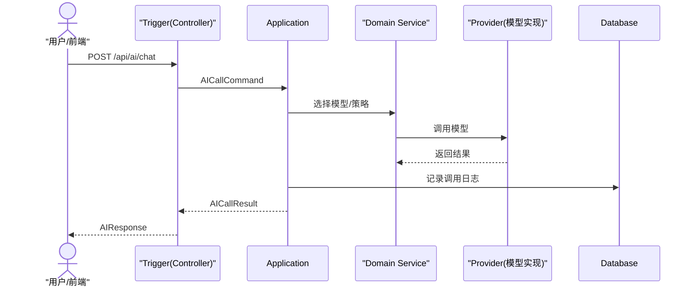
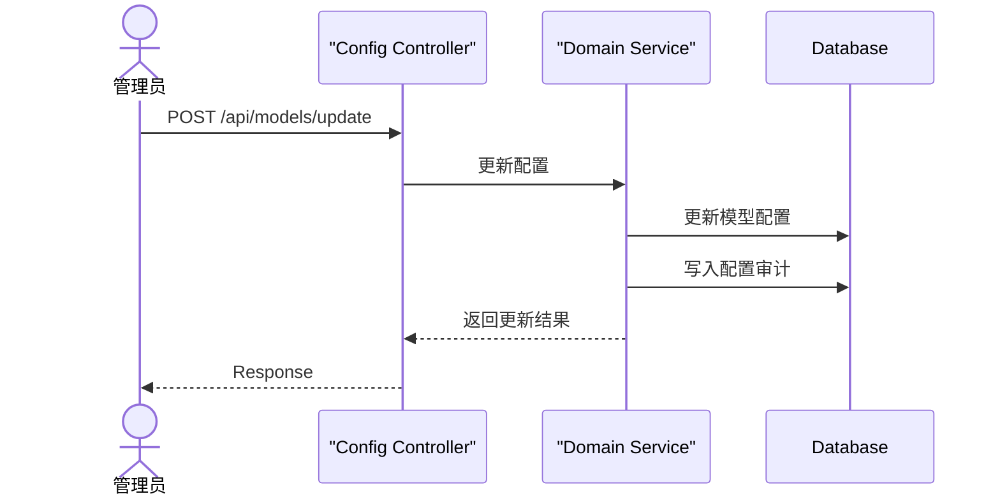
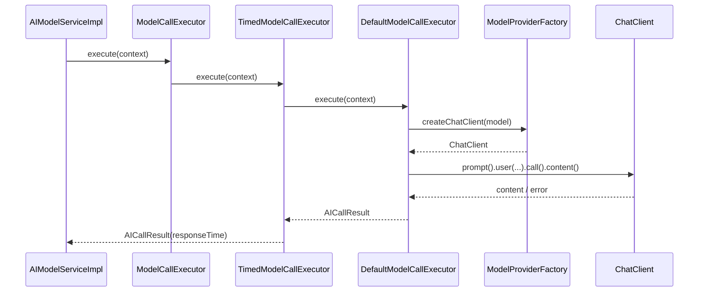
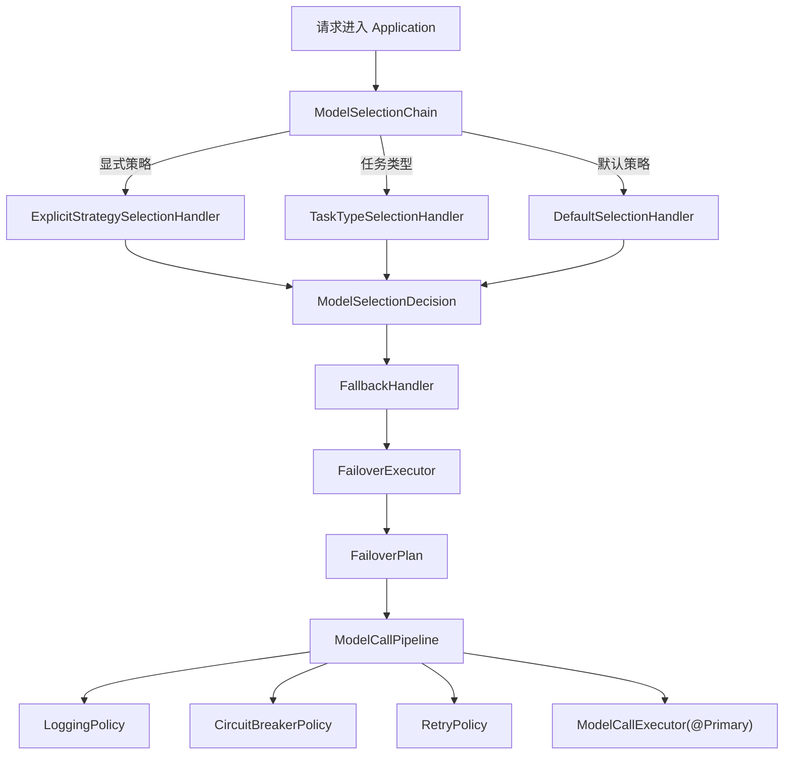
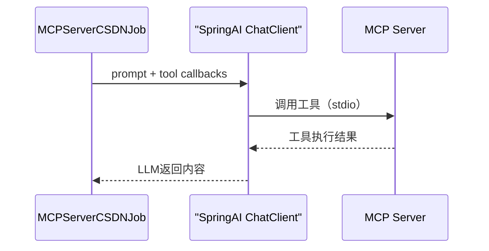

# ai-mcp-knowledge-study 入门文档（从 0 到 1）

> 目标：帮助你从零理解项目价值、架构、核心概念与实际运行流程，并能完成一次“模型配置 → 任务配置 → AI 调用 → 指标与审计查看”的闭环体验。

## 0. 阅读前提示（务必先看）

- 本项目后端使用 **JDK 17**，构建工具为 **Maven**。
- 项目使用 **双数据源**：MySQL（模型编排与配置数据） + PostgreSQL（pgvector 向量存储）。
- `ai-mcp-knowledge-app/src/main/resources/application-dev.yml` 中配置了 MySQL 与 PostgreSQL 的数据源参数。
- `sql/init-ai-model-orchestration.sql` 是 **MySQL 8.0+** 版本的初始化脚本。
- `application-dev.yml` 中 **`spring.main.web-application-type: none` 会禁用 HTTP 接口**，如需使用 Web 接口，需要改为 `servlet` 或删除该配置。

## 1. 项目简介（它是什么）

这是一个基于 DDD 分层的“多模型编排 + MCP 工具协同”的知识型 AI 工程示例。项目核心目标是：
- **统一管理多种大模型**（OpenAI / Anthropic / Gemini 等；Ollama 目前用于向量/embedding），
- **用任务驱动模型选择**，支持“质量优先 / 速度优先 / 成本优先”的策略选择，
- **具备可观测性**（调用日志、成功率、响应时间、模型使用分布），
- **具备配置审计能力**（对模型与任务配置变更留痕），
- **支持 MCP 工具协同**（通过 MCP Server/Client 接入外部工具）。

一句话：**把“多模型调用 + 任务策略 + 可靠性 + 可观测 + MCP 工具链”打通的工程模板。**

## 2. 解决了什么痛点

1. **多模型并存难管理**
   - 不同模型 API、参数、能力各异，业务很难统一调度。
   - 项目统一抽象 ModelProvider，并由应用层做策略编排。

2. **业务需求难映射到模型选择**
   - “分析/写作/翻译/代码生成”等任务需要不同模型，人工判断容易出错。
   - 项目引入 TaskType 任务类型配置，按任务自动选择首选与备用模型。

3. **稳定性与降级缺失**
   - 单模型故障会影响整体链路。
   - 项目提供熔断/降级能力（fallback），保证调用可用性。

4. **缺乏调用可观测**
   - 很难回答“调用量、成功率、响应耗时、模型使用分布”。
   - 项目提供指标统计接口 + 调用日志表。

5. **配置变更不可追溯**
   - 模型或任务配置一旦变更，难以追踪历史。
   - 项目提供配置审计表与审计接口。

6. **工具协同集成成本高**
   - MCP 工具的接入通常需要“独立服务 + 协议封装”。
   - 本项目提供 MCP Client/Server 集成样例与工具调用链路。

## 3. 架构总览（图表）

### 3.1 DDD 分层与模块依赖

> DDD 架构与分层的详细说明已单独整理到：`./DDD.md`  
> 当前项目已采用严格分层：**Trigger → Application → Domain → Infrastructure**  
> 建议先通读 DDD 文档，再回来看整体架构图与模块依赖。

### 3.2 AI 调用主流程（时序）



### 3.3 配置变更审计流程



## 4. 目录结构与 DDD 分层

项目根目录模块（以 `pom.xml` 为准）：

- **ai-mcp-knowledge-types**
  - 共享内核：通用类型、分页、Result、枚举、TraceId 等。

- **ai-mcp-knowledge-api**
  - API DTO 与服务接口定义（例如 AIRequest/AIResponse、ModelConfigRequest）。

- **ai-mcp-knowledge-domain**
  - 领域实体、领域服务接口、仓储接口等核心领域模型。

- **ai-mcp-knowledge-application**
  - 应用层编排：用例协调、模型选择、调用聚合、fallback 策略处理。

- **ai-mcp-knowledge-infrastructure**
  - 具体技术实现：MyBatis Mapper、仓储实现、模型调用 Provider 实现等。

- **ai-mcp-knowledge-trigger**
  - 接口适配层：HTTP Controller、DTO 转换、参数校验。

- **ai-mcp-knowledge-app**
  - 应用启动模块：Spring Boot 启动类、配置、定时任务、依赖聚合。

- **ai-mcp-knowledge-web**
  - 前端管理台（Vue3 + Element Plus）：模型管理、任务管理、指标看板、审计日志、Playground 调试等。
  - 说明：该目录不在当前 Maven Reactor 中，需单独构建/运行。

> DDD 的完整学习与项目落地讲解请见：`./DDD.md`

## 5. 核心概念与术语

### 5.1 业务实体

1. **ModelConfig（模型配置）**
   - 模型名称、类型、BaseUrl、API Key、启用状态、优先级。

2. **ModelCapability（模型能力）**
   - max tokens、质量评分、是否支持流式等能力。

3. **TaskType（任务类型）**
   - 任务名称/编码、描述、首选模型、备用模型列表。

4. **CallLog（调用日志）**
   - 请求内容、响应内容、耗时、Token、状态、异常信息。

5. **ConfigAudit（配置审计）**
   - 表名、记录 ID、操作类型、旧值/新值、操作人、时间。

6. **McpServerConfig（MCP Server 配置）**
   - Server 名称、类型（STDIO/HTTP/SSE/WEBSOCKET）、启停状态、连接参数。
   - 运行时支持热更新：创建/更新/启停会立即生效。

### 5.2 枚举与策略

- **ModelType**: `OPENAI` / `ANTHROPIC` / `GEMINI`
- **ModelSelectionStrategy**: `QUALITY_PRIORITY` / `SPEED_PRIORITY` / `COST_PRIORITY`
  - 当前显式策略仅实现 `QUALITY_PRIORITY`，其余策略会返回 400（提示“策略未实现”）
- **Audit Operation**: `INSERT` / `UPDATE` / `DELETE`
- **Call Status**: `SUCCESS` / `FAILED` / `FALLBACK`（在调用日志中）

## 6. 关键流程（从请求到落库）

### 6.1 AI 调用流程
1. 前端调用 `/api/ai/chat`（如需指定任务类型，将 taskType 放入请求体）
2. Trigger 层接收请求，转换为应用层命令
3. Application 层进入“模型选择责任链”（显式策略 > 任务类型 > 默认策略）
4. 进入“降级执行器”（模板方法 + 迭代器），准备候选模型计划
5. 对每个候选模型执行“调用管道”（责任链：熔断/重试/日志）
6. 成功即返回并记录调用日志；失败则尝试下一个候选
7. 若全部失败，返回统一失败结果

#### 6.1.1 模型选择与降级的关键组件（便于定位代码）
- 模型选择责任链：`ModelSelectionChain` + 各 `*SelectionHandler`
- 责任链装配工厂：`ModelSelectionChainFactory`
- 降级执行器（模板方法）：`AbstractFailoverExecutor` / `DefaultFailoverExecutor`
- 降级迭代器：`FailoverPlan` / `DefaultFailoverPlan`
- 调用管道（责任链）：`ModelCallPipeline` + `ModelCallPolicy`

#### 6.1.1.1 模型选择责任链装配方式（显式 next）

本项目采用“显式 next”责任链模式，装配与执行路径清晰可追踪：

- 装配位置：`ModelSelectionChainFactory` 负责集中装配
- 装配方式：通过 `Map<String, ModelSelectionHandler>` 获取处理器，并显式挂接
- 顺序固定：显式策略 → 任务类型 → 默认兜底
- 处理器行为：命中则处理，未命中则显式调用 `next()` 进入下一个节点

示例逻辑（概念级）：
1. 获取显式策略处理器作为头节点
2. `head.appendNext(taskTypeHandler).appendNext(defaultHandler)`
3. 头节点驱动整个责任链执行

#### 6.1.1.2 模型调用执行器调用链（ModelCallExecutor）



一句话总结：**调用入口统一在 `ModelCallExecutor`，默认是“计时装饰器 → 默认执行器 → Provider”三段式执行。**

#### 6.1.1.3 ModelCallExecutor 的 Spring 注入流程

这部分解释为什么最终注入的是 `TimedModelCallExecutor`，以及它如何委托 `DefaultModelCallExecutor`：

1. Spring 扫描到 `ModelCallExecutor` 的两个实现：
   - `DefaultModelCallExecutor`
   - `TimedModelCallExecutor`
2. `TimedModelCallExecutor` 标注 `@Primary`，所以当其他组件注入 `ModelCallExecutor` 时，默认选用它。
3. `TimedModelCallExecutor` 构造方法使用 `@Qualifier("defaultModelCallExecutor")`，
   显式注入默认执行器作为 delegate。
4. 执行时走装饰器链路：
   `TimedModelCallExecutor.execute(...)` → `DefaultModelCallExecutor.execute(...)`

一句话总结：**`@Primary` 决定默认注入实现，`@Qualifier` 用于装饰器拿到被装饰者。**

```mermaid
flowchart LR
  C["Spring 容器"] -->|扫描| D["DefaultModelCallExecutor"]
  C -->|扫描| T["TimedModelCallExecutor"]
  T -->|@Primary 默认注入| I["注入到 ModelCallExecutor 依赖点"]
  T -->|"@Qualifier(defaultModelCallExecutor)"| D
  I -->|execute| T
  T -->|delegate| D
```

#### 6.1.1.4 模型调用执行器涉及的设计模式

围绕 `AICallResult response = modelCallExecutor.execute(context);` 这一行，实际涉及的设计模式与对应类如下：

1. **策略模式（Strategy）**
   - 接口：`ModelCallExecutor`
   - 实现：`DefaultModelCallExecutor`、`TimedModelCallExecutor`
   - 作用：定义“执行器”抽象，便于替换/扩展实现

2. **装饰器模式（Decorator）**
   - 装饰器：`TimedModelCallExecutor`（`@Primary`）
   - 被装饰：`DefaultModelCallExecutor`
   - 作用：在不改动核心执行逻辑的前提下追加耗时统计

3. **工厂模式（Factory）**
   - 工厂：`ModelProviderFactory`
   - 产物：`ChatClient`
   - 作用：根据 `ModelConfig` 动态创建不同模型的调用客户端

4. **责任链模式（Chain of Responsibility）**
   - 管道：`ModelCallPipeline` + `ModelCallPolicy`（重试/熔断/日志）
   - 作用：在执行器调用前后叠加横切能力，形成可组合的调用链

一句话总览：**执行器本身是策略 + 装饰器 + 工厂的组合，外围再由责任链叠加可靠性能力。**

#### 6.1.2 模型选择与降级流程图（Mermaid）



### 6.2 模型与任务配置
- 模型与任务通过后台管理接口创建/更新
- 配置变更会产生审计记录，支持查询与追溯

### 6.4 MCP Server 配置与热更新
- MCP Server 配置已从本地配置文件迁移为 **MySQL 管理 + 运行时热更新**。
- 支持接入方式：`STDIO` / `HTTP` / `SSE`（WebSocket 暂不提供实现）。
- 配置管理接口：
  - `POST /api/mcp/servers/list`：分页查询
  - `POST /api/mcp/servers/get`：按 ID 查询
  - `POST /api/mcp/servers/create`：新增配置
  - `POST /api/mcp/servers/update`：更新配置
  - `POST /api/mcp/servers/delete`：删除配置
  - `POST /api/mcp/servers/enable`：启用配置
  - `POST /api/mcp/servers/disable`：禁用配置
  - `POST /api/mcp/servers/refresh`：刷新所有启用连接

### 6.3 指标统计
- 通过 `/api/metrics/*` 查询聚合指标
- 当前返回：调用次数、成功率、响应时间、模型使用分布

## 7. 数据库与表结构（MySQL + PostgreSQL）

当前默认采用双数据源：
- **MySQL**：存储模型编排相关业务表（模型配置/任务类型/调用日志/配置审计）
- **PostgreSQL**：仅用于 **pgvector 向量存储**

其中 MyBatis/MyBatis-Plus 绑定 MySQL；向量库由 Spring AI pgvector 使用 PostgreSQL。

### 7.1 MySQL 版本（项目自带）

脚本位置：`sql/init-ai-model-orchestration.sql`

脚本新增内容：
- `ai_mcp_server_config`（MCP Server 配置表）

### 7.2 PostgreSQL 版本（可选：仅当你需要把业务表迁到 PostgreSQL）

> 注意：当前默认配置为 **MySQL 存业务表 + PostgreSQL 存向量库**。以下脚本仅用于“业务表也迁移到 PostgreSQL”的场景。
> 如需使用 PostgreSQL 作为业务库，脚本默认数据库名为 `ai-rag-knowledge`，请与配置保持一致。

```sql
-- ============================
-- PostgreSQL 初始化脚本
-- ============================

-- 1) 创建数据库（需要超级权限）
CREATE DATABASE "ai-rag-knowledge" WITH ENCODING 'UTF8';

-- 2) 连接数据库（psql 中执行）
-- \\c "ai-rag-knowledge";

-- 3) 表结构
CREATE TABLE IF NOT EXISTS ai_model_config (
    id BIGSERIAL PRIMARY KEY,
    model_name VARCHAR(100) NOT NULL,
    model_type VARCHAR(50) NOT NULL,
    api_key VARCHAR(500) NOT NULL,
    base_url VARCHAR(500) NOT NULL,
    enabled BOOLEAN DEFAULT TRUE,
    priority INT DEFAULT 0,
    created_at TIMESTAMP DEFAULT CURRENT_TIMESTAMP,
    updated_at TIMESTAMP DEFAULT CURRENT_TIMESTAMP
);

CREATE TABLE IF NOT EXISTS ai_model_capability (
    id BIGSERIAL PRIMARY KEY,
    model_id BIGINT NOT NULL UNIQUE,
    max_input_tokens INT DEFAULT 0,
    max_output_tokens INT DEFAULT 0,
    support_function_calling BOOLEAN DEFAULT FALSE,
    support_vision BOOLEAN DEFAULT FALSE,
    support_streaming BOOLEAN DEFAULT TRUE,
    quality_score INT DEFAULT 50,
    created_at TIMESTAMP DEFAULT CURRENT_TIMESTAMP,
    updated_at TIMESTAMP DEFAULT CURRENT_TIMESTAMP,
    CONSTRAINT fk_model_config
      FOREIGN KEY (model_id) REFERENCES ai_model_config(id) ON DELETE CASCADE
);

CREATE TABLE IF NOT EXISTS ai_task_type (
    id BIGSERIAL PRIMARY KEY,
    task_name VARCHAR(100) NOT NULL,
    task_code VARCHAR(50) NOT NULL UNIQUE,
    description TEXT,
    preferred_model_id BIGINT,
    fallback_model_ids VARCHAR(500),
    created_at TIMESTAMP DEFAULT CURRENT_TIMESTAMP,
    updated_at TIMESTAMP DEFAULT CURRENT_TIMESTAMP,
    CONSTRAINT fk_task_model
      FOREIGN KEY (preferred_model_id) REFERENCES ai_model_config(id) ON DELETE SET NULL
);

CREATE TABLE IF NOT EXISTS ai_call_log (
    id BIGSERIAL PRIMARY KEY,
    model_id BIGINT NOT NULL,
    task_type VARCHAR(50),
    request_content TEXT,
    response_content TEXT,
    tokens_used INT DEFAULT 0,
    response_time BIGINT DEFAULT 0,
    status VARCHAR(20) NOT NULL,
    error_message TEXT,
    created_at TIMESTAMP DEFAULT CURRENT_TIMESTAMP,
    CONSTRAINT fk_call_model
      FOREIGN KEY (model_id) REFERENCES ai_model_config(id) ON DELETE CASCADE
);

CREATE TABLE IF NOT EXISTS ai_config_audit (
    id BIGSERIAL PRIMARY KEY,
    table_name VARCHAR(100) NOT NULL,
    record_id BIGINT NOT NULL,
    operation VARCHAR(20) NOT NULL,
    old_value TEXT,
    new_value TEXT,
    operator VARCHAR(100),
    created_at TIMESTAMP DEFAULT CURRENT_TIMESTAMP
);

-- 4) 索引
CREATE INDEX IF NOT EXISTS idx_model_type ON ai_model_config (model_type);
CREATE INDEX IF NOT EXISTS idx_enabled ON ai_model_config (enabled);
CREATE INDEX IF NOT EXISTS idx_priority ON ai_model_config (priority);
CREATE INDEX IF NOT EXISTS idx_task_code ON ai_task_type (task_code);
CREATE INDEX IF NOT EXISTS idx_call_model_id ON ai_call_log (model_id);
CREATE INDEX IF NOT EXISTS idx_call_task_type ON ai_call_log (task_type);
CREATE INDEX IF NOT EXISTS idx_call_status ON ai_call_log (status);
CREATE INDEX IF NOT EXISTS idx_call_created_at ON ai_call_log (created_at);
CREATE INDEX IF NOT EXISTS idx_audit_table_name ON ai_config_audit (table_name);
CREATE INDEX IF NOT EXISTS idx_audit_record_id ON ai_config_audit (record_id);
CREATE INDEX IF NOT EXISTS idx_audit_created_at ON ai_config_audit (created_at);
```

### 7.3 表字段说明（数据字典）

#### 7.3.1 ai_model_config
| 字段 | 类型 | 说明 |
| --- | --- | --- |
| id | BIGINT | 主键 |
| model_name | VARCHAR(100) | 模型名称 |
| model_type | VARCHAR(50) | 模型类型 |
| api_key | VARCHAR(500) | API 密钥 |
| base_url | VARCHAR(500) | 模型服务地址 |
| enabled | BOOLEAN | 是否启用 |
| priority | INT | 优先级（数值越大越优先；用于默认/扩展策略排序，是否生效取决于策略实现） |
| created_at | TIMESTAMP | 创建时间 |
| updated_at | TIMESTAMP | 更新时间 |

说明：
- 当前未启用基于 priority 的策略时，可用 0/10/20 等简单递增值即可。

#### 7.3.2 ai_model_capability
| 字段 | 类型 | 说明 |
| --- | --- | --- |
| id | BIGINT | 主键 |
| model_id | BIGINT | 模型ID（唯一） |
| max_input_tokens | INT | 最大输入 token |
| max_output_tokens | INT | 最大输出 token |
| support_function_calling | BOOLEAN | 是否支持函数调用 |
| support_vision | BOOLEAN | 是否支持视觉 |
| support_streaming | BOOLEAN | 是否支持流式输出 |
| quality_score | INT | 质量评分（1-100） |

#### 7.3.3 ai_task_type
| 字段 | 类型 | 说明 |
| --- | --- | --- |
| id | BIGINT | 主键 |
| task_name | VARCHAR(100) | 任务名称 |
| task_code | VARCHAR(50) | 任务编码 |
| description | TEXT | 描述 |
| preferred_model_id | BIGINT | 首选模型ID |
| fallback_model_ids | VARCHAR(500) | 备用模型ID列表（逗号分隔） |

#### 7.3.4 ai_call_log
| 字段 | 类型 | 说明 |
| --- | --- | --- |
| id | BIGINT | 主键 |
| model_id | BIGINT | 模型ID |
| task_type | VARCHAR(50) | 任务类型 |
| request_content | TEXT | 请求内容 |
| response_content | TEXT | 响应内容 |
| tokens_used | INT | 使用 token 数 |
| response_time | BIGINT | 响应时间（毫秒） |
| status | VARCHAR(20) | SUCCESS/FAILED/FALLBACK |
| error_message | TEXT | 错误信息 |

#### 7.3.5 ai_config_audit
| 字段 | 类型 | 说明 |
| --- | --- | --- |
| id | BIGINT | 主键 |
| table_name | VARCHAR(100) | 表名 |
| record_id | BIGINT | 记录ID |
| operation | VARCHAR(20) | INSERT/UPDATE/DELETE |
| old_value | TEXT | 旧值（JSON） |
| new_value | TEXT | 新值（JSON） |
| operator | VARCHAR(100) | 操作人 |
| created_at | TIMESTAMP | 创建时间 |

## 8. 配置文件说明（必须知道的关键项）

### 8.1 `ai-mcp-knowledge-app/src/main/resources/application.yml`
- 默认激活 `dev` profile

### 8.2 `application-dev.yml`（开发环境）
关键字段：
- `server.port`: 8090
- `spring.datasource.*`: MySQL + PostgreSQL 双数据源连接
- `spring.ai.*`: OpenAI/Gemini/Ollama 等模型配置
- `spring.ai.mcp.client.stdio.servers-configuration`: MCP 配置文件
- `logging.path`: 日志目录
- `spring.main.web-application-type`: 当前为 `none`（禁用 HTTP），如需开放接口请改为 `servlet`

### 8.3 MCP 配置文件
路径：`ai-mcp-knowledge-app/src/main/resources/config/mcp-servers-config.json`
- 定义了 `mcp-tool-computer / mcp-tool-weixin / mcp-tool-csdn` 的启动命令
- 注意：该文件包含本地路径与密钥参数，需要替换为你的真实环境

## 9. MCP 实战配置说明（非常详细）

### 9.1 MCP 是什么（项目内定位）
- MCP (Model Context Protocol) 是一种让模型调用外部工具的协议。
- 本项目使用 **Spring AI MCP Client** 连接外部 MCP Server，实现“工具调用”。  
- 你可以把 MCP Server 理解为一组“外部能力插件（发文、通知、调用系统等）”。  

### 9.2 当前项目使用 MCP 的位置
核心示例在：`ai-mcp-knowledge-trigger/src/main/java/com/xbk/knowledge/trigger/job/MCPServerCSDNJob.java`
- 定时任务触发：生成文章 → 发布到 CSDN → 发送微信通知
- 工具注入方式：`ToolCallbackProvider`
- 聊天上下文保留：`PromptChatMemoryAdvisor`

### 9.3 MCP Client 配置文件结构
路径：`ai-mcp-knowledge-app/src/main/resources/config/mcp-servers-config.json`

核心字段说明：
- `command`: 启动 MCP Server 的命令（这里为 `java`）
- `args`: 启动参数，通常包含 `-jar` + MCP Server JAR 路径

### 9.4 MCP Server 启动前置条件
1. 构建 MCP 工具工程（如 `mcp-tool-csdn` / `mcp-tool-weixin`）
2. 确保 JAR 真实存在，路径可访问
3. 替换配置中的密钥、公众号信息等参数

### 9.5 MCP 服务在本项目的调用链



### 9.6 MCP 排查清单
- MCP Server JAR 是否可运行（路径是否正确）
- `spring.ai.mcp.client.stdio.servers-configuration` 是否指向正确文件
- MCP Server 是否要求额外环境变量（token/账号等）

## 10. 接口清单 + 字段示例（极详细）

### 10.1 通用响应结构
```json
{
  "code": 200,
  "message": "success",
  "success": true,
  "data": {}
}
```

### 10.2 分页请求/响应结构
请求（PageRequest）：
```json
{
  "pageNum": 1,
  "pageSize": 10,
  "sortField": "created_at",
  "sortOrder": "DESC"
}
```

响应（PageResult）：
```json
{
  "records": [],
  "total": 0,
  "pageNum": 1,
  "pageSize": 10,
  "totalPages": 0,
  "hasNext": false,
  "hasPrevious": false
}
```

### 10.3 AI 调用接口

#### 10.3.1 POST /api/ai/chat
请求：
```json
{
  "content": "请写一段关于DDD的介绍",
  "taskType": "WRITING",
  "systemPrompt": "你是一名架构师",
  "parameters": {
    "temperature": 0.7,
    "maxTokens": 2048
  },
  "strategy": "QUALITY_PRIORITY",
  "streaming": false
}
```

响应：
```json
{
  "code": 200,
  "message": "success",
  "success": true,
  "data": {
    "content": "DDD是一种......",
    "modelUsed": "GPT-4",
    "tokensUsed": 1024,
    "responseTime": 540,
    "success": true,
    "errorMessage": null,
    "fallback": false,
    "retryCount": 0
  }
}
```

#### 10.3.2 POST /api/ai/chat（指定任务类型）
说明：在请求体中传入 taskType，会优先按任务类型的首选模型选择。

请求：
```json
{
  "content": "请翻译这段文本",
  "taskType": "TRANSLATION",
  "strategy": "QUALITY_PRIORITY"
}
```

#### 10.3.3 POST /api/ai/models
响应：
```json
[
  {
    "modelId": 1,
    "modelName": "GPT-4",
    "modelType": "OPENAI",
    "qualityScore": 90,
    "enabled": true,
    "capability": {
      "maxInputTokens": 128000,
      "maxOutputTokens": 4096,
      "supportFunctionCalling": true,
      "supportVision": true,
      "supportStreaming": true,
      "qualityScore": 90
    }
  }
]
```

#### 10.3.4 POST /api/ai/models/recommend
返回推荐模型信息（ModelInfo）。
请求：
```json
{
  "taskType": "WRITING"
}
```

### 10.4 模型管理接口

#### 10.4.1 POST /api/models/list
请求：
```json
{
  "pageNum": 1,
  "pageSize": 10
}
```

响应记录字段：
```json
{
  "id": 1,
  "modelName": "GPT-4",
  "modelType": "OPENAI",
  "baseUrl": "http://127.0.0.1:8045",
  "enabled": true,
  "priority": 90,
  "capability": {
    "maxInputTokens": 128000,
    "maxOutputTokens": 4096,
    "supportFunctionCalling": true,
    "supportVision": true,
    "supportStreaming": true,
    "qualityScore": 90
  },
  "createdAt": "2026-01-27T10:00:00",
  "updatedAt": "2026-01-27T10:00:00"
}
```

#### 10.4.2 POST /api/models/create
请求：
```json
{
  "modelName": "GPT-4",
  "modelType": "OPENAI",
  "apiKey": "sk-xxx",
  "baseUrl": "http://127.0.0.1:8045",
  "enabled": true,
  "priority": 90,
  "capability": {
    "maxTokens": 128000,
    "temperature": 0.7,
    "topP": 0.9,
    "qualityScore": 90,
    "speedScore": 80,
    "costScore": 60
  }
}
```

#### 10.4.3 POST /api/models/update
请求（需带 id）：
```json
{
  "id": 1,
  "modelName": "GPT-4",
  "modelType": "OPENAI",
  "apiKey": "sk-xxx",
  "baseUrl": "http://127.0.0.1:8045",
  "enabled": true,
  "priority": 95,
  "capability": {
    "maxTokens": 128000,
    "qualityScore": 92
  }
}
```

#### 10.4.4 POST /api/models/enable / disable / delete / get
请求结构统一：
```json
{ "id": 1 }
```

### 10.5 任务类型管理接口

#### 10.5.1 POST /api/task-types/list
请求：
```json
{ "pageNum": 1, "pageSize": 10 }
```

#### 10.5.2 POST /api/task-types/create
请求：
```json
{
  "taskName": "写作",
  "taskCode": "WRITING",
  "description": "文章创作任务",
  "preferredModelId": 2,
  "fallbackModelIds": "1,3"
}
```

#### 10.5.3 POST /api/task-types/update
请求：
```json
{
  "id": 1,
  "taskName": "写作",
  "taskCode": "WRITING",
  "description": "文章创作任务（更新）",
  "preferredModelId": 2,
  "fallbackModelIds": "1,3"
}
```

#### 10.5.4 POST /api/task-types/get / get-by-code / delete
请求示例：
```json
{ "id": 1 }
```
或：
```json
{ "code": "WRITING" }
```

### 10.6 指标统计接口

#### 10.6.1 POST /api/metrics/calls
请求：
```json
{
  "modelId": 1,
  "taskType": "WRITING",
  "startTime": "2026-01-01 00:00:00",
  "endTime": "2026-01-31 23:59:59"
}
```
响应：
```json
{
  "totalCalls": 100,
  "successCalls": 95,
  "failedCalls": 5,
  "fallbackCalls": 3
}
```

#### 10.6.2 POST /api/metrics/success-rate
响应：
```json
{
  "totalCalls": 100,
  "successCalls": 95,
  "successRate": 95.0
}
```

#### 10.6.3 POST /api/metrics/response-time
响应：
```json
{
  "avgResponseTime": 540.0,
  "minResponseTime": 120,
  "maxResponseTime": 3200
}
```

#### 10.6.4 POST /api/metrics/model-usage
响应：
```json
[
  { "modelId": 1, "callCount": 50, "usageRate": 50.0 },
  { "modelId": 2, "callCount": 30, "usageRate": 30.0 },
  { "modelId": 3, "callCount": 20, "usageRate": 20.0 }
]
```

### 10.7 审计日志接口

#### 10.7.1 POST /api/audits/list
请求：
```json
{
  "pageNum": 1,
  "pageSize": 20,
  "tableName": "ai_model_config",
  "recordId": 1,
  "operator": "admin"
}
```
响应记录：
```json
{
  "id": 1,
  "tableName": "ai_model_config",
  "recordId": 1,
  "operation": "UPDATE",
  "oldValue": "{...}",
  "newValue": "{...}",
  "operator": "admin",
  "createdAt": "2026-01-27T10:00:00"
}
```

## 11. 前端页面与后端接口对应关系

- **模型管理**：`/api/models/*`
- **任务类型管理**：`/api/task-types/*`
- **AI Playground**：`/api/ai/chat`（taskType 放入请求体）
- **指标看板**：`/api/metrics/*`
- **审计日志**：`/api/audits/list`

前端位置：`ai-mcp-knowledge-web`

## 12. 从 0 到 1 的完整跑通步骤

### 步骤 1：准备运行环境
- JDK 17（项目 `pom.xml` 指定）
- Maven 3.6.x（本机配置为 `/Users/sxie/maven/apache-maven-3.6.3`）
- Node.js 18+（用于前端）
- 数据库：MySQL 或 PostgreSQL（二选一）

### 步骤 2：初始化数据库
- 如果使用 MySQL：执行 `sql/init-ai-model-orchestration.sql`
- 如果使用 PostgreSQL：使用本节提供的 PG 脚本

### 步骤 3：配置后端
修改 `ai-mcp-knowledge-app/src/main/resources/application-dev.yml`：
- 数据库连接信息
- OpenAI / Gemini / Ollama 的 base-url 和 api-key
- MCP 工具配置文件路径（如需）
- `spring.main.web-application-type` 改为 `servlet`

### 步骤 4：编译后端
在项目根目录运行：
```
/Users/sxie/maven/apache-maven-3.6.3/bin/mvn -DskipTests compile
```

### 步骤 5：启动后端
方式 1（推荐）：
```
/Users/sxie/maven/apache-maven-3.6.3/bin/mvn -pl ai-mcp-knowledge-app -DskipTests spring-boot:run
```

方式 2（打包后运行）：
```
/Users/sxie/maven/apache-maven-3.6.3/bin/mvn -DskipTests package
java -jar ai-mcp-knowledge-app/target/ai-mcp-knowledge-app-1.0-SNAPSHOT.jar
```

### 步骤 6：启动前端
```
cd ai-mcp-knowledge-web
npm install
npm run dev
```

### 步骤 7：验证闭环
1. 创建模型配置
2. 创建任务类型
3. Playground 发起调用
4. Dashboard 查看指标
5. Audit 查看审计记录

## 13. 常见问题与排查

1. **接口无法访问**
   - 检查 `spring.main.web-application-type` 是否为 `none`

2. **数据库连接失败**
   - 检查 `application-dev.yml` 数据源配置
   - MySQL 与 PostgreSQL 脚本不兼容需调整

3. **模型调用失败**
   - 检查模型配置的 `baseUrl` 与 `apiKey`
   - 检查代理服务是否可访问（示例配置使用本地代理）

4. **MCP 工具无法调用**
   - 检查 `mcp-servers-config.json` 中路径是否存在
   - 检查目标 MCP Server JAR 是否可运行

## 14. 学习建议路线图

- 第 1 天：理解 DDD 分层与模块职责
- 第 2 天：熟悉模型配置与任务配置的数据库结构
- 第 3 天：阅读 Application 层（模型选择与调用编排）
- 第 4 天：阅读 Infrastructure Provider（OpenAI/Gemini/Anthropic 实现）
- 第 5 天：完整跑通前后端流程并观察日志

---

## 15. API 字段字典（更细）

### 15.1 AIRequest 字段说明
| 字段 | 类型 | 必填 | 说明 |
| --- | --- | --- | --- |
| content | string | 是 | 用户输入内容 |
| taskType | string | 否 | 任务类型编码（如 WRITING/ANALYSIS；仅支持 ANALYSIS/WRITING/TRANSLATION/CODE_GENERATION/CONVERSATION/SUMMARIZATION/MCP_INTEGRATION） |
| systemPrompt | string | 否 | 系统提示词 |
| parameters | object | 否 | 模型参数（temperature/maxTokens 等） |
| strategy | string | 否 | 模型选择策略：QUALITY_PRIORITY / SPEED_PRIORITY / COST_PRIORITY（当前仅显式支持 QUALITY_PRIORITY） |
| streaming | boolean | 否 | 是否流式输出 |

### 15.2 AIResponse 字段说明
| 字段 | 类型 | 说明 |
| --- | --- | --- |
| content | string | 返回内容 |
| modelUsed | string | 使用的模型名称 |
| tokensUsed | number | 使用的 token 数 |
| responseTime | number | 响应耗时（毫秒） |
| success | boolean | 是否成功 |
| errorMessage | string | 错误信息 |
| fallback | boolean | 是否降级 |
| retryCount | number | 重试次数 |

### 15.3 ModelConfigRequest 字段说明
| 字段 | 类型 | 必填 | 说明 |
| --- | --- | --- | --- |
| id | number | 更新必填 | 模型ID |
| modelName | string | 是 | 模型名称 |
| modelType | string | 是 | OPENAI/ANTHROPIC/GEMINI |
| apiKey | string | 是 | API Key |
| baseUrl | string | 是 | 模型服务地址 |
| enabled | boolean | 否 | 是否启用 |
| priority | number | 否 | 优先级 |
| capability.maxTokens | number | 否 | 最大 token |
| capability.temperature | number | 否 | 温度 |
| capability.topP | number | 否 | Top-P |
| capability.qualityScore | number | 否 | 质量评分 |
| capability.speedScore | number | 否 | 速度评分 |
| capability.costScore | number | 否 | 成本评分 |

### 15.4 TaskTypeRequest 字段说明
| 字段 | 类型 | 必填 | 说明 |
| --- | --- | --- | --- |
| id | number | 更新必填 | 任务ID |
| taskName | string | 是 | 任务名称 |
| taskCode | string | 是 | 任务编码 |
| description | string | 否 | 任务描述 |
| preferredModelId | number | 是 | 首选模型ID |
| fallbackModelIds | string | 否 | 备用模型ID（逗号分隔） |

### 15.5 AuditQueryRequest 字段说明
| 字段 | 类型 | 说明 |
| --- | --- | --- |
| tableName | string | 目标表名 |
| recordId | number | 记录ID |
| operator | string | 操作人 |
| pageNum | number | 页码 |
| pageSize | number | 每页大小 |
| sortField | string | 排序字段 |
| sortOrder | string | ASC/DESC |

## 16. PostgreSQL 实战准备（含 pgvector）

### 16.1 推荐准备步骤
1. 安装 PostgreSQL 14+（建议 15/16）
2. 安装 pgvector 扩展
3. 创建数据库并执行本节提供的 PostgreSQL 脚本
4. 修改 `application-dev.yml` 数据源配置

### 16.2 安装 pgvector（示例）
```sql
-- 连接到目标数据库后执行
CREATE EXTENSION IF NOT EXISTS vector;
```

### 16.3 pgvector 表结构说明（说明性）
本项目通过 Spring AI PGVector 组件使用向量存储，配置项位于：
`application-dev.yml` 中 `vector.store.*.table-name`。

注意：
- 表结构通常由 Spring AI 自动创建或由组件初始化脚本提供。
- 如你需要自行建表，请以当前 Spring AI 版本文档为准。

## 17. MCP 实战配置（进一步细化）

### 17.1 MCP Server 目录示例
建议将 MCP 工具工程放在单独目录，例如：
```
/Users/sxie/xbk/mcp-server-study/
  ├─ mcp-tool-csdn
  ├─ mcp-tool-weixin
  └─ mcp-tool-computer
```

### 17.2 MCP Server 构建命令（示例）
```
cd /Users/sxie/xbk/mcp-server-study/mcp-tool-csdn
/Users/sxie/maven/apache-maven-3.6.3/bin/mvn -DskipTests package
```

### 17.3 MCP 配置文件模板（带占位符）
```json
{
  "mcpServers": {
    "mcp-tool-csdn": {
      "command": "java",
      "args": [
        "-Dspring.ai.mcp.server.stdio=true",
        "-Dlogging.file.name=/path/to/mcp-tool-csdn.log",
        "-jar",
        "/path/to/mcp-tool-csdn-1.0.0.jar"
      ]
    }
  }
}
```

### 17.4 MCP 常见问题排查（更细）
- **日志路径权限不足**：确认 `-Dlogging.file.name` 指向可写路径
- **找不到工具**：确认 JAR 是否存在并可运行
- **工具参数缺失**：某些 MCP 工具需要额外 `-Dxxx` 参数
- **依赖环境**：如工具需要浏览器/系统权限，确保运行环境允许

## 18. API 调用示例（curl 版本）

> 假设后端运行在 `http://localhost:8090`，且 Web 已启用。

### 18.1 调用 AI（通用）
```bash
curl -X POST http://localhost:8090/api/ai/chat \\
  -H 'Content-Type: application/json' \\
  -d '{
    "content": "介绍一下 DDD",
    "strategy": "QUALITY_PRIORITY"
  }'
```

### 18.2 调用 AI（指定任务类型）
```bash
curl -X POST http://localhost:8090/api/ai/chat \\
  -H 'Content-Type: application/json' \\
  -d '{
    "content": "写一段关于 Spring AI 的介绍",
    "taskType": "WRITING"
  }'
```

### 18.3 模型列表
```bash
curl -X POST http://localhost:8090/api/ai/models
```

### 18.4 创建模型
```bash
curl -X POST http://localhost:8090/api/models/create \\
  -H 'Content-Type: application/json' \\
  -d '{
    "modelName": "GPT-4",
    "modelType": "OPENAI",
    "apiKey": "sk-xxx",
    "baseUrl": "http://127.0.0.1:8045",
    "enabled": true,
    "priority": 90,
    "capability": { "maxTokens": 128000, "qualityScore": 90 }
  }'
```

### 18.5 创建任务类型
```bash
curl -X POST http://localhost:8090/api/task-types/create \\
  -H 'Content-Type: application/json' \\
  -d '{
    "taskName": "写作",
    "taskCode": "WRITING",
    "description": "内容创作",
    "preferredModelId": 1,
    "fallbackModelIds": "2,3"
  }'
```

### 18.6 查询审计日志
```bash
curl -X POST http://localhost:8090/api/audits/list \\
  -H 'Content-Type: application/json' \\
  -d '{
    "pageNum": 1,
    "pageSize": 10,
    "tableName": "ai_model_config"
  }'
```

## 19. 配置片段示例（带注释）

> 以下仅为示例，注意替换为真实环境参数。

```yaml
server:
  port: 8090

spring:
  main:
    web-application-type: servlet
  datasource:
    driver-class-name: org.postgresql.Driver
    username: postgres
    password: postgres
    url: jdbc:postgresql://localhost:5432/ai-rag-knowledge
  ai:
    openai:
      base-url: http://127.0.0.1:8045
      api-key: sk-xxx

vector:
  store:
    openai:
      table-name: vector_store_openai
```

## 20. 日志与运行路径说明

- 后端日志目录：`logs/app`（见 `application-dev.yml` 的 `logging.path`）
- MCP 工具日志：由 `mcp-servers-config.json` 中的 `-Dlogging.file.name` 指定
- 建议将日志与数据库数据目录分开存放，方便排查与清理

## 21. 安全与配置管理建议

- **不要提交真实 API Key** 到仓库
- 建议将密钥改用环境变量或外部配置中心管理
- MCP 工具如涉及账号信息，确保最小权限原则

---

如需继续补充（如：完整前端页面说明、调用日志与指标计算口径、性能优化建议），直接告诉我继续扩充的方向即可。
