# ai-mcp-knowledge-study 项目从 0 到 1 掌握与企业落地手册（支付/卡券后端视角）

> 版本基线：基于当前仓库 `feat/multi-agent-platform-governance` 分支工作区（2026-02-22）  
> 目标：让你从“能跑起来”到“能讲清楚、能改造、能在公司落地”

---

## 0. 快速导航（按你有空的程度来）

- 只有 30 分钟：先看 `6.6 最小验收` + `6.10 8个核心接口`。
- 有 2 小时：再看 `5 关键执行链路` + `6.7 调试顺序`。
- 有半天：加看 `7 库表设计` + `16 源码攻坚地图`。
- 要接手项目：按 `17 实战任务卡` + `18 故障演练` + `21 最终验收清单` 执行。

### 0.1 三个最关键术语（先懂这三个）

- `run`：一次运行主记录（Agent 或 Workflow 的一次执行）。
- `run_context`：运行快照（用于中断后恢复续跑）。
- `approval_request`：高风险动作审批单（通过后恢复执行，拒绝则结束）。

---

## 1. 你现在面对的项目是什么

`ai-mcp-knowledge-study` 是一个 **企业 AI 中台**，不是单点问答 Demo。  
它覆盖了完整链路：

- 身份权限（用户/角色/权限/审计）
- LLM 模型中心（多模型配置、启停、激活）
- AI 对话（同步/流式、会话与消息）
- Agent 平台（Agent、版本、调度、运行）
- Workflow 编排运行时（节点图、执行、审批中断续跑）
- MCP 工具治理（Server、网关、工具注册、绑定、审批）
- RAG 知识库（文档导入、任务治理、检索增强）
- 指标与工作台（调用量、成功率、耗时、模型使用）
- XXL 任务中心（清理、重试、过期治理）

一句话：这是一个可作为企业 AI 平台骨架的全栈项目，而不是“只会调一次模型”的脚手架。

---

## 2. 项目规模与结构全景

### 2.1 模块分层（DDD）

- `ai-mcp-knowledge-trigger`：HTTP 适配层（Controller）
- `ai-mcp-knowledge-application`：应用用例编排层（AppService）
- `ai-mcp-knowledge-domain`：领域模型层（实体/值对象/仓储接口/领域服务）
- `ai-mcp-knowledge-infrastructure`：基础设施层（仓储实现、DAO、外部协议）
- `ai-mcp-knowledge-api`：对外 API 契约与 DTO
- `ai-mcp-knowledge-types`：共享类型（Result、分页、异常、契约、trace）
- `ai-mcp-knowledge-app`：启动模块与配置装配
- `ai-mcp-knowledge-web`：前端管理台（Vue3 + TS + Element Plus）

### 2.2 代码量（主干 Java 文件数）

- `types`: 34
- `api`: 172
- `domain`: 236
- `application`: 116
- `infrastructure`: 170
- `trigger`: 70
- `app`: 23

### 2.3 分层架构图（总览）

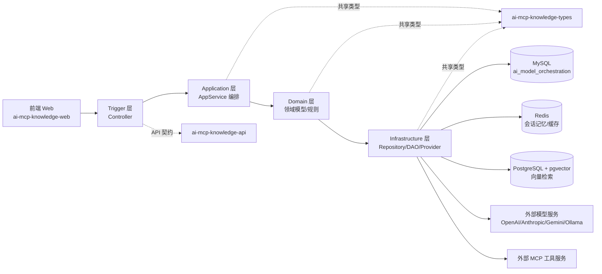

---

## 3. 技术栈与运行依赖

### 3.1 后端

- JDK 17
- Spring Boot 3.4.3
- Spring AI 1.1.2
- MyBatis-Plus + MyBatis-Spring
- Sa-Token
- XXL-Job
- Maven 多模块

### 3.2 前端

- Vue 3 + Vite + TypeScript
- Element Plus
- Pinia + Vue Router
- Axios + ECharts

### 3.3 中间件与数据

- MySQL 8（主业务库：`ai_model_orchestration`）
- Redis（会话记忆与部分缓存）
- PostgreSQL + pgvector（RAG 向量检索）

---

## 4. 核心业务能力地图（你要先记住这张图）

### 4.1 控制面（配置与治理）

- 身份权限：`/api/auth`、`/api/users`、`/api/roles`、`/api/permissions`、`/api/audit/events`
- 模型中心：`/api/models`
- MCP 与网关：`/api/mcp/servers`、`/api/gateway/manage`
- Agent/Workflow 配置：`/api/agents`、`/api/agent-versions`、`/api/workflows`
- Prompt/Advisor：`/api/templates`、`/api/advisors`
- 调度管理：`/api/schedules`、`/api/xxl`

### 4.2 运行面（调用与执行）

- AI 对话：`/api/ai/chat`、`/api/ai/stream`
- Agent 调用：`/api/agents/{agentCode}/chat|stream|invoke`
- Workflow 执行：`/api/workflows/{workflowCode}/run`
- MCP 协议对外：`GET /api/gateway/{gatewayId}/mcp/sse`、`POST /api/gateway/{gatewayId}/mcp/message`
- RAG：`/api/ai/rag/*`

### 4.3 观测面（看板与审计）

- 工作台：`/api/workbench/summary`
- 指标：`/api/metrics/*`
- 审批：`/api/approvals/*`

### 4.4 业务能力地图（图）

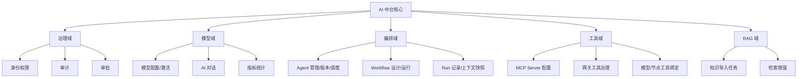

---

## 5. 关键执行链路（面试和落地都要能讲出来）

### 5.1 AI 对话链路

`AICallController -> AiChatAppService -> ChatClientAssemblyService -> 模型 Provider -> 返回 -> ai_call_log + 会话记忆`

要点：

- 支持同步和流式
- 支持 RAG 注入系统提示
- 支持会话绑定模型一致性控制
- 调用日志落库用于指标聚合

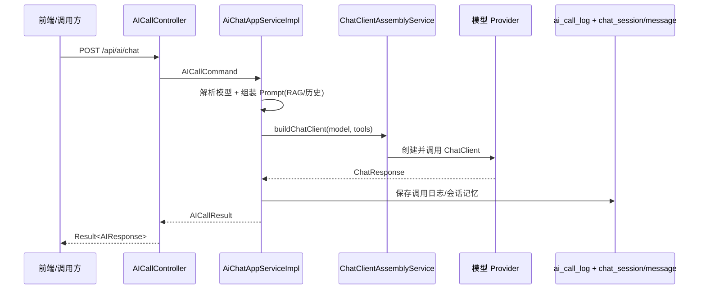

### 5.2 Agent 运行链路

`AgentRuntimeController -> AgentRuntimeAppService -> Agent/Version 解析 -> (普通链路 or Client 链路 or Workflow 转发) -> agent_run/agent_run_context`

要点：

- 按 `agentCode` 路由
- 版本绑定支持 3 种形态：Prompt / Chain / Workflow
- 高风险工具会触发审批并进入 `PENDING_APPROVAL`

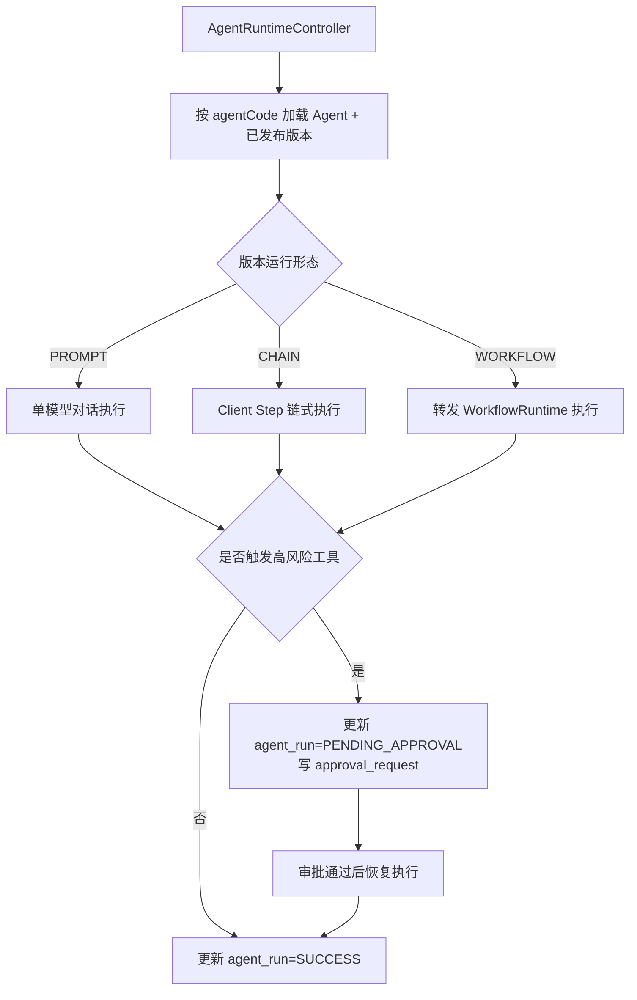

### 5.3 Workflow 运行链路（自研 DAG）

`WorkflowRuntimeController -> WorkflowRuntimeAppService -> 加载 graph(nodes+edges) -> 拓扑就绪队列执行 -> workflow_run + workflow_node_run`

已支持节点类型：

- `START` `END` `PARALLEL` `JOIN`
- `RAG_RETRIEVE`
- `IF`
- `TOOL_CALL`
- `LLM` `OUTPUT`

要点：

- 审批中断可保存 `workflow_run_context` 快照
- 审批通过后可 `resumeFromApproval` 续跑

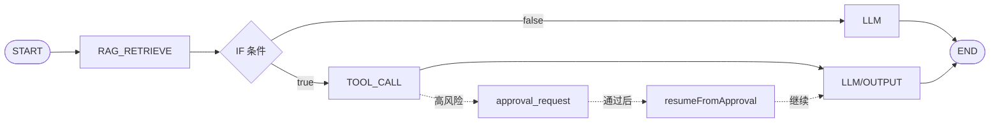

### 5.4 MCP 工具治理链路

配置链路：

- MCP Server 配置（STDIO/HTTP/SSE/WEBSOCKET）
- Gateway 实例、鉴权、工具注册、Schema、映射、绑定

调用链路：

- 运行时按模型/节点上下文注入允许工具集合（allowlist）
- 高风险工具走审批

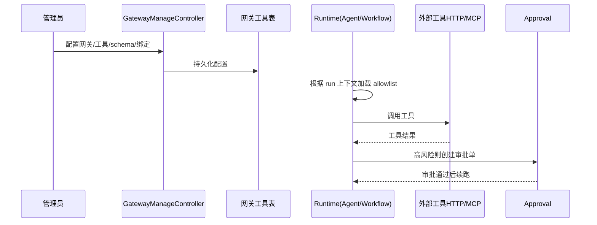

---

## 6. 从 0 到 1 跑通项目（实操手册）

### 6.1 准备环境

- JDK 17+
- Maven 3.6+
- Node.js 18+
- MySQL 8+
- Redis 6+
- PostgreSQL 14+（安装 pgvector）

### 6.2 初始化数据库（MySQL）

```bash
mysql -uroot -proot < sql/init-ai-model-orchestration.sql
```

这一步会创建数据库并初始化默认管理员：

- 用户名：`admin`
- 密码：`123456`

### 6.3 配置后端连接

检查并按本机环境调整：

- `ai-mcp-knowledge-app/src/main/resources/application.yml`
- `ai-mcp-knowledge-app/src/main/resources/application-dev.yml`

重点字段：

- MySQL：`spring.datasource.mysql.*`
- Redis：`spring.data.redis.*`
- pgvector：`spring.datasource.pgvector.*`
- 端口：`server.port`（默认 `8090`）

### 6.4 启动后端

```bash
mvn -DskipTests compile
mvn -pl ai-mcp-knowledge-app spring-boot:run
```

后端默认地址：`http://localhost:8090`

### 6.5 启动前端

```bash
cd ai-mcp-knowledge-web
npm install
npm run dev
```

前端默认地址（Vite）：`http://localhost:5173`

> 说明：`ai-mcp-knowledge-web/README.md` 里有旧端口描述（3000/8080），以当前实际配置为准。

### 6.6 最小验收（必须做）

1. 登录后台（`admin/123456`）
2. 打开 `LLM 配置` 页面，确认模型列表可见
3. 打开 `Agent 调用` 页面，执行一次调用
4. 打开 `Workflow 调用` 页面，运行一个已发布版本
5. 打开 `监控看板`/`工作台`，确认指标变化
6. 打开 `工具审批`，验证审批流状态变化

### 6.7 从 0 到 1 完整调试（断点驱动版）

建议按“控制面 -> 运行面 -> 治理面 -> 观测面”调试，不要一上来就怼 Agent 运行。

1. 确认分支与编译基线  
   当前目标分支：`feat/multi-agent-platform-governance`。

```bash
git branch --show-current
mvn -DskipTests compile
```

2. 启动基础依赖并确认端口  
   必需端口：MySQL `3306`、Redis `6379`、PostgreSQL `5432`。  
   后端端口：`8090`（`application-dev.yml`）。

3. 启动后端（建议 IDE Debug 运行）

```bash
mvn -pl ai-mcp-knowledge-app spring-boot:run
```

4. 登录拿 token（后续接口统一带 `satoken` 请求头）

```bash
curl -s -X POST http://127.0.0.1:8090/api/auth/login \
  -H "Content-Type: application/json" \
  -d '{"username":"admin","password":"123456"}'
```

5. 先做健康检查接口  
   优先验证控制面是通的，再验证运行面。

```bash
curl -s -X POST http://127.0.0.1:8090/api/workbench/summary \
  -H "Content-Type: application/json" \
  -H "satoken: <上一步token>" \
  -d '{}'
```

6. 控制面调试顺序（先配再跑）  
   `POST /api/models/list`、`POST /api/gateway/manage/instances/list`、`POST /api/mcp/servers/list`、`POST /api/agents/list`、`POST /api/agent-versions/list`、`POST /api/workflows/list`

7. 运行面调试顺序（核心）  
   `POST /api/agents/{agentCode}/invoke`、`POST /api/workflows/{workflowCode}/run`、`POST /api/approvals/list`、`POST /api/approvals/approve`、`POST /api/approvals/reject`

8. 治理与调度调试顺序  
   `POST /api/gateway/manage/tools/debug`、`POST /api/mcp/servers/refresh`、`POST /api/schedules/create`、`POST /api/xxl/jobs/trigger`

9. 观测面回看（闭环）  
   `POST /api/workflows/runs/list`、`POST /api/workflows/runs/nodes`、`POST /api/metrics/calls`、`POST /api/audit/events/list`

### 6.8 断点清单（按优先级）

P0（首批必须下）：

1. 认证入口：`ai-mcp-knowledge-trigger/src/main/java/com/xbk/knowledge/trigger/http/AuthController.java`  
2. 登录鉴权：`ai-mcp-knowledge-application/src/main/java/com/xbk/knowledge/application/service/app/impl/AuthAppServiceImpl.java` `verifyLogin`  
3. Token 上下文：`ai-mcp-knowledge-infrastructure/src/main/java/com/xbk/knowledge/infrastructure/auth/SaTokenIdentityContextService.java` `login`  
4. Agent 运行入口：`ai-mcp-knowledge-trigger/src/main/java/com/xbk/knowledge/trigger/http/AgentRuntimeController.java` `invoke`  
5. Agent 核心编排：`ai-mcp-knowledge-application/src/main/java/com/xbk/knowledge/application/service/app/impl/AgentRuntimeAppServiceImpl.java` `chat`  
6. ChatClient 装配：`ai-mcp-knowledge-application/src/main/java/com/xbk/knowledge/application/service/app/impl/ChatClientAssemblyServiceImpl.java` `buildChatClient`  
7. Gateway 工具回调：`ai-mcp-knowledge-infrastructure/src/main/java/com/xbk/knowledge/infrastructure/gateway/GatewayToolCallbackProvider.java` `getToolCallbacks` / `maybeRequireApproval`  
8. MCP 工具回调：`ai-mcp-knowledge-infrastructure/src/main/java/com/xbk/knowledge/infrastructure/mcp/DynamicMcpToolCallbackProvider.java` `getToolCallbacks` / `maybeRequireApproval`  
9. Workflow 运行入口：`ai-mcp-knowledge-trigger/src/main/java/com/xbk/knowledge/trigger/http/WorkflowRuntimeController.java` `run`  
10. Workflow DAG 编排：`ai-mcp-knowledge-application/src/main/java/com/xbk/knowledge/application/service/app/impl/WorkflowRuntimeAppServiceImpl.java` `run`  
11. 审批入口：`ai-mcp-knowledge-trigger/src/main/java/com/xbk/knowledge/trigger/http/ApprovalController.java` `approve`  
12. 审批续跑核心：`ai-mcp-knowledge-application/src/main/java/com/xbk/knowledge/application/service/app/impl/ApprovalAppServiceImpl.java` `approve`  

P1（第二批）：

1. 网关工具调试：`ai-mcp-knowledge-trigger/src/main/java/com/xbk/knowledge/trigger/http/GatewayManageController.java` `debugTool`  
2. HTTP 工具调用执行：`ai-mcp-knowledge-infrastructure/src/main/java/com/xbk/knowledge/infrastructure/gateway/GatewayToolServiceImpl.java` `callTool`  
3. MCP 运行时刷新：`ai-mcp-knowledge-infrastructure/src/main/java/com/xbk/knowledge/infrastructure/mcp/McpServerRuntimeServiceImpl.java` `registerOrUpdate` / `refresh`  
4. 调度任务入口：`ai-mcp-knowledge-trigger/src/main/java/com/xbk/knowledge/trigger/job/AgentScheduleJob.java` `execute`  
5. 身份审计切面：`ai-mcp-knowledge-infrastructure/src/main/java/com/xbk/knowledge/infrastructure/audit/IdentityAuditAspect.java`  
6. 网关审计切面：`ai-mcp-knowledge-infrastructure/src/main/java/com/xbk/knowledge/infrastructure/audit/GatewayAuditAspect.java`  

### 6.9 接口该从哪里开始往下看（推荐阅读顺序）

先看 API 契约，再看 Trigger Controller，再看 Application 用例编排，再看 Domain 规则，再看 Infrastructure 落地。

1. 认证与权限  
`IAuthService` -> `AuthController` -> `AuthAppServiceImpl` -> `IdentityRepository` -> `IdentityRepositoryImpl` -> `IdentityMapper.xml` -> `sys_user/sys_role/sys_permission`。

2. 模型配置  
`IModelConfigService` -> `ModelConfigController` -> `ModelConfigAppServiceImpl` -> `ModelConfigServiceImpl` -> `ModelConfigRepositoryImpl` -> `ModelConfigMapper.xml` -> `model_config/model_activation`。

3. 网关与工具治理  
`IGatewayManageService` -> `GatewayManageController` -> `GatewayManageAppServiceImpl` + `GatewayToolService` -> `GatewayToolServiceImpl` -> `McpGateway*RepositoryImpl/McpTool*RepositoryImpl` -> `mcp_gateway/mcp_tool_registry/mcp_tool_mapping/mcp_tool_binding/mcp_tool_schema`。

4. MCP Server 运行时  
`IMcpServerConfigService` -> `McpServerConfigController` -> `McpServerConfigAppServiceImpl` -> `McpServerConfigServiceImpl` -> `McpServerConfigRepositoryImpl` -> `McpServerRuntimeServiceImpl` -> `mcp_server_config`。

5. Agent 控制面  
`IAgentService` -> `AgentController` -> `AgentAppServiceImpl` -> `AgentServiceImpl` -> `AgentRepositoryImpl` -> `agent`。

6. Agent 版本管理  
`IAgentVersionService` -> `AgentVersionController` -> `AgentVersionAppServiceImpl` -> `AgentVersionServiceImpl` -> `AgentVersionRepositoryImpl` -> `agent_version`。

7. Agent 运行面（重点）  
`IAgentRuntimeService` -> `AgentRuntimeController` -> `AgentRuntimeAppServiceImpl` -> `ChatClientAssemblyServiceImpl` + `GatewayToolCallbackProvider` + `DynamicMcpToolCallbackProvider` -> `AgentRunRepositoryImpl/AgentRunContextRepositoryImpl` -> `agent_run/agent_run_context`。

8. Workflow 控制面  
`IWorkflowService` -> `WorkflowController` -> `WorkflowAppServiceImpl` -> `WorkflowRepositoryImpl/WorkflowVersionRepositoryImpl/WorkflowGraphRepositoryImpl` -> `workflow/workflow_version/workflow_node/workflow_edge`。

9. Workflow 运行面（重点）  
`IWorkflowRuntimeService` -> `WorkflowRuntimeController` -> `WorkflowRuntimeAppServiceImpl` -> `WorkflowRunRepositoryImpl/WorkflowNodeRunRepositoryImpl/WorkflowRunContextRepositoryImpl` -> `workflow_run/workflow_node_run/workflow_run_context`。

10. 工具审批与续跑（重点）  
`IApprovalService` -> `ApprovalController` -> `ApprovalAppServiceImpl` -> `ApprovalRequestRepositoryImpl` + `AgentRunContextRepositoryImpl` + `WorkflowRunContextRepositoryImpl` -> `approval_request`。

11. 调度与作业  
`IAgentScheduleService` -> `AgentScheduleController` -> `AgentScheduleAppServiceImpl` -> `AgentScheduleServiceImpl/AgentScheduleRepositoryImpl` -> `agent_schedule`，运行时进入 `AgentScheduleJob`。

12. 观测与审计  
`IMetricsService`/`IAuditEventService`/`IWorkbenchService` -> 对应 Controller/AppService -> `CallLogRepositoryImpl`/`SysAuditEventRepositoryImpl` -> `call_log/sys_audit_event`。

### 6.10 你现在最该先啃的 8 个接口（按收益排序）

1. `POST /api/auth/login`  
2. `POST /api/models/list`  
3. `POST /api/gateway/manage/tools/debug`  
4. `POST /api/agents/{agentCode}/invoke`  
5. `POST /api/workflows/{workflowCode}/run`  
6. `POST /api/approvals/approve`  
7. `POST /api/schedules/create`  
8. `POST /api/workbench/summary`

### 6.11 全项目端到端单图（登录到观测）

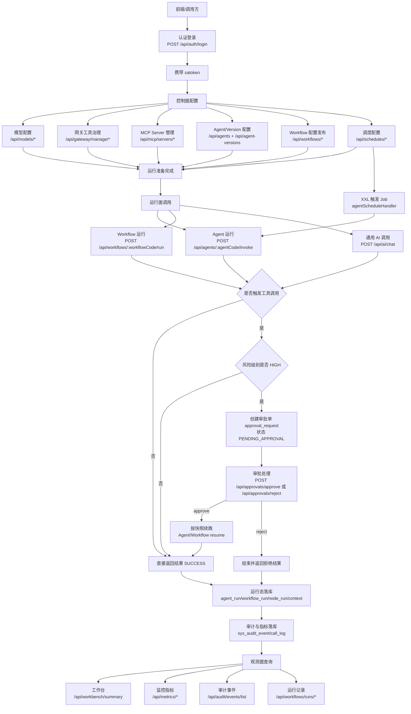

### 6.12 支付/卡券场景端到端简化图（可直接汇报）

```mermaid
flowchart LR
    BIZ[业务事件入口<br/>支付下单/退款/发券/核销] --> EVT[事件标准化<br/>组装 Agent/Workflow 入参]
    EVT --> RUN[平台运行入口<br/>/api/agents/:agentCode/invoke<br/>或 /api/workflows/:workflowCode/run]

    RUN --> RAG[RAG 检索规则库<br/>活动规则/风控策略/SOP]
    RAG --> DECIDE[LLM + 规则节点决策]

    DECIDE --> RC{是否高风险操作}
    RC -->|是| AP[审批流<br/>/api/approvals/approve]
    AP --> RESUME[审批通过后续跑]
    RC -->|否| RESUME

    RESUME --> TOOL[工具调用编排<br/>支付网关/卡券中心/CRM/通知]
    TOOL --> IDEMP[幂等与状态机校验<br/>防重复扣款/重复核销]
    IDEMP --> EXEC[执行业务动作<br/>扣款/退款/发券/核销]

    EXEC --> LEDGER[记账与对账数据落库]
    LEDGER --> OBS[观测与审计<br/>metrics + sys_audit_event]
    OBS --> FEED[结果回写业务系统<br/>工单/消息/看板]
```

### 6.13 关键接口最小可执行样例（复制即可调试）

> 先登录拿到 `satoken`，再替换下面示例里的 `<TOKEN>`、`<AGENT_CODE>`、`<WORKFLOW_CODE>`、`<APPROVAL_ID>`。

1. Agent 运行（invoke）

```bash
curl -s -X POST "http://127.0.0.1:8090/api/agents/<AGENT_CODE>/invoke" \
  -H "Content-Type: application/json" \
  -H "satoken: <TOKEN>" \
  -d '{
    "content": "请分析这笔支付失败原因并给出排查建议",
    "sessionId": 1001,
    "ragTagsJson": "[\"pay\",\"fault\"]"
  }'
```

2. Workflow 运行

```bash
curl -s -X POST "http://127.0.0.1:8090/api/workflows/<WORKFLOW_CODE>/run" \
  -H "Content-Type: application/json" \
  -H "satoken: <TOKEN>" \
  -d '{
    "content": "核销失败，帮我判断是券状态还是门店规则问题",
    "sessionId": 1001,
    "variablesJson": "{\"storeId\":\"S100\",\"couponCode\":\"C2026\"}"
  }'
```

3. 工具调试（Gateway）

```bash
curl -s -X POST "http://127.0.0.1:8090/api/gateway/manage/tools/debug" \
  -H "Content-Type: application/json" \
  -H "satoken: <TOKEN>" \
  -d '{
    "gatewayId": "default_gateway",
    "toolName": "order.query",
    "arguments": {"orderNo":"P20260223001"}
  }'
```

4. 审批通过

```bash
curl -s -X POST "http://127.0.0.1:8090/api/approvals/approve" \
  -H "Content-Type: application/json" \
  -H "satoken: <TOKEN>" \
  -d '{
    "id": <APPROVAL_ID>,
    "decisionComment": "风控确认通过，允许执行"
  }'
```

5. 审批拒绝

```bash
curl -s -X POST "http://127.0.0.1:8090/api/approvals/reject" \
  -H "Content-Type: application/json" \
  -H "satoken: <TOKEN>" \
  -d '{
    "id": <APPROVAL_ID>,
    "decisionComment": "风险过高，拒绝执行"
  }'
```

---

## 7. 37 张库表完整设计梳理（当前版本）

### 7.1 设计原则（你必须知道）

- 单组织模式（去多租户）
- 无外键，依赖应用层做级联清理
- 运行态与配置态分离（如 `agent_version` vs `agent_run`）
- 审批与运行上下文显式落库（支持续跑与审计）

### 7.2 按业务域分组

- A. 身份权限审计：6 张
- B. 模型/对话/RAG/MCP 网关基础：15 张
- C. Client/Advisor/Agent/Workflow/审批/运行：16 张
- 合计：37 张

### 7.3 表级说明（逐表）

#### A. 身份权限审计（6）

- `sys_user`：用户主表；关键字段 `username`、`status`、`is_super_admin`
- `sys_role`：角色主表；关键字段 `role_code`、`status`
- `sys_permission`：权限主表；关键字段 `permission_code`、`resource_type`、`action`
- `sys_user_role`：用户-角色关系；关键字段 `user_id`、`role_id`
- `sys_role_permission`：角色-权限关系；关键字段 `role_id`、`permission_id`
- `sys_audit_event`：统一审计事件；关键字段 `event_type`、`resource_type`、`resource_id`、`occurred_at`

#### B1. 模型/对话/RAG（7）

- `ai_model_config`：模型配置中心；关键字段 `model_name`、`model_type`、`base_url`、`tool_enabled`
- `ai_call_log`：调用日志；关键字段 `model_id`、`status`、`response_time`、`created_at`
- `ai_model_activation`：当前激活模型单例；关键字段 `chat_model_id`、`embedding_model_id`
- `ai_chat_session`：会话主表；关键字段 `owner_user_id`、`model_id`、`agent_id`、`agent_version_id`
- `ai_chat_message`：会话消息；关键字段 `session_id`、`role`、`content`
- `ai_rag_task`：RAG 导入任务；关键字段 `task_id`、`type`、`status`、`progress`
- `ai_mcp_server_config`：MCP Server 配置；关键字段 `server_type`、`command/endpoint`、`enabled`

#### B2. MCP 网关工具治理（6）

- `mcp_gateway`：网关实例；关键字段 `gateway_id`、`status`
- `mcp_gateway_auth`：网关鉴权；关键字段 `gateway_id`、`api_key`、`rate_limit`、`expire_time`
- `mcp_tool_registry`：工具注册；关键字段 `tool_key`、`http_url`、`risk_level`、`status`
- `mcp_tool_mapping`：工具参数映射；关键字段 `mapping_type`、`parent_id`、`http_path`、`http_location`
- `mcp_tool_schema`：工具 schema 版本；关键字段 `schema_version`、`input_schema`、`output_schema`
- `mcp_tool_binding`：工具绑定目标；关键字段 `bind_type`、`bind_target_id`、`enabled`

#### C1. Advisor/Client/Agent（10）

- `advisor`：Advisor 资产；关键字段 `advisor_code`、`advisor_type`、`enabled`
- `advisor_binding`：Advisor 绑定关系；关键字段 `bind_type`、`bind_target_id`、`advisor_id`
- `ai_client_profile`：Client 资产；关键字段 `client_code`、`status`
- `ai_client_profile_step`：Client 步骤配置；关键字段 `sequence_no`、`model_id`、`enable_tools`
- `agent`：Agent 主体；关键字段 `agent_code`、`channel`、`current_published_version_id`
- `agent_version`：Agent 版本快照；关键字段 `state`、`workflow_version_id`、`rag_mode`、`client_profile_id`
- `prompt_template`：提示词模板资产；关键字段 `template_code`、`version_no`、`state`
- `agent_schedule`：Agent 调度配置；关键字段 `cron`、`enabled`、`xxl_job_id`
- `agent_run`：Agent 运行记录；关键字段 `run_id`、`status`、`run_type`、`trigger_source`
- `agent_run_context`：Agent 运行快照；关键字段 `run_id`、`snapshot_json`、`status`

#### C2. Workflow/审批（8）

- `workflow`：Workflow 资产；关键字段 `workflow_code`、`status`、`current_published_version_id`
- `workflow_version`：Workflow 版本；关键字段 `version_no`、`state`、`graph_json`
- `workflow_node`：节点定义；关键字段 `node_key`、`node_type`、`config_json`
- `workflow_edge`：边定义；关键字段 `source_key`、`target_key`、`edge_type`
- `workflow_run`：运行主记录；关键字段 `run_id`、`status`、`current_node_key`
- `workflow_node_run`：节点运行明细；关键字段 `node_key`、`status`、`tool_call_count`、`approval_request_id`
- `workflow_run_context`：运行快照；关键字段 `run_id`、`snapshot_json`、`status`
- `approval_request`：审批单；关键字段 `run_id`、`tool_key`、`risk_level`、`status`、`expire_at`

### 7.4 关键唯一约束（高频面试点）

- 编码类唯一：`username`、`role_code`、`permission_code`、`model_name`、`gateway_id`、`tool_key`、`agent_code`、`workflow_code`
- 版本类唯一：`(agent_id, version_no)`、`(workflow_id, version_no)`、`(template_code, version_no)`、`(gateway_id, tool_id, schema_version)`
- 关系类唯一：`(user_id, role_id)`、`(role_id, permission_id)`、`(tool_id, bind_type, bind_target_id)`、`(bind_type, bind_target_id, advisor_id)`
- 快照单例：`workflow_run_context.run_id`、`agent_run_context.run_id`

### 7.5 核心 ER 关系图（简化）

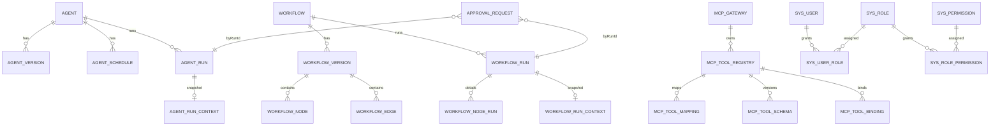

### 7.6 逐表字段清单（可读版）

> 你刚才说“完全看不懂”，核心原因是上一版把字段平铺成了一长串。  
> 这一版改成“按用途读表”，每张表只先抓 4 类字段：`主键/业务键`、`核心业务字段`、`状态时间`、`关联字段`。  
> 原始完整字段仍以 `sql/init-ai-model-orchestration.sql` 为准。

#### 7.6.1 身份权限审计（6）

| 表名（含用途） | 主键/业务键 | 核心业务字段 | 状态/时间 | 关联字段 |
| --- | --- | --- | --- | --- |
| `sys_user`（用户主档） | `id` / `username`(唯一) | `display_name,email,mobile,password_hash,is_super_admin` | `status,last_login_at,created_at,updated_at` | - |
| `sys_role`（角色主档） | `id` / `role_code`(唯一) | `role_name,remark` | `status,created_at,updated_at` | - |
| `sys_permission`（权限字典） | `id` / `permission_code`(唯一) | `permission_name,resource_type,action` | `status,created_at,updated_at` | - |
| `sys_user_role`（用户-角色关系） | `id` / `(user_id,role_id)`(唯一) | `granted_by,granted_at` | `granted_at` | `user_id,role_id` |
| `sys_role_permission`（角色-权限关系） | `id` / `(role_id,permission_id)`(唯一) | `granted_by,granted_at` | `granted_at` | `role_id,permission_id` |
| `sys_audit_event`（审计流水） | `id` | `event_type,resource_type,resource_id,action,result,error_message` | `cost_ms,occurred_at` | `operator_id,request_id` |

#### 7.6.2 模型/对话/RAG（7）

| 表名（含用途） | 主键/业务键 | 核心业务字段 | 状态/时间 | 关联字段 |
| --- | --- | --- | --- | --- |
| `ai_model_config`（模型配置中心） | `id` / `model_name`(唯一) | `model_type,api_key,base_url,completions_path,embeddings_path,tool_enabled` | `enabled,created_at,updated_at` | - |
| `ai_model_activation`（当前激活模型单例） | `id` / `singleton_key`(唯一) | `chat_model_id,embedding_model_id` | `created_at,updated_at` | `chat_model_id,embedding_model_id` |
| `ai_call_log`（模型调用日志） | `id` | `request_content,response_content,response_time,error_message` | `status,created_at` | `model_id` |
| `ai_chat_session`（会话头信息） | `id` | `title,rag_tags` | `created_at,updated_at` | `owner_user_id,model_id,agent_id,agent_version_id` |
| `ai_chat_message`（会话消息明细） | `id` | `role,content` | `created_at` | `session_id,model_id` |
| `ai_rag_task`（RAG 导入任务） | `id` / `task_id`(唯一) | `type,message,rag_tag,error_details,retry_count,parent_task_id` | `status,progress,created_at,updated_at` | - |
| `ai_mcp_server_config`（MCP Server 配置） | `id` / `server_name`(唯一) | `server_type,command,args,env,endpoint,sse_endpoint,headers,connect_timeout_ms,request_timeout_ms,init_timeout_ms` | `enabled,created_at,updated_at` | - |

#### 7.6.3 网关/工具治理（8）

| 表名（含用途） | 主键/业务键 | 核心业务字段 | 状态/时间 | 关联字段 |
| --- | --- | --- | --- | --- |
| `mcp_gateway`（网关实例主档） | `id` / `gateway_id`(唯一) | `gateway_name,gateway_desc,gateway_version,gateway_instructions` | `status,created_at,updated_at` | - |
| `mcp_gateway_auth`（网关鉴权配置） | `id` / `(gateway_id,api_key)`(唯一) | `rate_limit,expire_time` | `status,created_at,updated_at` | `gateway_id` |
| `mcp_tool_registry`（工具注册清单） | `id` / `tool_key`(唯一) | `tool_name,tool_description,http_url,http_method,http_headers,timeout,retry_times,risk_level` | `status,created_at,updated_at` | `gateway_id` |
| `mcp_tool_mapping`（工具字段映射树） | `id` / `(tool_id,mapping_type,parent_id_norm,field_name)`(唯一) | `mcp_type,mcp_desc,is_required,item_type,item_ref_id,http_path,http_location,sort_order` | `created_at,updated_at` | `gateway_id,tool_id,parent_id` |
| `mcp_tool_schema`（工具 schema 版本） | `id` / `(gateway_id,tool_id,schema_version)`(唯一) | `input_schema,output_schema,schema_hash,is_active` | `created_at,updated_at` | `gateway_id,tool_id` |
| `mcp_tool_binding`（工具绑定对象） | `id` / `(tool_id,bind_type,bind_target_id)`(唯一) | `bind_type,bind_target_id` | `enabled,created_at,updated_at` | `gateway_id,tool_id` |
| `advisor`（Advisor 资产库） | `id` / `advisor_code`(唯一) | `advisor_name,advisor_type,config_json` | `enabled,created_at,updated_at` | - |
| `advisor_binding`（Advisor 绑定关系） | `id` / `(bind_type,bind_target_id,advisor_id)`(唯一) | `order_no` | `enabled,created_at,updated_at` | `advisor_id,bind_target_id` |

#### 7.6.4 Client/Agent 配置与运行（8）

| 表名（含用途） | 主键/业务键 | 核心业务字段 | 状态/时间 | 关联字段 |
| --- | --- | --- | --- | --- |
| `ai_client_profile`（Client 资产主档） | `id` / `client_code`(唯一) | `client_name,description,created_by,updated_by` | `status,created_at,updated_at` | - |
| `ai_client_profile_step`（Client 步骤链） | `id` / `(client_profile_id,sequence_no)`(唯一) | `step_name,model_id,system_prompt,enable_tools,allowed_tool_keys_json` | `created_at,updated_at` | `client_profile_id,model_id` |
| `agent`（Agent 主档） | `id` / `agent_code`(唯一) | `agent_name,description,channel,created_by,updated_by` | `status,created_at,updated_at` | `current_published_version_id` |
| `agent_version`（Agent 版本快照） | `id` / `(agent_id,version_no)`(唯一) | `change_summary,prompt_template_id,prompt_template_version_no,template_params_json,system_prompt_snapshot,workflow_version_id,output_contract_version,output_contract_options_json,rag_mode,default_rag_tags_json,allowed_rag_tags_json,allowed_tool_keys_json,client_profile_id,client_chain_json,timeout_ms,max_turns,temperature,repair_retry_times,created_by,updated_by` | `state,created_at,updated_at` | `agent_id,workflow_version_id,prompt_template_id,client_profile_id` |
| `prompt_template`（模板资产） | `id` / `(template_code,version_no)`(唯一) | `template_name,content,variable_spec_json,created_by,updated_by` | `state,created_at,updated_at` | - |
| `agent_schedule`（Agent 调度配置） | `id` / `(agent_id,schedule_name)`(唯一) | `description,cron,xxl_job_id,payload_template_json,created_by,updated_by` | `enabled,created_at,updated_at` | `agent_id` |
| `agent_run`（Agent 运行流水） | `run_id` | `run_type,trigger_source,operator_id,operator_type,session_id,model_id_used,model_name_used,tool_call_count,tool_denied_count,repair_attempts,cost_ms,error_message` | `status,started_at,ended_at` | `agent_id,agent_code,agent_version_id` |
| `agent_run_context`（Agent 续跑快照） | `id` / `run_id`(唯一) | `snapshot_json` | `status,created_at,updated_at` | `run_id` |

#### 7.6.5 Workflow 与审批（8）

| 表名（含用途） | 主键/业务键 | 核心业务字段 | 状态/时间 | 关联字段 |
| --- | --- | --- | --- | --- |
| `workflow`（Workflow 主档） | `id` / `workflow_code`(唯一) | `workflow_name,description,created_by,updated_by` | `status,created_at,updated_at` | `current_published_version_id` |
| `workflow_version`（Workflow 版本） | `id` / `(workflow_id,version_no)`(唯一) | `change_summary,graph_json,default_config_json,created_by,updated_by` | `state,created_at,updated_at` | `workflow_id` |
| `workflow_node`（节点定义） | `id` / `(workflow_version_id,node_key)`(唯一) | `node_type,node_name,config_json,position_x,position_y` | `created_at,updated_at` | `workflow_version_id` |
| `workflow_edge`（连线定义） | `id` | `source_key,target_key,edge_type,condition_expr` | `created_at,updated_at` | `workflow_version_id` |
| `workflow_run`（Workflow 运行流水） | `run_id` | `trigger_source,operator_id,operator_type,session_id,current_node_key,cost_ms,error_message` | `status,started_at,ended_at,created_at,updated_at` | `workflow_id,workflow_code,workflow_version_id` |
| `workflow_node_run`（节点运行明细） | `id` | `node_key,node_type,node_name,model_id_used,model_name_used,tool_call_count,tool_denied_count,input_digest,output_digest,output_text,output_truncated,approval_request_id,cost_ms,error_message` | `status,started_at,ended_at` | `run_id` |
| `workflow_run_context`（Workflow 续跑快照） | `id` / `run_id`(唯一) | `snapshot_json` | `status,created_at,updated_at` | `run_id` |
| `approval_request`（统一审批单） | `id` | `approval_type,run_id,agent_id,agent_version_id,workflow_id,workflow_version_id,node_key,requester_id,requester_type,request_reason,approver_id,decision_comment,decided_at,tool_key,risk_level,arguments_snapshot_json,arguments_digest,expire_at` | `status,created_at,updated_at` | `run_id,agent_id,workflow_id,workflow_version_id` |

#### 7.6.6 快速阅读建议（你先看这 10 张）

- `agent`
- `agent_version`
- `agent_run`
- `workflow`
- `workflow_version`
- `workflow_node`
- `workflow_run`
- `workflow_node_run`
- `approval_request`
- `mcp_tool_registry`

---

## 8. 你作为支付/卡券后端，应该怎么学（最短掌握路径）

### 8.1 学习主线（按空闲推进，不绑时间）

### 阶段 1：跑通 + 看懂

- 跑通本地全链路（登录、模型、Agent 调用、Workflow 调用）。
- 读懂 8 个核心类：
  - `AICallController`
  - `AgentRuntimeController`
  - `WorkflowRuntimeController`
  - `AiChatAppServiceImpl`
  - `AgentRuntimeAppServiceImpl`
  - `WorkflowRuntimeAppServiceImpl`
  - `GatewayManageController`
  - `RagController`
- 完成一次“从请求到落库”的全链路 debug。

### 阶段 2：模型与编排能力

- 深入 AgentVersion 与 WorkflowVersion。
- 手工配置一个 `TOOL_CALL + OUTPUT` 的 Workflow。
- 跑通审批中断与续跑。
- 看懂 `agent_run`、`workflow_run`、`approval_request` 三表关系。

### 阶段 3：RAG 与 MCP

- 跑通上传文档、异步导入、任务重试。
- 配置一个 MCP 网关工具并绑定模型。
- 验证工具调用日志、审批、失败回放。

### 阶段 4：业务化改造（支付/卡券）

- 做 1 个支付问题诊断 Agent（故障排查）。
- 做 1 个卡券核销规则 Agent（规则解释）。
- 做 1 个运营问答 Workflow（RAG + 工具 + 审批）。
- 写一份“公司试点方案”并完成内部演示。

### 8.2 阶段完成判定（DoD）

- 阶段 1 完成：你能独立从登录请求一路追到落库，并解释关键字段。
- 阶段 2 完成：你能独立发布一个 Workflow 并跑通审批续跑。
- 阶段 3 完成：你能独立接入一个工具并定位一次失败调用。
- 阶段 4 完成：你能把一个支付/卡券场景做成可演示的端到端流程。

---

## 9. 支付/卡券场景如何映射到这个平台（你最关心）

### 9.1 可直接落地的 Agent

- 支付问题诊断 Agent  
输入：订单号/交易号 + 问题描述  
输出：失败原因、证据链、下一步动作

- 卡券规则解释 Agent  
输入：券码/活动码 + 门店 + 时间 + 用户标签  
输出：可用性判断、冲突规则、推荐处理建议

- 退款补偿建议 Agent  
输入：退款流水 + 优惠信息 + 会员状态  
输出：退款路径、补偿策略建议、风险提示

### 9.2 可直接落地的 Workflow

- 支付故障工单流：`START -> TOOL_CALL(订单查询) -> TOOL_CALL(支付网关查询) -> IF -> OUTPUT`
- 卡券核销纠纷流：`START -> RAG_RETRIEVE(活动规则) -> TOOL_CALL(券状态) -> IF -> OUTPUT`
- 高风险操作审批流：`START -> TOOL_CALL(高风险工具) -> PENDING_APPROVAL -> resume -> OUTPUT`

### 9.3 推荐先接入的 MCP 工具

- 订单查询（按订单号、交易号）
- 卡券状态查询（券生命周期）
- 活动规则查询（策略中心）
- 支付网关交易明细查询
- 退款进度查询

---

## 10. 作为公司 AI 项目的落地路线图（可直接拿去汇报）

### 阶段 0：POC（验证可用）

- 目标：证明“可用”
- 产出：
  - 1 个支付诊断 Agent
  - 1 个卡券规则 Workflow
  - 1 份运行指标看板（调用量/成功率/耗时）

### 阶段 1：试点（验证价值）

- 目标：证明“有价值”
- 产出：
  - 接入真实业务工具（只读）
  - 接入业务知识库（规则文档、FAQ、排障手册）
  - 周期性评估：节省工单处理时长、减少人工排查成本

### 阶段 2：规模化（验证可持续）

- 目标：证明“可持续”
- 产出：
  - 标准化 Agent 模板（Prompt/Workflow/审批策略）
  - 业务域复制（支付 -> 卡券 -> 会员）
  - 运维手册（巡检、回滚、问题定位）

### 路线图图表（POC -> 试点 -> 规模化）

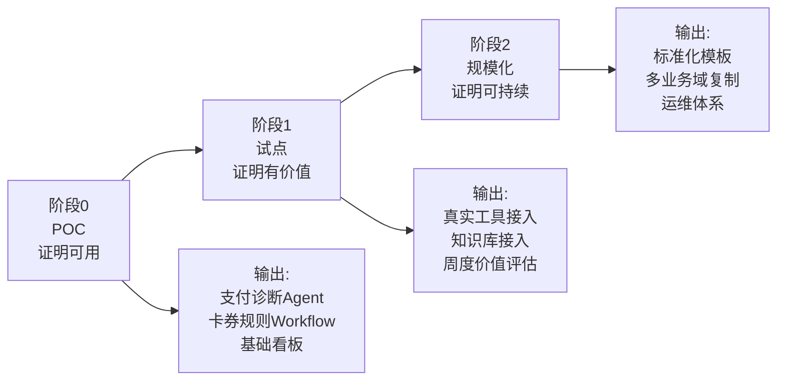

---

## 11. 你要“完全掌握”必须过的 8 个关卡

1. 能独立从 0 拉起环境并跑通首个调用
2. 能口述 Trigger -> Application -> Domain -> Infra 调用链
3. 能画出 Agent/Workflow/Approval 的数据关系
4. 能解释为什么要 `run_context` 快照
5. 能定位一次审批卡住的根因
6. 能新增一个 MCP 工具并接到模型
7. 能把支付/卡券一个真实场景落成 Workflow
8. 能用 15 分钟做内部分享（技术 + 业务价值）

---

## 12. 常见坑位（避免走弯路）

- 只看前端，不看 `AppServiceImpl`：会导致“会用不会改”
- 忽略 `agent_version/workflow_version` 的状态机：容易配置错版本
- 只测 happy path，不测审批续跑：上线后最容易踩雷
- 忽略 run 相关表：定位问题会非常慢
- 把它当单模型调用项目：会错过平台化能力

---

## 13. 最后给你的执行建议（针对你当前岗位）

你的背景是支付/卡券后端，这个项目对你最有价值的不是“写 Prompt”，而是：

- 用工程化方式把复杂业务知识结构化（RAG + Workflow）
- 用工具编排打通业务系统（MCP + Gateway）
- 用审批与审计让 AI 能进企业流程（而不是 Demo）

建议你从“支付故障诊断 Agent”先落地，因为：

- 数据源清晰（订单、交易、网关）
- 价值可量化（排障时间、一次解决率）
- 风险可控（先只读工具）

当你把这个场景跑通，你就具备了把本项目升级为公司 AI 中台的核心能力。

---

## 14. “完全掌握”到底是什么意思（不是会跑 Demo）

如果目标是“真正接手项目”，你的完成标准不是“接口能调通”，而是以下 6 个维度都能独立负责：

1. 架构理解：能解释分层边界、为什么这么分、改哪里不破坏边界。
2. 业务抽象：能把支付/卡券问题抽成 Agent、Workflow、Tool、Approval 四类资产。
3. 代码实现：能独立加需求、改链路、补测试、做回归。
4. 数据治理：能讲清每张关键表的职责、状态流转、幂等与一致性。
5. 运行保障：能定位线上问题、做降级、做恢复、做复盘。
6. 组织落地：能把能力产品化，形成规范、模板、看板和团队协作流程。

### 14.1 掌握等级（你当前建议目标：L3 -> L4）

| 等级 | 能力特征 | 你是否可对外承诺 |
| --- | --- | --- |
| L1 了解 | 能跑通系统、知道模块名字 | 否 |
| L2 会用 | 能配模型、建 Agent、发起调用 | 否 |
| L3 会改 | 能改 1 条链路并稳定上线 | 小范围可 |
| L4 可负责 | 能负责一个业务域（支付或卡券）从需求到上线 | 是 |
| L5 可复制 | 能把成功经验复制到第二业务域并带人 | 是 |

---

## 15. 深度掌握路径（分阶段，不绑定周期）

> 你已具备后端工程背景，建议走“工程化实战”路径：每完成一个阶段再进入下一阶段。
> 说明：第 8 章偏“个人学习主线”，第 15 章偏“可负责标准下的阶段验收”。

### 15.1 三阶段目标

- 阶段 A：看懂与跑通，建立全局认知。
- 阶段 B：深入与改造，具备独立实现能力。
- 阶段 C：业务落地与运营，达到可负责水平。

### 15.2 阶段交付物（按完成推进）

| 阶段 | 重点 | 必交付产物 |
| --- | --- | --- |
| 阶段 A | 全链路跑通、认证权限、模型调用、Agent/Workflow 主链阅读 | 《本地启动与排错清单》+《关键链路时序图》 |
| 阶段 B | Workflow 引擎、MCP 网关、审批续跑、RAG 检索治理 | 1 个可运行工具接入案例 +《审批续跑复盘》 |
| 阶段 C | 支付/卡券业务化改造、指标治理、稳定性治理 | 支付 Agent + 卡券 Workflow +《企业落地蓝图》 |

### 15.3 深度掌握闭环图

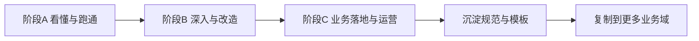

---

## 16. 源码攻坚地图（必须按链路读，不要散读）

### 16.1 阅读顺序（固定）

1. `api` 契约：先看入参/出参和语义边界。  
2. `trigger` 控制器：看入口校验、权限、路由。  
3. `application`：看用例编排和流程主干。  
4. `domain`：看业务规则和状态机。  
5. `infrastructure`：看落库与外部依赖实现。  

### 16.2 五条主链（每条都要能复述）

1. 登录授权链：`AuthController -> AuthAppServiceImpl -> IdentityRepositoryImpl`
2. AI 调用链：`AICallController -> AiChatAppServiceImpl -> ChatClientAssemblyServiceImpl`
3. Agent 运行链：`AgentRuntimeController -> AgentRuntimeAppServiceImpl -> agent_run`
4. Workflow 运行链：`WorkflowRuntimeController -> WorkflowRuntimeAppServiceImpl -> workflow_run`
5. 工具审批链：`Tool callback -> approval_request -> ApprovalAppServiceImpl -> resume`

### 16.3 阅读验收标准（过关才算读完）

每读完一条链路，必须产出 4 件事：

1. 一张时序图
2. 一组核心断点位置
3. 一份关键数据表变化记录
4. 一段“为什么这样设计”的说明

---

## 17. 必做实战任务卡（做完你才真正会）

### 17.1 基础任务（必须完成）

1. 新增一个模型配置并完成激活切换。
2. 新增一个 Agent，并发布一个可运行版本。
3. 新增一个 Workflow（含 `IF + TOOL_CALL + OUTPUT`）。
4. 新增一个 MCP 工具，并绑定到指定模型。
5. 完成一次高风险工具审批并续跑成功。

### 17.2 进阶任务（建议完成）

1. 给 Agent 增加 Client 链路（多步模型执行）。
2. 给 Workflow 增加并行节点（`PARALLEL + JOIN`）。
3. 接入一套支付只读工具（订单、交易、退款查询）。
4. 接入一套卡券只读工具（券状态、活动规则查询）。
5. 新增监控看板指标并完成阈值告警配置。

### 17.3 高阶任务（达到可负责）

1. 完成一次跨模块重构（保持分层边界不破）。
2. 设计并实现一个“失败自动回退”流程。
3. 补一套端到端回归脚本（核心接口全覆盖）。
4. 把支付方案复制到卡券，形成可复用模板。

### 17.4 任务完成定义（DoD）

每个任务都按同一标准验收，避免“看起来做了，实际不可用”：

1. 接口验收：对应 API 请求成功，返回结构符合契约。
2. 日志验收：关键日志可检索（含 traceId/runId）。
3. 数据验收：关键表写入正确（至少核对主表 + 上下文表）。
4. 回归验收：不影响已上线核心链路（登录、调用、审批、观测）。

---

## 18. 故障演练手册（必须刻意练习）

### 18.1 你要主动制造并解决的 10 类故障

1. 登录失败：token 无效、权限不足。
2. 模型调用失败：API Key 错误、模型不可达。
3. 工具调用失败：网关超时、参数映射错误。
4. 审批卡死：审批单状态不一致或过期。
5. Workflow 中断：节点配置错误、条件分支异常。
6. Run 数据不一致：run 主表和 context 不一致。
7. 调度不触发：xxl 配置或 cron 错误。
8. RAG 任务失败：文档解析异常、向量库连接问题。
9. 指标异常：调用成功但统计缺失。
10. 审计缺失：关键写操作未落审计事件。

### 18.2 故障处理四步法（固定模板）

1. 现象：明确用户可见问题。
2. 定位：日志 + 断点 + 数据表交叉验证。
3. 修复：热修复/回滚/补偿方案。
4. 预防：监控、告警、测试、规范更新。

### 18.3 故障闭环图

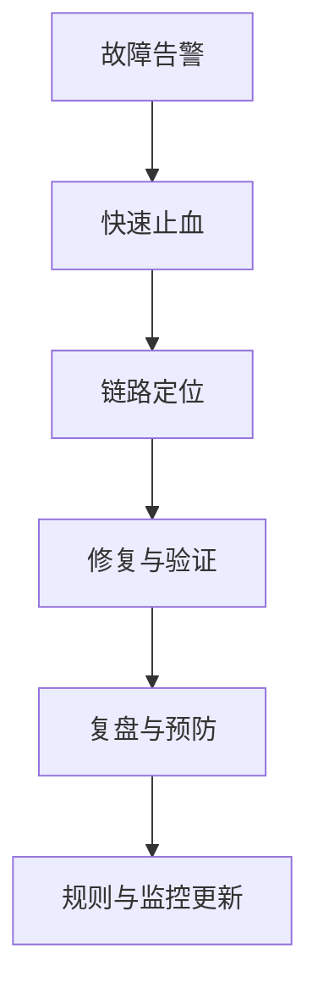

---

## 19. 企业落地能力建设（不是写完功能就结束）

### 19.1 你需要建立的 5 套规范

1. Agent 设计规范：命名、版本、发布、回滚。
2. Workflow 设计规范：节点类型、异常分支、超时策略。
3. MCP 工具接入规范：安全分级、审批策略、幂等约束。
4. 数据治理规范：关键表字段字典、状态流转定义。
5. 运行保障规范：告警阈值、排障流程、值班手册。

### 19.2 团队协作机制（建议）

- 需求评审：业务 + 技术 + 风险三方对齐。
- 中期检查：链路可观测性 + 风险点校准。
- 发布评审：回滚方案 + 指标对齐。
- 定期：故障演练和复盘分享。

---

## 20. 个人掌握体系（你的知识资产沉淀模板）

### 20.1 建议你维护的 6 份长期文档

1. 《项目术语表》：统一语言，减少沟通成本。
2. 《链路图谱》：关键接口到数据表的映射。
3. 《问题库》：所有踩坑与定位方式。
4. 《改造案例库》：每次需求改造的设计与结果。
5. 《指标与SLA手册》：可量化的稳定性指标。
6. 《业务落地手册》：支付、卡券、会员场景模板。

### 20.2 每周复盘模板（建议固定）

- 本周完成了什么（事实）
- 本周踩了什么坑（原因）
- 哪个设计理解加深了（认知）
- 下周要补哪条短板（行动）

---

## 21. 最终验收清单（达到“可独立负责”才算完全掌握）

### 21.1 技术验收

1. 能独立完成一次从需求到上线的改造。
2. 能在 30 分钟内定位核心链路故障。
3. 能解释 20 张关键表的数据职责和关系。
4. 能独立新增一个工具并跑通审批续跑。
5. 能给出可执行的回滚和补偿方案。

### 21.2 业务验收

1. 支付场景至少上线 1 个可用流程。
2. 卡券场景至少上线 1 个可用流程。
3. 能量化价值：时长下降、命中率提升、人工成本下降。
4. 能向非技术同学讲清楚系统价值与边界。

### 21.3 组织验收

1. 有标准模板可复制到新业务线。
2. 有运行手册可供值班同学执行。
3. 有复盘机制能持续改进。

> 满足以上三类验收，你就不是“会用项目”，而是“能负责这个项目”。

---

## 22. 系统提示词与 Advisor 实战（现实支付场景）

你问的这个点非常关键。很多同学卡住，不是因为不会写代码，而是不知道这两类配置在生产里到底干什么。

### 22.1 先给结论：当前项目有，而且是核心能力

1. 系统提示词：有  
   - Agent 发布快照：`agent_version.system_prompt_snapshot`  
   - Client 步骤覆盖：`ai_client_profile_step.system_prompt`
2. Advisor：有  
   - 资产表：`advisor`  
   - 绑定表：`advisor_binding`  
   - 运行时按 `AGENT_VERSION` / `WORKFLOW_VERSION` 装配

注意：本项目不是 `ai_client_system_prompt` 独立表方案，而是“模板发布快照 + 步骤覆盖”方案。

### 22.2 这两个能力分别解决什么问题

1. 系统提示词解决“回答边界与角色一致性”  
   - 让模型始终按企业口径输出，避免每次调用都靠调用方临时拼 prompt。
   - 在发布时固化快照，保证线上可回溯、可回滚。

2. Advisor 解决“调用过程治理”  
   - `CHAT_MEMORY`：多轮对话记忆。  
   - `REQUEST_RESPONSE_LOG`：请求响应可观测。  
   - `TOOL_CALL_LOG`：工具调用可审计。  
   - 并且可按版本绑定，避免“一刀切全局生效”。

### 22.3 现实案例：夜间支付成功但商户说“未到账”

#### 22.3.1 业务背景

- 场景：客服夜班收到商户投诉“支付成功但未到账”。  
- 目标：10 分钟内给出“是否真实未到账、卡在哪一段、下一步处理动作”。  
- 风险：不能让 AI 直接执行高风险资金动作，只允许查询与建议。

#### 22.3.2 你在控制面怎么配

1. 配 Prompt 模板（系统提示词来源）  
   - 模板角色：支付故障分诊专家。  
   - 约束：必须输出结构化结论（状态、证据、下一步动作、风险等级）。  
   - 发布模板后，AgentVersion 发布时固化到 `system_prompt_snapshot`。

2. 配 AgentVersion（运行模式建议 CHAIN）  
   - 绑定 `client_profile_id`。  
   - 步骤 1：意图重写与工单标准化（可关闭工具）。  
   - 步骤 2：证据检索与归因（开启工具，但仅允许查询类 toolKey）。  
   - 步骤 3：生成客服回复与内部处理建议（关闭工具，防止误调用）。

3. 配 Advisor 资产  
   - `CHAT_MEMORY`：`maxMessages=20`，会话维度用 `SESSION_ID`。  
   - `REQUEST_RESPONSE_LOG`：打开，便于复盘“为什么这样回答”。  
   - `TOOL_CALL_LOG`：打开，确认实际调用了哪些工具。

4. 绑定 Advisor 到 AgentVersion  
   - `order=0`：`CHAT_MEMORY`  
   - `order=1`：`REQUEST_RESPONSE_LOG`  
   - `order=2`：`TOOL_CALL_LOG`

#### 22.3.3 一次真实调用时会发生什么

1. 用户输入：  
   “商户 M123，订单 O20260223001，顾客扣款成功 20 分钟，商户没到账。”
2. 运行时读取 Agent 当前发布版本，拿到 `system_prompt_snapshot`。  
3. 如果走 Client Profile 链路，则步骤级 `system_prompt` 可覆盖版本快照。  
4. Advisor 按绑定顺序注入：先记忆，再日志，再工具调用日志。  
5. 模型如需查证，会调用被 allowlist 允许的查询工具（例如订单查询、交易流水查询）。  
6. 输出给客服的是“证据化结论”，不是一句模糊建议。  
7. 同时落地运行审计：`agent_run`、`agent_run_context`、工具调用日志、审批状态（若触发）。

#### 22.3.4 这次调用你能拿到什么业务价值

1. 客服话术更稳定  
   - 不同人值班，口径一致。
2. 故障定位更快  
   - 从“靠经验猜”变成“基于工具证据判断”。
3. 线上可追责可复盘  
   - 能追溯这次回答用的版本、提示词快照、工具调用轨迹。

### 22.4 最容易踩坑的 4 个点

1. 以为改了模板就立刻生效  
   - 错。AgentVersion 已发布后用的是快照；要新建/更新草稿并重新发布。

2. 绑定了 Advisor 但运行没生效  
   - 常见原因：`bind_type` 绑错（应是 `AGENT_VERSION` 或 `WORKFLOW_VERSION`）。

3. 多轮记忆串会话  
   - `CHAT_MEMORY` 的 `conversationIdFrom` 配置不当会造成串话；生产建议优先 `SESSION_ID`。

4. 工具误开放  
   - 没有配 `allowedToolKeys` 或步骤级覆盖不严，会放大风险；生产要默认最小权限。

### 22.5 一页落地清单（可直接照做）

1. 先定角色：这个 Agent 在业务上“负责什么，不负责什么”。  
2. 先配模板并发布：把系统提示词规范化。  
3. 再配 AgentVersion：明确运行模式（Prompt / Chain / Workflow）。  
4. 给每步配置工具权限：没有必要就关工具。  
5. 绑定 Advisor：记忆、请求日志、工具日志至少三件套。  
6. 走一次真实工单回放：核对输出、日志、表数据是否一致。  
7. 通过后再放量：先灰度客服组，再全量。

如果你愿意，我下一步可以继续在这份手册里补一个“卡券场景同款案例”（例如“已核销但用户仍可使用”的投诉），这样你可以直接对照支付与卡券两条业务线复用。
