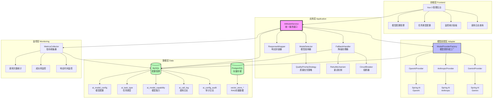
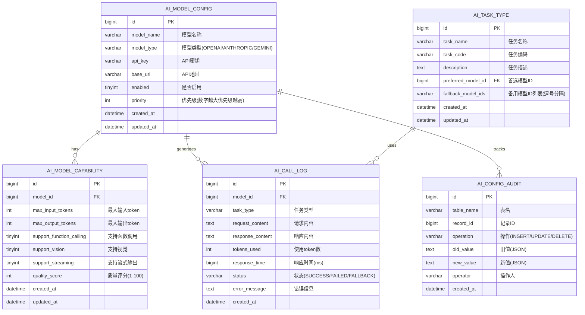
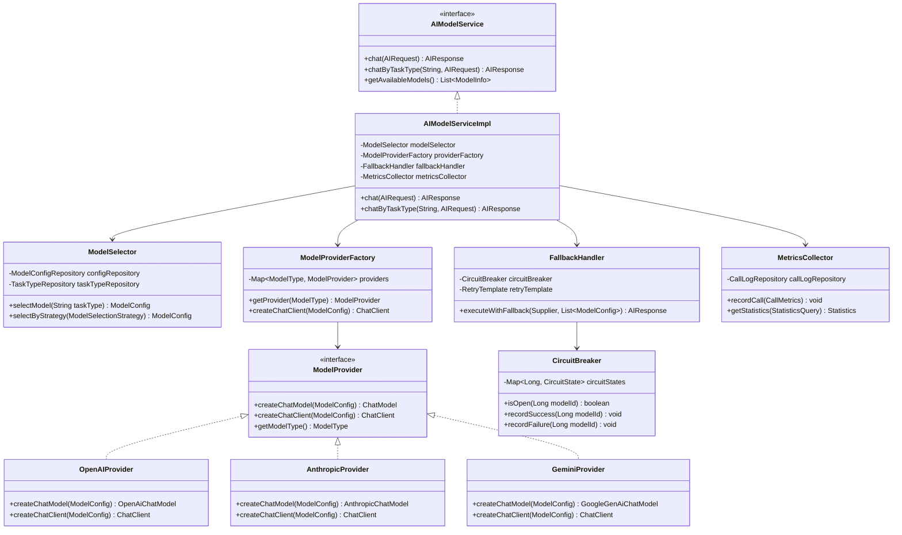
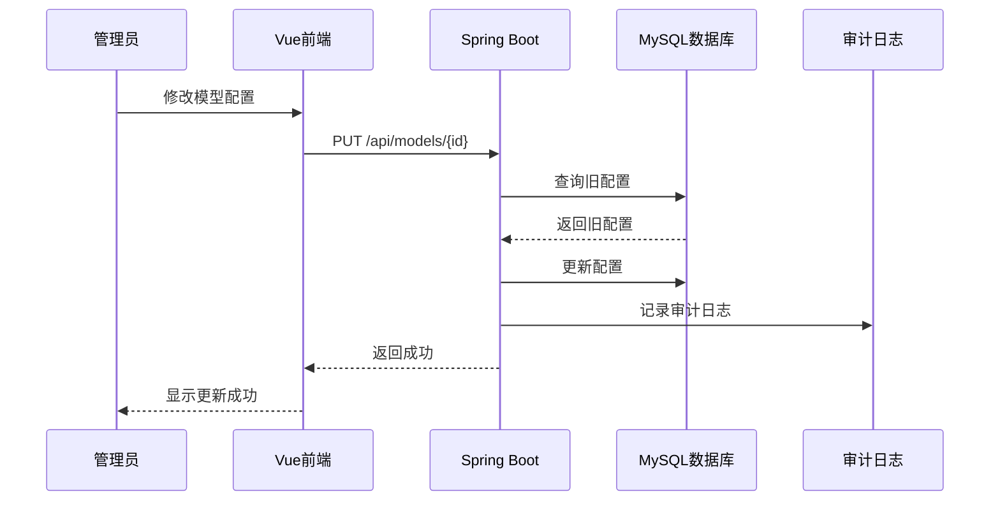
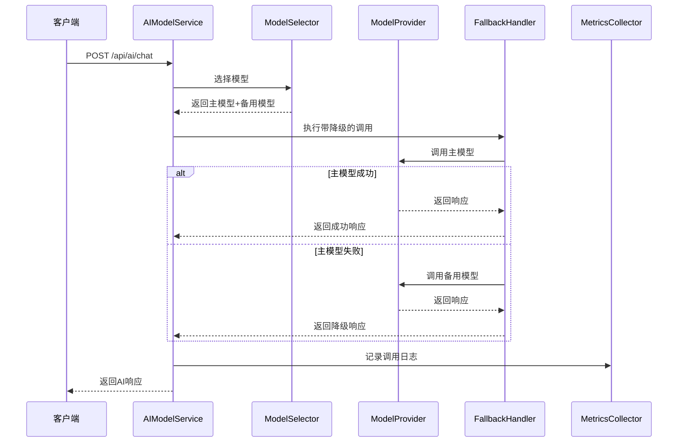
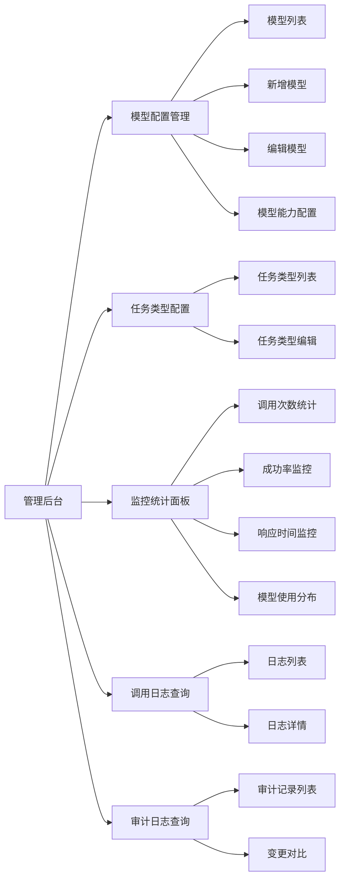
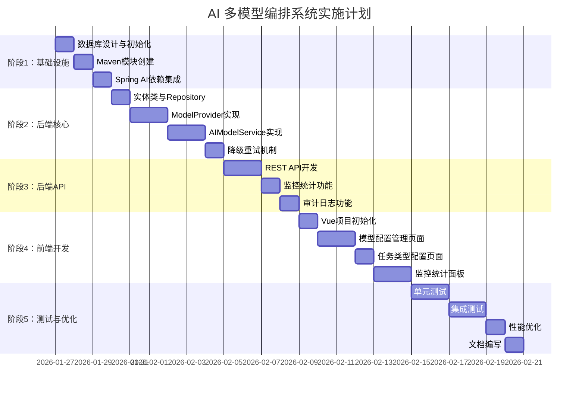

# AI 多模型编排系统 - 技术方案设计

> **项目名称**：AI Model Orchestration System
> **设计日期**：2026-01-27
> **设计者**：xiexu
> **版本**：v1.0

---

## 📋 目录

1. [需求概述](#需求概述)
2. [系统架构设计](#系统架构设计)
3. [数据库设计](#数据库设计)
4. [核心模块设计](#核心模块设计)
5. [接口设计](#接口设计)
6. [前端设计](#前端设计)
7. [实施计划](#实施计划)
8. [技术栈](#技术栈)

---

## 需求概述

### 核心目标
构建一个**通用的 AI 多模型编排系统**，支持 OpenAI、Anthropic Claude、Google Gemini 等多种模型的统一管理和智能调度。

### 核心功能
1. **统一接口抽象**：屏蔽不同模型的 API 差异
2. **数据库配置管理**：模型配置动态可调
3. **可视化管理后台**：Vue 3 + Element Plus
4. **智能模型选择**：根据任务类型自动选择最优模型
5. **降级重试机制**：主模型失败自动切换备用模型
6. **监控统计**：调用次数、成功率、响应时间
7. **审计日志**：配置变更和调用记录

### 任务类型
- 分析（Analysis）
- 写作（Writing）
- 翻译（Translation）
- 代码生成（CodeGeneration）
- 对话（Conversation）
- 总结（Summarization）
- 对接MCP（MCPIntegration）

---

## 系统架构设计

### 整体架构



### 分层职责

| 层级 | 职责 | 核心组件 |
|------|------|---------|
| **前端层** | 可视化配置管理 | Vue 3 + Element Plus |
| **应用层** | 业务逻辑编排 | AIModelService、ModelSelector、FallbackHandler |
| **适配层** | 模型协议适配 | ModelProvider、Spring AI 集成 |
| **数据层** | 数据持久化 | MySQL（配置）+ PostgreSQL（向量） |
| **监控层** | 指标采集分析 | MetricsCollector、日志记录 |

---


## 数据库设计

### 数据库架构



### 表结构说明

| 表名 | 说明 | 核心字段 |
|------|------|---------|
| **ai_model_config** | 模型配置表 | model_name, model_type, api_key, base_url, enabled, priority |
| **ai_model_capability** | 模型能力表 | max_input_tokens, max_output_tokens, quality_score, support_* |
| **ai_task_type** | 任务类型表 | task_code, preferred_model_id, fallback_model_ids |
| **ai_call_log** | 调用日志表 | model_id, task_type, tokens_used, response_time, status |
| **ai_config_audit** | 审计日志表 | table_name, operation, old_value, new_value, operator |

---

## 核心模块设计

### 模块关系图



### 核心类说明

#### 1. AIModelService（统一服务接口）
```java
/**
 * AI 模型统一服务接口
 * 
 * @author xiexu
 */
public interface AIModelService {
    
    /**
     * 通用聊天接口
     * 根据请求中的策略自动选择模型
     */
    AIResponse chat(AIRequest request);
    
    /**
     * 根据任务类型聊天
     * 自动选择该任务类型的首选模型
     */
    AIResponse chatByTaskType(String taskType, AIRequest request);
    
    /**
     * 获取所有可用模型列表
     */
    List<ModelInfo> getAvailableModels();
    
    /**
     * 获取指定任务类型的推荐模型
     */
    ModelInfo getRecommendedModel(String taskType);
}
```

#### 2. AIRequest（统一请求对象）
```java
/**
 * AI 请求对象
 * 
 * @author xiexu
 */
@Data
@Builder
public class AIRequest {
    
    /**
     * 请求内容
     */
    private String content;
    
    /**
     * 任务类型（可选）
     */
    private String taskType;
    
    /**
     * 系统提示词（可选）
     */
    private String systemPrompt;
    
    /**
     * 模型参数（可选）
     */
    private Map<String, Object> parameters;
    
    /**
     * 模型选择策略（可选）
     */
    private ModelSelectionStrategy strategy;
    
    /**
     * 是否启用流式输出
     */
    private Boolean streaming;
}
```

#### 3. AIResponse（统一响应对象）
```java
/**
 * AI 响应对象
 * 
 * @author xiexu
 */
@Data
@Builder
public class AIResponse {
    
    /**
     * 响应内容
     */
    private String content;
    
    /**
     * 使用的模型名称
     */
    private String modelUsed;
    
    /**
     * 使用的 token 数量
     */
    private Integer tokensUsed;
    
    /**
     * 响应时间（毫秒）
     */
    private Long responseTime;
    
    /**
     * 是否成功
     */
    private Boolean success;
    
    /**
     * 错误信息（失败时）
     */
    private String errorMessage;
    
    /**
     * 是否使用了降级模型
     */
    private Boolean fallback;
    
    /**
     * 重试次数
     */
    private Integer retryCount;
}
```

#### 4. ModelSelector（模型选择器）
```java
/**
 * 模型选择器
 * 根据任务类型和策略选择最优模型
 * 
 * @author xiexu
 */
@Service
public class ModelSelector {
    
    @Autowired
    private ModelConfigRepository configRepository;
    
    @Autowired
    private TaskTypeRepository taskTypeRepository;
    
    @Autowired
    private CircuitBreaker circuitBreaker;
    
    /**
     * 根据任务类型选择模型
     * 返回首选模型和备用模型列表
     */
    public ModelSelectionResult selectModel(String taskType) {
        // 1. 查询任务类型配置
        TaskType task = taskTypeRepository.findByTaskCode(taskType);
        
        // 2. 获取首选模型
        ModelConfig preferred = configRepository.findById(task.getPreferredModelId());
        
        // 3. 检查熔断状态
        if (circuitBreaker.isOpen(preferred.getId())) {
            // 首选模型熔断，使用备用模型
            preferred = selectFallbackModel(task.getFallbackModelIds());
        }
        
        // 4. 获取备用模型列表
        List<ModelConfig> fallbacks = getFallbackModels(task.getFallbackModelIds());
        
        return ModelSelectionResult.builder()
                .primaryModel(preferred)
                .fallbackModels(fallbacks)
                .build();
    }
    
    /**
     * 根据质量优先策略选择模型
     */
    public ModelConfig selectByQualityPriority() {
        return configRepository.findTopByEnabledTrueOrderByQualityScoreDesc();
    }
}
```

#### 5. FallbackHandler（降级处理器）
```java
/**
 * 降级处理器
 * 实现重试和熔断机制
 * 
 * @author xiexu
 */
@Service
public class FallbackHandler {
    
    @Autowired
    private CircuitBreaker circuitBreaker;
    
    @Autowired
    private ModelProviderFactory providerFactory;
    
    /**
     * 执行带降级的调用
     * 
     * @param primary 主模型配置
     * @param fallbacks 备用模型列表
     * @param request 请求对象
     * @return 响应对象
     */
    public AIResponse executeWithFallback(
            ModelConfig primary,
            List<ModelConfig> fallbacks,
            AIRequest request) {
        
        // 1. 尝试主模型（带重试）
        AIResponse response = executeWithRetry(primary, request, 1);
        
        if (response.getSuccess()) {
            circuitBreaker.recordSuccess(primary.getId());
            return response;
        }
        
        // 2. 主模型失败，记录失败并尝试备用模型
        circuitBreaker.recordFailure(primary.getId());
        
        for (ModelConfig fallback : fallbacks) {
            if (circuitBreaker.isOpen(fallback.getId())) {
                continue; // 跳过已熔断的模型
            }
            
            response = executeWithRetry(fallback, request, 1);
            
            if (response.getSuccess()) {
                response.setFallback(true);
                circuitBreaker.recordSuccess(fallback.getId());
                return response;
            }
            
            circuitBreaker.recordFailure(fallback.getId());
        }
        
        // 3. 所有模型都失败
        return AIResponse.builder()
                .success(false)
                .errorMessage("所有模型调用失败")
                .build();
    }
    
    /**
     * 执行带重试的调用
     */
    private AIResponse executeWithRetry(
            ModelConfig model,
            AIRequest request,
            int maxRetries) {
        
        int retryCount = 0;
        Exception lastException = null;
        
        while (retryCount <= maxRetries) {
            try {
                long startTime = System.currentTimeMillis();
                
                // 调用模型
                ChatClient chatClient = providerFactory.createChatClient(model);
                String content = chatClient.prompt()
                        .user(request.getContent())
                        .call()
                        .content();
                
                long responseTime = System.currentTimeMillis() - startTime;
                
                return AIResponse.builder()
                        .content(content)
                        .modelUsed(model.getModelName())
                        .responseTime(responseTime)
                        .success(true)
                        .retryCount(retryCount)
                        .build();
                
            } catch (Exception e) {
                lastException = e;
                retryCount++;
            }
        }
        
        return AIResponse.builder()
                .success(false)
                .errorMessage(lastException.getMessage())
                .retryCount(retryCount)
                .build();
    }
}
```

#### 6. CircuitBreaker（熔断器）
```java
/**
 * 熔断器
 * 连续失败后暂停使用该模型
 * 
 * @author xiexu
 */
@Component
public class CircuitBreaker {
    
    /**
     * 熔断阈值：连续失败3次触发熔断
     */
    private static final int FAILURE_THRESHOLD = 3;
    
    /**
     * 熔断恢复时间：5分钟
     */
    private static final long RECOVERY_TIMEOUT = 5 * 60 * 1000;
    
    /**
     * 熔断状态缓存
     */
    private final Map<Long, CircuitState> circuitStates = new ConcurrentHashMap<>();
    
    /**
     * 检查熔断器是否打开
     */
    public boolean isOpen(Long modelId) {
        CircuitState state = circuitStates.get(modelId);
        
        if (state == null) {
            return false;
        }
        
        // 检查是否到达恢复时间
        if (state.isOpen() && System.currentTimeMillis() - state.getOpenTime() > RECOVERY_TIMEOUT) {
            // 尝试恢复
            state.halfOpen();
            return false;
        }
        
        return state.isOpen();
    }
    
    /**
     * 记录成功调用
     */
    public void recordSuccess(Long modelId) {
        CircuitState state = circuitStates.computeIfAbsent(modelId, k -> new CircuitState());
        state.recordSuccess();
    }
    
    /**
     * 记录失败调用
     */
    public void recordFailure(Long modelId) {
        CircuitState state = circuitStates.computeIfAbsent(modelId, k -> new CircuitState());
        state.recordFailure();
        
        if (state.getConsecutiveFailures() >= FAILURE_THRESHOLD) {
            state.open();
        }
    }
    
    /**
     * 熔断状态
     */
    @Data
    private static class CircuitState {
        private int consecutiveFailures = 0;
        private boolean open = false;
        private long openTime = 0;
        
        public void recordSuccess() {
            this.consecutiveFailures = 0;
            this.open = false;
        }
        
        public void recordFailure() {
            this.consecutiveFailures++;
        }
        
        public void open() {
            this.open = true;
            this.openTime = System.currentTimeMillis();
        }
        
        public void halfOpen() {
            this.open = false;
            this.consecutiveFailures = 0;
        }
    }
}
```

---


## 接口设计

### REST API 设计

#### 1. 模型配置管理 API



**API 列表**：

| 方法 | 路径 | 说明 |
|------|------|------|
| GET | /api/models | 获取所有模型列表 |
| GET | /api/models/{id} | 获取指定模型详情 |
| POST | /api/models | 创建新模型配置 |
| PUT | /api/models/{id} | 更新模型配置 |
| DELETE | /api/models/{id} | 删除模型配置 |
| POST | /api/models/{id}/toggle | 启用/禁用模型 |

#### 2. AI 调用 API



**API 列表**：

| 方法 | 路径 | 说明 |
|------|------|------|
| POST | /api/ai/chat | 通用聊天接口 |
| POST | /api/ai/chat/{taskType} | 根据任务类型聊天 |
| GET | /api/ai/models/available | 获取可用模型列表 |
| GET | /api/ai/models/recommended/{taskType} | 获取推荐模型 |

#### 3. 监控统计 API

| 方法 | 路径 | 说明 |
|------|------|------|
| GET | /api/metrics/calls | 获取调用统计 |
| GET | /api/metrics/success-rate | 获取成功率 |
| GET | /api/metrics/response-time | 获取响应时间统计 |
| GET | /api/logs/calls | 获取调用日志列表 |
| GET | /api/logs/audit | 获取审计日志列表 |

### API 请求/响应示例

#### 示例 1：通用聊天接口

**请求**：
```http
POST /api/ai/chat
Content-Type: application/json

{
  "content": "请帮我分析一下这段代码的性能问题",
  "taskType": "ANALYSIS",
  "systemPrompt": "你是一个专业的代码审查专家",
  "parameters": {
    "temperature": 0.7,
    "maxTokens": 2000
  },
  "streaming": false
}
```

**响应**：
```json
{
  "code": 200,
  "message": "success",
  "data": {
    "content": "根据分析，这段代码存在以下性能问题...",
    "modelUsed": "Gemini-3-Flash",
    "tokensUsed": 1523,
    "responseTime": 2345,
    "success": true,
    "fallback": false,
    "retryCount": 0
  }
}
```

#### 示例 2：创建模型配置

**请求**：
```http
POST /api/models
Content-Type: application/json

{
  "modelName": "Claude-4-Opus",
  "modelType": "ANTHROPIC",
  "apiKey": "sk-ant-xxx",
  "baseUrl": "https://api.anthropic.com",
  "enabled": true,
  "priority": 100,
  "capability": {
    "maxInputTokens": 200000,
    "maxOutputTokens": 4096,
    "supportFunctionCalling": true,
    "supportVision": true,
    "supportStreaming": true,
    "qualityScore": 98
  }
}
```

**响应**：
```json
{
  "code": 200,
  "message": "创建成功",
  "data": {
    "id": 4,
    "modelName": "Claude-4-Opus",
    "modelType": "ANTHROPIC",
    "enabled": true,
    "priority": 100,
    "createdAt": "2026-01-27T10:30:00"
  }
}
```

---

## 前端设计

### 技术栈
- **框架**：Vue 3 (Composition API)
- **UI 组件库**：Element Plus
- **状态管理**：Pinia
- **路由**：Vue Router
- **HTTP 客户端**：Axios
- **构建工具**：Vite

### 页面结构



### 核心页面设计

#### 1. 模型配置管理页面

**功能**：
- 模型列表展示（表格）
- 新增/编辑/删除模型
- 启用/禁用模型
- 模型能力配置
- 优先级调整

**关键组件**：
```vue
<template>
  <div class="model-config-page">
    <!-- 搜索栏 -->
    <el-form :inline="true">
      <el-form-item label="模型类型">
        <el-select v-model="searchForm.modelType">
          <el-option label="全部" value=""></el-option>
          <el-option label="OpenAI" value="OPENAI"></el-option>
          <el-option label="Anthropic" value="ANTHROPIC"></el-option>
          <el-option label="Gemini" value="GEMINI"></el-option>
        </el-select>
      </el-form-item>
      <el-form-item>
        <el-button type="primary" @click="handleSearch">查询</el-button>
        <el-button type="success" @click="handleAdd">新增模型</el-button>
      </el-form-item>
    </el-form>

    <!-- 模型列表表格 -->
    <el-table :data="modelList" border>
      <el-table-column prop="id" label="ID" width="80"></el-table-column>
      <el-table-column prop="modelName" label="模型名称"></el-table-column>
      <el-table-column prop="modelType" label="模型类型"></el-table-column>
      <el-table-column prop="baseUrl" label="API地址"></el-table-column>
      <el-table-column prop="priority" label="优先级" width="100"></el-table-column>
      <el-table-column prop="enabled" label="状态" width="100">
        <template #default="{ row }">
          <el-switch
            v-model="row.enabled"
            @change="handleToggle(row)"
          ></el-switch>
        </template>
      </el-table-column>
      <el-table-column label="操作" width="200">
        <template #default="{ row }">
          <el-button size="small" @click="handleEdit(row)">编辑</el-button>
          <el-button size="small" type="danger" @click="handleDelete(row)">删除</el-button>
        </template>
      </el-table-column>
    </el-table>

    <!-- 新增/编辑对话框 -->
    <el-dialog v-model="dialogVisible" :title="dialogTitle" width="600px">
      <el-form :model="modelForm" label-width="120px">
        <el-form-item label="模型名称">
          <el-input v-model="modelForm.modelName"></el-input>
        </el-form-item>
        <el-form-item label="模型类型">
          <el-select v-model="modelForm.modelType">
            <el-option label="OpenAI" value="OPENAI"></el-option>
            <el-option label="Anthropic" value="ANTHROPIC"></el-option>
            <el-option label="Gemini" value="GEMINI"></el-option>
          </el-select>
        </el-form-item>
        <el-form-item label="API Key">
          <el-input v-model="modelForm.apiKey" type="password"></el-input>
        </el-form-item>
        <el-form-item label="API地址">
          <el-input v-model="modelForm.baseUrl"></el-input>
        </el-form-item>
        <el-form-item label="优先级">
          <el-input-number v-model="modelForm.priority" :min="0" :max="100"></el-input-number>
        </el-form-item>
        
        <!-- 模型能力配置 -->
        <el-divider>模型能力配置</el-divider>
        <el-form-item label="最大输入Token">
          <el-input-number v-model="modelForm.capability.maxInputTokens"></el-input-number>
        </el-form-item>
        <el-form-item label="最大输出Token">
          <el-input-number v-model="modelForm.capability.maxOutputTokens"></el-input-number>
        </el-form-item>
        <el-form-item label="质量评分">
          <el-slider v-model="modelForm.capability.qualityScore" :min="1" :max="100"></el-slider>
        </el-form-item>
        <el-form-item label="支持功能">
          <el-checkbox v-model="modelForm.capability.supportFunctionCalling">函数调用</el-checkbox>
          <el-checkbox v-model="modelForm.capability.supportVision">视觉</el-checkbox>
          <el-checkbox v-model="modelForm.capability.supportStreaming">流式输出</el-checkbox>
        </el-form-item>
      </el-form>
      <template #footer>
        <el-button @click="dialogVisible = false">取消</el-button>
        <el-button type="primary" @click="handleSubmit">确定</el-button>
      </template>
    </el-dialog>
  </div>
</template>

<script setup>
import { ref, reactive, onMounted } from 'vue'
import { ElMessage } from 'element-plus'
import { getModels, createModel, updateModel, deleteModel, toggleModel } from '@/api/model'

// 数据定义
const modelList = ref([])
const dialogVisible = ref(false)
const dialogTitle = ref('新增模型')
const searchForm = reactive({ modelType: '' })
const modelForm = reactive({
  modelName: '',
  modelType: 'OPENAI',
  apiKey: '',
  baseUrl: '',
  priority: 50,
  capability: {
    maxInputTokens: 128000,
    maxOutputTokens: 4096,
    supportFunctionCalling: true,
    supportVision: false,
    supportStreaming: true,
    qualityScore: 80
  }
})

// 方法定义
const loadModels = async () => {
  const res = await getModels(searchForm)
  modelList.value = res.data
}

const handleAdd = () => {
  dialogTitle.value = '新增模型'
  dialogVisible.value = true
}

const handleEdit = (row) => {
  dialogTitle.value = '编辑模型'
  Object.assign(modelForm, row)
  dialogVisible.value = true
}

const handleSubmit = async () => {
  if (modelForm.id) {
    await updateModel(modelForm.id, modelForm)
    ElMessage.success('更新成功')
  } else {
    await createModel(modelForm)
    ElMessage.success('创建成功')
  }
  dialogVisible.value = false
  loadModels()
}

const handleDelete = async (row) => {
  await deleteModel(row.id)
  ElMessage.success('删除成功')
  loadModels()
}

const handleToggle = async (row) => {
  await toggleModel(row.id)
  ElMessage.success(row.enabled ? '已启用' : '已禁用')
}

onMounted(() => {
  loadModels()
})
</script>
```

#### 2. 监控统计面板

**功能**：
- 调用次数统计（折线图）
- 成功率监控（仪表盘）
- 响应时间监控（柱状图）
- 模型使用分布（饼图）

**使用 ECharts 进行数据可视化**

---

## 实施计划

### 开发阶段划分



### 详细任务清单

#### 阶段 1：基础设施（3天）

- [ ] **任务 1.1**：数据库设计与初始化
  - 创建 MySQL 数据库
  - 执行初始化脚本
  - 验证表结构和初始数据

- [ ] **任务 1.2**：Maven 模块创建
  - 创建 `ai-mcp-knowledge-orchestration` 模块
  - 配置 pom.xml 依赖

- [ ] **任务 1.3**：Spring AI 依赖集成
  - 添加 Spring AI Anthropic 依赖
  - 配置 MySQL 数据源
  - 验证 Spring AI 集成

#### 阶段 2：后端核心（6天）

- [ ] **任务 2.1**：实体类与 Repository
  - 创建实体类（ModelConfig, ModelCapability, TaskType, CallLog, ConfigAudit）
  - 创建 Repository 接口
  - 编写基础 CRUD 方法

- [ ] **任务 2.2**：ModelProvider 实现
  - 创建 ModelProvider 接口
  - 实现 OpenAIProvider
  - 实现 AnthropicProvider
  - 实现 GeminiProvider
  - 创建 ModelProviderFactory

- [ ] **任务 2.3**：AIModelService 实现
  - 创建 AIModelService 接口
  - 实现 AIModelServiceImpl
  - 实现 ModelSelector（模型选择器）
  - 实现质量优先策略

- [ ] **任务 2.4**：降级重试机制
  - 实现 FallbackHandler
  - 实现 CircuitBreaker（熔断器）
  - 实现重试逻辑
  - 编写单元测试

#### 阶段 3：后端 API（4天）

- [ ] **任务 3.1**：REST API 开发
  - 模型配置管理 API
  - AI 调用 API
  - 任务类型管理 API
  - 统一异常处理

- [ ] **任务 3.2**：监控统计功能
  - 实现 MetricsCollector
  - 调用次数统计 API
  - 成功率监控 API
  - 响应时间统计 API

- [ ] **任务 3.3**：审计日志功能
  - 实现 AOP 拦截器
  - 自动记录配置变更
  - 审计日志查询 API

#### 阶段 4：前端开发（6天）

- [ ] **任务 4.1**：Vue 项目初始化
  - 创建 Vue 3 项目
  - 集成 Element Plus
  - 配置路由和状态管理
  - 封装 Axios 请求

- [ ] **任务 4.2**：模型配置管理页面
  - 模型列表页面
  - 新增/编辑模型对话框
  - 模型能力配置表单
  - 启用/禁用功能

- [ ] **任务 4.3**：任务类型配置页面
  - 任务类型列表
  - 任务类型编辑
  - 首选模型选择
  - 备用模型配置

- [ ] **任务 4.4**：监控统计面板
  - 集成 ECharts
  - 调用次数折线图
  - 成功率仪表盘
  - 响应时间柱状图
  - 模型使用饼图

#### 阶段 5：测试与优化（6天）

- [ ] **任务 5.1**：单元测试
  - Service 层单元测试
  - Repository 层单元测试
  - 工具类单元测试
  - 测试覆盖率 > 80%

- [ ] **任务 5.2**：集成测试
  - API 集成测试
  - 降级重试测试
  - 熔断机制测试
  - 端到端测试

- [ ] **任务 5.3**：性能优化
  - 数据库查询优化
  - 缓存策略优化
  - 并发性能测试

- [ ] **任务 5.4**：文档编写
  - API 文档（Swagger）
  - 部署文档
  - 用户手册

---

## 技术栈

### 后端技术栈

| 技术 | 版本 | 说明 |
|------|------|------|
| Java | 17 | 编程语言 |
| Spring Boot | 3.x | 应用框架 |
| Spring AI | 1.1.2 | AI 集成框架 |
| MySQL | 8.0+ | 配置数据库 |
| PostgreSQL | 14+ | 向量数据库 |
| MyBatis Plus | 3.5.x | ORM 框架 |
| Lombok | 1.18.x | 代码简化 |
| Hutool | 5.8.x | 工具类库 |

### 前端技术栈

| 技术 | 版本 | 说明 |
|------|------|------|
| Vue | 3.x | 前端框架 |
| Element Plus | 2.x | UI 组件库 |
| Pinia | 2.x | 状态管理 |
| Vue Router | 4.x | 路由管理 |
| Axios | 1.x | HTTP 客户端 |
| ECharts | 5.x | 数据可视化 |
| Vite | 5.x | 构建工具 |

### Spring AI 模型集成

| 模型 | Spring AI 依赖 | 说明 |
|------|---------------|------|
| OpenAI | spring-ai-starter-model-openai | GPT-4, GPT-3.5 等 |
| Anthropic | spring-ai-anthropic | Claude 3.5 Sonnet 等 |
| Gemini | spring-ai-google-genai | Gemini 3 Flash 等 |

---

## 附录

### A. 审查策略

根据 CLAUDE.md 的指导，本项目采用**严格模式（双重审查）**：

**理由**：
- 涉及核心业务逻辑（AI 模型编排）
- 复杂的架构设计（多模型适配、降级重试、熔断机制）
- 影响范围广（新增多个模块）

**审查流程**：
1. **第一层**：工程实践审查（通用规范检查）
2. **第二层**：架构深度审查（项目特定规范、安全性能）

### B. 关键技术决策

| 决策点 | 选择 | 理由 |
|--------|------|------|
| 数据库架构 | 双数据库（MySQL + PostgreSQL） | 职责分离，不影响现有 RAG 功能 |
| 模型选择策略 | 质量优先 | 用户明确要求 |
| 降级机制 | 主模型 + 备用模型列表 | 提高可用性 |
| 重试次数 | 1次 | 用户明确要求 |
| 熔断阈值 | 连续失败3次 | 平衡可用性和容错性 |
| 熔断恢复时间 | 5分钟 | 给模型服务足够的恢复时间 |
| 前端技术栈 | Vue 3 + Element Plus | 用户明确要求 |

### C. 风险与应对

| 风险 | 影响 | 应对措施 |
|------|------|---------|
| Spring AI Anthropic 版本不稳定 | 集成失败 | 准备自定义 HTTP 客户端方案 |
| 模型 API 限流 | 调用失败 | 实现请求队列和限流控制 |
| 数据库性能瓶颈 | 响应慢 | 添加索引、使用缓存 |
| 前后端联调问题 | 开发延期 | 提前定义 API 契约，使用 Mock 数据 |

---

## 总结

本技术方案设计了一个**完整的 AI 多模型编排系统**，具备以下特点：

1. **统一抽象**：屏蔽不同模型的 API 差异
2. **灵活配置**：数据库驱动，支持动态修改
3. **智能选择**：根据任务类型自动选择最优模型
4. **高可用性**：降级重试、熔断机制
5. **可观测性**：完整的监控统计和审计日志
6. **易于扩展**：模块化设计，便于添加新模型

**预计开发周期**：25 天（约 5 周）

**下一步**：等待用户确认方案后，开始编码实现。

