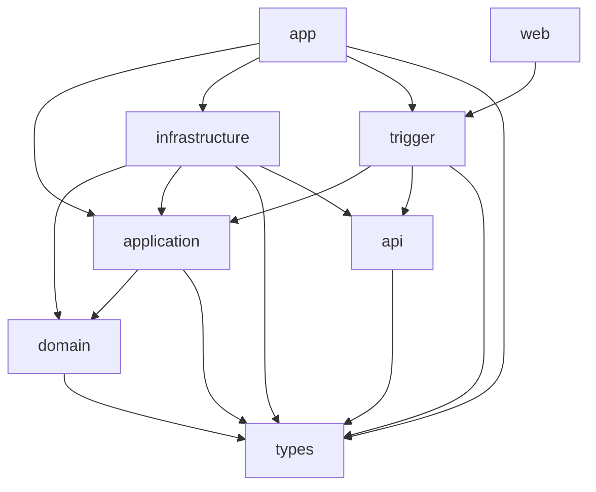
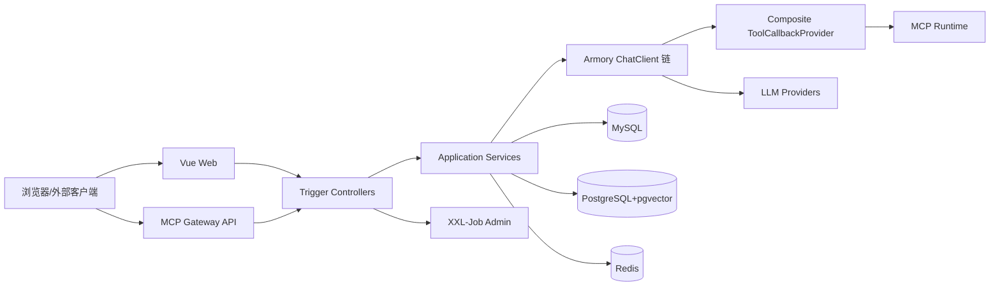
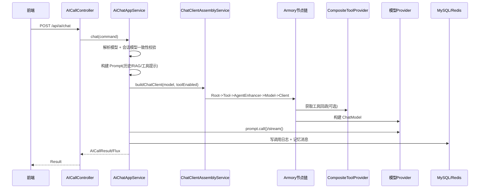
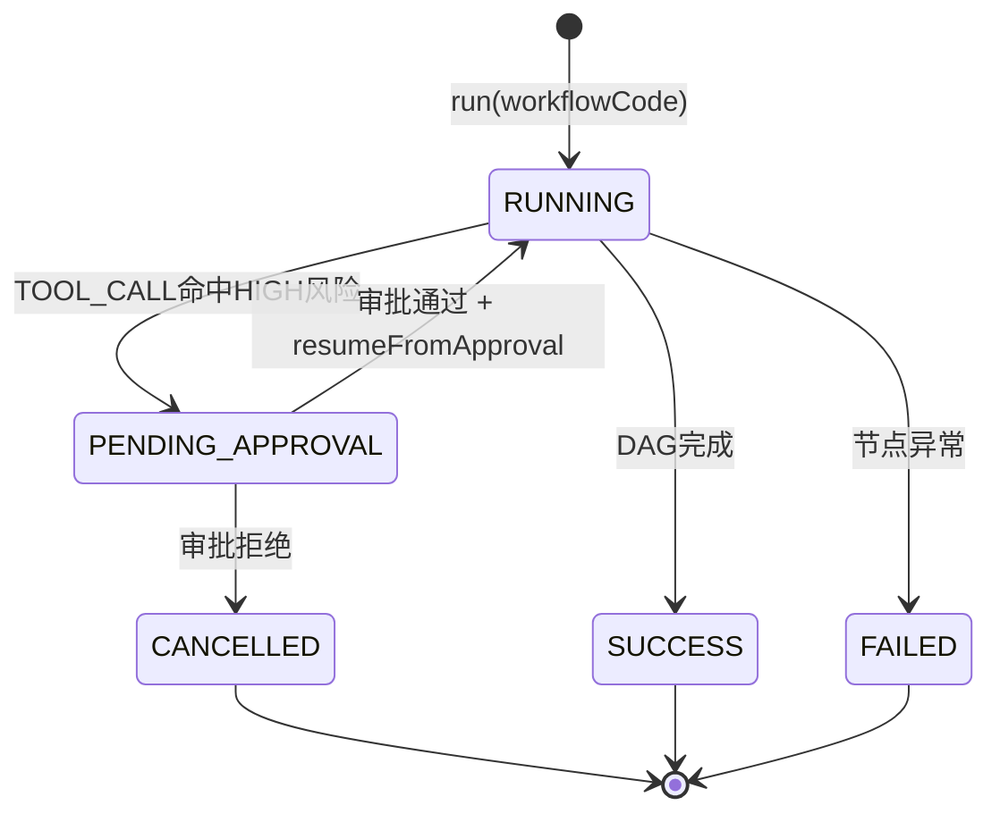
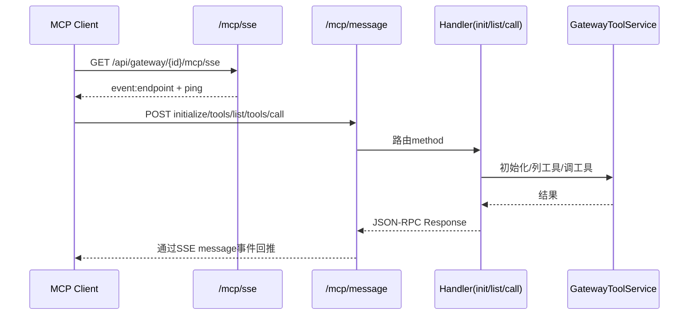

# AI MCP Knowledge Study

<div align="center">

**基于 DDD + Spring AI 的企业级 AI 中台（单组织版）**

[](https://www.oracle.com/java/technologies/javase/jdk17-archive-downloads.html)
[](https://spring.io/projects/spring-boot)
[](https://spring.io/projects/spring-ai)
[](https://vuejs.org/)

</div>

## 1. 项目概述
`ai-mcp-knowledge-study` 是一个完整的 AI 平台工程，覆盖：
- 身份权限（Sa-Token）
- 模型中心（OpenAI / Anthropic / Gemini / Ollama / DeepSeek）
- AI 对话（同步 + SSE）
- Agent 资产与运行（Prompt / Client Chain / Workflow）
- Workflow 图编排与运行时
- MCP Server 动态接入
- Gateway HTTP 工具治理
- 工具审批与审批后续跑
- RAG 文档处理与检索
- 监控统计与运维作业（XXL-Job）

当前仓库采用单组织模式，SQL 为重建脚本（无外键，应用层负责级联约束与清理）。

## 2. 当前代码快照（基于当前工作区）
- 总文件数：`1010`
- Java 文件：`861`
- Vue 文件：`42`
- TypeScript 文件：`31`
- 后端 Controller：`28`
- XXL Job 类：`8`（另有 `package-info`）
- 数据库表：`37`

## 3. 技术栈
### 后端
- Java 17
- Spring Boot 3.4.3
- Spring AI 1.1.2
- MyBatis-Plus + MyBatis-Spring
- Druid（MySQL）+ Hikari（PostgreSQL/pgvector）
- Sa-Token
- XXL-Job
- Redis（会话/记忆等）

### 前端
- Vue 3 + Vite + TypeScript
- Element Plus
- Pinia + Vue Router
- Axios + ECharts

## 4. 仓库结构
```text
ai-mcp-knowledge-study
├── ai-mcp-knowledge-types           # 通用类型、枚举、异常、Result/Page 等
├── ai-mcp-knowledge-api             # 接口契约（I*Service）与 DTO
├── ai-mcp-knowledge-domain          # 领域层（模型、仓储接口、领域服务）
├── ai-mcp-knowledge-application     # 应用层（用例编排、运行时服务）
├── ai-mcp-knowledge-infrastructure  # 基础设施（DAO、仓储实现、外部适配）
├── ai-mcp-knowledge-trigger         # 触发层（HTTP Controller、网关协议、Job）
├── ai-mcp-knowledge-app             # 启动模块与装配配置
├── ai-mcp-knowledge-web             # 前端管理台
├── docs                             # 设计文档与方案分析
├── sql                              # 数据库初始化脚本
└── start-dev.sh                     # 前端 dev 快速启动脚本
```

## 5. 分层架构（DDD）
| 模块 | 角色 | 核心职责 |
|---|---|---|
| `ai-mcp-knowledge-trigger` | 触发层 | HTTP 接口、MCP Gateway 协议入口、任务触发 |
| `ai-mcp-knowledge-application` | 应用层 | 用例编排、运行时流程、跨域协调 |
| `ai-mcp-knowledge-domain` | 领域层 | 领域模型、业务规则、仓储接口 |
| `ai-mcp-knowledge-infrastructure` | 基础设施层 | 仓储实现、DAO、外部系统对接 |
| `ai-mcp-knowledge-api` | 契约层 | API 接口定义与 DTO |
| `ai-mcp-knowledge-types` | 公共层 | Result/Page、异常、枚举、trace 工具 |
| `ai-mcp-knowledge-app` | 启动装配层 | Spring Boot 启动、数据源、向量库、异步、RAG、XXL |

### 5.1 模块依赖图


### 5.2 运行时组件图


## 6. 核心能力地图
### 6.1 身份与权限
- 登录/登出/当前用户画像：`/api/auth`
- 用户管理：`/api/users`
- 角色管理：`/api/roles`
- 权限查询：`/api/permissions`
- 身份审计：`/api/audit/events`
- 鉴权机制：Sa-Token（`@SaCheckPermission` + `@SaCheckLogin`）

### 6.2 模型中心
- 模型配置 CRUD、启停、连通性测试：`/api/models/*`
- 激活对话模型/嵌入模型：`/api/models/activate-chat`、`/api/models/activate-embedding`
- 支持自定义 `completions_path` 与 `embeddings_path`

### 6.3 AI 对话与会话
- 对话：`/api/ai/chat`
- 流式：`/api/ai/stream`
- 会话管理：`/api/ai/sessions/*`
- 会话绑定模型一致性校验（同会话禁止随意切模）

### 6.4 Agent 平台
- Agent 管理：`/api/agents/*`
- Agent 版本：`/api/agent-versions/*`
- Agent 运行：`/api/agents/{agentCode}/chat|stream|invoke`
- Agent 调度：`/api/schedules/*`
- Prompt 模板：`/api/templates/*`
- AgentEnhancer 绑定：`/api/agent-enhancers/*`

### 6.5 Workflow 平台
- Workflow 与版本管理：`/api/workflows/*`
- 图编辑保存：`/api/workflows/versions/save-graph`
- 运行与记录：`/api/workflows/{workflowCode}/run`、`/api/workflows/runs/*`
- 审批中断后恢复执行：`resumeFromApproval`（应用层）

### 6.6 MCP 与工具治理
- MCP Server 配置：`/api/mcp/servers/*`（支持 `STDIO/HTTP/SSE/WEBSOCKET`，当前运行时不支持 websocket 执行）
- Gateway 管理：`/api/gateway/manage/*`
- MCP Gateway 协议入口：
  - `GET /api/gateway/{gatewayId}/mcp/sse`
  - `POST /api/gateway/{gatewayId}/mcp/message?sessionId=...`
- 工具治理：模型/会话/AgentVersion 绑定 + allowlist 过滤 + tool:invoke 权限门禁

### 6.7 工具审批
- 审批接口：`/api/approvals/list|get|approve|reject`
- 风险等级：`HIGH` 工具触发审批单（`approval_request`）
- 审批通过后自动续跑：
  - Agent：执行审批工具后继续模型生成
  - Workflow：从挂起节点恢复 DAG

### 6.8 RAG
- 标签查询、上传（同步/异步）、Git 分析、进度、取消、重试、清理：`/api/ai/rag/*`
- 文档切块：`TokenTextSplitter`
- 多向量表：OpenAI/Ollama 各自表名可配置

### 6.9 监控与运维
- 指标：调用量、成功率、响应时间、模型使用分布：`/api/metrics/*`
- 工作台聚合：`/api/workbench/summary`
- XXL Admin 管理代理：`/api/xxl/*`
- 预热接口：`/api/preheat/agent-version`、`/api/preheat/workflow-version`

## 7. 关键流程图
### 7.1 AI 对话链路（同步/流式）


### 7.2 Workflow 运行与审批续跑


### 7.3 MCP Gateway 协议交互


## 8. 数据库设计（`sql/init-ai-model-orchestration.sql`）
脚本特征：
- 先 `DROP TABLE IF EXISTS`，再重建
- 共 `37` 张表
- 无外键（由应用层保证一致性）

### 8.1 分组统计
| 分组 | 数量 | 代表表 |
|---|---:|---|
| 身份与审计 | 6 | `sys_user`, `sys_role`, `sys_permission`, `sys_audit_event` |
| 模型/对话/RAG | 7 | `ai_model_config`, `ai_call_log`, `ai_chat_session`, `ai_rag_task` |
| Gateway/工具 | 6 | `mcp_gateway`, `mcp_gateway_auth`, `mcp_tool_registry` |
| Client/AgentEnhancer/Agent/Prompt | 10 | `advisor`, `ai_client_profile`, `agent`, `agent_version`, `prompt_template` |
| Workflow/运行 | 7 | `workflow`, `workflow_version`, `workflow_node`, `workflow_run` |
| 审批 | 1 | `approval_request` |

### 8.2 默认初始化数据
- 默认管理员：
  - 用户名：`admin`
  - 密码：`123456`（BCrypt 哈希已写入）
- 默认角色：`PLATFORM_ADMIN`、`BUSINESS_ADMIN`、`AGENT_OWNER`、`AUDITOR`、`VIEWER`
- 默认权限：`user:*`、`role:*`、`agent:*`、`workflow:*`、`tool:*`、`audit:read` 等
- 初始模型示例：`GPT-4`、`Claude-3.5-Sonnet`、`Gemini-3-Flash`

## 9. 配置说明
主要配置文件：
- `ai-mcp-knowledge-app/src/main/resources/application.yml`
- `ai-mcp-knowledge-app/src/main/resources/application-dev.yml`
- `ai-mcp-knowledge-app/src/main/resources/application-prod.yml`
- `ai-mcp-knowledge-app/src/main/resources/application-test.yml`

### 9.1 关键配置项
| 配置前缀 | 作用 |
|---|---|
| `server.port` | 后端端口（默认 `8090`） |
| `spring.datasource.mysql.*` | MySQL 业务库 |
| `spring.datasource.pgvector.*` | PostgreSQL 向量库 |
| `spring.data.redis.*` | Redis |
| `vector.store.*` | 向量表名 |
| `chat.history.*` | 聊天记忆窗口与保留周期 |
| `mcp.tools.cache-seconds` | 工具目录缓存时间 |
| `xxl.job.*` / `xxl.admin.*` | XXL 执行器与 Admin 对接 |
| `sa-token.*` | 登录 token 行为 |

## 10. 快速开始（本地开发）
### 10.1 环境要求
- JDK 17+
- Maven 3.6+
- MySQL 8+
- Redis 6+
- PostgreSQL + pgvector（启用 RAG 建议）
- Node.js 18+

### 10.2 初始化数据库
```bash
mysql -uroot -proot < sql/init-ai-model-orchestration.sql
```

### 10.3 启动后端
```bash
mvn -DskipTests compile
mvn -pl ai-mcp-knowledge-app spring-boot:run
```
后端地址：`http://localhost:8090`

### 10.4 启动前端
```bash
cd ai-mcp-knowledge-web
npm install
npm run dev
```
前端地址：`http://localhost:3000`  
Vite 已代理 `/api -> http://localhost:8090`

### 10.5 一键前端启动脚本
```bash
./start-dev.sh
```
说明：该脚本只负责前端依赖检测与前端 dev 启动。

## 11. 开发与测试命令
### 11.1 常用命令
```bash
# 全量编译
mvn -DskipTests compile

# 单模块编译
mvn -pl ai-mcp-knowledge-app -DskipTests compile

# 全量测试（默认排除 integration 组）
mvn test

# 前端类型检查与构建
cd ai-mcp-knowledge-web
npm run type-check
npm run build
```

### 11.2 测试策略
- 各后端模块均有单元测试
- `ai-mcp-knowledge-app` 下存在 `@Tag("integration")` 集成测试
- 父 `pom.xml` 和 app `pom.xml` 默认 `excludedGroups=integration`

## 12. 前端功能地图（路由）
主要路由分组（见 `ai-mcp-knowledge-web/src/router/routes.ts`）：
- 通用：工作台、AI 对话、监控看板、任务中心
- Agent：Agent 管理、版本、调度、调用、Prompt、工具审批
- Workflow：管理、版本、编辑器、调用、运行记录、详情
- 知识库：知识库管理、导入任务
- 集成：LLM 配置、Client 配置、AgentEnhancer、MCP 配置、网关工具、凭证管理
- 安全：用户、角色、身份审计

## 13. 任务与运维（XXL）
触发层内置处理器（`@XxlJob`）：
- `approvalExpireHandler`
- `agentScheduleHandler`
- `chatHistoryCleanupHandler`
- `mcpServerCSDNHandler`
- `ragTaskAutoRetryHandler`
- `ragTaskCleanupHandler`
- `ragTaskTimeoutHandler`
- `workflowRunCleanupHandler`

## 14. 可观测性与排障
### 14.1 Trace 机制
- HTTP 请求入口由 `TraceIdFilter` 注入/透传 `X-Trace-Id`
- AI 调用链由 `TraceIdAgentEnhancer` 贯穿
- 异步线程池通过 `TaskDecorator` 透传 MDC

### 14.2 日志目录
- 应用日志默认：`logs/app`
- XXL 日志默认：`logs/xxl-job`
- logback 配置：`ai-mcp-knowledge-app/src/main/resources/logback-spring.xml`

### 14.3 常见问题
1. 启动后模型调用报错：先检查 `ai_model_config` 的 `api_key/base_url/completions_path`。
2. RAG 不生效：检查 pgvector 数据源与向量表配置、嵌入模型启用状态。
3. 工具不可见：检查工具绑定、allowlist、`tool:invoke` 权限、MCP 刷新状态。
4. Gateway 客户端连不上：检查 `gatewayId` 状态、API Key 有效期、速率限制。

## 15. 已知边界
- `McpServerType` 枚举包含 `WEBSOCKET`，但运行时当前显式不支持 websocket 客户端构建。
- 数据库不使用外键，删除/状态流转一致性依赖应用层实现。
- `mcp-tool-weixin` 当前目录仅保留日志，不是本仓库内可直接构建的子模块。

## 16. 参考文档
- `docs/README-ARCH.md`（详细架构图文，建议二次开发先读）
- `docs/API-INDEX.md`（方法级接口索引，联调/回归使用）
- `docs/任务编排入门指南.md`
- `docs/Spring-AI任务编排落地方案综合对比.md`
- `docs/RAG文档处理优化完整方案.md`
- `docs/AI对话服务优化可行性分析.md`
- `docs/XXL对接方案.md`
- `.codex/DDD.md`
