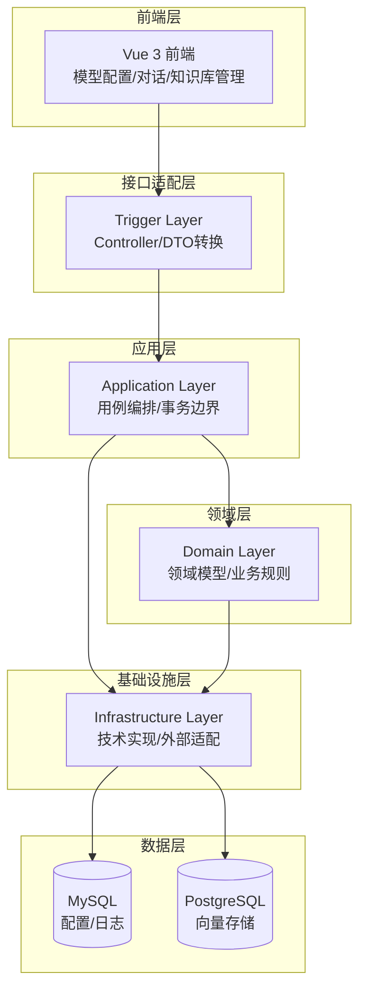
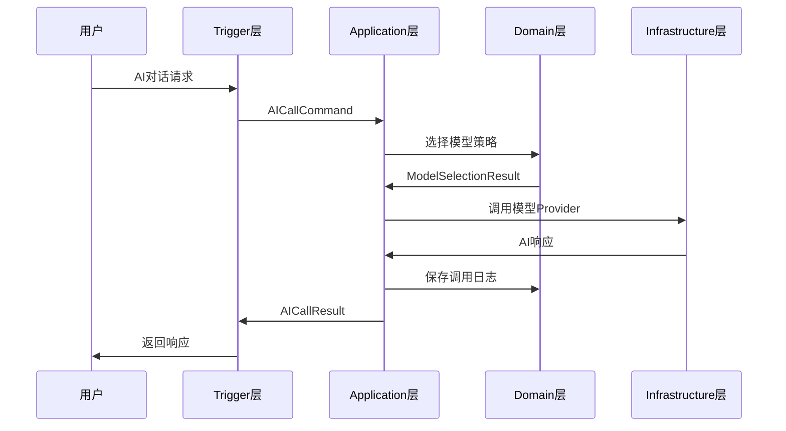
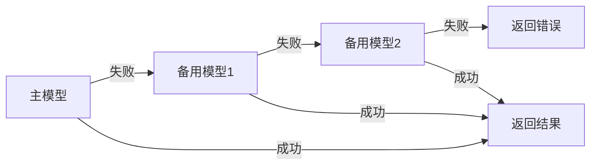

# AI MCP Knowledge Study

<div align="center">

**基于 DDD 架构的企业级 AI 应用编排平台**

[](https://www.oracle.com/java/technologies/javase/jdk17-archive-downloads.html)
[](https://spring.io/projects/spring-boot)
[](https://spring.io/projects/spring-ai)
[](LICENSE)

[English](README_EN.md) | 简体中文

</div>

## 📖 项目简介

**ai-mcp-knowledge-study** 是一个企业级 AI 应用编排平台，展示了如何使用 **DDD（领域驱动设计）** 架构和 **Spring AI** 框架构建可扩展、高可用的知识型 AI 系统。

### 核心特性

- 🎯 **多模型编排**：统一管理 OpenAI、Anthropic、Gemini、Ollama、DeepSeek 等多种 AI 模型
- 🔄 **智能降级**：主模型失败时自动降级到备用模型，保证服务可用性
- 🛠️ **MCP 协议集成**：支持 Model Context Protocol，可作为 MCP Server/Client 接入外部工具
- 📚 **RAG 知识库**：支持文档上传、解析、向量化存储和相似度检索
- 💬 **聊天会话管理**：完整的多轮对话、历史记忆和上下文管理
- 📊 **可观测性**：调用日志、成功率、响应时间、模型使用分布等指标统计
- 🔍 **配置审计**：所有配置变更自动记录，支持追溯和回滚
- 🏗️ **DDD 架构**：清晰的分层设计，易于维护和扩展

## 🎯 解决的痛点

| 痛点 | 解决方案 |
|------|---------|
| **多模型管理混乱** | 统一抽象 ModelProvider，应用层策略编排 |
| **业务需求难映射** | TaskType 任务类型配置，自动选择最优模型 |
| **稳定性与降级缺失** | 熔断/降级/重试机制，保证调用可用性 |
| **缺乏可观测性** | 完整的指标统计和调用日志 |
| **配置变更不可追溯** | 配置审计表，记录所有变更历史 |
| **工具集成成本高** | MCP 协议集成，快速接入外部工具 |

## 🏗️ 架构设计

### DDD 分层架构



### 核心流程



## 📦 模块结构

| 模块 | 职责 | 说明 |
|------|------|------|
| **ai-mcp-knowledge-types** | 共享内核 | 通用类型、枚举、Result、TraceId |
| **ai-mcp-knowledge-api** | API 定义 | 请求/响应 DTO |
| **ai-mcp-knowledge-domain** | 领域层 | 领域模型、领域服务、仓储接口 |
| **ai-mcp-knowledge-application** | 应用层 | 用例编排、模型选择、降级策略 |
| **ai-mcp-knowledge-infrastructure** | 基础设施层 | 仓储实现、模型调用、MCP 集成 |
| **ai-mcp-knowledge-trigger** | 接口适配层 | HTTP Controller、DTO 转换 |
| **ai-mcp-knowledge-app** | 应用启动 | Spring Boot 启动类、配置 |
| **ai-mcp-knowledge-web** | 前端 | Vue 3 管理界面 |

## 🚀 快速开始

### 环境要求

- JDK 17+
- Maven 3.6+
- MySQL 8.0+ 或 PostgreSQL 14+
- Node.js 18+ (前端)

### 1. 初始化数据库

```bash
# MySQL
mysql -u root -p < sql/init-ai-model-orchestration.sql

# PostgreSQL (可选)
psql -U postgres -d ai-rag-knowledge -f sql/init-postgresql.sql
```

### 2. 配置后端

修改 `ai-mcp-knowledge-app/src/main/resources/application-dev.yml`：

```yaml
spring:
  main:
    web-application-type: servlet  # 启用 Web 接口
  datasource:
    url: jdbc:mysql://localhost:3306/ai-rag-knowledge
    username: root
    password: your_password
  ai:
    openai:
      base-url: https://api.openai.com
      api-key: sk-xxx
```

### 3. 启动后端

```bash
# 编译
mvn clean compile -DskipTests

# 启动
mvn -pl ai-mcp-knowledge-app spring-boot:run
```

### 4. 启动前端

```bash
cd ai-mcp-knowledge-web
npm install
npm run dev
```

### 5. 访问系统

- 前端界面：http://localhost:5173
- 后端接口：http://localhost:8090

## 💡 核心功能

### 1. 多模型编排

```java
// 自动选择最优模型
AICallCommand command = new AICallCommand();
command.setContent("介绍一下 DDD");
command.setTaskType("WRITING");  // 根据任务类型选择模型
command.setStrategy("QUALITY_PRIORITY");  // 质量优先策略

AICallResult result = aiChatAppService.chat(command);
```

### 2. 智能降级



### 3. RAG 知识库

```java
// 上传文档
ragAppService.uploadFile(file, Arrays.asList("java", "spring"));

// 检索相似内容
List<String> contexts = ragAppService.search(
    Arrays.asList("java"),
    "如何使用 Spring AI"
);
```

### 4. MCP 工具调用

```java
// 配置 MCP Server
McpServerConfig config = new McpServerConfig();
config.setServerName("mcp-tool-csdn");
config.setServerType(McpServerType.STDIO);
config.setEnabled(true);

// 自动集成到 AI 对话中
AICallCommand command = new AICallCommand();
command.setContent("发布文章到 CSDN");
// MCP 工具会自动被调用
```

## 📊 设计模式

项目中使用了多种设计模式来保证代码的可维护性和可扩展性：

| 设计模式 | 应用场景 | 关键类 |
|---------|---------|--------|
| **策略模式** | 模型选择策略 | `ModelSelectionStrategy` |
| **责任链模式** | 模型选择链、调用管道 | `ModelSelectionChain`、`ModelCallPipeline` |
| **模板方法** | 降级流程骨架 | `AbstractFailoverExecutor` |
| **工厂模式** | 模型提供者创建 | `ModelProviderFactory` |
| **装饰器模式** | 调用计时 | `TimedModelCallExecutor` |
| **迭代器模式** | 候选模型遍历 | `FailoverPlan` |

## 📈 性能优化

### 当前性能

- 单次 AI 调用：< 2s (取决于模型)
- RAG 检索：< 100ms
- 并发支持：100+ QPS

### 优化建议

1. **引入任务编排**：使用 Temporal 或 Spring State Machine
2. **并行处理**：RAG 文档处理并行化
3. **缓存优化**：模型配置缓存、RAG 结果缓存
4. **异步处理**：长时间运行任务异步化

详见：[任务编排落地方案](docs/Spring-AI任务编排落地方案综合对比.md)

## 📚 文档

- [入门文档](.codex/入门文档.md) - 从 0 到 1 完整指南
- [DDD 架构](.codex/DDD.md) - DDD 实战详解
- [任务编排入门](docs/任务编排入门指南.md) - 任务编排基础概念
- [方案对比](docs/Spring-AI任务编排落地方案综合对比.md) - 编排方案选择

## 🛠️ 技术栈

### 后端

- **框架**：Spring Boot 3.4.3、Spring AI 1.1.2
- **数据库**：MySQL 8.0+、PostgreSQL + pgvector
- **ORM**：MyBatis-Plus 3.5.6
- **AI 模型**：OpenAI、Anthropic、Gemini、Ollama、DeepSeek
- **工具**：Apache Tika、Jieba 中文分词

### 前端

- **框架**：Vue 3、TypeScript
- **UI 库**：Element Plus
- **构建工具**：Vite
- **状态管理**：Pinia
- **路由**：Vue Router

## 🔧 配置说明

### 模型配置

```yaml
spring:
  ai:
    openai:
      base-url: https://api.openai.com
      api-key: sk-xxx
    anthropic:
      base-url: https://api.anthropic.com
      api-key: sk-ant-xxx
    gemini:
      base-url: https://generativelanguage.googleapis.com
      api-key: xxx
```

### MCP 配置（推荐：Streamable HTTP）

```json
{
  "mcpServers": {
    "mcp-tool-csdn": {
      "type": "http",
      "url": "http://127.0.0.1:8101/mcp/message"
    }
  }
}
```

### MCP 配置（兼容：stdio）

```json
{
  "mcpServers": {
    "mcp-tool-csdn": {
      "command": "java",
      "args": [
        "-jar",
        "/path/to/mcp-tool-csdn.jar"
      ]
    }
  }
}
```

## 🎯 使用场景

1. **企业 AI 中台**：统一管理多个 AI 模型，提供统一接口
2. **知识库问答**：基于企业文档的智能问答系统
3. **多模型对比**：快速切换不同模型进行效果对比
4. **AI 应用开发学习**：学习如何构建企业级 AI 应用
5. **MCP 生态探索**：学习和实践 MCP 协议

## 🤝 贡献

欢迎提交 Issue 和 Pull Request！

## 📄 License

[MIT License](LICENSE)

## 🙏 致谢

- [Spring AI](https://spring.io/projects/spring-ai) - AI 应用开发框架
- [Model Context Protocol](https://modelcontextprotocol.io/) - 模型上下文协议
- [pgvector](https://github.com/pgvector/pgvector) - PostgreSQL 向量扩展

## 📞 联系方式

- 作者：xiexu
- 项目地址：[GitHub](https://github.com/your-repo/ai-mcp-knowledge-study)

---

**⭐ 如果这个项目对你有帮助，请给个 Star！**
