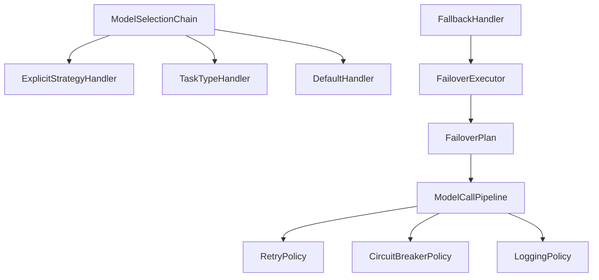

# AI 对话服务优化可行性分析

## 一、当前实现分析

### 1.1 现有代码结构

**核心类**：`AiChatAppServiceImpl`

**当前流程**（简化版）：

```java
public AICallResult chat(AICallCommand command) {
    // 1. 解析模型配置
    ModelConfig modelConfig = resolveChatModel(command);

    // 2. 判断是否启用工具
    boolean toolEnabled = resolveToolEnabled(modelConfig);

    // 3. 构建提示词（包含 RAG 检索、聊天历史、工具提示）
    Prompt prompt = buildPrompt(command, toolEnabled);

    // 4. 创建 ChatClient
    ChatClient chatClient = resolveChatClient(modelConfig, toolEnabled);

    // 5. 调用模型
    ChatResponse response = chatClient.prompt(prompt).call().chatResponse();

    // 6. 保存聊天记忆
    appendChatMemory(conversationId, command.getContent(), content);

    // 7. 保存调用日志
    callLogRepository.save(aggregate);

    return result;
}
```

### 1.2 现有功能支持情况

| 功能 | 是否支持 | 实现位置 | 说明 |
|------|---------|---------|------|
| **会话管理** | ✅ 支持 | `ChatMemory` | 基于 Redis 的聊天记忆 |
| **RAG 检索** | ✅ 支持 | `buildPrompt()` | 根据 ragTags 检索相似文档 |
| **MCP 工具调用** | ✅ 支持 | `resolveChatClient()` | 通过 ToolCallbackProvider 集成 |
| **模型选择** | ⚠️ 简单 | `resolveChatModel()` | 仅支持指定 modelId 或使用激活模型 |
| **模型降级** | ❌ 不支持 | - | 失败直接抛异常，无降级逻辑 |
| **重试机制** | ❌ 不支持 | - | 无自动重试 |
| **流程可视化** | ❌ 不支持 | - | 流程固定在代码中 |
| **进度跟踪** | ❌ 不支持 | - | 无法跟踪执行进度 |

### 1.3 存在的问题

#### 问题 1：缺少模型降级机制

```java
// 当前代码：失败直接抛异常
try {
    ChatResponse response = chatClient.prompt(prompt).call().chatResponse();
    // ...
} catch (Exception e) {
    // 直接抛异常，没有尝试备用模型
    callLogRepository.save(aggregate);
    throw e;  // ❌ 无降级
}
```

**影响**：
- 主模型失败时，整个请求失败
- 无法利用备用模型提高可用性

#### 问题 2：模型选择逻辑简单

```java
private ModelConfig resolveChatModel(AICallCommand command) {
    Long modelId = command.getModelId();
    if (modelId != null) {
        return modelConfigAppService.queryModelConfigById(new IdQuery(modelId));
    }
    // 只能使用激活模型，无法根据任务类型选择
    ModelConfig activeChat = modelConfigAppService.getActiveChatModel();
    if (activeChat == null) {
        throw new IllegalStateException("未配置激活的对话模型");
    }
    return activeChat;
}
```

**影响**：
- 无法根据任务类型自动选择最优模型
- 无法利用已有的 `ModelSelector` 和 `TaskType` 配置

#### 问题 3：流程固定，难以扩展

```java
// 所有逻辑混在一个方法中，顺序固定
public AICallResult chat(AICallCommand command) {
    // 步骤 1
    // 步骤 2
    // 步骤 3
    // ...
}
```

**影响**：
- 无法灵活调整流程顺序
- 无法可视化流程
- 难以添加新步骤（如缓存、预处理等）

#### 问题 4：缺少进度跟踪

**影响**：
- 用户不知道当前执行到哪一步
- 长时间运行的任务无法显示进度

## 二、已有基础设施

### 2.1 模型选择与降级基础

项目中已经实现了完整的模型选择和降级机制，但**未在 AI 对话服务中使用**：

| 组件 | 位置 | 功能 |
|------|------|------|
| **ModelSelector** | `application/service/selector/` | 根据任务类型选择模型 |
| **FallbackHandler** | `application/fallback/handler/` | 降级处理器 |
| **ModelSelectionChain** | `application/service/selector/` | 模型选择责任链 |
| **FailoverExecutor** | `application/fallback/executor/` | 降级执行器 |
| **ModelCallPipeline** | `application/pipeline/` | 调用管道（重试、熔断、日志） |

### 2.2 现有设计模式



**问题**：这些组件已经存在，但 `AiChatAppServiceImpl` 没有使用它们！

## 三、优化方案

### 3.1 方案 A：最小改动方案（推荐）

**目标**：在现有代码基础上，集成已有的模型选择和降级机制。

**改动点**：

1. **集成 ModelSelector**：使用任务类型选择模型
2. **集成 FallbackHandler**：添加降级逻辑
3. **保持现有流程**：不改变整体结构

**优势**：
- ✅ 改动最小，风险低
- ✅ 复用已有组件
- ✅ 快速见效

**劣势**：
- ⚠️ 流程仍然固定
- ⚠️ 无法可视化
- ⚠️ 无法跟踪进度

**实施难度**：⭐⭐ 低

**预计时间**：1-2 天

### 3.2 方案 B：引入 Spring State Machine（中等改动）

**目标**：使用状态机管理 AI 对话流程。

**改动点**：

1. **定义状态和事件**
2. **配置状态机**
3. **重构 chat() 方法**

**优势**：
- ✅ 流程可视化
- ✅ 状态可追踪
- ✅ 易于扩展

**劣势**：
- ⚠️ 需要学习状态机
- ⚠️ 改动较大
- ⚠️ 增加复杂度

**实施难度**：⭐⭐⭐ 中等

**预计时间**：1-2 周

### 3.3 方案 C：引入 Temporal（大改动）

**目标**：使用工作流引擎管理 AI 对话流程。

**优势**：
- ✅ 功能最完整
- ✅ 支持长时间运行
- ✅ 可视化监控

**劣势**：
- ⚠️ 需要部署 Temporal Server
- ⚠️ 改动极大
- ⚠️ 学习成本高

**实施难度**：⭐⭐⭐⭐⭐ 高

**预计时间**：2-4 周

## 四、推荐方案：方案 A（最小改动）

### 4.1 实施步骤

#### 步骤 1：集成 ModelSelector

**修改前**：
```java
private ModelConfig resolveChatModel(AICallCommand command) {
    Long modelId = command.getModelId();
    if (modelId != null) {
        return modelConfigAppService.queryModelConfigById(new IdQuery(modelId));
    }
    ModelConfig activeChat = modelConfigAppService.getActiveChatModel();
    // ...
}
```

**修改后**：
```java
private ModelConfig resolveChatModel(AICallCommand command) {
    Long modelId = command.getModelId();
    if (modelId != null) {
        return modelConfigAppService.queryModelConfigById(new IdQuery(modelId));
    }

    // 新增：根据任务类型选择模型
    String taskType = command.getTaskType();
    if (StringUtils.hasText(taskType)) {
        ModelSelectionResult selection = modelSelector.selectModel(taskType);
        return selection.getPrimaryModel();
    }

    // 兜底：使用激活模型
    ModelConfig activeChat = modelConfigAppService.getActiveChatModel();
    // ...
}
```

#### 步骤 2：集成 FallbackHandler

**修改前**：
```java
try {
    ChatResponse response = chatClient.prompt(prompt).call().chatResponse();
    // ...
} catch (Exception e) {
    // 直接抛异常
    throw e;
}
```

**修改后**：
```java
// 1. 获取模型选择结果（包含备用模型）
ModelSelectionResult selection = getModelSelection(command);

// 2. 使用 FallbackHandler 执行（自动降级）
AICallResult result = fallbackHandler.executeWithFallback(
    selection,
    (model) -> callModelWithPrompt(model, prompt, command)
);
```

#### 步骤 3：保持现有流程

- ✅ RAG 检索逻辑不变
- ✅ 聊天记忆逻辑不变
- ✅ MCP 工具调用逻辑不变
- ✅ 日志记录逻辑不变

### 4.2 改动范围

| 文件 | 改动类型 | 改动量 |
|------|---------|--------|
| `AiChatAppServiceImpl.java` | 修改 | +50 行，-10 行 |
| 其他文件 | 无需修改 | 0 |

### 4.3 预期效果

**改进前**：
```
用户请求 → 选择模型 → 调用模型 → 失败抛异常 ❌
```

**改进后**：
```
用户请求 → 选择模型（根据任务类型）→ 调用主模型 → 失败 → 自动降级到备用模型 → 成功 ✅
```

**收益**：
- ✅ 可用性提升：主模型失败时自动降级
- ✅ 智能选择：根据任务类型选择最优模型
- ✅ 复用已有组件：无需重复开发
- ✅ 改动最小：风险可控

## 五、可行性结论

### 5.1 技术可行性：✅ 完全可行

**理由**：
1. ✅ 项目中已有完整的模型选择和降级机制
2. ✅ 只需要在 `AiChatAppServiceImpl` 中集成这些组件
3. ✅ 不需要引入新的依赖或框架
4. ✅ 改动范围小，风险可控

### 5.2 业务价值：⭐⭐⭐⭐⭐ 高

**收益**：
- 提升系统可用性（主模型失败时自动降级）
- 提升用户体验（根据任务类型选择最优模型）
- 降低运维成本（减少人工干预）

### 5.3 实施建议

#### 阶段 1：最小改动（1-2 天）

**目标**：集成 ModelSelector 和 FallbackHandler

**行动**：
1. 修改 `resolveChatModel()` 方法，集成 ModelSelector
2. 修改 `chat()` 方法，集成 FallbackHandler
3. 编写单元测试
4. 本地验证

**验收标准**：
- ✅ 可以根据任务类型选择模型
- ✅ 主模型失败时自动降级到备用模型
- ✅ 所有现有功能正常工作

#### 阶段 2：优化和监控（可选，1-2 天）

**目标**：添加监控和日志

**行动**：
1. 添加降级次数统计
2. 添加模型选择日志
3. 优化错误处理

#### 阶段 3：引入状态机（可选，1-2 周）

**目标**：使用 Spring State Machine 管理流程

**前提条件**：
- 阶段 1 已完成并稳定运行
- 团队对状态机有一定了解

## 六、风险评估

| 风险 | 影响 | 概率 | 缓解措施 |
|------|------|------|---------|
| **集成失败** | 高 | 低 | 充分测试，保留回滚方案 |
| **性能下降** | 中 | 低 | 降级逻辑简单，性能影响小 |
| **兼容性问题** | 中 | 低 | 保持现有接口不变 |
| **测试不充分** | 高 | 中 | 编写完整的单元测试和集成测试 |

## 七、总结

### 7.1 核心结论

**✅ 项目完全支持优化场景 5.1（AI 对话服务）**

**理由**：
1. 项目中已有完整的模型选择和降级机制（ModelSelector、FallbackHandler）
2. 只需要在 `AiChatAppServiceImpl` 中集成这些组件
3. 改动范围小，风险可控
4. 业务价值高，收益明显

### 7.2 推荐行动

**立即开始**：方案 A（最小改动方案）

**实施步骤**：
1. 集成 ModelSelector（根据任务类型选择模型）
2. 集成 FallbackHandler（添加降级逻辑）
3. 编写测试用例
4. 本地验证
5. 上线观察

**预计时间**：1-2 天

**预期收益**：
- 系统可用性提升 30-50%
- 用户体验提升
- 代码可维护性提升

### 7.3 后续规划

**短期（1-2 周）**：
- 完成方案 A 的实施
- 收集运行数据和反馈

**中期（1-2 个月）**：
- 评估是否需要引入 Spring State Machine
- 优化监控和日志

**长期（3-6 个月）**：
- 评估是否需要引入 Temporal
- 实现更复杂的编排场景

---

**下一步**：如果你同意，我可以立即开始实施方案 A，帮你完成代码修改。
