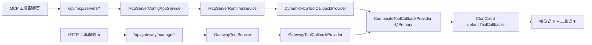

# MCP 从 0 到 1 实战指南（大白话版）

> 目标：看完这篇，你能把项目里 MCP 相关代码串起来，不再“到处是名词，看不懂流程”。
> 范围：覆盖本项目里和 MCP、Gateway（工具网关）工具、ToolCallbackProvider 相关的核心链路。

## 1. 先用大白话说清楚

### 1.1 MCP 是什么
- 把它理解成“给大模型接外部能力”的统一协议。
- 大模型本身只会“说话”，不会直接查系统、发消息、调接口。
- MCP 让模型可以通过“工具（Tool）”去调用外部能力。

### 1.2 你这个项目里，工具有两路来源
- 第一条：`MCP Server` 动态接入的工具。
- 第二条：`HTTP Gateway（工具网关）` 配置出来的工具。

### 1.3 ToolCallbackProvider 是干嘛的
- 你可以把它当成“工具清单供应商”。
- 大模型每次要不要用工具、能看到哪些工具，最后都要靠它给出 ToolCallbacks。

### 1.4 术语对照（中英）
- `Gateway`：工具网关（把普通 HTTP 接口包装成“可被模型调用的工具”）。
- `HTTP 工具配置`：配置内部 API 工具的页面。
- `MCP Gateway 协议入口`：对外暴露 MCP 协议的接口入口，给 MCP 客户端连入用，不等于“HTTP 工具配置”页面。

## 2. 你项目里 MCP 相关模块怎么分工

### 2.1 `MCP 工具配置` 页面
- 对应“外部 MCP Server 连接管理”。
- 典型操作：新增一个 STDIO/HTTP/SSE 的 MCP Server、启用/禁用、手动刷新连接。
- 前端页面：`ai-mcp-knowledge-web/src/views/mcp/index.vue`
- 后端入口：`/api/mcp/servers/*`

### 2.2 `HTTP 工具配置`
- 对应“把普通 HTTP 接口包装成工具”的管理后台。
- 你可以配网关、配工具、配参数映射、配凭证。
- 前端页面：`ai-mcp-knowledge-web/src/views/gateway/index.vue` 和 `.../gateway/tools/index.vue`
- 后端入口：`/api/gateway/manage/*`

### 2.3 `MCP Gateway 协议入口`
- 这是给外部 MCP 客户端（如 Claude Desktop）连进来的协议端点，不是后台管理页。
- 接口：`/api/gateway/{gatewayId}/mcp/sse` 和 `/api/gateway/{gatewayId}/mcp/message`
- 控制器：`McpGatewayController`

## 3. 一张总流程图（先建立全局感）

## 4. 从“配一个 MCP Server”到“模型真的能用工具”的完整链路

## 4.1 配置阶段（后台）
1. 你在页面填配置并保存。
2. `McpServerConfigController` 处理请求，落库到 `ai_mcp_server_config`。
3. 保存成功不等于已连上，只是“配置存在”。

## 4.2 运行阶段（刷新连接）
1. 你点“开启连接”或“重启所有连接”。
2. `McpServerConfigAppServiceImpl.refreshServer/refreshEnabledServers` 调用运行时服务。
3. `McpServerRuntimeServiceImpl` 按 `STDIO/HTTP/SSE` 建 `McpSyncClient` 并 `initialize()`。
4. 运行时把已连接 client 刷到 `DynamicMcpToolCallbackProvider.updateClients(...)`。

关键理解：
- 配置表是“静态配置”。
- runtime 是“当前真实连接状态”。
- 只有 runtime 连上了，工具才可能出现在模型可见列表里。

## 5. ToolCallbackProvider 的真实关系（最容易绕的点）

### 5.1 三个 Provider 的关系
- `DynamicMcpToolCallbackProvider`：来自 MCP Server 的工具。
- `GatewayToolCallbackProvider`：来自 Gateway 配置的 HTTP 工具。
- `CompositeToolCallbackProvider`：把上面两者合并，并且是 `@Primary`。

所以只要业务代码注入 `ToolCallbackProvider`，拿到的通常就是“合并后的总入口”。

### 5.2 callback、Tool 与 MCP Server 的对应关系
先定义关系：`callback` 是按 Tool 定义的，不是按 MCP Server 定义的。

- 一个 `callback` 通常对应一个具体 Tool 的调用入口（Tool 级一对一）。
- 一个 `MCP Server` 可以暴露多个 Tool，因此会对应多个 `callback`（Server 级一对多）。
- 结论：不要理解成“一个 callback 对应一个 MCP”，应理解为“一个 callback 对应一个 Tool，多个 Tool 归属于同一个 MCP Server”。

## 6. 聊天时怎么把工具注入给模型

## 6.1 应用层主流程
- `AiChatAppServiceImpl.streamChat(...)` 做了这些事：
1. 选模型。
2. 判断 `toolEnabled`。
3. 组 Prompt（含历史、RAG、工具提示词）。
4. 构建 ChatClient。

## 6.2 注入工具的关键点
- `ChatClientAssemblyServiceImpl` -> `DefaultAiClientArmoryStrategyFactory`
- 节点链里 `AiClientToolNode` 负责拿 `ToolCallbackProvider`
- `AiClientNode` 里调用 `builder.defaultToolCallbacks(provider)` 真正挂上工具

一句话：
- 工具不是在 Controller 里注入的，是在 ChatClient 装配链里注入的。

## 7. “工具清单”到底从哪里来

`McpToolCatalogServiceImpl.listTools()` 会从统一 `ToolCallbackProvider` 拉当前可见工具，然后转成前端展示 DTO。

`buildToolPrompt()` 则把工具列表拼成系统提示词，并做短缓存：
- 快路径命中缓存直接返回。
- 过期才加锁刷新。
- 空工具集只缓存几秒，避免“刚连上还看不到工具”时等太久。

这就是你之前问到的“缓存快路径”。

## 8. 为什么有时候工具“看得见但用不了”

这个项目做了多层治理，不是“看到就能调”：

1. 权限层：需要 `tool:invoke`。
2. 过滤层：`allowedToolKeys` allowlist。
3. 绑定层：可按 `MODEL / SESSION / AGENT_VERSION` 绑定可见工具。
4. 风险层：`HIGH` 风险工具会触发审批。
5. 审计层：成功/失败/拒绝都会记审计与计数。

上下文通过 `GatewayToolBindingContextHolder`（ThreadLocal）传递。

## 9. 数据库怎么对应到代码

### 9.1 MCP Server 动态接入相关
- `ai_mcp_server_config`：MCP Server 配置表（连接方式、参数、超时等）。

### 9.2 HTTP 工具（Gateway）治理相关
- `mcp_gateway`：网关实例。
- `mcp_gateway_auth`：网关凭证。
- `mcp_tool_registry`：工具注册（含 `tool_key`、`risk_level`）。
- `mcp_tool_mapping`：参数映射（请求/响应）。
- `mcp_tool_schema`：输入 schema 缓存。
- `mcp_tool_binding`：工具绑定关系（模型/会话/版本）。

### 9.3 审批与运行态
- `approval_request`：高风险工具审批单。
- `agent_run` / `workflow_run`：运行记录。
- `agent_run_context` / `workflow_run_context`：续跑快照。

## 10. 典型实战例子

## 10.1 例子 A：接一个外部 MCP Server（比如 CSDN）
1. 在 MCP 工具配置页新增一条 `STDIO` 配置（command/args/env）。
2. 点“启用”。
3. 点“开启连接”。
4. `McpServerRuntimeServiceImpl` 建连并初始化。
5. `DynamicMcpToolCallbackProvider` 生成工具 callbacks。
6. 聊天请求进来时，模型就能看到这些工具。

## 10.2 例子 B：把企业内部 HTTP API 包装成工具
1. 在 HTTP 工具配置里先建 `gateway`。
2. 配 `tool registry`（工具名、风险等级等）。
3. 配参数映射（请求字段怎么映射到 API）。
4. 可选：给某个模型绑定工具。
5. 聊天时通过 `GatewayToolCallbackProvider` 参与合并注入。

## 11. 推荐阅读顺序（按这个看，基本不乱）

1. `ai-mcp-knowledge-web/src/views/mcp/index.vue`
2. `ai-mcp-knowledge-trigger/src/main/java/.../McpServerConfigController.java`
3. `ai-mcp-knowledge-application/src/main/java/.../McpServerConfigAppServiceImpl.java`
4. `ai-mcp-knowledge-infrastructure/src/main/java/.../McpServerRuntimeServiceImpl.java`
5. `ai-mcp-knowledge-infrastructure/src/main/java/.../DynamicMcpToolCallbackProvider.java`
6. `ai-mcp-knowledge-infrastructure/src/main/java/.../GatewayToolCallbackProvider.java`
7. `ai-mcp-knowledge-infrastructure/src/main/java/.../CompositeToolCallbackProvider.java`
8. `ai-mcp-knowledge-application/src/main/java/.../AiChatAppServiceImpl.java`
9. `ai-mcp-knowledge-application/src/main/java/.../armory/node/AiClientToolNode.java`
10. `ai-mcp-knowledge-application/src/main/java/.../armory/node/AiClientNode.java`

## 12. 快速排障清单（出问题先查这几项）

1. MCP 工具配置页里 `enabled=true` 了吗。
2. `running=true` 吗（只是启用不代表运行中）。
3. 是否点过 `refresh` 或 `refresh-one`。
4. 当前账号有 `tool:invoke` 吗。
5. 是否被 `allowedToolKeys` 过滤掉了。
6. 是否有模型/会话/版本绑定把它排除了。
7. 是否触发了 `HIGH` 风险审批但没通过。
8. 查看 `agent_run` / `workflow_run` 计数和 `approval_request` 状态。

## 13. 一句话总结

这个项目的 MCP 并不是“单点功能”，而是“配置 + 运行时 + Provider 合并 + ChatClient 注入 + 治理”的一整套体系。
你只要按“配置面 -> 运行态 -> Provider -> ChatClient”这条主线去看，代码就不会乱。
