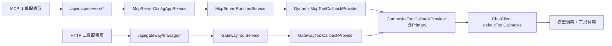

# MCP 从 0 到 1 实战指南（大白话版）

> 目标：看完这篇，你能把项目里 MCP 相关代码串起来，不再“到处是名词，看不懂流程”。
> 范围：覆盖本项目里和 MCP、Gateway（工具网关）工具、ToolCallbackProvider 相关的核心链路。

## 1. 基础概念

### 1.1 MCP 是什么
- 把它理解成“给大模型接外部能力”的统一协议。
- 大模型本身只会“说话”，不会直接查系统、发消息、调接口。
- MCP 让模型可以通过“工具（Tool）”去调用外部能力。

### 1.2 项目内工具来源
- 第一条：`MCP Server` 动态接入的工具。
- 第二条：`HTTP Gateway（工具网关）` 配置出来的工具。

### 1.3 ToolCallbackProvider 职责
- 你可以把它当成“工具清单供应商”。
- 大模型每次要不要用工具、能看到哪些工具，最后都要靠它给出 ToolCallbacks。

### 1.4 术语对照（中英）
- `Gateway`：工具网关（把普通 HTTP 接口包装成“可被模型调用的工具”）。
- `HTTP 工具配置`：配置内部 API 工具的页面。
- `MCP Gateway 协议入口`：对外暴露 MCP 协议的接口入口，给 MCP 客户端连入用，不等于“HTTP 工具配置”页面。

## 2. MCP 相关模块分工

### 2.1 `MCP 工具配置` 页面
- 对应“外部 MCP Server 连接管理”。
- 典型操作：新增一个 STDIO/HTTP/SSE 的 MCP Server、启用/禁用、手动刷新连接。
- 前端页面：`ai-mcp-knowledge-web/src/views/mcp/index.vue`
- 后端入口：`/api/mcp/servers/*`

### 2.2 `HTTP 工具配置`
- 对应“把普通 HTTP 接口包装成工具”的管理后台。
- 你可以配网关、配工具、配参数映射、配凭证。
- 前端页面：`ai-mcp-knowledge-web/src/views/gateway/index.vue` 和 `.../gateway/tools/index.vue`
- 后端入口：`/api/gateway/manage/*`

### 2.3 `MCP Gateway 协议入口`
- 这是给外部 MCP 客户端（如 Claude Desktop）连进来的协议端点，不是后台管理页。
- 接口：`/api/gateway/{gatewayId}/mcp/sse` 和 `/api/gateway/{gatewayId}/mcp/message`
- 控制器：`McpGatewayController`

### 2.4 运行时 Registry 说明
- 位置：`ai-mcp-knowledge-infrastructure/src/main/java/com/xbk/knowledge/infrastructure/mcp/McpServerRuntimeServiceImpl.java`
- 它们是运行时服务里的 3 本“内存账本”（`ConcurrentHashMap`），不是数据库字段，也不是外部传入参数。
- 创建时机：Spring 创建 `McpServerRuntimeServiceImpl` Bean 时就初始化。
- 销毁时机：应用关闭（`@PreDestroy shutdown`）或注销时清理。

三本账本分别记什么：
- `clientRegistry`：`configId -> McpSyncClient`，记“真实连接对象”。
- `metaRegistry`：`configId -> McpServerMeta`，记“服务元信息”（当前主要是 `serverName`）。
- `configSnapshotRegistry`：`configId -> RuntimeConfigSnapshot`，记“上次生效配置快照”，用于判断要不要重连。

一句话理解：
- 配置表像“设计图”。
- 这三本 Registry 像“施工现场当前状态”。

## 3. 总体流程图

## 4. 从 MCP Server 配置到工具可用的完整链路

## 4.1 配置阶段（后台）
1. 你在页面填配置并保存。
2. `McpServerConfigController` 处理请求，落库到 `ai_mcp_server_config`。
3. 保存成功不等于已连上，只是“配置存在”。

## 4.2 运行阶段（刷新连接）
1. 你点“开启连接”或“重启所有连接”。
2. `McpServerConfigAppServiceImpl.refreshServer/refreshEnabledServers` 调用运行时服务。
3. `McpServerRuntimeServiceImpl` 按 `STDIO/HTTP/SSE` 建 `McpSyncClient` 并 `initialize()`。
4. 运行时把已连接 client 刷到 `DynamicMcpToolCallbackProvider.updateClients(...)`。

关键理解：
- 配置表是“静态配置”。
- runtime 是“当前真实连接状态”。
- 只有 runtime 连上了，工具才可能出现在模型可见列表里。

## 4.3 `enabled` 与 `running` 状态差异
- `enabled`：数据库配置开关，表示“允许参与运行时”。
- `running`：内存运行态，表示“此刻是否真有连接对象在跑”。
- 在接口响应里，`running` 是通过 `mcpServerRuntimeService.isRunning(id)` 实时计算的，不是直接读库字段。

常见现象：
- `enabled=true` 但 `running=false`：通常是还没点 `refresh`，或刷新时初始化失败。
- `enabled=false` 一定会走注销：运行时连接会被清掉，避免“配置关了但连接还活着”。

## 4.4 非 `true` 状态的注销策略
- 代码用的是 `!Boolean.TRUE.equals(enabled)`，也就是只有“显式 true”才保留运行时连接。
- `false/null` 都视为“不应生效”，因此统一走 `unregister`。
- 这是故意的保守策略：宁可下线，不可误上线。

## 5. ToolCallbackProvider 关系说明

### 5.1 三个 Provider 的关系
- `DynamicMcpToolCallbackProvider`：来自 MCP Server 的工具。
- `GatewayToolCallbackProvider`：来自 Gateway 配置的 HTTP 工具。
- `CompositeToolCallbackProvider`：把上面两者合并，并且是 `@Primary`。

所以只要业务代码注入 `ToolCallbackProvider`，拿到的通常就是“合并后的总入口”。

### 5.2 callback、Tool 与 MCP Server 的对应关系
先定义关系：`callback` 是按 Tool 定义的，不是按 MCP Server 定义的。

- 一个 `callback` 通常对应一个具体 Tool 的调用入口（Tool 级一对一）。
- 一个 `MCP Server` 可以暴露多个 Tool，因此会对应多个 `callback`（Server 级一对多）。
- 结论：不要理解成“一个 callback 对应一个 MCP”，应理解为“一个 callback 对应一个 Tool，多个 Tool 归属于同一个 MCP Server”。

## 6. 聊天链路中的工具注入

## 6.1 应用层主流程
- `AiChatAppServiceImpl.streamChat(...)` 做了这些事：
1. 选模型。
2. 判断 `toolEnabled`。
3. 组 Prompt（含历史、RAG、工具提示词）。
4. 构建 ChatClient。

## 6.2 注入工具的关键点
- `ChatClientAssemblyServiceImpl` -> `DefaultAiClientArmoryStrategyFactory`
- 节点链里 `AiClientToolNode` 负责拿 `ToolCallbackProvider`
- `AiClientNode` 里调用 `builder.defaultToolCallbacks(provider)` 真正挂上工具
- 当前真实路径是 `ai-mcp-knowledge-application/src/main/java/com/xbk/knowledge/application/service/armory/node/*`

一句话：
- 工具不是在 Controller 里注入的，是在 ChatClient 装配链里注入的。

## 6.3 SSE 思考分流（thinking）与最终回答（message）
- 你现在的对话流是 SSE，不是一次性返回。
- 后端 `AICallController.sendChunk` 会按分片类型发两种事件：
1. `event: thinking`：模型思考分片（用于前端折叠展示）。
2. 默认 `message`：最终回答分片（用于主回答区渲染与落库）。

应用层还有一个关键点：
- `AiChatAppServiceImpl.appendStreamContent` 只把最终回答写入会话记忆。
- 思考分片不会写入聊天记忆，避免污染后续多轮上下文。

前端处理策略：
1. `thinking` 分片拼到“思考区”（可折叠）。
2. `message` 分片拼到“主回答区”。
3. 落库时只保存主回答内容，不保存思考内容。

## 7. 工具清单来源

`McpToolCatalogServiceImpl.listTools()` 会从统一 `ToolCallbackProvider` 拉当前可见工具，然后转成前端展示 DTO。

`buildToolPrompt()` 则把工具列表拼成系统提示词，并做短缓存：
- 快路径命中缓存直接返回。
- 过期才加锁刷新。
- 空工具集只缓存几秒，避免“刚连上还看不到工具”时等太久。

这就是你之前问到的“缓存快路径”。

## 8. 工具可见但不可用的常见原因

这个项目做了多层治理，不是“看到就能调”：

1. 权限层：需要 `tool:invoke`。
2. 过滤层：`allowedToolKeys` allowlist。
3. 绑定层：可按 `MODEL / SESSION / AGENT_VERSION` 绑定可见工具。
4. 风险层：`HIGH` 风险工具会触发审批。
5. 审计层：成功/失败/拒绝都会记审计与计数。

上下文通过 `GatewayToolBindingContextHolder`（ThreadLocal）传递。

## 9. 数据库表与代码对应关系

### 9.1 MCP Server 动态接入相关
- `ai_mcp_server_config`：MCP Server 配置表（连接方式、参数、超时等）。

### 9.2 HTTP 工具（Gateway）治理相关
- `mcp_gateway`：网关实例。
- `mcp_gateway_auth`：网关凭证。
- `mcp_tool_registry`：工具注册（含 `tool_key`、`risk_level`）。
- `mcp_tool_mapping`：参数映射（请求/响应）。
- `mcp_tool_schema`：输入 schema 缓存。
- `mcp_tool_binding`：工具绑定关系（模型/会话/版本）。

### 9.3 审批与运行态
- `approval_request`：高风险工具审批单。
- `agent_run` / `workflow_run`：运行记录。
- `agent_run_context` / `workflow_run_context`：续跑快照。

## 10. 典型实战例子

## 10.1 例子 A：接一个外部 MCP Server（比如 CSDN）
1. 在 MCP 工具配置页新增一条 `STDIO` 配置（command/args/env）。
2. 点“启用”。
3. 点“开启连接”。
4. `McpServerRuntimeServiceImpl` 建连并初始化。
5. `DynamicMcpToolCallbackProvider` 生成工具 callbacks。
6. 聊天请求进来时，模型就能看到这些工具。

## 10.2 例子 B：把企业内部 HTTP API 包装成工具
1. 在 HTTP 工具配置里先建 `gateway`。
2. 配 `tool registry`（工具名、风险等级等）。
3. 配参数映射（请求字段怎么映射到 API）。
4. 可选：给某个模型绑定工具。
5. 聊天时通过 `GatewayToolCallbackProvider` 参与合并注入。

## 11. 推荐阅读顺序

1. `ai-mcp-knowledge-web/src/views/mcp/index.vue`
2. `ai-mcp-knowledge-trigger/src/main/java/.../McpServerConfigController.java`
3. `ai-mcp-knowledge-application/src/main/java/.../McpServerConfigAppServiceImpl.java`
4. `ai-mcp-knowledge-infrastructure/src/main/java/.../McpServerRuntimeServiceImpl.java`
5. `ai-mcp-knowledge-infrastructure/src/main/java/.../DynamicMcpToolCallbackProvider.java`
6. `ai-mcp-knowledge-infrastructure/src/main/java/.../GatewayToolCallbackProvider.java`
7. `ai-mcp-knowledge-infrastructure/src/main/java/.../CompositeToolCallbackProvider.java`
8. `ai-mcp-knowledge-application/src/main/java/.../AiChatAppServiceImpl.java`
9. `ai-mcp-knowledge-application/src/main/java/com/xbk/knowledge/application/service/armory/node/AiClientToolNode.java`
10. `ai-mcp-knowledge-application/src/main/java/com/xbk/knowledge/application/service/armory/node/AiClientNode.java`

## 12. 快速排障清单

1. MCP 工具配置页里 `enabled=true` 了吗。
2. `running=true` 吗（只是启用不代表运行中）。
3. 是否点过 `refresh` 或 `refresh-one`。
4. 当前账号有 `tool:invoke` 吗。
5. 是否被 `allowedToolKeys` 过滤掉了。
6. 是否有模型/会话/版本绑定把它排除了。
7. 是否触发了 `HIGH` 风险审批但没通过。
8. 查看 `agent_run` / `workflow_run` 计数和 `approval_request` 状态。
9. 如果“看起来不像流式”，先看是否有代理缓冲（Nginx `proxy_buffering`）或浏览器网络层缓存。
10. 再看前端是否每个分片都触发整页 markdown 重渲染（会导致视觉上“整段跳出”）。
11. 如果回复里出现“思考前缀混入正文”，确认前后端是否启用了 `thinking/message` 事件分流。

## 13. 总结

这个项目的 MCP 并不是“单点功能”，而是“配置 + 运行时 + Provider 合并 + ChatClient 注入 + 治理”的一整套体系。
你只要按“配置面 -> 运行态 -> Provider -> ChatClient”这条主线去看，代码就不会乱。

## 14. 从 0 到 1 学习路线

目标：
- 第一遍先看“谁调谁”。
- 第二遍再看“状态怎么流转（enabled/running/registry）”。

### 第 1 步：入口层（页面到接口）
看这里：
- `McpServerConfigController.refreshConfigs`（全量刷新）
- `McpServerConfigController.refreshConfig`（单条刷新）
- `McpServerConfigController.convertToResponse`（`running` 的来源）

断点建议：
- 在 `refreshConfigs/refreshConfig` 进来时打断点，看请求如何走到应用层。
- 在 `convertToResponse` 打断点，看 `running` 是实时算的，不是数据库字段。

### 第 2 步：应用层编排（业务语义）
看这里：
- `McpServerConfigAppServiceImpl.refreshEnabledServers`
- `McpServerConfigAppServiceImpl.refreshServer`
- `McpServerConfigAppServiceImpl.disableMcpServer/updateMcpServerConfig`

断点建议：
- 看它何时调用 `registerOrUpdate`，何时调用 `unregister`。
- 特别关注“禁用后立即注销”的分支。

### 第 3 步：运行时核心
看这里：
- `McpServerRuntimeServiceImpl.refresh`
- `McpServerRuntimeServiceImpl.registerOrUpdateInternal`
- `McpServerRuntimeServiceImpl.unregisterInternal`
- `McpServerRuntimeServiceImpl.refreshToolCallbacks`

断点建议：
- 观察三本 registry 在“注册、更新、注销、批量刷新”前后的变化。
- 观察 `!Boolean.TRUE.equals(enabled)` 如何直接转注销。
- 观察 `RuntimeConfigSnapshot` 如何避免无效重连。

### 第 4 步：工具到模型可调用能力转换
看这里：
- `DynamicMcpToolCallbackProvider.updateClients`
- `DynamicMcpToolCallbackProvider.buildCallbacks`
- `CompositeToolCallbackProvider.getToolCallbacks`

断点建议：
- 看 `McpSyncClient` 如何被转成 `ToolCallback[]`。
- 看合并后最终有多少个工具，是否有重名被跳过。

### 第 5 步：ChatClient 装配末端
看这里：
- `AiChatAppServiceImpl.streamChat`
- `AiClientToolNode.doHandle`
- `AiClientNode.doHandle`

断点建议：
- 看 `GatewayToolBindingContextHolder` 的 set/clear 生命周期。
- 看 `builder.defaultToolCallbacks(provider)` 在什么条件下执行。

### 第 6 步：治理能力（权限、绑定、审批）
看这里：
- `GatewayToolCallbackProvider.applyAllowlistIfPresent`
- `GatewayToolCallbackProvider.applyVisibilityFilter`
- `GatewayToolCallbackProvider.maybeRequireApproval`

断点建议：
- 模拟“能看到工具但调用失败”的场景，排查是权限、绑定还是审批导致。

## 15. 常见问题

1. 以为“保存配置=已经连上”
- 错。保存只是落库，必须 refresh 才会建运行时连接。

2. 以为 `enabled=true` 就一定可用
- 错。`enabled` 是配置态；`running` 才是运行态。

3. 以为“禁用只是不给新请求用，老连接还在”
- 错。当前实现是禁用就注销，连接会被清掉。

4. 看到工具名却调不起来
- 常见原因：缺 `tool:invoke`、allowlist 过滤、绑定规则排除、或高风险审批未通过。

5. 文档路径和代码路径对不上
- 这类问题确实出现过。当前 armory 节点真实路径是 `application/service/armory/node/*`。
