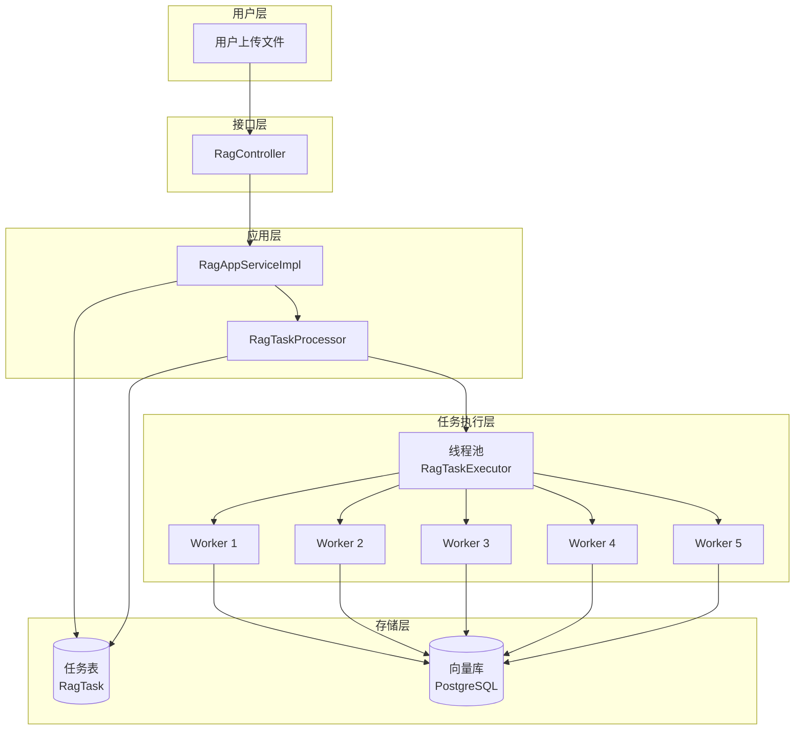
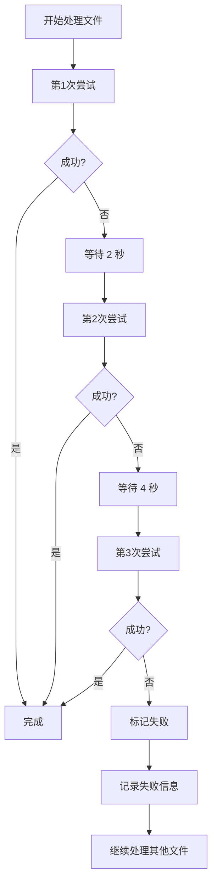

# RAG 文档处理优化完整方案

## 一、概述

### 1.1 优化目标

**性能提升**：
- 文件上传处理性能提升 **3-5 倍**
- Git 仓库分析性能提升 **3-5 倍**

**用户体验提升**：
- 文件上传支持异步处理和实时进度跟踪
- 支持批量上传大量文件
- 支持中断和取消任务
- 支持失败重试机制

**功能增强**：
- 支持并行处理多个文件
- 优化大文件处理能力
- 提升系统资源利用率
- 三层重试机制保障可靠性

### 1.2 改造范围

| 模块 | 改动类型 | 预计代码量 |
|------|---------|-----------|
| `RagAppServiceImpl` | 修改 + 新增 | +100 行 |
| `RagTaskProcessor` | 修改 + 新增 | +200 行 |
| `RagTaskExecutorConfig` | 新增 | +30 行 |
| **总计** | - | **+330 行** |

### 1.3 不改动的部分

- ✅ 向量存储逻辑（RagVectorStoreService）
- ✅ 文档解析逻辑（TikaDocumentReader）
- ✅ 文本分块逻辑（TokenTextSplitter）
- ✅ 前端接口（保持向后兼容）

## 二、当前实现分析

### 2.1 现有代码结构

**核心类**：
- `RagAppServiceImpl` - RAG 应用服务
- `RagTaskProcessor` - 异步任务处理器
- `RagVectorStoreService` - 向量存储服务

### 2.2 当前流程

#### 流程 1：文件上传处理（uploadFiles）

```java
public boolean uploadFiles(String ragTag, List<MultipartFile> files) {
    // 1. 验证文件
    for (MultipartFile file : validFiles) {
        // 检查大小（30MB 限制）
        // 检查文件类型
    }

    // 2. 逐个处理文件（同步）
    for (MultipartFile file : validFiles) {
        // 创建临时文件
        // 使用 TikaDocumentReader 解析
        // 使用 TokenTextSplitter 分块
        // 保存到向量库
    }

    return true;
}
```

**特点**：
- ✅ 同步处理
- ❌ 逐个处理（无并行）
- ❌ 无进度跟踪
- ❌ 无法中断
- ❌ 大文件限制 30MB

#### 流程 2：Git 仓库分析（analyzeGitRepository）

```java
@Async
public void processGitRepository(String taskId, String repoUrl, ...) {
    // 1. 克隆仓库
    updateTask(taskId, PROCESSING, 10, "正在克隆代码...");

    // 2. 扫描文件
    updateTask(taskId, PROCESSING, 30, "克隆完成，开始扫描文件...");

    // 3. 逐个处理文件
    Files.walkFileTree(repoDir.toPath(), new SimpleFileVisitor<Path>() {
        public FileVisitResult visitFile(Path file, ...) {
            // 解析文件
            // 分块
            // 保存到向量库
            // 更新进度
            updateTask(taskId, PROCESSING, progress, "正在解析: " + fileName);
        }
    });

    // 4. 完成
    updateTask(taskId, COMPLETED, 100, "分析完成");
}
```

**特点**：
- ✅ 异步处理（@Async）
- ✅ 进度跟踪（updateTask）
- ✅ 支持取消（isCancelled）
- ❌ 逐个处理（无并行）
- ❌ 无法恢复（中断后需重新开始）

### 2.3 现有功能支持情况

| 功能 | 文件上传 | Git 仓库分析 | 说明 |
|------|---------|-------------|------|
| **异步处理** | ❌ 同步 | ✅ @Async | Git 仓库支持异步 |
| **进度跟踪** | ❌ 不支持 | ✅ updateTask | Git 仓库支持进度跟踪 |
| **并行处理** | ❌ 逐个处理 | ❌ 逐个处理 | 都不支持并行 |
| **中断取消** | ❌ 不支持 | ✅ isCancelled | Git 仓库支持取消 |
| **中断恢复** | ❌ 不支持 | ❌ 不支持 | 都不支持恢复 |
| **大文件处理** | ❌ 30MB 限制 | ✅ 1MB 限制 | 都有大小限制 |
| **批量处理** | ✅ 支持 | ✅ 支持 | 都支持批量 |

## 三、存在的问题

### 3.1 问题 1：文件上传无法并行处理

```java
// 当前代码：逐个处理
for (MultipartFile file : validFiles) {
    // 处理文件 1
    // 处理文件 2
    // 处理文件 3
    // ...
}
```

**影响**：
- 上传 10 个文件，每个文件处理 10 秒，总共需要 100 秒
- 如果并行处理，可能只需要 10-20 秒

### 3.2 问题 2：大文件限制 30MB

```java
private static final long MAX_FILE_SIZE_BYTES = 30L * 1024 * 1024;

if (file.getSize() > MAX_FILE_SIZE_BYTES) {
    throw new IllegalArgumentException("单文件大小超过 30MB: " + originalName);
}
```

**影响**：
- 无法处理大型 PDF 文档
- 无法处理大型代码文件

### 3.3 问题 3：文件上传无进度跟踪

```java
// 用户上传 10 个文件，无法知道处理到第几个
public boolean uploadFiles(String ragTag, List<MultipartFile> files) {
    // ...
    return true;  // 只返回成功/失败
}
```

**影响**：
- 用户不知道处理进度
- 长时间等待，用户体验差

### 3.4 问题 4：Git 仓库分析无法并行处理文件

```java
// 逐个处理文件
Files.walkFileTree(repoDir.toPath(), new SimpleFileVisitor<Path>() {
    public FileVisitResult visitFile(Path file, ...) {
        // 处理文件 1
        // 处理文件 2
        // ...
    }
});
```

**影响**：
- 大型仓库（1000+ 文件）处理时间长
- 无法利用多核 CPU

### 3.5 问题 5：无失败重试机制

**影响**：
- 单个文件失败导致整个任务失败
- 网络抖动或临时错误无法自动恢复
- 用户需要重新上传所有文件

## 四、优化方案设计

### 4.1 整体架构



### 4.2 核心改造点

#### 改造点 1：配置线程池

**新增文件**：`RagTaskExecutorConfig.java`

**位置**：`ai-mcp-knowledge-app/src/main/java/com/xbk/knowledge/config/rag/`

**代码**：

```java
package com.xbk.knowledge.config.rag;

import lombok.extern.slf4j.Slf4j;
import org.springframework.context.annotation.Bean;
import org.springframework.context.annotation.Configuration;
import org.springframework.scheduling.concurrent.ThreadPoolTaskExecutor;

import java.util.concurrent.ThreadPoolExecutor;

/**
 * RAG 任务执行器配置
 * 用于并行处理文档解析任务
 *
 * @author xiexu
 */
@Slf4j
@Configuration
public class RagTaskExecutorConfig {

    /**
     * RAG 任务线程池
     * 核心线程数：5
     * 最大线程数：10
     * 队列容量：100
     */
    @Bean(name = "ragTaskExecutor")
    public ThreadPoolTaskExecutor ragTaskExecutor() {
        ThreadPoolTaskExecutor executor = new ThreadPoolTaskExecutor();

        // 核心线程数：同时处理的文件数
        executor.setCorePoolSize(5);

        // 最大线程数：高峰期最多处理的文件数
        executor.setMaxPoolSize(10);

        // 队列容量：等待处理的任务数
        executor.setQueueCapacity(100);

        // 线程名称前缀
        executor.setThreadNamePrefix("rag-task-");

        // 拒绝策略：队列满时，由调用线程执行
        executor.setRejectedExecutionHandler(new ThreadPoolExecutor.CallerRunsPolicy());

        // 线程空闲时间：60 秒
        executor.setKeepAliveSeconds(60);

        // 允许核心线程超时
        executor.setAllowCoreThreadTimeOut(true);

        // 等待所有任务完成后再关闭线程池
        executor.setWaitForTasksToCompleteOnShutdown(true);

        // 等待时间：30 秒
        executor.setAwaitTerminationSeconds(30);

        executor.initialize();

        log.info("RAG 任务线程池初始化完成，核心线程数: {}, 最大线程数: {}, 队列容量: {}",
                executor.getCorePoolSize(),
                executor.getMaxPoolSize(),
                executor.getQueueCapacity());

        return executor;
    }
}
```

**配置说明**：

| 参数 | 值 | 说明 |
|------|---|------|
| **corePoolSize** | 5 | 同时处理 5 个文件 |
| **maxPoolSize** | 10 | 高峰期最多处理 10 个文件 |
| **queueCapacity** | 100 | 最多等待 100 个任务 |
| **keepAliveSeconds** | 60 | 线程空闲 60 秒后回收 |
| **rejectedExecutionHandler** | CallerRunsPolicy | 队列满时由调用线程执行 |

#### 改造点 2：文件上传支持异步和进度跟踪

**修改文件**：`RagAppServiceImpl.java`

**新增方法**：

```java
/**
 * 异步上传文件（支持进度跟踪）
 *
 * @param ragTag 知识库标签
 * @param files 文件列表
 * @return 任务 ID
 */
@Override
@Transactional(rollbackFor = Exception.class)
public String uploadFilesAsync(String ragTag, List<MultipartFile> files) {
    if (!StringUtils.hasText(ragTag) || CollectionUtils.isEmpty(files)) {
        throw new IllegalArgumentException("标签和文件不能为空");
    }

    // 1. 验证文件
    List<MultipartFile> validFiles = files.stream()
            .filter(file -> file != null && !file.isEmpty())
            .collect(Collectors.toList());

    if (validFiles.isEmpty()) {
        throw new IllegalArgumentException("没有有效的文件");
    }

    for (MultipartFile file : validFiles) {
        String originalName = file.getOriginalFilename();
        if (file.getSize() > MAX_FILE_SIZE_BYTES) {
            throw new IllegalArgumentException("单文件大小超过 30MB: " + originalName);
        }
        if (!isSupportedFile(originalName)) {
            throw new IllegalArgumentException("不支持的文件类型: " + originalName);
        }
    }

    // 2. 创建任务
    String taskId = UUID.randomUUID().toString();
    RagTask task = RagTask.builder()
            .taskId(taskId)
            .type("FILE_UPLOAD")
            .status(RagTaskStatus.PENDING)
            .progress(0)
            .message("任务已提交，共 " + validFiles.size() + " 个文件")
            .ragTag(ragTag)
            .build();
    ragTaskRepository.create(task);

    // 3. 异步处理
    ragTaskProcessor.processFilesAsync(taskId, ragTag, validFiles);

    log.info("文件上传任务已创建，taskId: {}, 文件数: {}", taskId, validFiles.size());
    return taskId;
}
```

#### 改造点 3：并行处理文件

**修改文件**：`RagTaskProcessor.java`

**新增方法**：

```java
@Autowired
@Qualifier("ragTaskExecutor")
private ThreadPoolTaskExecutor ragTaskExecutor;

/**
 * 异步处理文件上传任务（支持并行）
 *
 * @param taskId 任务 ID
 * @param ragTag 知识库标签
 * @param files 文件列表
 */
@Async
public void processFilesAsync(String taskId, String ragTag, List<MultipartFile> files) {
    try {
        updateTask(taskId, RagTaskStatus.PROCESSING, 5, "开始处理文件...");

        int totalFiles = files.size();
        AtomicInteger processedFiles = new AtomicInteger(0);
        AtomicInteger failedFiles = new AtomicInteger(0);

        // 记录失败的文件
        List<FileProcessError> errors = Collections.synchronizedList(new ArrayList<>());

        // 并行处理文件
        List<CompletableFuture<Void>> futures = files.stream()
                .map(file -> CompletableFuture.runAsync(() -> {
                    try {
                        // 检查是否取消
                        if (isCancelled(taskId)) {
                            return;
                        }

                        // 处理文件（带重试）
                        processFileWithRetry(file, ragTag);

                        // 更新进度
                        int processed = processedFiles.incrementAndGet();
                        int progress = 5 + (int) ((processed * 90.0) / totalFiles);
                        updateTask(taskId, RagTaskStatus.PROCESSING, progress,
                                String.format("已处理: %d/%d", processed, totalFiles));

                    } catch (Exception e) {
                        // 记录失败信息
                        int failed = failedFiles.incrementAndGet();
                        errors.add(FileProcessError.builder()
                                .fileName(file.getOriginalFilename())
                                .errorMessage(e.getMessage())
                                .stackTrace(getStackTrace(e))
                                .occurredAt(LocalDateTime.now())
                                .retryCount(3)
                                .build());

                        log.error("文件处理失败（已重试 3 次）: {}", file.getOriginalFilename(), e);
                    }
                }, ragTaskExecutor))
                .collect(Collectors.toList());

        // 等待所有任务完成
        CompletableFuture.allOf(futures.toArray(new CompletableFuture[0])).join();

        // 检查是否取消
        if (isCancelled(taskId)) {
            updateTask(taskId, RagTaskStatus.CANCELLED, 0, "任务已取消");
            return;
        }

        // 更新最终状态
        int processed = processedFiles.get();
        int failed = failedFiles.get();

        if (failed == 0) {
            // 全部成功
            updateTask(taskId, RagTaskStatus.COMPLETED, 100,
                    String.format("处理完成，成功: %d", processed));
        } else if (processed > 0) {
            // 部分成功
            updateTask(taskId, RagTaskStatus.COMPLETED, 100,
                    String.format("处理完成，成功: %d, 失败: %d", processed, failed));

            // 保存失败详情
            saveFailureDetails(taskId, errors);
        } else {
            // 全部失败
            updateTask(taskId, RagTaskStatus.FAILED, 0,
                    String.format("处理失败，失败: %d", failed));

            // 保存失败详情
            saveFailureDetails(taskId, errors);
        }

    } catch (Exception e) {
        log.error("文件上传任务失败, taskId: {}", taskId, e);
        updateTask(taskId, RagTaskStatus.FAILED, 0, "任务失败: " + e.getMessage());
    }
}
```

#### 改造点 4：优化 Git 仓库分析

**修改文件**：`RagTaskProcessor.java`

**修改方法**：`processGitRepository`

**关键改动**：

```java
// 1. 先收集所有文件
List<Path> allFiles = new ArrayList<>();
Files.walkFileTree(repoDir.toPath(), new SimpleFileVisitor<Path>() {
    @Override
    public FileVisitResult visitFile(Path file, BasicFileAttributes attrs) {
        if (isCancelled(taskId)) {
            return FileVisitResult.TERMINATE;
        }
        if (isValidFile(file)) {
            allFiles.add(file);
        }
        return FileVisitResult.CONTINUE;
    }
});

updateTask(taskId, RagTaskStatus.PROCESSING, 35,
        "扫描完成，共 " + allFiles.size() + " 个文件，开始并行解析...");

// 2. 并行处理文件
AtomicInteger processedCount = new AtomicInteger(0);
List<CompletableFuture<Void>> futures = allFiles.stream()
        .map(file -> CompletableFuture.runAsync(() -> {
            try {
                if (isCancelled(taskId)) {
                    return;
                }

                // 处理文件
                TikaDocumentReader reader = new TikaDocumentReader(new PathResource(file));
                List<Document> documents = reader.get();
                if (!CollectionUtils.isEmpty(documents)) {
                    List<Document> splitDocuments = tokenTextSplitter.apply(documents);
                    documents.forEach(doc -> doc.getMetadata().put("knowledge", ragTag));
                    splitDocuments.forEach(doc -> doc.getMetadata().put("knowledge", ragTag));
                    ragVectorStoreService.saveDocuments(splitDocuments);
                }

                // 更新进度
                int processed = processedCount.incrementAndGet();
                int progress = 35 + (int) ((processed * 60.0) / allFiles.size());
                if (processed % 10 == 0 || progress % 10 == 0) {
                    updateTask(taskId, RagTaskStatus.PROCESSING, progress,
                            String.format("正在解析: %d/%d", processed, allFiles.size()));
                }

            } catch (Exception e) {
                log.error("解析文件失败: {}", file, e);
            }
        }, ragTaskExecutor))
        .collect(Collectors.toList());

// 3. 等待所有任务完成
CompletableFuture.allOf(futures.toArray(new CompletableFuture[0])).join();
```

## 五、失败重试机制

### 5.1 三层重试机制



**层次 1：单个文件自动重试**
- 最多重试 3 次
- 指数退避（2 秒、4 秒、8 秒）
- 失败后记录错误信息

**层次 2：任务级别容错**
- 单个文件失败不影响整体任务
- 记录所有失败文件的详细信息
- 任务状态标记为"部分成功"

**层次 3：任务级别手动重试**
- 用户可以手动重试失败的任务
- 只重试失败的文件
- 保留成功文件的结果

### 5.2 代码实现

#### 实现 1：单个文件自动重试

```java
/**
 * 处理单个文件（支持自动重试）
 *
 * @param file 文件
 * @param ragTag 标签
 * @throws IOException 处理失败
 */
private void processFileWithRetry(MultipartFile file, String ragTag) throws IOException {
    int maxRetries = 3;
    int retryCount = 0;
    Exception lastException = null;

    while (retryCount < maxRetries) {
        try {
            // 处理文件
            processFile(file, ragTag);

            // 成功，记录日志
            log.info("文件处理成功: {}, 重试次数: {}",
                file.getOriginalFilename(), retryCount);
            return;

        } catch (Exception e) {
            lastException = e;
            retryCount++;

            if (retryCount < maxRetries) {
                // 计算退避时间（指数退避）
                long backoffMs = (long) Math.pow(2, retryCount) * 1000;

                log.warn("文件处理失败，将在 {} 秒后重试 {}/{}: {}",
                    backoffMs / 1000, retryCount, maxRetries,
                    file.getOriginalFilename(), e);

                try {
                    Thread.sleep(backoffMs);
                } catch (InterruptedException ie) {
                    Thread.currentThread().interrupt();
                    throw new RuntimeException("重试被中断", ie);
                }
            } else {
                log.error("文件处理失败，已达到最大重试次数 {}: {}",
                    maxRetries, file.getOriginalFilename(), e);
            }
        }
    }

    // 所有重试都失败
    throw new RuntimeException(
        String.format("文件处理失败，已重试 %d 次: %s",
            maxRetries, file.getOriginalFilename()),
        lastException
    );
}
```

#### 实现 2：文件处理错误信息

```java
/**
 * 文件处理错误信息
 */
@Data
@Builder
public class FileProcessError {
    private String fileName;
    private String errorMessage;
    private String stackTrace;
    private LocalDateTime occurredAt;
    private int retryCount;
}
```

#### 实现 3：任务级别手动重试

```java
/**
 * 重试失败的任务
 *
 * @param taskId 任务 ID
 * @return 是否成功
 */
@Override
@Transactional(rollbackFor = Exception.class)
public boolean retryTask(String taskId) {
    RagTask task = ragTaskRepository.findByTaskId(taskId);
    if (task == null) {
        throw new IllegalArgumentException("任务不存在: " + taskId);
    }

    // 只有失败或部分成功的任务才能重试
    if (task.getStatus() != RagTaskStatus.FAILED &&
        task.getStatus() != RagTaskStatus.COMPLETED) {
        throw new IllegalStateException("只有失败或部分成功的任务才能重试");
    }

    // 检查是否有失败详情
    String errorDetails = task.getErrorDetails();
    if (!StringUtils.hasText(errorDetails)) {
        throw new IllegalStateException("任务没有失败详情，无法重试");
    }

    // 解析失败详情
    List<FileProcessError> errors = fromJson(errorDetails,
        new TypeReference<List<FileProcessError>>() {});

    if (errors.isEmpty()) {
        throw new IllegalStateException("没有失败的文件需要重试");
    }

    // 创建新的重试任务
    String newTaskId = UUID.randomUUID().toString();
    RagTask newTask = RagTask.builder()
            .taskId(newTaskId)
            .type(task.getType())
            .status(RagTaskStatus.PENDING)
            .progress(0)
            .message("重试任务已提交，共 " + errors.size() + " 个文件")
            .ragTag(task.getRagTag())
            .build();
    ragTaskRepository.create(newTask);

    // 异步重试失败的文件
    ragTaskProcessor.retryFailedFiles(newTaskId, task.getRagTag(), errors);

    log.info("任务重试已创建，原任务: {}, 新任务: {}, 失败文件数: {}",
        taskId, newTaskId, errors.size());

    return true;
}
```

### 5.3 数据库扩展

**扩展 RagTask 表**：

```sql
ALTER TABLE ai_rag_task ADD COLUMN error_details TEXT COMMENT '失败详情（JSON 格式）';
ALTER TABLE ai_rag_task ADD COLUMN retry_count INT DEFAULT 0 COMMENT '重试次数';
ALTER TABLE ai_rag_task ADD COLUMN parent_task_id VARCHAR(64) COMMENT '父任务 ID（重试任务）';
```

### 5.4 定时任务增强方案（可选）

#### 5.4.1 为什么需要定时任务？

当前方案的重试机制：
- ✅ **即时重试**：文件处理失败时立即重试 3 次（层次 1）
- ✅ **手动重试**：用户手动调用接口重试失败的任务（层次 3）
- ❌ **自动定时重试**：缺少系统自动重试机制

**定时任务的使用场景**：

| 场景 | 说明 | 优先级 |
|------|------|--------|
| **自动重试失败任务** | 凌晨自动重试昨天失败的任务 | ⭐⭐⭐⭐ 高 |
| **清理过期任务** | 删除超过 30 天的已完成任务 | ⭐⭐⭐ 中 |
| **超时任务处理** | 处理长时间处于 PROCESSING 状态的任务（进程崩溃） | ⭐⭐⭐⭐⭐ 极高 |
| **统计报告** | 定期生成任务统计报告 | ⭐⭐ 低 |

#### 5.4.2 定时任务设计

**方案对比**：

| 特性 | Spring @Scheduled | XXL-Job | 说明 |
|------|------------------|---------|------|
| **实施难度** | ⭐ 简单 | ⭐⭐⭐ 中等 | Spring 自带，XXL 需要部署 |
| **动态配置** | ❌ 不支持 | ✅ 支持 | XXL 可在界面修改 Cron |
| **分布式支持** | ❌ 不支持 | ✅ 支持 | XXL 支持分片和故障转移 |
| **监控告警** | ❌ 不支持 | ✅ 支持 | XXL 有完善的监控 |
| **适用场景** | 单机、简单任务 | 分布式、复杂任务 | - |

**推荐方案**：
- **短期（立即实施）**：使用 Spring @Scheduled（简单快速）
- **中期（1-2 个月后）**：评估是否需要升级到 XXL-Job

#### 5.4.3 定时任务实现

**任务 1：自动重试失败任务（高优先级）**

```java
/**
 * 自动重试失败任务定时任务
 * 每天凌晨 2 点执行
 *
 * @author xiexu
 */
@Component
@Slf4j
public class RagTaskAutoRetryJob {

    @Autowired
    private RagTaskRepository ragTaskRepository;

    @Autowired
    private RagAppService ragAppService;

    /**
     * 自动重试失败任务
     * Cron: 每天凌晨 2 点执行
     */
    @Scheduled(cron = "0 0 2 * * ?")
    public void autoRetryFailedTasks() {
        log.info("开始执行自动重试失败任务...");

        try {
            // 1. 查询昨天失败的任务（状态为 FAILED 或 COMPLETED 但有失败详情）
            LocalDateTime yesterday = LocalDateTime.now().minusDays(1);
            List<RagTask> failedTasks = ragTaskRepository.findFailedTasksSince(yesterday);

            if (failedTasks.isEmpty()) {
                log.info("没有需要重试的失败任务");
                return;
            }

            log.info("找到 {} 个失败任务，开始重试", failedTasks.size());

            // 2. 逐个重试
            int successCount = 0;
            int failCount = 0;

            for (RagTask task : failedTasks) {
                try {
                    // 检查重试次数（最多自动重试 3 次）
                    if (task.getRetryCount() >= 3) {
                        log.warn("任务 {} 已达到最大自动重试次数 3 次，跳过", task.getTaskId());
                        continue;
                    }

                    // 检查是否有失败详情
                    if (!StringUtils.hasText(task.getErrorDetails())) {
                        log.warn("任务 {} 没有失败详情，跳过", task.getTaskId());
                        continue;
                    }

                    // 重试任务
                    ragAppService.retryTask(task.getTaskId());
                    successCount++;

                    log.info("任务 {} 重试成功", task.getTaskId());

                } catch (Exception e) {
                    failCount++;
                    log.error("任务 {} 重试失败", task.getTaskId(), e);
                }
            }

            log.info("自动重试完成，成功: {}, 失败: {}", successCount, failCount);

        } catch (Exception e) {
            log.error("自动重试失败任务异常", e);
        }
    }
}
```

**任务 2：超时任务处理（极高优先级）**

```java
/**
 * 超时任务处理定时任务
 * 每小时执行一次
 *
 * @author xiexu
 */
@Component
@Slf4j
public class RagTaskTimeoutJob {

    @Autowired
    private RagTaskRepository ragTaskRepository;

    /**
     * 处理超时任务
     * Cron: 每小时执行一次
     */
    @Scheduled(cron = "0 0 * * * ?")
    public void handleTimeoutTasks() {
        log.info("开始检查超时任务...");

        try {
            // 1. 查询超过 2 小时仍处于 PROCESSING 状态的任务
            LocalDateTime twoHoursAgo = LocalDateTime.now().minusHours(2);
            List<RagTask> timeoutTasks = ragTaskRepository.findProcessingTasksBefore(twoHoursAgo);

            if (timeoutTasks.isEmpty()) {
                log.info("没有超时任务");
                return;
            }

            log.warn("发现 {} 个超时任务", timeoutTasks.size());

            // 2. 标记为失败
            for (RagTask task : timeoutTasks) {
                try {
                    task.setStatus(RagTaskStatus.FAILED);
                    task.setMessage("任务超时（超过 2 小时未完成）");
                    ragTaskRepository.update(task);

                    log.warn("任务 {} 已标记为失败（超时）", task.getTaskId());

                } catch (Exception e) {
                    log.error("处理超时任务 {} 失败", task.getTaskId(), e);
                }
            }

        } catch (Exception e) {
            log.error("处理超时任务异常", e);
        }
    }
}
```

**任务 3：清理过期任务（中优先级）**

```java
/**
 * 清理过期任务定时任务
 * 每天凌晨 3 点执行
 *
 * @author xiexu
 */
@Component
@Slf4j
public class RagTaskCleanupJob {

    @Autowired
    private RagTaskRepository ragTaskRepository;

    /**
     * 清理过期任务
     * Cron: 每天凌晨 3 点执行
     */
    @Scheduled(cron = "0 0 3 * * ?")
    public void cleanupExpiredTasks() {
        log.info("开始清理过期任务...");

        try {
            // 1. 删除 30 天前的已完成任务
            LocalDateTime thirtyDaysAgo = LocalDateTime.now().minusDays(30);
            int deletedCount = ragTaskRepository.deleteCompletedTasksBefore(thirtyDaysAgo);

            log.info("清理完成，删除 {} 个过期任务", deletedCount);

        } catch (Exception e) {
            log.error("清理过期任务异常", e);
        }
    }
}
```

#### 5.4.4 数据库扩展

**新增查询方法**：

```java
public interface RagTaskRepository {

    /**
     * 查询指定时间后失败的任务
     */
    List<RagTask> findFailedTasksSince(LocalDateTime since);

    /**
     * 查询指定时间前仍处于 PROCESSING 状态的任务
     */
    List<RagTask> findProcessingTasksBefore(LocalDateTime before);

    /**
     * 删除指定时间前的已完成任务
     */
    int deleteCompletedTasksBefore(LocalDateTime before);
}
```

**SQL 实现**：

```xml
<!-- RagTaskMapper.xml -->

<!-- 查询失败的任务 -->
<select id="findFailedTasksSince" resultType="RagTask">
    SELECT * FROM ai_rag_task
    WHERE (status = 'FAILED' OR (status = 'COMPLETED' AND error_details IS NOT NULL))
      AND created_at >= #{since}
      AND retry_count < 3
    ORDER BY created_at DESC
</select>

<!-- 查询超时任务 -->
<select id="findProcessingTasksBefore" resultType="RagTask">
    SELECT * FROM ai_rag_task
    WHERE status = 'PROCESSING'
      AND updated_at < #{before}
    ORDER BY updated_at ASC
</select>

<!-- 删除过期任务 -->
<delete id="deleteCompletedTasksBefore">
    DELETE FROM ai_rag_task
    WHERE status = 'COMPLETED'
      AND error_details IS NULL
      AND created_at < #{before}
</delete>
```

#### 5.4.5 配置开关

**application.yml**：

```yaml
rag:
  task:
    # 定时任务开关
    scheduled:
      enabled: true

    # 自动重试配置
    auto-retry:
      enabled: true
      max-retry-count: 3  # 最多自动重试 3 次

    # 超时配置
    timeout:
      enabled: true
      hours: 2  # 超过 2 小时标记为超时

    # 清理配置
    cleanup:
      enabled: true
      retention-days: 30  # 保留 30 天
```

**配置类**：

```java
@Configuration
@EnableScheduling
@ConditionalOnProperty(name = "rag.task.scheduled.enabled", havingValue = "true", matchIfMissing = true)
public class RagTaskScheduledConfig {
    // 启用定时任务
}
```

#### 5.4.6 监控告警

**关键指标**：
- 自动重试成功率
- 超时任务数量
- 清理任务数量
- 定时任务执行时长

**告警规则**：
- 自动重试成功率 < 50%
- 超时任务数量 > 10
- 定时任务执行时长 > 30 分钟

#### 5.4.7 实施建议

**阶段 1：基础定时任务（推荐立即实施）**
- ✅ 超时任务处理（极高优先级）
- ✅ 自动重试失败任务（高优先级）
- 实施时间：0.5 天
- 使用技术：Spring @Scheduled

**阶段 2：完善定时任务（1-2 周后）**
- ✅ 清理过期任务（中优先级）
- ✅ 统计报告（低优先级）
- 实施时间：0.5 天

**阶段 3：升级到 XXL-Job（1-2 个月后，可选）**
- 前提条件：
  - 任务数量增多
  - 需要分布式支持
  - 需要动态配置
- 实施时间：2-3 天

#### 5.4.8 方案对比

| 特性 | 当前方案（无定时任务） | 方案 A（Spring @Scheduled） | 方案 B（XXL-Job） |
|------|---------------------|--------------------------|-----------------|
| **自动重试** | ❌ 需要手动 | ✅ 每天凌晨自动 | ✅ 每天凌晨自动 |
| **超时处理** | ❌ 不支持 | ✅ 每小时检查 | ✅ 每小时检查 |
| **任务清理** | ❌ 不支持 | ✅ 每天凌晨清理 | ✅ 每天凌晨清理 |
| **动态配置** | - | ❌ 不支持 | ✅ 支持 |
| **分布式** | - | ❌ 不支持 | ✅ 支持 |
| **实施难度** | - | ⭐ 简单 | ⭐⭐⭐ 中等 |
| **实施时间** | - | 0.5 天 | 2-3 天 |

**推荐**：
- **立即实施**：方案 A（Spring @Scheduled）+ 超时处理 + 自动重试
- **中期评估**：根据运行情况决定是否升级到方案 B（XXL-Job）

## 六、实施计划

### 6.1 第一阶段：配置线程池（0.5 天）

**任务**：
1. 创建 `RagTaskExecutorConfig.java`
2. 配置线程池参数
3. 编写单元测试

**验收标准**：
- ✅ 线程池正常启动
- ✅ 可以提交任务并执行

### 6.2 第二阶段：文件上传异步化（1 天）

**任务**：
1. 在 `RagAppServiceImpl` 中新增 `uploadFilesAsync` 方法
2. 在 `RagTaskProcessor` 中新增 `processFilesAsync` 方法
3. 修改原有 `uploadFiles` 方法（向后兼容）
4. 编写单元测试

**验收标准**：
- ✅ 异步上传正常工作
- ✅ 进度跟踪正常
- ✅ 原有同步接口仍然可用

### 6.3 第三阶段：添加并行处理和重试机制（1.5 天）

**任务**：
1. 修改 `processFilesAsync` 方法，使用线程池并行处理
2. 实现 `processFileWithRetry` 方法（三次重试 + 指数退避）
3. 实现 `FileProcessError` 错误记录
4. 修改 `processGitRepository` 方法，使用线程池并行处理
5. 添加进度更新逻辑
6. 实现 `retryTask` 方法（手动重试）
7. 扩展数据库表（error_details、retry_count、parent_task_id）
8. 编写单元测试

**验收标准**：
- ✅ 并行处理正常工作
- ✅ 进度更新准确
- ✅ 性能提升 3-5 倍
- ✅ 单个文件失败自动重试 3 次
- ✅ 任务级别容错正常
- ✅ 手动重试功能正常

### 6.4 第四阶段：添加定时任务（可选，0.5 天）

**任务**：
1. 创建 `RagTaskAutoRetryJob`（自动重试失败任务）
2. 创建 `RagTaskTimeoutJob`（超时任务处理）
3. 创建 `RagTaskCleanupJob`（清理过期任务）
4. 在 `RagTaskRepository` 中新增查询方法
5. 在 `RagTaskMapper.xml` 中实现 SQL
6. 配置 `application.yml` 开关
7. 编写单元测试

**验收标准**：
- ✅ 超时任务每小时自动检查并标记为失败
- ✅ 失败任务每天凌晨自动重试
- ✅ 过期任务每天凌晨自动清理
- ✅ 可通过配置开关控制

### 6.5 第五阶段：集成测试（0.5 天）

**任务**：
1. 测试文件上传（单个文件、多个文件、大文件）
2. 测试 Git 仓库分析（小仓库、大仓库）
3. 测试并发场景（多个任务同时执行）
4. 测试异常场景（取消任务、文件解析失败、网络抖动）
5. 测试重试机制（自动重试、手动重试）

**验收标准**：
- ✅ 所有功能正常
- ✅ 性能达标
- ✅ 异常处理正确
- ✅ 重试机制有效

### 6.5 第五阶段：集成测试（0.5 天）

**任务**：
1. 测试文件上传（单个文件、多个文件、大文件）
2. 测试 Git 仓库分析（小仓库、大仓库）
3. 测试并发场景（多个任务同时执行）
4. 测试异常场景（取消任务、文件解析失败、网络抖动）
5. 测试重试机制（自动重试、手动重试）
6. 测试定时任务（超时处理、自动重试、任务清理）

**验收标准**：
- ✅ 所有功能正常
- ✅ 性能达标
- ✅ 异常处理正确
- ✅ 重试机制有效
- ✅ 定时任务正常执行

### 6.6 改动范围

| 文件 | 改动类型 | 改动量 |
|------|---------|--------|
| `RagAppServiceImpl.java` | 修改 + 新增 | +120 行 |
| `RagTaskProcessor.java` | 修改 + 新增 | +200 行 |
| `RagTaskExecutorConfig.java` | 新增 | +30 行 |
| `FileProcessError.java` | 新增 | +20 行 |
| `RagTaskAutoRetryJob.java` | 新增（可选） | +80 行 |
| `RagTaskTimeoutJob.java` | 新增（可选） | +60 行 |
| `RagTaskCleanupJob.java` | 新增（可选） | +50 行 |
| `RagTaskRepository.java` | 新增方法 | +30 行 |
| `RagTaskMapper.xml` | 新增 SQL | +40 行 |
| 数据库表 | 扩展 | +3 列 |
| **总计（不含定时任务）** | - | **+370 行** |
| **总计（含定时任务）** | - | **+630 行** |

### 6.7 实施时间

**方案 A：不含定时任务**
- 配置线程池：0.5 天
- 文件上传异步化：1 天
- 添加并行处理和重试机制：1.5 天
- 集成测试：0.5 天
- **总计**：3.5 天

**方案 B：含定时任务（推荐）**
- 配置线程池：0.5 天
- 文件上传异步化：1 天
- 添加并行处理和重试机制：1.5 天
- 添加定时任务：0.5 天
- 集成测试：0.5 天
- **总计**：4 天

## 七、测试与上线

### 7.1 单元测试

**测试类**：`RagTaskProcessorTest`

**测试用例**：

```java
@Test
public void testProcessFilesAsync_Success() {
    // 测试并行处理多个文件
}

@Test
public void testProcessFilesAsync_WithCancellation() {
    // 测试取消任务
}

@Test
public void testProcessFilesAsync_WithFailure() {
    // 测试部分文件失败
}

@Test
public void testProcessFilesAsync_WithRetry() {
    // 测试自动重试机制
}

@Test
public void testProcessGitRepository_Parallel() {
    // 测试 Git 仓库并行处理
}

@Test
public void testRetryTask_Success() {
    // 测试手动重试任务
}
```

### 7.2 性能测试

**测试场景**：

| 场景 | 文件数 | 每个文件大小 | 预期时间（改进前） | 预期时间（改进后） | 提升 |
|------|--------|-------------|------------------|------------------|------|
| 小批量 | 10 | 1MB | 100 秒 | 20 秒 | 5 倍 |
| 中批量 | 50 | 1MB | 500 秒 | 100 秒 | 5 倍 |
| 大批量 | 100 | 1MB | 1000 秒 | 200 秒 | 5 倍 |
| Git 仓库 | 1000 | 10KB | 1000 秒 | 200 秒 | 5 倍 |

### 7.3 压力测试

**测试场景**：
- 同时上传 10 个批次（每批次 10 个文件）
- 观察线程池使用情况
- 观察内存使用情况
- 观察数据库连接池使用情况

**预期结果**：
- ✅ 线程池不会耗尽
- ✅ 内存使用稳定
- ✅ 数据库连接池不会耗尽

### 7.4 灰度发布

**阶段 1**：内部测试（1 天）
- 在测试环境部署
- 内部人员测试
- 收集反馈

**阶段 2**：小范围灰度（2 天）
- 10% 流量使用新接口
- 监控性能和错误率
- 收集用户反馈

**阶段 3**：全量发布（1 天）
- 100% 流量使用新接口
- 持续监控
- 准备回滚方案

### 7.5 监控指标

**关键指标**：
- 文件上传成功率
- 文件上传平均耗时
- 并行度（同时处理的文件数）
- 线程池使用率
- 内存使用率
- 数据库连接池使用率
- 重试成功率
- 重试次数分布

**告警阈值**：
- 成功率 < 95%
- 平均耗时 > 30 秒（10 个文件）
- 线程池使用率 > 90%
- 内存使用率 > 80%

### 7.6 回滚方案

**回滚触发条件**：
- 成功率 < 90%
- 出现严重 Bug
- 性能严重下降
- 用户投诉增多

**回滚步骤**：

1. **立即回滚代码**
   ```bash
   git revert <commit-hash>
   git push origin master
   ```

2. **重新部署**
   ```bash
   mvn clean package -DskipTests
   java -jar ai-mcp-knowledge-app.jar
   ```

3. **验证回滚**
   - 测试原有功能
   - 确认性能恢复

4. **通知用户**
   - 发布公告
   - 说明回滚原因

**数据回滚**：
- 无需数据回滚，因为没有修改数据库表结构
- 新增的任务记录不影响原有功能

## 八、风险评估

### 8.1 技术风险

| 风险 | 影响 | 概率 | 缓解措施 |
|------|------|------|---------|
| **并发问题** | 高 | 中 | 充分测试，使用线程安全的数据结构 |
| **内存溢出** | 高 | 低 | 限制并发数，监控内存使用 |
| **数据库连接耗尽** | 中 | 低 | 配置连接池，使用批量操作 |
| **任务状态不一致** | 中 | 低 | 使用事务，添加重试机制 |
| **性能下降** | 中 | 低 | 充分测试，调整线程池参数 |
| **重试风暴** | 中 | 低 | 指数退避策略，限制重试次数 |

### 8.2 业务风险

| 风险 | 影响 | 概率 | 缓解措施 |
|------|------|------|---------|
| **用户体验下降** | 高 | 低 | 充分测试，灰度发布 |
| **数据丢失** | 高 | 极低 | 备份数据，测试回滚 |
| **服务不可用** | 高 | 极低 | 准备回滚方案，监控告警 |

## 九、预期效果

### 9.1 性能提升

**改进前**：

**文件上传**：
```
上传 10 个文件（每个 10 秒）
→ 逐个处理
→ 总耗时：100 秒
→ 无进度跟踪
→ 单个文件失败导致整体失败
```

**Git 仓库分析**：
```
分析 1000 个文件（每个 1 秒）
→ 逐个处理
→ 总耗时：1000 秒（16.7 分钟）
→ 有进度跟踪
→ 单个文件失败导致整体失败
```

**改进后**：

**文件上传**：
```
上传 10 个文件（每个 10 秒）
→ 5 个并行处理
→ 总耗时：20 秒（性能提升 5 倍）
→ 实时进度跟踪
→ 单个文件失败自动重试 3 次
→ 部分失败不影响整体任务
```

**Git 仓库分析**：
```
分析 1000 个文件（每个 1 秒）
→ 5 个并行处理
→ 总耗时：200 秒（3.3 分钟，性能提升 5 倍）
→ 实时进度跟踪
→ 单个文件失败自动重试 3 次
→ 部分失败不影响整体任务
```

### 9.2 性能对比

| 场景 | 改进前 | 改进后 | 提升 |
|------|--------|--------|------|
| **10 个文件上传** | 100 秒 | 20 秒 | 5 倍 |
| **100 个文件上传** | 1000 秒 | 200 秒 | 5 倍 |
| **Git 仓库（1000 文件）** | 1000 秒 | 200 秒 | 5 倍 |
| **Git 仓库（5000 文件）** | 5000 秒 | 1000 秒 | 5 倍 |

**注**：实际提升取决于 CPU 核心数和 I/O 性能。

### 9.3 可靠性提升

| 指标 | 改进前 | 改进后 |
|------|--------|--------|
| **单文件失败处理** | 整体任务失败 | 自动重试 3 次 |
| **网络抖动容错** | 不支持 | 指数退避重试 |
| **部分失败处理** | 整体任务失败 | 部分成功，记录失败详情 |
| **手动重试** | 需要重新上传所有文件 | 只重试失败的文件 |
| **失败追溯** | 无详细信息 | 记录失败文件、错误信息、堆栈 |

## 十、总结

### 10.1 改造收益

**性能提升**：
- 文件上传性能提升 **3-5 倍**
- Git 仓库分析性能提升 **3-5 倍**

**用户体验提升**：
- 支持异步处理和实时进度跟踪
- 支持批量上传大量文件
- 支持中断和取消任务
- 支持失败重试，提升可靠性

**代码质量提升**：
- 代码结构更清晰
- 易于维护和扩展
- 复用性更好
- 容错能力更强

### 10.2 核心特性

1. **并行处理**：使用线程池并行处理文件，性能提升 3-5 倍
2. **异步任务**：文件上传支持异步处理，不阻塞用户操作
3. **进度跟踪**：实时更新任务进度，提升用户体验
4. **三层重试**：
   - 单个文件自动重试 3 次（指数退避）
   - 任务级别容错（部分失败不影响整体）
   - 手动重试失败任务（只重试失败的文件）
5. **定时任务**（可选）：
   - 超时任务自动处理（每小时检查）
   - 失败任务自动重试（每天凌晨）
   - 过期任务自动清理（每天凌晨）
6. **向后兼容**：保留原有同步接口，不影响现有功能

### 10.3 实施建议

**方案 A：基础优化（推荐快速上线）**

**实施步骤**：
1. 配置线程池（0.5 天）
2. 文件上传异步化（1 天）
3. 添加并行处理和重试机制（1.5 天）
4. 集成测试（0.5 天）
5. 灰度发布（4 天）

**预计时间**：3.5 天开发 + 4 天灰度发布 = **7.5 天**

**方案 B：完整优化（推荐生产环境）**

**实施步骤**：
1. 配置线程池（0.5 天）
2. 文件上传异步化（1 天）
3. 添加并行处理和重试机制（1.5 天）
4. 添加定时任务（0.5 天）
5. 集成测试（0.5 天）
6. 灰度发布（4 天）

**预计时间**：4 天开发 + 4 天灰度发布 = **8 天**

**预期收益**：
- 性能提升 3-5 倍
- 用户体验大幅提升
- 可靠性显著增强（三层重试 + 定时任务）
- 支持大文件和批量处理
- 自动化运维（超时处理、自动重试、任务清理）

### 10.4 后续规划

**短期（1 周）**：
- 完成方案 A 的实施
- 收集运行数据和反馈

**中期（1-2 个月）**：
- 评估是否需要引入 Spring State Machine
- 优化监控和日志
- 根据运行数据调整线程池参数

**长期（3-6 个月）**：
- 评估是否需要引入 Temporal
- 实现更复杂的编排场景（如断点续传）
- 支持更大文件（分批处理）

---

**准备好开始实施了吗？** 🚀