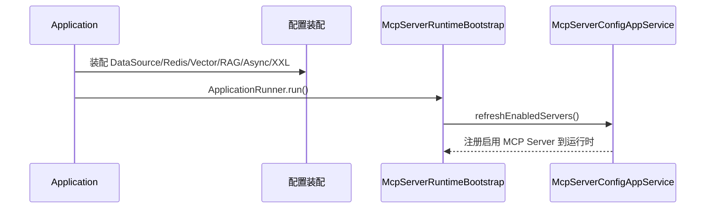
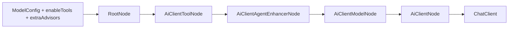
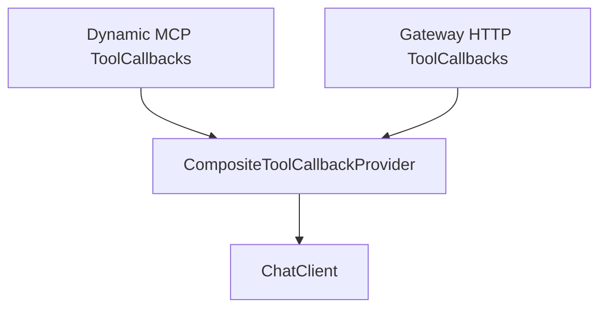
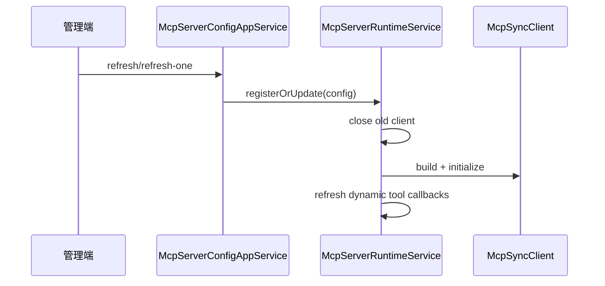
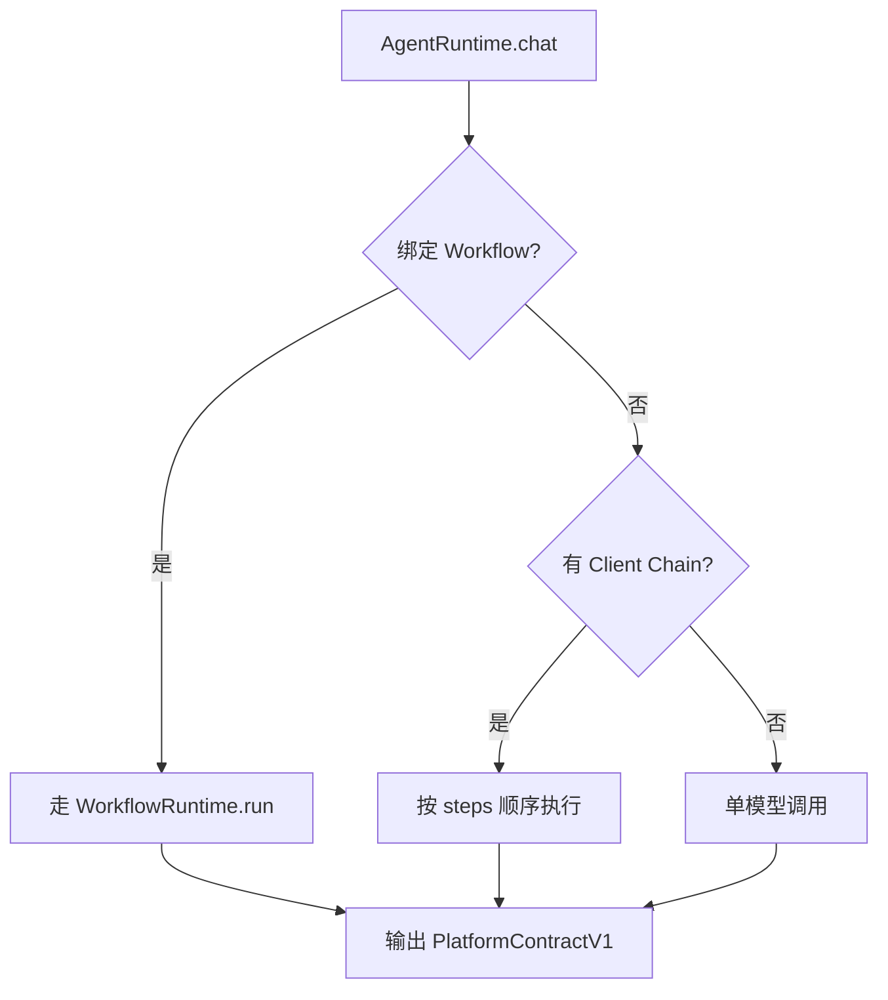
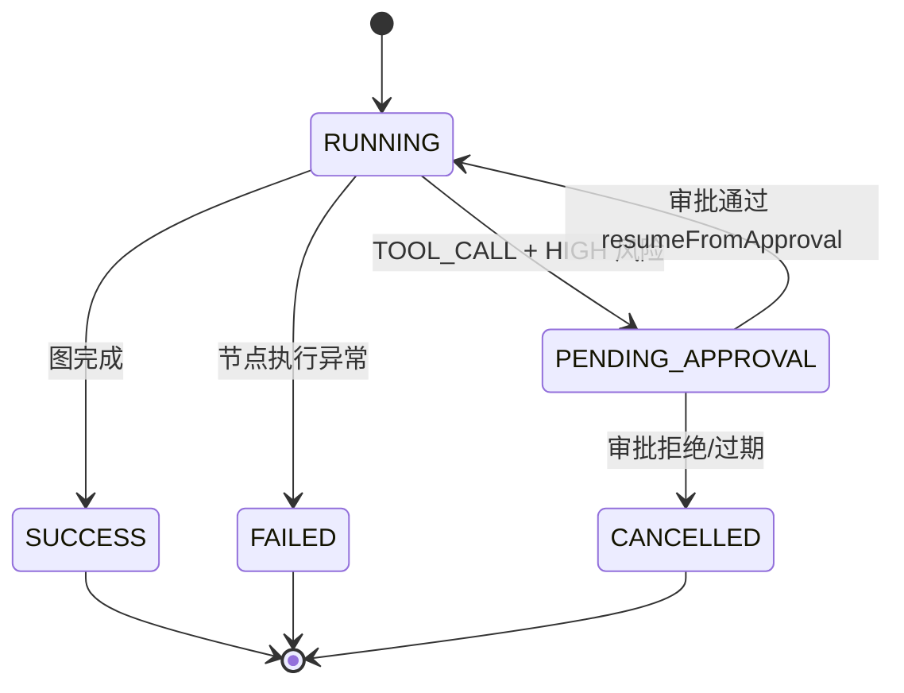
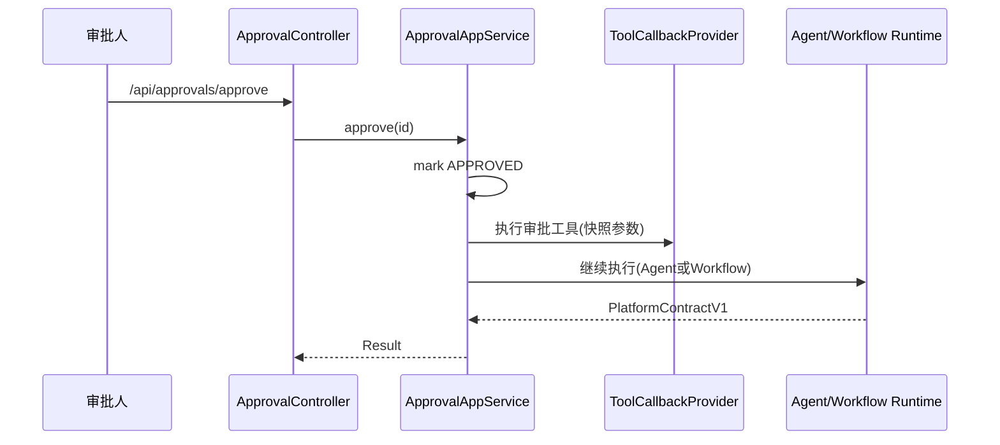
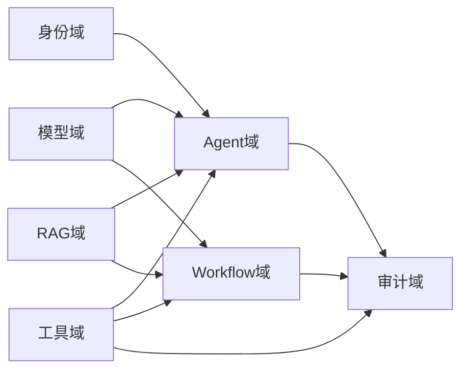

# 架构说明（详细版）

> 本文是主 README 的架构扩展文档，重点描述运行机制、关键时序、状态流转和扩展点。

## 1. 架构目标
- 以 DDD 分层承载复杂业务（模型中心、Agent、Workflow、工具治理、审批）。
- 以 Spring AI 统一模型调用与工具调用，降低多模型接入复杂度。
- 以“配置驱动 + 运行时装配”支持动态工具、动态 MCP Server、动态 AgentEnhancer。
- 以审计与 trace 贯穿关键链路，支持回放、排障、治理与合规。

## 2. 分层与包结构

```mermaid
graph TB
  subgraph Trigger[trigger 触发层]
    HTTP[http controllers]
    GW[gateway protocol handlers]
    JOB[job handlers]
    FILTER[filter/aspect/exception]
  end

  subgraph App[application 应用层]
    APP_SVC[app services]
    RUNTIME[runtime services]
    ARMORY[armory nodes]
    SUPPORT[support(preheat/rag/contract)]
  end

  subgraph Domain[domain 领域层]
    DOMAIN_MODEL[entity/valobj]
    DOMAIN_SVC[domain services]
    REPO_PORT[repository ports]
  end

  subgraph Infra[infrastructure 基础设施层]
    DAO[MyBatis DAO + XML]
    REPO_IMPL[repository impl]
    PROVIDER[model providers]
    MCP[MCP runtime/tool provider]
    GATEWAY[Gateway tool adapter]
  end

  Trigger --> App
  App --> Domain
  App --> Infra
  Infra --> Domain
```

## 3. 启动与装配

### 3.1 启动流程


### 3.2 数据源策略
- `mysqlDataSource`：业务库（MyBatis 事务主库）。
- `pgvectorDataSource`：向量库（`JdbcTemplate` + `PgVectorStore`）。
- `redis`：聊天记忆与缓存类场景。

## 4. ChatClient Armory 装配链

装配工厂：`DefaultAiClientArmoryStrategyFactory`

节点顺序：
1. `RootNode`
2. `AiClientToolNode`
3. `AiClientAgentEnhancerNode`
4. `AiClientModelNode`
5. `AiClientNode`



关键点：
- 标准装配（同模型 ID + 无额外 advisor）会进入 `ChatClient` 缓存。
- 工具回调不存在时自动降级为“无工具调用”。
- 全局 AgentEnhancer 与运行时 AgentEnhancer 合并并排序。

## 5. 工具体系（MCP + Gateway）

### 5.1 Provider 组合
`CompositeToolCallbackProvider` 为 `@Primary`，合并：
- `DynamicMcpToolCallbackProvider`（动态 MCP 工具）
- `GatewayToolCallbackProvider`（网关 HTTP 工具）



### 5.2 治理机制
- allowlist：按 `toolKey` 白名单过滤。
- 绑定过滤：支持按 `MODEL` / `SESSION` / `AGENT_VERSION` 维度控制可见性。
- 权限门禁：需 `tool:invoke`。
- 高风险审批：`riskLevel=HIGH` 触发审批单。
- 审计：工具调用成功/失败/拒绝均写审计事件。

## 6. MCP Server 运行时

运行时实现：`McpServerRuntimeServiceImpl`

支持传输：
- `STDIO`
- `SSE`
- `HTTP (streamable)`

当前限制：
- 枚举虽含 `WEBSOCKET`，运行时暂未实现。



## 7. Agent 运行模式

`AgentRuntimeAppServiceImpl` 运行分支：
- `workflowVersionId` 不为空：委托 WorkflowRuntime。
- 有 `client_profile` / `client_chain`：按链路步骤执行。
- 默认模式：单模型 prompt 执行。



## 8. Workflow DAG 运行时

运行实现：`WorkflowRuntimeAppServiceImpl`

节点类型：
- `START` `LLM` `TOOL_CALL` `RAG_RETRIEVE` `IF` `PARALLEL` `JOIN` `OUTPUT` `END`

执行特征：
- 从 START 入图，按拓扑就绪队列推进。
- 支持条件边（`TRUE/FALSE/CONDITION`）。
- 每节点写 `workflow_node_run`。
- 运行级别写 `workflow_run` + `workflow_run_context` 快照。



## 9. 审批续跑机制

审批入口：`ApprovalAppServiceImpl`

- `approve`：
  - Agent 场景：执行已审批工具 -> 注入结果 -> 继续模型生成 -> run 成功。
  - Workflow 场景：调用 `workflowRuntime.resumeFromApproval()` 从挂起节点续跑。
- `reject`：将相关 run 标记取消，context 标记过期。



## 10. Trace 与审计

### 10.1 Trace
- HTTP：`TraceIdFilter` 注入/透传 `X-Trace-Id`。
- AI 调用：`TraceIdAgentEnhancer` 保障模型调用链 trace 连续。
- 异步：`AsyncTraceConfig` + `TaskDecorator` 透传 MDC。

### 10.2 审计
- 身份与管理操作：审计事件统一入 `sys_audit_event`。
- 工具调用与审批：记录操作人、资源、结果、耗时、错误信息。

## 11. 数据域边界



## 12. 扩展建议
- 新增模型厂商：实现 `ModelProvider` 并注册到 `ModelProviderFactory`。
- 新增节点类型：在 WorkflowRuntime 增加 `executeNode` 分支并补前端编辑器配置向导。
- 新增工具来源：实现新的 `ToolCallbackProvider`，接入 `CompositeToolCallbackProvider`。
- 新增审批策略：在 tool callback 治理层扩展风险评估与审批规则。

## 13. 与主 README 的关系
- 主 README：面向使用与入门。
- 本文档：面向架构分析、二次开发、故障定位。
