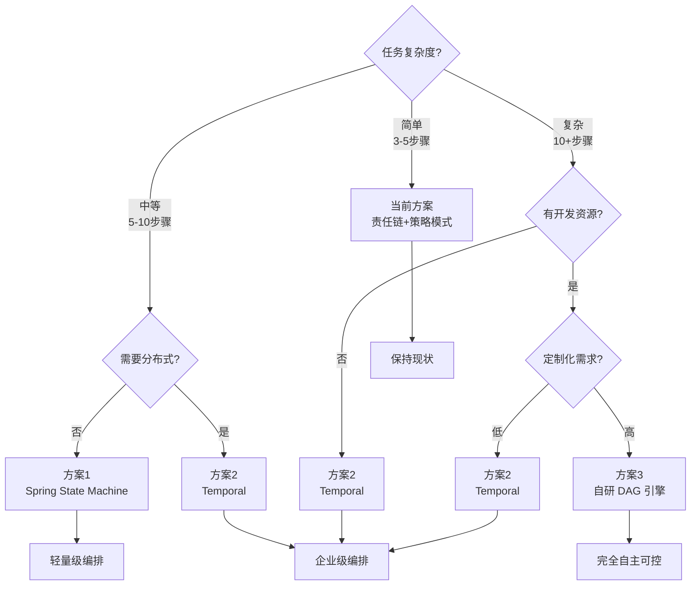
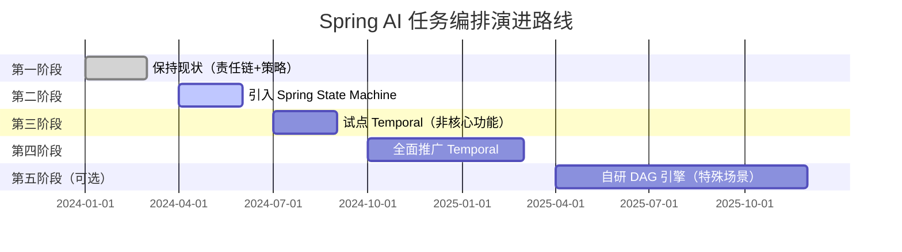
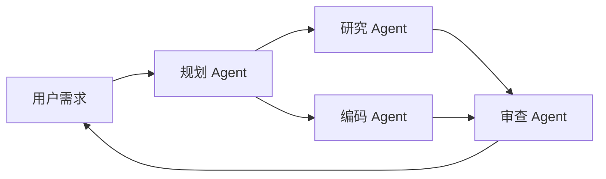
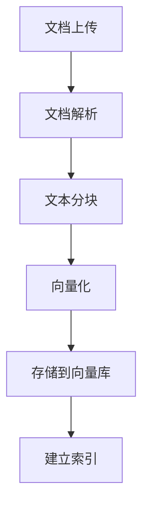
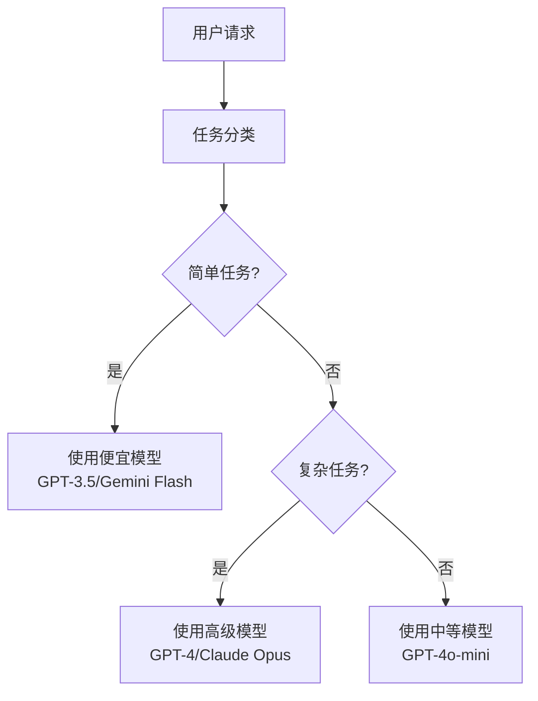
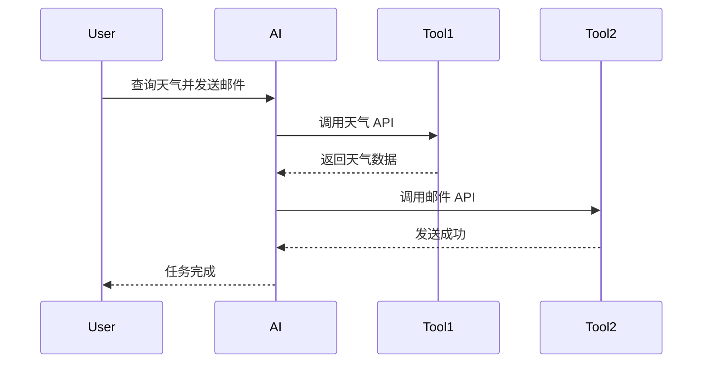

# Spring AI + 任务编排落地方案综合对比

## 一、方案对比矩阵

| 维度 | 方案 1：Spring State Machine | 方案 2：Temporal | 方案 3：自研 DAG 引擎 |
|------|---------------------------|-----------------|-------------------|
| **复杂度** | ⭐⭐ 中等 | ⭐⭐⭐ 较高 | ⭐⭐⭐⭐⭐ 极高 |
| **学习成本** | ⭐⭐ 中等 | ⭐⭐⭐ 较高 | ⭐⭐⭐⭐ 高 |
| **开发成本** | ⭐⭐ 低 | ⭐⭐ 低 | ⭐⭐⭐⭐⭐ 极高 |
| **维护成本** | ⭐⭐ 低 | ⭐⭐⭐ 中等 | ⭐⭐⭐⭐⭐ 极高 |
| **功能完整性** | ⭐⭐⭐ 中等 | ⭐⭐⭐⭐⭐ 极高 | ⭐⭐⭐⭐ 高（需开发） |
| **可扩展性** | ⭐⭐⭐ 中等 | ⭐⭐⭐⭐⭐ 极高 | ⭐⭐⭐⭐⭐ 极高 |
| **状态持久化** | ⭐⭐⭐ 需手动实现 | ⭐⭐⭐⭐⭐ 自动 | ⭐⭐⭐⭐ 需实现 |
| **分布式支持** | ⭐⭐ 弱 | ⭐⭐⭐⭐⭐ 强 | ⭐⭐⭐⭐ 需实现 |
| **可视化** | ⭐⭐ 弱 | ⭐⭐⭐⭐⭐ 强 | ⭐⭐⭐⭐ 需开发 |
| **社区支持** | ⭐⭐⭐⭐ 好 | ⭐⭐⭐⭐⭐ 极好 | ⭐ 无 |
| **生产就绪** | ⭐⭐⭐ 中等 | ⭐⭐⭐⭐⭐ 高 | ⭐⭐ 低 |

## 二、适用场景对比

## 三、推荐方案

### 🎯 推荐 1：渐进式演进路线（最佳实践）

**演进步骤**：

#### 阶段 1：保持现状（已完成）✅
- 当前的责任链 + 策略模式已经足够应对简单场景
- 继续优化现有代码，补充单元测试

#### 阶段 2：引入 Spring State Machine（3-6 个月）
**目标**：为中等复杂度任务提供状态管理能力

**实施步骤**：
1. 选择 1-2 个中等复杂度的功能试点（如 RAG 文档处理流程）
2. 引入 Spring State Machine 依赖
3. 定义状态和事件枚举
4. 实现状态机配置和监听器
5. 与现有服务集成
6. 编写测试用例
7. 上线观察

**成功标准**：
- 状态流转清晰可追踪
- 支持中断恢复
- 代码可维护性提升

#### 阶段 3：试点 Temporal（3-6 个月）
**目标**：验证 Temporal 在生产环境的可行性

**实施步骤**：
1. 部署 Temporal Server（开发环境）
2. 选择 1-2 个非核心功能试点（如批量文档处理、定时任务）
3. 实现 Workflow 和 Activity
4. 配置 Worker 节点
5. 集成到现有系统
6. 压力测试和稳定性验证
7. 上线观察

**成功标准**：
- 长时间运行任务稳定
- 状态自动持久化和恢复
- 可视化监控有效
- 性能满足要求

#### 阶段 4：全面推广 Temporal（6-12 个月）
**目标**：将核心功能迁移到 Temporal

**实施步骤**：
1. 部署 Temporal Server（生产环境，高可用）
2. 逐步迁移核心功能
3. 建立监控和告警体系
4. 编写运维文档
5. 团队培训

**成功标准**：
- 核心功能全部迁移
- 系统稳定性提升
- 开发效率提升
- 运维成本可控

#### 阶段 5：自研 DAG 引擎（可选，12+ 个月）
**目标**：应对极其复杂的定制化场景

**前提条件**：
- Temporal 无法满足特殊需求
- 有足够的开发资源
- 有明确的 ROI

**实施步骤**：
1. 需求调研和架构设计
2. MVP 开发（基础 DAG 解析和执行）
3. 状态持久化和恢复
4. 可视化编辑器
5. 分布式调度
6. 充分测试
7. 逐步推广

### 🎯 推荐 2：快速落地方案（适合时间紧迫）

**直接采用 Temporal**

**理由**：
- 功能完整，开箱即用
- 社区成熟，文档完善
- 生产就绪，稳定性高
- 节省开发时间

**实施步骤**：
1. 部署 Temporal Server（Docker Compose 快速启动）
2. 实现核心 Workflow 和 Activity
3. 集成到现有系统
4. 上线观察

**时间估算**：1-2 个月

### 🎯 推荐 3：最小成本方案（适合资源有限）

**采用 Spring State Machine**

**理由**：
- 学习成本低
- 开发成本低
- 与 Spring 生态无缝集成
- 满足中等复杂度需求

**实施步骤**：
1. 引入依赖
2. 定义状态和事件
3. 实现状态机配置
4. 集成到现有服务
5. 上线观察

**时间估算**：2-4 周

## 四、Spring AI 特有的编排场景

### 场景 1：Multi-Agent 协作

**编排需求**：
- 并行执行（研究 + 编码）
- 结果合并
- 多轮对话
- 状态持久化

**推荐方案**：Temporal（支持复杂编排）

### 场景 2：RAG Pipeline 编排

**编排需求**：
- 顺序执行
- 错误重试
- 进度跟踪
- 批量处理

**推荐方案**：Spring State Machine 或 Temporal

### 场景 3：成本优化调度

**编排需求**：
- 动态路由
- 成本统计
- 质量监控
- 自动降级

**推荐方案**：当前方案（责任链）+ Spring State Machine

### 场景 4：Tool Calling 编排

**编排需求**：
- 顺序工具调用
- 工具结果传递
- 错误处理
- 超时控制

**推荐方案**：Temporal（支持长时间运行）

## 五、具体实施建议

### 1. 短期（1-3 个月）

**目标**：优化现有代码，引入轻量级编排

**行动项**：
- [ ] 重构现有的 `ModelSelector` 和 `FallbackHandler`
- [ ] 补充单元测试和集成测试
- [ ] 引入 Spring State Machine 依赖
- [ ] 选择 1-2 个功能试点 State Machine
- [ ] 编写技术文档

### 2. 中期（3-6 个月）

**目标**：试点 Temporal，验证可行性

**行动项**：
- [ ] 部署 Temporal Server（开发环境）
- [ ] 实现 1-2 个 Workflow 试点
- [ ] 压力测试和稳定性验证
- [ ] 团队培训
- [ ] 编写最佳实践文档

### 3. 长期（6-12 个月）

**目标**：全面推广 Temporal，建立企业级编排能力

**行动项**：
- [ ] 部署 Temporal Server（生产环境，高可用）
- [ ] 迁移核心功能到 Temporal
- [ ] 建立监控和告警体系
- [ ] 编写运维文档
- [ ] 持续优化和迭代

## 六、成本收益分析

### 方案 1：Spring State Machine

**成本**：
- 开发成本：2-4 周
- 学习成本：1 周
- 维护成本：低

**收益**：
- 状态流转清晰
- 支持中断恢复
- 代码可维护性提升

**ROI**：⭐⭐⭐⭐ 高

### 方案 2：Temporal

**成本**：
- 开发成本：1-2 个月
- 学习成本：2-3 周
- 维护成本：中等
- 基础设施成本：Temporal Server 部署

**收益**：
- 自动状态持久化
- 长时间运行任务支持
- 分布式调度能力
- 可视化监控
- 开发效率大幅提升

**ROI**：⭐⭐⭐⭐⭐ 极高（生产环境）

### 方案 3：自研 DAG 引擎

**成本**：
- 开发成本：6-12 个月
- 学习成本：高
- 维护成本：极高

**收益**：
- 完全自主可控
- 高度定制化
- 可视化编排

**ROI**：⭐⭐ 低（除非有特殊需求）

## 七、风险评估

### 方案 1：Spring State Machine

**风险**：
- ⚠️ 功能有限，无法应对复杂场景
- ⚠️ 分布式支持弱

**缓解措施**：
- 仅用于中等复杂度场景
- 复杂场景使用 Temporal

### 方案 2：Temporal

**风险**：
- ⚠️ 学习曲线陡峭
- ⚠️ 部署和运维复杂
- ⚠️ 依赖外部服务

**缓解措施**：
- 充分培训
- 使用 Docker Compose 简化部署
- 建立监控和告警

### 方案 3：自研 DAG 引擎

**风险**：
- ⚠️⚠️⚠️ 开发成本极高
- ⚠️⚠️⚠️ 稳定性未知
- ⚠️⚠️ 维护成本极高

**缓解措施**：
- 充分评估 ROI
- MVP 优先
- 参考成熟开源项目

## 八、总结

### 最佳实践建议

1. **渐进式演进**：从简单到复杂，逐步引入编排能力
2. **优先使用成熟方案**：Temporal 是生产环境的最佳选择
3. **避免过度设计**：不要为了编排而编排
4. **充分测试**：编排逻辑复杂，必须有完善的测试
5. **监控和告警**：建立完善的监控体系

### 核心原则

- **简单场景**：保持现状（责任链 + 策略模式）
- **中等复杂度**：Spring State Machine
- **高复杂度**：Temporal
- **极端定制化**：自研 DAG 引擎（慎重）

### 最终推荐

**对于你的项目，我推荐采用"渐进式演进路线"**：

1. **短期**：优化现有代码，引入 Spring State Machine
2. **中期**：试点 Temporal，验证可行性
3. **长期**：全面推广 Temporal，建立企业级编排能力

这样既能快速见效，又能为未来的复杂场景做好准备。