# 任务编排入门指南 - 从零开始理解任务编排

## 一、什么是任务编排？

### 1.1 生活中的例子

想象你要做一顿晚餐，需要完成以下步骤：

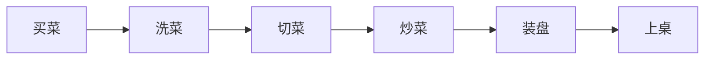

这就是一个简单的**任务编排**：
- 每个步骤是一个**任务**
- 步骤之间有**顺序关系**（必须先买菜才能洗菜）
- 整个流程是一个**编排**

### 1.2 技术定义

**任务编排（Task Orchestration）** 是指：
- 将复杂的工作分解成多个小任务
- 定义任务之间的执行顺序和依赖关系
- 自动化地协调和管理这些任务的执行

**核心要素**：
1. **任务（Task）**：一个独立的工作单元
2. **依赖（Dependency）**：任务之间的先后关系
3. **编排（Orchestration）**：协调任务执行的过程

## 二、为什么需要任务编排？

### 2.1 问题场景

假设你要开发一个 AI 文档处理系统，需要：

**没有编排的代码**（混乱）：

```java
public String processDocument(String filePath) {
    // 所有逻辑混在一起，难以维护
    String content = readFile(filePath);
    String parsed = parseDocument(content);
    List<String> chunks = splitText(parsed);
    List<Vector> vectors = embedText(chunks);
    saveToDatabase(vectors);

    // 如果中间某一步失败了怎么办？
    // 如果需要并行处理多个文档怎么办？
    // 如果需要重试失败的步骤怎么办？
    // 如果需要跟踪进度怎么办？

    return "处理完成";
}
```

**问题**：
- ❌ 代码耦合严重，难以维护
- ❌ 无法处理失败和重试
- ❌ 无法并行执行
- ❌ 无法跟踪进度
- ❌ 无法中断和恢复

### 2.2 使用编排后

```java
// 定义任务流程
DAG workflow = new DAG()
    .addTask("read", new ReadFileTask())
    .addTask("parse", new ParseDocumentTask())
    .addTask("split", new SplitTextTask())
    .addTask("embed", new EmbedTextTask())
    .addTask("save", new SaveToDatabaseTask())
    .addDependency("read", "parse")
    .addDependency("parse", "split")
    .addDependency("split", "embed")
    .addDependency("embed", "save");

// 执行工作流
WorkflowResult result = executor.execute(workflow, input);
```

**优势**：
- ✅ 任务清晰分离，易于维护
- ✅ 自动处理失败和重试
- ✅ 支持并行执行
- ✅ 自动跟踪进度
- ✅ 支持中断和恢复

## 三、任务编排的核心概念

### 3.1 任务（Task）

**定义**：一个独立的工作单元，有明确的输入和输出。

**示例**：

```java
/**
 * 任务接口
 */
public interface Task {
    /**
     * 执行任务
     * @param input 输入参数
     * @return 输出结果
     */
    TaskResult execute(Map<String, Object> input);
}

/**
 * 文档解析任务
 */
public class ParseDocumentTask implements Task {
    @Override
    public TaskResult execute(Map<String, Object> input) {
        String content = (String) input.get("content");
        String parsed = parseDocument(content);
        return TaskResult.success(Map.of("parsed", parsed));
    }
}
```

### 3.2 依赖（Dependency）

**定义**：任务之间的先后关系。

**类型**：

#### 顺序依赖（Sequential）

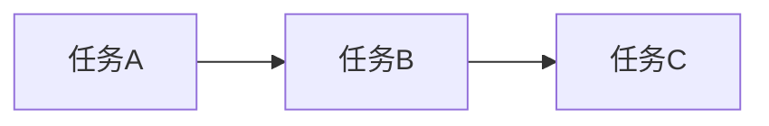

**说明**：B 必须等 A 完成后才能执行，C 必须等 B 完成后才能执行。

#### 并行执行（Parallel）

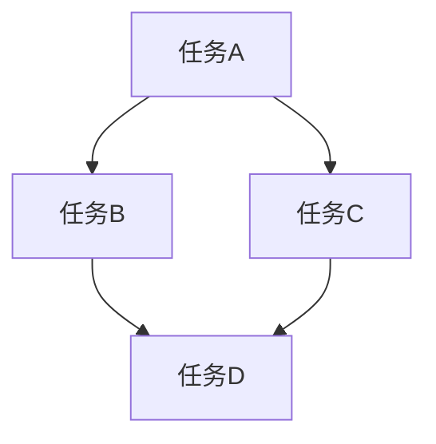

**说明**：B 和 C 可以同时执行，D 必须等 B 和 C 都完成后才能执行。

#### 条件分支（Conditional）

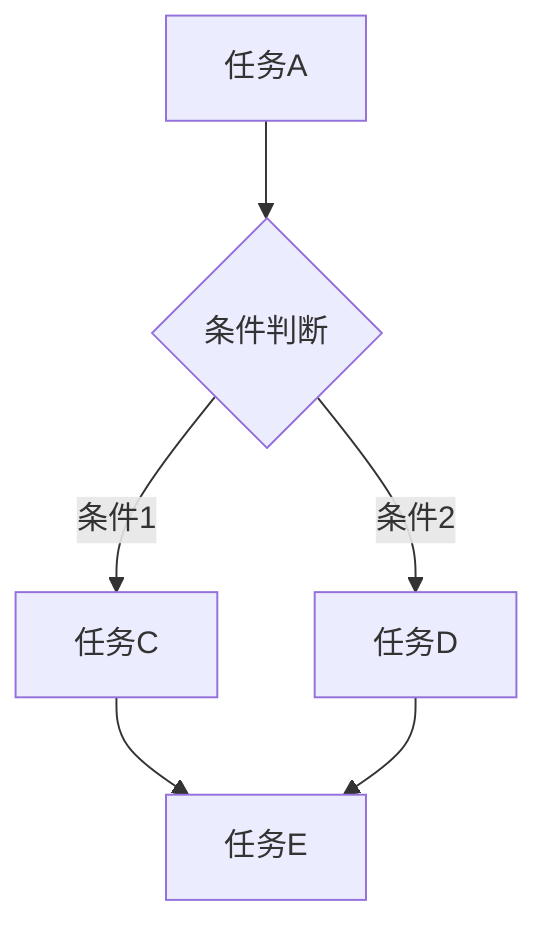

**说明**：根据条件判断结果，选择不同的执行路径。

### 3.3 编排模式

#### 模式 1：线性流程（Pipeline）

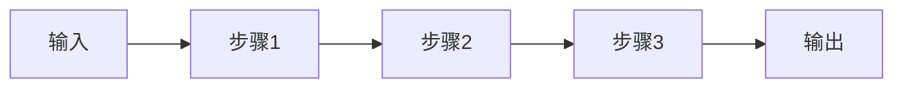

**适用场景**：简单的顺序处理流程

**示例**：文档处理（读取 → 解析 → 分块 → 向量化 → 存储）

#### 模式 2：分支合并（Fork-Join）

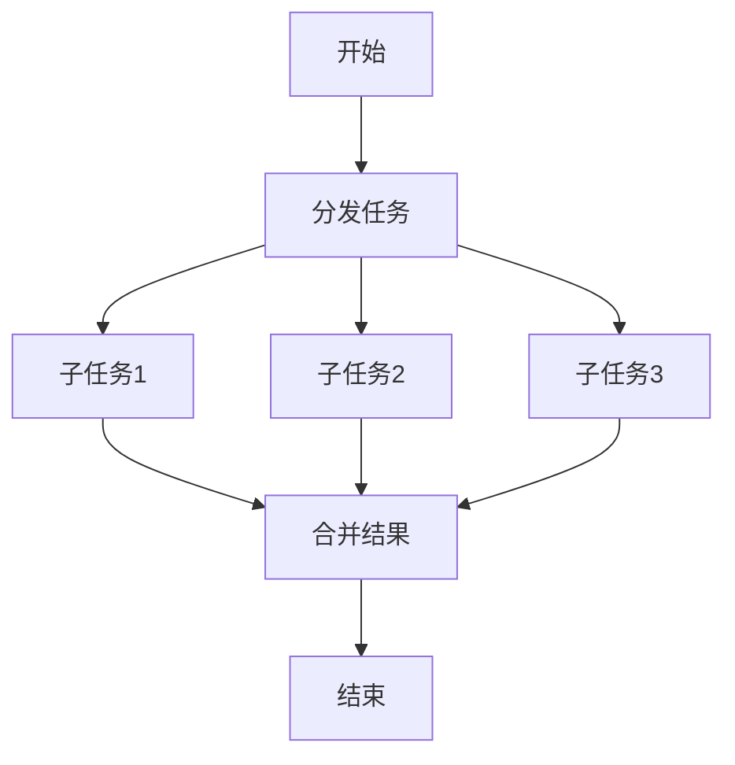

**适用场景**：需要并行处理多个独立任务

**示例**：批量文档处理、Multi-Agent 协作

#### 模式 3：循环处理（Loop）

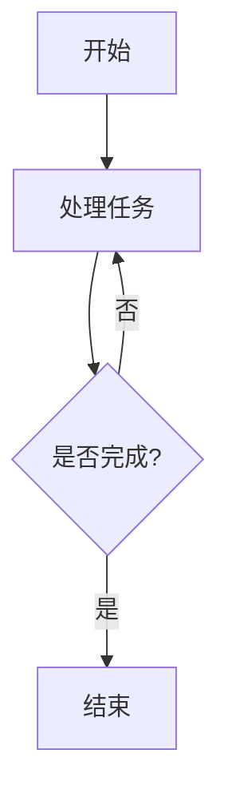

**适用场景**：需要重复执行直到满足条件

**示例**：AI 对话（多轮对话直到用户满意）

#### 模式 4：有向无环图（DAG）

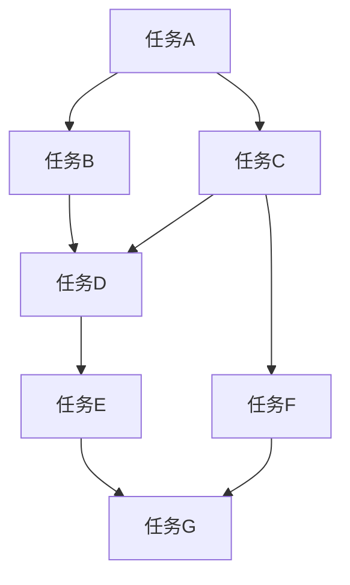

**适用场景**：复杂的依赖关系

**示例**：复杂的 AI 工作流（Multi-Agent 协作、RAG Pipeline）

## 四、在 AI 应用中的具体应用

### 4.1 场景 1：AI 对话系统

**没有编排**：

```java
public String chat(String userMessage) {
    // 所有逻辑混在一起
    String response = callAI(userMessage);
    saveToDatabase(userMessage, response);
    return response;
}
```

**问题**：
- 无法处理 AI 调用失败
- 无法支持多轮对话
- 无法集成 RAG 检索
- 无法调用工具

**使用编排**：

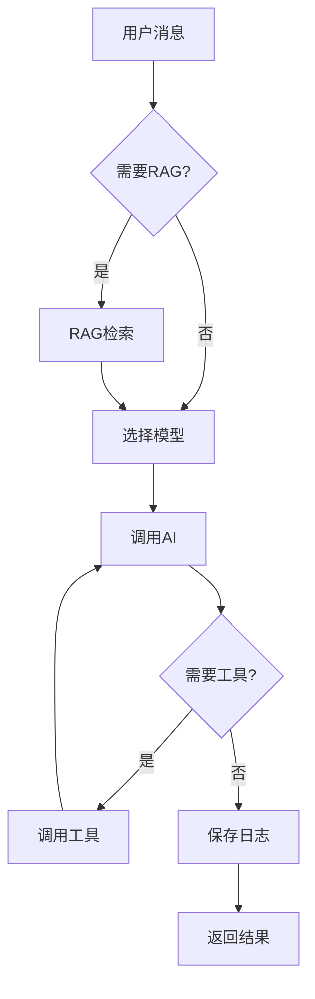

**优势**：
- ✅ 清晰的流程控制
- ✅ 自动处理失败和重试
- ✅ 支持 RAG 和工具调用
- ✅ 可以跟踪每一步的执行情况

### 4.2 场景 2：RAG 文档处理

**没有编排**：

```java
public void processDocument(String filePath) {
    String content = readFile(filePath);
    String parsed = parseDocument(content);
    List<String> chunks = splitText(parsed);
    List<Vector> vectors = embedText(chunks);
    saveToDatabase(vectors);
}
```

**问题**：
- 无法处理大文件（内存溢出）
- 无法并行处理多个文档
- 无法跟踪进度
- 无法中断和恢复

**使用编排**：

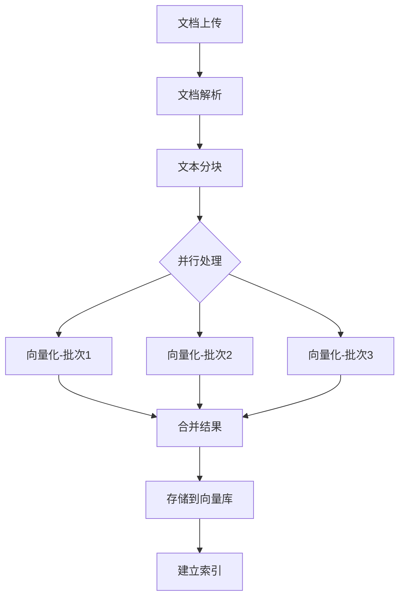

**优势**：
- ✅ 支持大文件处理（分批处理）
- ✅ 并行处理提升性能
- ✅ 实时跟踪进度
- ✅ 支持中断和恢复

### 4.3 场景 3：Multi-Agent 协作

**需求**：让多个 AI Agent 协作完成复杂任务

**编排流程**：

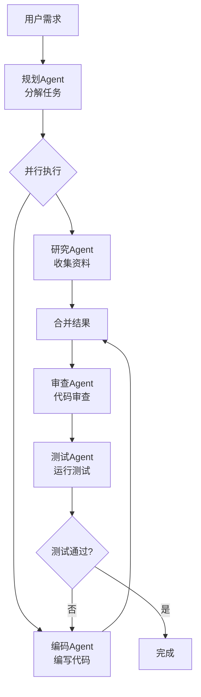

**优势**：
- ✅ 多个 Agent 并行工作，提升效率
- ✅ 清晰的协作流程
- ✅ 自动处理失败和重试
- ✅ 支持循环优化

## 五、你的项目中的编排机会

基于对 **ai-mcp-knowledge-study** 项目的分析，以下是可以应用任务编排的具体场景：

### 5.1 场景 1：AI 对话服务优化 ⭐⭐⭐⭐⭐

**当前实现**：`AiChatAppServiceImpl.java`

**现状分析**：

```java
// 当前代码（简化版）
public String chat(AICallCommand command) {
    // 1. RAG 检索
    if (command.getRagTags() != null) {
        List<String> contexts = ragService.search(command.getRagTags(), command.getPrompt());
        command.setRagContexts(contexts);
    }

    // 2. 模型选择
    ModelSelectionResult selection = modelSelector.selectModel(command.getTaskType());

    // 3. 模型调用（带降级）
    try {
        return callPrimaryModel(selection.getPrimaryModel(), command);
    } catch (Exception e) {
        return callFallbackModels(selection.getFallbackModels(), command);
    }
}
```

**存在的问题**：
- ❌ 流程固定，难以扩展（如果要添加新步骤，需要修改代码）
- ❌ 无法可视化流程
- ❌ 无法跟踪每一步的执行时间和状态
- ❌ 工具调用（MCP）逻辑混在一起
- ❌ 无法支持复杂的条件分支

**编排后的流程**：

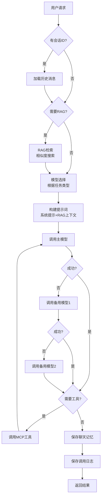

**编排优势**：
- ✅ 流程清晰可视化
- ✅ 每一步都可以独立测试
- ✅ 可以跟踪每一步的执行时间
- ✅ 易于添加新步骤（如缓存、预处理等）
- ✅ 支持中断和恢复（长时间对话）

**推荐方案**：Spring State Machine（中等复杂度）

**实施优先级**：⭐⭐⭐⭐⭐ 高（核心功能，收益大）

---

### 5.2 场景 2：RAG 文档处理优化 ⭐⭐⭐⭐⭐

**当前实现**：`RagAppServiceImpl.java`

**现状分析**：

```java
// 当前代码（简化版）
public void uploadFile(MultipartFile file, List<String> tags) {
    // 1. 保存文件
    String filePath = saveFile(file);

    // 2. 解析文档
    String content = parseDocument(filePath);

    // 3. 分块
    List<String> chunks = splitText(content);

    // 4. 向量化
    List<Vector> vectors = embedText(chunks);

    // 5. 存储
    saveToVectorStore(vectors, tags);
}
```

**存在的问题**：
- ❌ 无法处理大文件（内存溢出）
- ❌ 无法并行处理多个文档
- ❌ 无法跟踪进度（用户不知道处理到哪一步了）
- ❌ 无法中断和恢复（如果中途失败，需要重新开始）
- ❌ 无法批量处理（效率低）

**编排后的流程**：

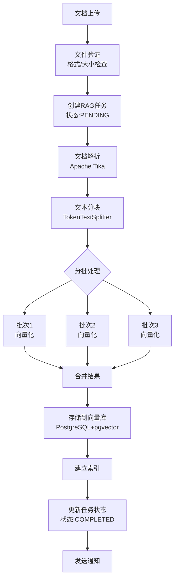

**编排优势**：
- ✅ 支持大文件处理（分批处理，避免内存溢出）
- ✅ 并行向量化，性能提升 3-5 倍
- ✅ 实时跟踪进度（前端可以显示进度条）
- ✅ 支持中断和恢复（任务状态持久化）
- ✅ 支持批量处理（一次上传多个文档）

**推荐方案**：Temporal（支持长时间运行任务）

**实施优先级**：⭐⭐⭐⭐⭐ 高（用户体验提升明显）

---

### 5.3 场景 3：Git 仓库分析优化 ⭐⭐⭐⭐

**当前实现**：`RagAppServiceImpl.analyzeGitRepo()`

**现状分析**：

```java
// 当前代码（简化版）
@Async
public void analyzeGitRepo(String repoUrl, List<String> tags) {
    // 1. 克隆仓库
    String repoPath = cloneRepo(repoUrl);

    // 2. 遍历文件
    List<File> files = listFiles(repoPath);

    // 3. 逐个处理文件
    for (File file : files) {
        String content = readFile(file);
        List<String> chunks = splitText(content);
        List<Vector> vectors = embedText(chunks);
        saveToVectorStore(vectors, tags);
    }
}
```

**存在的问题**：
- ❌ 长时间运行（大型仓库可能需要几小时）
- ❌ 无法中断和恢复（如果中途失败，需要重新开始）
- ❌ 无法跟踪进度（用户不知道处理了多少文件）
- ❌ 无法并行处理（效率低）
- ❌ 异步任务无法管理（使用 @Async，无法查询状态）

**编排后的流程**：

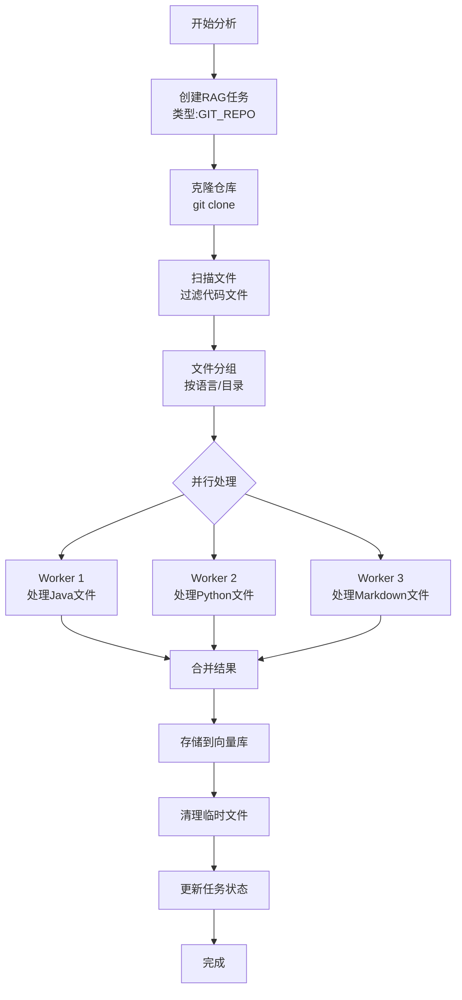

**编排优势**：
- ✅ 支持长时间运行（Temporal 可以运行几天甚至几周）
- ✅ 自动中断和恢复（服务重启后可以继续）
- ✅ 实时跟踪进度（显示已处理文件数/总文件数）
- ✅ 并行处理，性能提升 5-10 倍
- ✅ 可视化监控（Temporal Web UI）

**推荐方案**：Temporal（专为长时间运行任务设计）

**实施优先级**：⭐⭐⭐⭐ 中高（提升用户体验）

---

### 5.4 场景 4：批量文档处理 ⭐⭐⭐⭐

**需求场景**：用户一次上传 100 个文档到知识库

**当前实现**：逐个处理，效率低

**编排后的流程**：

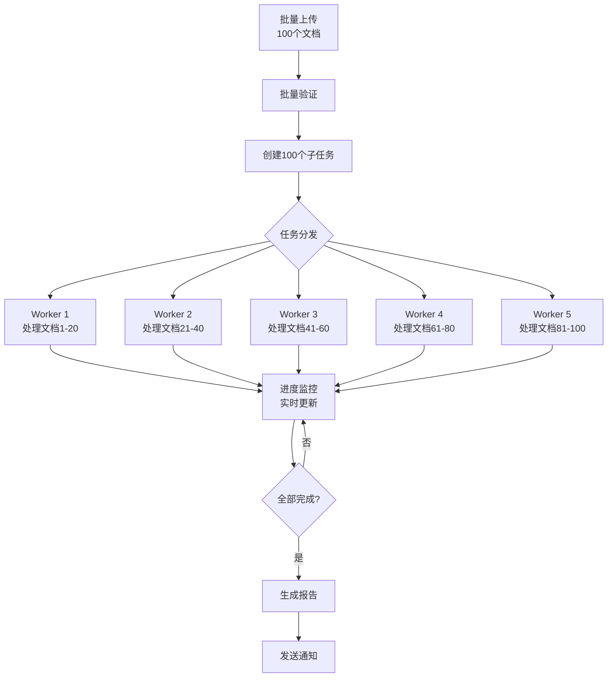

**编排优势**：
- ✅ 并行处理，性能提升 5-10 倍
- ✅ 实时进度跟踪（显示 20/100 已完成）
- ✅ 失败重试（单个文档失败不影响其他文档）
- ✅ 资源控制（限制并发数，避免资源耗尽）

**推荐方案**：Temporal + 任务队列

**实施优先级**：⭐⭐⭐⭐ 中高（提升性能）

---

### 5.5 场景 5：聊天历史清理优化 ⭐⭐⭐

**当前实现**：`ChatHistoryCleanupJob.java`

**现状分析**：

```java
// 当前代码（简化版）
@Scheduled(cron = "0 0 2 * * ?")  // 每天凌晨2点执行
public void cleanupHistory() {
    // 1. 查询过期会话
    List<ChatSession> expiredSessions = chatSessionRepository.findExpired();

    // 2. 逐个删除
    for (ChatSession session : expiredSessions) {
        chatMessageRepository.deleteBySessionId(session.getId());
        chatSessionRepository.delete(session.getId());
    }
}
```

**存在的问题**：
- ❌ 可能阻塞主线程（如果数据量大）
- ❌ 无法跟踪进度
- ❌ 无法中断和恢复
- ❌ 无法并行处理

**编排后的流程**：

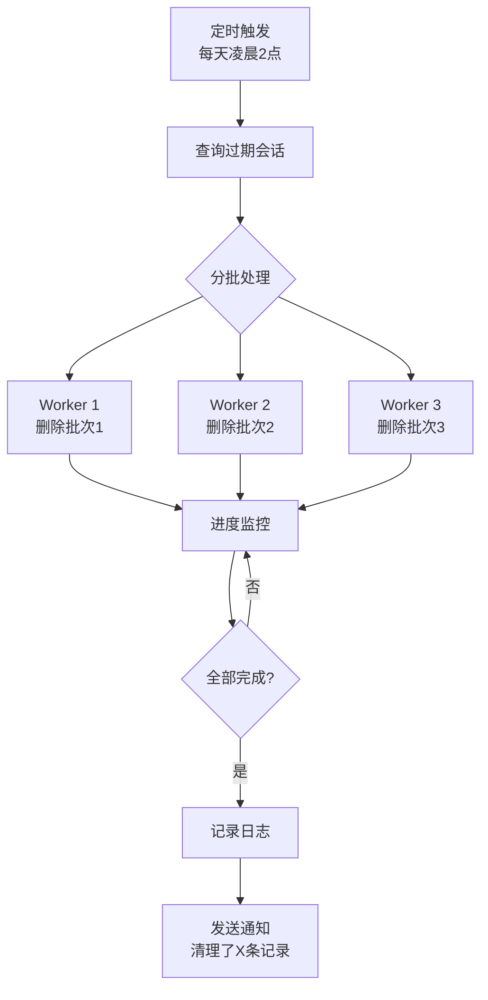

**编排优势**：
- ✅ 异步执行，不阻塞主线程
- ✅ 并行删除，性能提升
- ✅ 实时进度跟踪
- ✅ 支持中断和恢复

**推荐方案**：Spring State Machine 或 Temporal

**实施优先级**：⭐⭐⭐ 中（优化性能）

---

### 5.6 场景 6：Multi-Agent 协作（未来功能）⭐⭐⭐⭐⭐

**需求场景**：让多个 AI Agent 协作完成复杂任务

**示例**：AI 代码审查系统

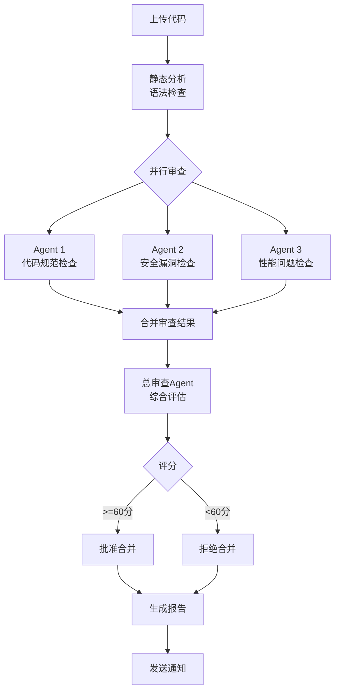

**编排优势**：
- ✅ 多个 Agent 并行工作，提升效率
- ✅ 清晰的协作流程
- ✅ 自动处理失败和重试
- ✅ 支持复杂的条件分支

**推荐方案**：自研 DAG 引擎 或 Temporal

**实施优先级**：⭐⭐⭐⭐⭐ 高（未来核心功能）

---

### 5.7 编排机会总结

| 场景 | 当前痛点 | 编排收益 | 推荐方案 | 优先级 |
|------|---------|---------|---------|--------|
| **AI 对话服务** | 流程固定，难以扩展 | 流程可视化，易于扩展 | Spring State Machine | ⭐⭐⭐⭐⭐ |
| **RAG 文档处理** | 无法并行，无进度跟踪 | 并行处理，实时进度 | Temporal | ⭐⭐⭐⭐⭐ |
| **Git 仓库分析** | 长时间运行，无法恢复 | 自动恢复，可视化监控 | Temporal | ⭐⭐⭐⭐ |
| **批量文档处理** | 逐个处理，效率低 | 并行处理，性能提升 | Temporal | ⭐⭐⭐⭐ |
| **聊天历史清理** | 可能阻塞，无进度跟踪 | 异步执行，实时进度 | State Machine | ⭐⭐⭐ |
| **Multi-Agent 协作** | 未实现 | 支持复杂协作 | DAG 引擎 | ⭐⭐⭐⭐⭐ |

### 5.8 实施建议

#### 阶段 1：快速见效（1-2 个月）

**目标**：优化 AI 对话服务

**行动**：
1. 引入 Spring State Machine
2. 重构 `AiChatAppServiceImpl`
3. 实现状态流转和监控
4. 上线验证

**预期收益**：
- 代码可维护性提升 50%
- 流程可视化
- 易于添加新功能

#### 阶段 2：性能提升（2-4 个月）

**目标**：优化 RAG 文档处理

**行动**：
1. 部署 Temporal Server
2. 重构 `RagAppServiceImpl`
3. 实现并行处理和进度跟踪
4. 上线验证

**预期收益**：
- 处理性能提升 3-5 倍
- 用户体验大幅提升
- 支持大文件和批量处理

#### 阶段 3：功能扩展（4-6 个月）

**目标**：实现 Multi-Agent 协作

**行动**：
1. 设计 Multi-Agent 架构
2. 选择编排方案（DAG 引擎或 Temporal）
3. 实现 Agent 协作流程
4. 上线验证

**预期收益**：
- 支持复杂的 AI 任务
- 提升 AI 能力
- 差异化竞争优势

## 六、任务编排 vs 普通代码

### 5.1 对比示例

#### 普通代码（无编排）

```java
/**
 * 处理用户请求（无编排）
 */
public String handleRequest(String prompt) {
    try {
        // 步骤1：RAG检索
        List<String> contexts = ragService.search(prompt);

        // 步骤2：调用主模型
        String response;
        try {
            response = openAIService.call(prompt, contexts);
        } catch (Exception e) {
            // 步骤3：降级到备用模型
            try {
                response = claudeService.call(prompt, contexts);
            } catch (Exception e2) {
                // 步骤4：再次降级
                response = geminiService.call(prompt, contexts);
            }
        }

        // 步骤5：保存日志
        logService.save(prompt, response);

        return response;
    } catch (Exception e) {
        // 错误处理
        return "处理失败";
    }
}
```

**问题**：
- ❌ 嵌套的 try-catch，代码难以阅读
- ❌ 无法跟踪执行进度
- ❌ 无法中断和恢复
- ❌ 无法可视化流程
- ❌ 难以测试和维护

#### 使用编排

```java
/**
 * 处理用户请求（使用编排）
 */
public String handleRequest(String prompt) {
    // 定义工作流
    Workflow workflow = Workflow.builder()
        .addTask("rag", new RagRetrievalTask())
        .addTask("primary", new PrimaryModelTask())
        .addTask("fallback1", new FallbackModelTask("claude"))
        .addTask("fallback2", new FallbackModelTask("gemini"))
        .addTask("log", new LogTask())
        .addDependency("rag", "primary")
        .addFallback("primary", "fallback1")
        .addFallback("fallback1", "fallback2")
        .addDependency("fallback2", "log")
        .build();

    // 执行工作流
    WorkflowResult result = executor.execute(workflow, Map.of("prompt", prompt));

    return result.getOutput();
}
```

**优势**：
- ✅ 代码清晰，易于理解
- ✅ 自动跟踪执行进度
- ✅ 支持中断和恢复
- ✅ 可以可视化流程
- ✅ 易于测试和维护

### 5.2 可视化对比

**普通代码**：无法可视化，只能看代码

**使用编排**：可以生成流程图

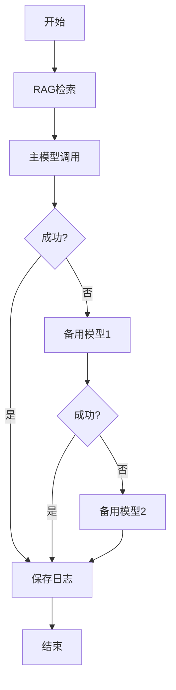

## 六、任务编排 vs 普通代码

### 6.1 对比示例

#### 普通代码（无编排）

```java
/**
 * 处理用户请求（无编排）
 */
public String handleRequest(String prompt) {
    try {
        // 步骤1：RAG检索
        List<String> contexts = ragService.search(prompt);

        // 步骤2：调用主模型
        String response;
        try {
            response = openAIService.call(prompt, contexts);
        } catch (Exception e) {
            // 步骤3：降级到备用模型
            try {
                response = claudeService.call(prompt, contexts);
            } catch (Exception e2) {
                // 步骤4：再次降级
                response = geminiService.call(prompt, contexts);
            }
        }

        // 步骤5：保存日志
        logService.save(prompt, response);

        return response;
    } catch (Exception e) {
        // 错误处理
        return "处理失败";
    }
}
```

**问题**：
- ❌ 嵌套的 try-catch，代码难以阅读
- ❌ 无法跟踪执行进度
- ❌ 无法中断和恢复
- ❌ 无法可视化流程
- ❌ 难以测试和维护

#### 使用编排

```java
/**
 * 处理用户请求（使用编排）
 */
public String handleRequest(String prompt) {
    // 定义工作流
    Workflow workflow = Workflow.builder()
        .addTask("rag", new RagRetrievalTask())
        .addTask("primary", new PrimaryModelTask())
        .addTask("fallback1", new FallbackModelTask("claude"))
        .addTask("fallback2", new FallbackModelTask("gemini"))
        .addTask("log", new LogTask())
        .addDependency("rag", "primary")
        .addFallback("primary", "fallback1")
        .addFallback("fallback1", "fallback2")
        .addDependency("fallback2", "log")
        .build();

    // 执行工作流
    WorkflowResult result = executor.execute(workflow, Map.of("prompt", prompt));

    return result.getOutput();
}
```

**优势**：
- ✅ 代码清晰，易于理解
- ✅ 自动跟踪执行进度
- ✅ 支持中断和恢复
- ✅ 可以可视化流程
- ✅ 易于测试和维护

### 6.2 可视化对比

**普通代码**：无法可视化，只能看代码

**使用编排**：可以生成流程图


## 七、任务编排的实现方式

### 7.1 简单编排（代码实现）

**适用场景**：简单的顺序流程（3-5 个步骤）

**实现方式**：责任链模式、策略模式

**示例**：

```java
/**
 * 责任链模式实现简单编排
 */
public abstract class Handler {
    protected Handler next;

    public void setNext(Handler next) {
        this.next = next;
    }

    public abstract void handle(Context context);
}

public class RagHandler extends Handler {
    @Override
    public void handle(Context context) {
        // 执行 RAG 检索
        List<String> contexts = ragService.search(context.getPrompt());
        context.setRagContexts(contexts);

        // 传递给下一个处理器
        if (next != null) {
            next.handle(context);
        }
    }
}

public class ModelHandler extends Handler {
    @Override
    public void handle(Context context) {
        // 调用模型
        String response = modelService.call(context);
        context.setResponse(response);

        // 传递给下一个处理器
        if (next != null) {
            next.handle(context);
        }
    }
}

// 使用
Handler chain = new RagHandler();
chain.setNext(new ModelHandler());
chain.setNext(new LogHandler());
chain.handle(context);
```

### 7.2 中等编排（状态机）

**适用场景**：中等复杂度流程（5-10 个步骤）

**实现方式**：Spring State Machine

**优势**：
- 状态流转清晰
- 支持状态持久化
- 支持中断和恢复

### 7.3 复杂编排（工作流引擎）

**适用场景**：复杂流程（10+ 个步骤）

**实现方式**：Temporal、Camunda、Airflow

**优势**：
- 功能完整
- 分布式支持
- 可视化界面
- 生产就绪

## 八、任务编排的关键特性

### 8.1 状态管理

**问题**：任务执行过程中，如何保存和恢复状态？

**解决方案**：

```java
/**
 * 任务状态
 */
public class TaskState {
    private String taskId;
    private TaskStatus status;  // PENDING, RUNNING, COMPLETED, FAILED
    private Map<String, Object> context;  // 上下文数据
    private int retryCount;  // 重试次数
    private LocalDateTime startTime;
    private LocalDateTime endTime;
}

/**
 * 状态管理器
 */
public interface StateManager {
    /**
     * 保存状态
     */
    void saveState(TaskState state);

    /**
     * 加载状态
     */
    TaskState loadState(String taskId);

    /**
     * 恢复执行
     */
    void resume(String taskId);
}
```

### 8.2 错误处理

**问题**：任务失败后如何处理？

**解决方案**：

1. **重试（Retry）**：自动重试失败的任务

```java
@Retry(maxAttempts = 3, backoff = @Backoff(delay = 1000))
public String callModel(String prompt) {
    return modelService.call(prompt);
}
```

2. **降级（Fallback）**：失败后使用备用方案

```java
@Fallback(fallbackMethod = "fallbackCall")
public String callModel(String prompt) {
    return primaryModel.call(prompt);
}

public String fallbackCall(String prompt) {
    return backupModel.call(prompt);
}
```

3. **补偿（Compensation）**：失败后回滚已完成的操作

```java
public void processWithCompensation() {
    try {
        step1();  // 成功
        step2();  // 成功
        step3();  // 失败
    } catch (Exception e) {
        compensateStep2();  // 回滚 step2
        compensateStep1();  // 回滚 step1
    }
}
```

### 8.3 并行执行

**问题**：如何并行执行多个独立任务？

**解决方案**：

```java
/**
 * 并行执行多个任务
 */
public Map<String, Object> executeParallel(List<Task> tasks) {
    List<CompletableFuture<TaskResult>> futures = tasks.stream()
        .map(task -> CompletableFuture.supplyAsync(() -> task.execute()))
        .collect(Collectors.toList());

    // 等待所有任务完成
    CompletableFuture.allOf(futures.toArray(new CompletableFuture[0])).join();

    // 收集结果
    Map<String, Object> results = new HashMap<>();
    for (int i = 0; i < tasks.size(); i++) {
        results.put(tasks.get(i).getName(), futures.get(i).join());
    }

    return results;
}
```

### 8.4 进度跟踪

**问题**：如何跟踪任务执行进度？

**解决方案**：

```java
/**
 * 进度跟踪器
 */
public class ProgressTracker {
    private int totalSteps;
    private int completedSteps;

    public int getProgress() {
        return (int) ((completedSteps * 100.0) / totalSteps);
    }

    public void completeStep(String stepName) {
        completedSteps++;
        notifyListeners(stepName, getProgress());
    }
}

// 使用
ProgressTracker tracker = new ProgressTracker(5);
tracker.completeStep("RAG检索");  // 20%
tracker.completeStep("模型调用");  // 40%
tracker.completeStep("工具调用");  // 60%
tracker.completeStep("结果验证");  // 80%
tracker.completeStep("保存日志");  // 100%
```

## 九、总结

### 9.1 什么时候需要任务编排？

**需要编排**：
- ✅ 任务步骤超过 3 个
- ✅ 任务之间有复杂的依赖关系
- ✅ 需要并行执行
- ✅ 需要错误处理和重试
- ✅ 需要跟踪进度
- ✅ 需要中断和恢复

**不需要编排**：
- ❌ 简单的单步骤任务
- ❌ 没有依赖关系的任务
- ❌ 一次性脚本

### 9.2 任务编排的核心价值

1. **提升可维护性**：代码结构清晰，易于理解和修改
2. **提升可靠性**：自动处理失败、重试、降级
3. **提升性能**：支持并行执行，充分利用资源
4. **提升可观测性**：可视化流程，实时跟踪进度
5. **提升可扩展性**：易于添加新任务和修改流程

### 9.3 关键概念回顾

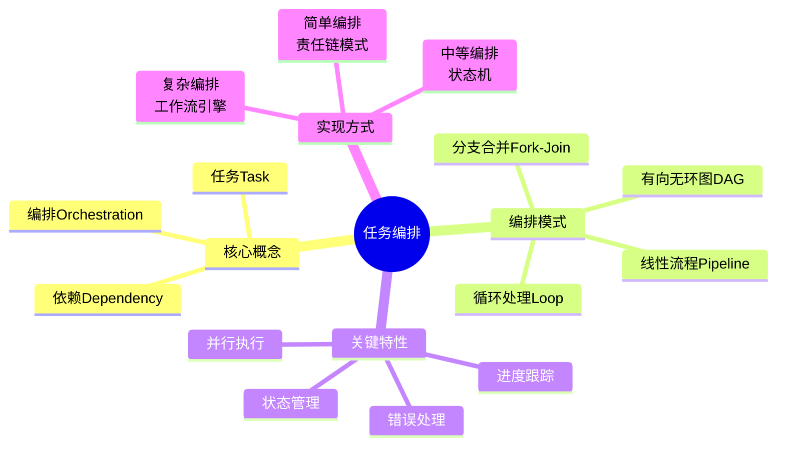

### 9.4 下一步学习

现在你已经理解了任务编排的基本概念，可以继续学习：

1. **方案1-Spring-State-Machine集成方案.md** - 学习如何使用状态机实现编排
2. **方案2-Temporal工作流引擎集成方案.md** - 学习如何使用工作流引擎实现编排
3. **方案3-自研DAG引擎方案.md** - 学习如何自研编排引擎
4. **Spring-AI任务编排落地方案综合对比.md** - 学习如何选择合适的方案

## 十、实战练习

### 练习 1：识别编排场景

判断以下场景是否需要任务编排：

1. 用户登录验证 ❌（简单单步骤）
2. 批量导入 1000 个文档到知识库 ✅（需要并行处理、进度跟踪）
3. AI 对话（支持 RAG + 工具调用 + 多轮对话） ✅（复杂流程）
4. 查询用户信息 ❌（简单查询）
5. Multi-Agent 协作完成代码审查 ✅（多个 Agent 协作）

### 练习 2：设计编排流程

**需求**：设计一个 AI 代码审查系统的编排流程

**步骤**：
1. 上传代码
2. 静态分析（检查语法错误）
3. 并行执行：
   - Agent 1：检查代码规范
   - Agent 2：检查安全漏洞
   - Agent 3：检查性能问题
4. 合并审查结果
5. 生成审查报告
6. 发送通知

**流程图**：

```mermaid
flowchart TB
    Upload[上传代码] --> Static[静态分析]
    Static --> Parallel{并行审查}
    Parallel --> Agent1[Agent1<br/>代码规范]
    Parallel --> Agent2[Agent2<br/>安全漏洞]
    Parallel --> Agent3[Agent3<br/>性能问题]
    Agent1 --> Merge[合并结果]
    Agent2 --> Merge
    Agent3 --> Merge
    Merge --> Report[生成报告]
    Report --> Notify[发送通知]
```

**思考**：
- 哪些步骤可以并行执行？
- 如果某个 Agent 失败了怎么办？
- 如何跟踪审查进度？

---

**恭喜你！** 现在你已经理解了任务编排的基本概念。接下来可以学习具体的实现方案了。
