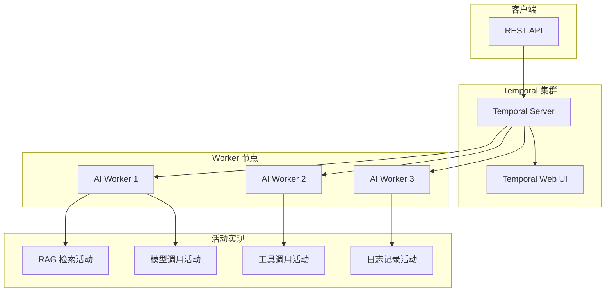

# 方案 2：Temporal 工作流引擎集成方案

## 一、方案概述

Temporal 是一个开源的分布式工作流编排引擎，特别适合长时间运行的 AI 任务。

**核心优势**：
- ✅ 自动状态持久化和恢复
- ✅ 支持长时间运行任务（天/周/月级别）
- ✅ 内置重试、超时、补偿机制
- ✅ 可视化工作流界面
- ✅ 支持分布式部署

## 二、架构设计



## 三、依赖引入

```xml
<dependency>
    <groupId>io.temporal</groupId>
    <artifactId>temporal-sdk</artifactId>
    <version>1.20.0</version>
</dependency>
<dependency>
    <groupId>io.temporal</groupId>
    <artifactId>temporal-spring-boot-starter-alpha</artifactId>
    <version>1.20.0</version>
</dependency>
```

## 四、工作流定义

```java
/**
 * AI 任务工作流接口
 * @author xiexu
 */
@WorkflowInterface
public interface AiTaskWorkflow {

    /**
     * 执行 AI 任务
     * @param request 任务请求
     * @return 任务结果
     */
    @WorkflowMethod
    AiTaskResult execute(AiTaskRequest request);

    /**
     * 查询任务进度
     * @return 进度百分比
     */
    @QueryMethod
    int getProgress();

    /**
     * 取消任务
     */
    @SignalMethod
    void cancel();
}
```

## 五、工作流实现

```java
/**
 * AI 任务工作流实现
 * @author xiexu
 */
@Slf4j
public class AiTaskWorkflowImpl implements AiTaskWorkflow {

    // 活动存根（Temporal 会自动注入）
    private final AiTaskActivities activities = Workflow.newActivityStub(
        AiTaskActivities.class,
        ActivityOptions.newBuilder()
            .setStartToCloseTimeout(Duration.ofMinutes(5))
            .setRetryOptions(RetryOptions.newBuilder()
                .setMaximumAttempts(3)
                .setBackoffCoefficient(2.0)
                .build())
            .build()
    );

    private int progress = 0;
    private boolean cancelled = false;

    @Override
    public AiTaskResult execute(AiTaskRequest request) {
        log.info("开始执行 AI 任务: {}", request.getTaskId());

        try {
            // 1. RAG 检索（如果需要）
            List<String> ragContexts = null;
            if (request.getRagTags() != null && !request.getRagTags().isEmpty()) {
                progress = 10;
                ragContexts = activities.performRagRetrieval(request.getRagTags(), request.getPrompt());
                checkCancellation();
            }

            // 2. 模型选择
            progress = 20;
            ModelSelectionResult selection = activities.selectModel(request.getTaskType());
            checkCancellation();

            // 3. 主模型调用
            progress = 40;
            String result;
            try {
                result = activities.callPrimaryModel(
                    selection.getPrimaryModel(),
                    request.getPrompt(),
                    ragContexts
                );
                progress = 60;
            } catch (Exception e) {
                log.error("主模型调用失败，尝试备用模型", e);

                // 4. 备用模型降级
                result = activities.callFallbackModels(
                    selection.getFallbackModels(),
                    request.getPrompt(),
                    ragContexts
                );
                progress = 60;
            }
            checkCancellation();

            // 5. 工具调用（如果需要）
            if (needsToolCalling(result)) {
                progress = 70;
                result = activities.performToolCalling(result);
                checkCancellation();
            }

            // 6. 结果验证
            progress = 80;
            activities.validateResult(result);
            checkCancellation();

            // 7. 日志记录
            progress = 90;
            activities.logCallResult(request.getTaskId(), result);

            progress = 100;
            return AiTaskResult.success(result);

        } catch (Exception e) {
            log.error("AI 任务执行失败", e);
            activities.logCallFailure(request.getTaskId(), e.getMessage());
            return AiTaskResult.failure(e.getMessage());
        }
    }

    @Override
    public int getProgress() {
        return progress;
    }

    @Override
    public void cancel() {
        log.info("收到取消信号");
        cancelled = true;
    }

    private void checkCancellation() {
        if (cancelled) {
            throw new CancellationException("任务已取消");
        }
    }

    private boolean needsToolCalling(String result) {
        // 判断是否需要工具调用（例如检查响应中是否包含工具调用标记）
        return result.contains("tool_call:");
    }
}
```

## 六、活动定义

```java
/**
 * AI 任务活动接口
 * @author xiexu
 */
@ActivityInterface
public interface AiTaskActivities {

    /**
     * 执行 RAG 检索
     */
    List<String> performRagRetrieval(List<String> ragTags, String prompt);

    /**
     * 选择模型
     */
    ModelSelectionResult selectModel(String taskType);

    /**
     * 调用主模型
     */
    String callPrimaryModel(ModelConfig model, String prompt, List<String> ragContexts);

    /**
     * 调用备用模型
     */
    String callFallbackModels(List<ModelConfig> fallbackModels, String prompt, List<String> ragContexts);

    /**
     * 执行工具调用
     */
    String performToolCalling(String toolCallRequest);

    /**
     * 验证结果
     */
    void validateResult(String result);

    /**
     * 记录调用成功日志
     */
    void logCallResult(String taskId, String result);

    /**
     * 记录调用失败日志
     */
    void logCallFailure(String taskId, String errorMessage);
}
```

## 七、活动实现

```java
/**
 * AI 任务活动实现
 * @author xiexu
 */
@Component
@Slf4j
@RequiredArgsConstructor
public class AiTaskActivitiesImpl implements AiTaskActivities {

    private final RagAppService ragAppService;
    private final ModelSelector modelSelector;
    private final ModelProviderFactory modelProviderFactory;
    private final CallLogRepository callLogRepository;

    @Override
    public List<String> performRagRetrieval(List<String> ragTags, String prompt) {
        log.info("执行 RAG 检索，标签: {}", ragTags);
        return ragAppService.search(ragTags, prompt);
    }

    @Override
    public ModelSelectionResult selectModel(String taskType) {
        log.info("选择模型，任务类型: {}", taskType);
        return modelSelector.selectModel(taskType);
    }

    @Override
    public String callPrimaryModel(ModelConfig model, String prompt, List<String> ragContexts) {
        log.info("调用主模型: {}", model.getModelName());
        ModelProvider provider = modelProviderFactory.getProvider(model.getModelType());

        // 构建完整提示词（包含 RAG 上下文）
        String fullPrompt = buildPromptWithContext(prompt, ragContexts);

        return provider.call(model, fullPrompt);
    }

    @Override
    public String callFallbackModels(List<ModelConfig> fallbackModels, String prompt, List<String> ragContexts) {
        log.info("尝试备用模型，数量: {}", fallbackModels.size());

        for (ModelConfig fallback : fallbackModels) {
            try {
                return callPrimaryModel(fallback, prompt, ragContexts);
            } catch (Exception e) {
                log.error("备用模型调用失败: {}", fallback.getModelName(), e);
            }
        }

        throw new RuntimeException("所有备用模型调用失败");
    }

    @Override
    public String performToolCalling(String toolCallRequest) {
        log.info("执行工具调用");
        // 解析工具调用请求，执行工具，返回结果
        // 这里需要集成 MCP 工具调用逻辑
        return "工具调用结果";
    }

    @Override
    public void validateResult(String result) {
        log.info("验证结果");
        // 验证结果的合法性、完整性等
        if (result == null || result.isEmpty()) {
            throw new RuntimeException("结果为空");
        }
    }

    @Override
    public void logCallResult(String taskId, String result) {
        log.info("记录调用成功日志，任务ID: {}", taskId);
        // 保存调用日志到数据库
        CallLog callLog = new CallLog();
        callLog.setTaskId(taskId);
        callLog.setResponse(result);
        callLog.setStatus(CallStatus.SUCCESS);
        callLogRepository.save(callLog);
    }

    @Override
    public void logCallFailure(String taskId, String errorMessage) {
        log.error("记录调用失败日志，任务ID: {}, 错误: {}", taskId, errorMessage);
        // 保存失败日志到数据库
        CallLog callLog = new CallLog();
        callLog.setTaskId(taskId);
        callLog.setErrorMessage(errorMessage);
        callLog.setStatus(CallStatus.FAILED);
        callLogRepository.save(callLog);
    }

    private String buildPromptWithContext(String prompt, List<String> ragContexts) {
        if (ragContexts == null || ragContexts.isEmpty()) {
            return prompt;
        }

        StringBuilder sb = new StringBuilder();
        sb.append("参考上下文：\n");
        for (String context : ragContexts) {
            sb.append("- ").append(context).append("\n");
        }
        sb.append("\n用户问题：").append(prompt);

        return sb.toString();
    }
}
```

## 八、Worker 配置

```java
/**
 * Temporal Worker 配置
 * @author xiexu
 */
@Configuration
public class TemporalWorkerConfig {

    @Bean
    public WorkflowClient workflowClient() {
        WorkflowServiceStubs service = WorkflowServiceStubs.newLocalServiceStubs();
        return WorkflowClient.newInstance(service);
    }

    @Bean
    public WorkerFactory workerFactory(
            WorkflowClient workflowClient,
            AiTaskActivitiesImpl activities) {

        WorkerFactory factory = WorkerFactory.newInstance(workflowClient);

        Worker worker = factory.newWorker("ai-task-queue");

        // 注册工作流实现
        worker.registerWorkflowImplementationTypes(AiTaskWorkflowImpl.class);

        // 注册活动实现
        worker.registerActivitiesImplementations(activities);

        factory.start();

        return factory;
    }
}
```

## 九、客户端调用

```java
/**
 * AI 任务服务（使用 Temporal）
 * @author xiexu
 */
@Service
@Slf4j
@RequiredArgsConstructor
public class AiTaskTemporalService {

    private final WorkflowClient workflowClient;

    /**
     * 提交 AI 任务（异步）
     */
    public String submitTask(AiTaskRequest request) {
        // 创建工作流存根
        AiTaskWorkflow workflow = workflowClient.newWorkflowStub(
            AiTaskWorkflow.class,
            WorkflowOptions.newBuilder()
                .setWorkflowId("ai-task-" + request.getTaskId())
                .setTaskQueue("ai-task-queue")
                .build()
        );

        // 异步启动工作流
        WorkflowClient.start(workflow::execute, request);

        log.info("AI 任务已提交: {}", request.getTaskId());
        return request.getTaskId();
    }

    /**
     * 查询任务进度
     */
    public int getTaskProgress(String taskId) {
        AiTaskWorkflow workflow = workflowClient.newWorkflowStub(
            AiTaskWorkflow.class,
            "ai-task-" + taskId
        );
        return workflow.getProgress();
    }

    /**
     * 取消任务
     */
    public void cancelTask(String taskId) {
        AiTaskWorkflow workflow = workflowClient.newWorkflowStub(
            AiTaskWorkflow.class,
            "ai-task-" + taskId
        );
        workflow.cancel();
    }

    /**
     * 获取任务结果（同步等待）
     */
    public AiTaskResult getTaskResult(String taskId) {
        AiTaskWorkflow workflow = workflowClient.newWorkflowStub(
            AiTaskWorkflow.class,
            "ai-task-" + taskId
        );

        // 这里会阻塞等待工作流完成
        return workflow.execute(null);
    }
}
```

## 十、控制器集成

```java
/**
 * AI 任务控制器（Temporal 版本）
 * @author xiexu
 */
@RestController
@RequestMapping("/api/ai/temporal")
@RequiredArgsConstructor
public class AiTaskTemporalController {

    private final AiTaskTemporalService aiTaskTemporalService;

    /**
     * 提交任务
     */
    @PostMapping("/submit")
    public Response<String> submitTask(@RequestBody AiTaskRequest request) {
        String taskId = aiTaskTemporalService.submitTask(request);
        return Response.success(taskId);
    }

    /**
     * 查询进度
     */
    @GetMapping("/progress/{taskId}")
    public Response<Integer> getProgress(@PathVariable String taskId) {
        int progress = aiTaskTemporalService.getTaskProgress(taskId);
        return Response.success(progress);
    }

    /**
     * 取消任务
     */
    @PostMapping("/cancel/{taskId}")
    public Response<Void> cancelTask(@PathVariable String taskId) {
        aiTaskTemporalService.cancelTask(taskId);
        return Response.success();
    }

    /**
     * 获取结果
     */
    @GetMapping("/result/{taskId}")
    public Response<AiTaskResult> getResult(@PathVariable String taskId) {
        AiTaskResult result = aiTaskTemporalService.getTaskResult(taskId);
        return Response.success(result);
    }
}
```

## 十一、优势

1. **自动状态持久化**：无需手动保存状态，Temporal 自动管理
2. **长时间运行支持**：支持天/周/月级别的任务
3. **内置重试机制**：自动重试失败的活动
4. **可视化界面**：Temporal Web UI 可以查看工作流执行情况
5. **分布式部署**：支持多 Worker 节点，水平扩展
6. **版本管理**：支持工作流版本升级，不影响运行中的任务

## 十二、不足

1. **部署复杂**：需要部署 Temporal Server（依赖 Cassandra/PostgreSQL）
2. **学习成本**：需要理解 Temporal 的概念（Workflow、Activity、Signal、Query）
3. **资源消耗**：Temporal Server 本身需要一定资源

## 十三、适用场景

- 长时间运行的 AI 任务（如批量文档处理、大规模数据分析）
- 需要高可靠性和状态持久化
- 需要分布式部署和水平扩展
- 需要可视化监控和管理
- 生产环境推荐方案

## 十四、部署建议

### 开发环境
```bash
# 使用 Docker Compose 快速启动
docker-compose up -d
```

### 生产环境
- 使用 Kubernetes 部署 Temporal Server
- 配置高可用（多副本）
- 使用 PostgreSQL 作为持久化存储
- 配置监控和告警（Prometheus + Grafana）

## 十五、与现有代码集成

1. **保留现有服务**：`AiChatAppService` 继续提供同步调用
2. **新增 Temporal 服务**：`AiTaskTemporalService` 提供异步任务编排
3. **前端选择**：根据任务类型选择同步或异步接口
4. **逐步迁移**：先在非核心功能上试用，验证后再扩展