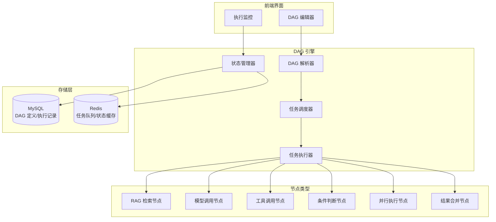
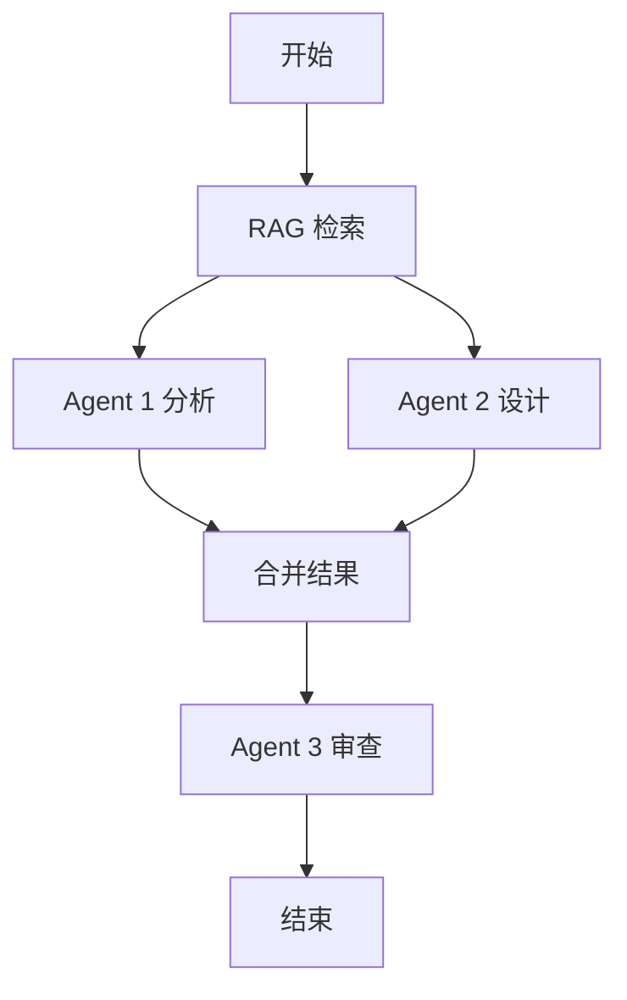

# 方案 3：自研 DAG 引擎方案

## 一、方案概述

基于 DAG（有向无环图）构建自研的任务编排引擎，适合复杂的 Multi-Agent 协作场景。

**核心优势**：
- ✅ 完全自主可控
- ✅ 支持复杂的并行和依赖关系
- ✅ 可视化 DAG 编排界面
- ✅ 动态任务图生成
- ✅ 支持条件分支和循环

## 二、架构设计



## 三、核心概念

### 3.1 DAG 定义

```java
/**
 * DAG 定义
 * @author xiexu
 */
@Data
public class DagDefinition {
    /**
     * DAG ID
     */
    private String dagId;

    /**
     * DAG 名称
     */
    private String name;

    /**
     * 节点列表
     */
    private List<DagNode> nodes;

    /**
     * 边列表（依赖关系）
     */
    private List<DagEdge> edges;

    /**
     * 全局参数
     */
    private Map<String, Object> globalParams;
}
```

### 3.2 节点定义

```java
/**
 * DAG 节点
 * @author xiexu
 */
@Data
public class DagNode {
    /**
     * 节点 ID
     */
    private String nodeId;

    /**
     * 节点名称
     */
    private String name;

    /**
     * 节点类型
     */
    private NodeType type;

    /**
     * 节点配置
     */
    private Map<String, Object> config;

    /**
     * 重试次数
     */
    private int retryCount = 3;

    /**
     * 超时时间（秒）
     */
    private int timeout = 300;
}
```

### 3.3 节点类型

```java
/**
 * 节点类型枚举
 * @author xiexu
 */
public enum NodeType {
    RAG_RETRIEVAL,      // RAG 检索
    MODEL_CALL,         // 模型调用
    TOOL_CALL,          // 工具调用
    CONDITION,          // 条件判断
    PARALLEL,           // 并行执行
    MERGE,              // 结果合并
    TRANSFORM,          // 数据转换
    LOOP,               // 循环执行
    SUBDAG              // 子 DAG
}
```

### 3.4 边定义

```java
/**
 * DAG 边（依赖关系）
 * @author xiexu
 */
@Data
public class DagEdge {
    /**
     * 源节点 ID
     */
    private String sourceNodeId;

    /**
     * 目标节点 ID
     */
    private String targetNodeId;

    /**
     * 条件表达式（可选）
     */
    private String condition;
}
```

## 四、DAG 引擎实现

### 4.1 DAG 解析器

```java
/**
 * DAG 解析器
 * @author xiexu
 */
@Service
@Slf4j
public class DagParser {

    /**
     * 解析 DAG 定义，构建执行图
     */
    public DagExecutionGraph parse(DagDefinition definition) {
        log.info("解析 DAG: {}", definition.getDagId());

        // 1. 验证 DAG 合法性
        validateDag(definition);

        // 2. 构建邻接表
        Map<String, List<String>> adjacencyList = buildAdjacencyList(definition);

        // 3. 拓扑排序，确定执行顺序
        List<String> topologicalOrder = topologicalSort(adjacencyList);

        // 4. 识别可并行执行的节点
        List<Set<String>> parallelLevels = identifyParallelLevels(adjacencyList, topologicalOrder);

        return new DagExecutionGraph(definition, adjacencyList, parallelLevels);
    }

    /**
     * 验证 DAG 合法性
     */
    private void validateDag(DagDefinition definition) {
        // 1. 检查是否有环
        if (hasCycle(definition)) {
            throw new IllegalArgumentException("DAG 包含环，不是有向无环图");
        }

        // 2. 检查节点 ID 唯一性
        Set<String> nodeIds = new HashSet<>();
        for (DagNode node : definition.getNodes()) {
            if (!nodeIds.add(node.getNodeId())) {
                throw new IllegalArgumentException("节点 ID 重复: " + node.getNodeId());
            }
        }

        // 3. 检查边的有效性
        for (DagEdge edge : definition.getEdges()) {
            if (!nodeIds.contains(edge.getSourceNodeId())) {
                throw new IllegalArgumentException("边的源节点不存在: " + edge.getSourceNodeId());
            }
            if (!nodeIds.contains(edge.getTargetNodeId())) {
                throw new IllegalArgumentException("边的目标节点不存在: " + edge.getTargetNodeId());
            }
        }
    }

    /**
     * 检查是否有环（DFS）
     */
    private boolean hasCycle(DagDefinition definition) {
        Map<String, List<String>> adjacencyList = buildAdjacencyList(definition);
        Set<String> visited = new HashSet<>();
        Set<String> recursionStack = new HashSet<>();

        for (String nodeId : adjacencyList.keySet()) {
            if (hasCycleDfs(nodeId, adjacencyList, visited, recursionStack)) {
                return true;
            }
        }

        return false;
    }

    private boolean hasCycleDfs(String nodeId, Map<String, List<String>> adjacencyList,
                                Set<String> visited, Set<String> recursionStack) {
        if (recursionStack.contains(nodeId)) {
            return true;
        }
        if (visited.contains(nodeId)) {
            return false;
        }

        visited.add(nodeId);
        recursionStack.add(nodeId);

        List<String> neighbors = adjacencyList.getOrDefault(nodeId, Collections.emptyList());
        for (String neighbor : neighbors) {
            if (hasCycleDfs(neighbor, adjacencyList, visited, recursionStack)) {
                return true;
            }
        }

        recursionStack.remove(nodeId);
        return false;
    }

    /**
     * 构建邻接表
     */
    private Map<String, List<String>> buildAdjacencyList(DagDefinition definition) {
        Map<String, List<String>> adjacencyList = new HashMap<>();

        // 初始化所有节点
        for (DagNode node : definition.getNodes()) {
            adjacencyList.put(node.getNodeId(), new ArrayList<>());
        }

        // 添加边
        for (DagEdge edge : definition.getEdges()) {
            adjacencyList.get(edge.getSourceNodeId()).add(edge.getTargetNodeId());
        }

        return adjacencyList;
    }

    /**
     * 拓扑排序（Kahn 算法）
     */
    private List<String> topologicalSort(Map<String, List<String>> adjacencyList) {
        // 计算入度
        Map<String, Integer> inDegree = new HashMap<>();
        for (String nodeId : adjacencyList.keySet()) {
            inDegree.put(nodeId, 0);
        }
        for (List<String> neighbors : adjacencyList.values()) {
            for (String neighbor : neighbors) {
                inDegree.put(neighbor, inDegree.get(neighbor) + 1);
            }
        }

        // 找到所有入度为 0 的节点
        Queue<String> queue = new LinkedList<>();
        for (Map.Entry<String, Integer> entry : inDegree.entrySet()) {
            if (entry.getValue() == 0) {
                queue.offer(entry.getKey());
            }
        }

        // 拓扑排序
        List<String> result = new ArrayList<>();
        while (!queue.isEmpty()) {
            String nodeId = queue.poll();
            result.add(nodeId);

            for (String neighbor : adjacencyList.get(nodeId)) {
                inDegree.put(neighbor, inDegree.get(neighbor) - 1);
                if (inDegree.get(neighbor) == 0) {
                    queue.offer(neighbor);
                }
            }
        }

        return result;
    }

    /**
     * 识别可并行执行的节点层级
     */
    private List<Set<String>> identifyParallelLevels(Map<String, List<String>> adjacencyList,
                                                      List<String> topologicalOrder) {
        List<Set<String>> levels = new ArrayList<>();
        Map<String, Integer> nodeLevel = new HashMap<>();

        // 计算每个节点的层级
        for (String nodeId : topologicalOrder) {
            int maxParentLevel = -1;
            for (Map.Entry<String, List<String>> entry : adjacencyList.entrySet()) {
                if (entry.getValue().contains(nodeId)) {
                    maxParentLevel = Math.max(maxParentLevel, nodeLevel.get(entry.getKey()));
                }
            }
            int currentLevel = maxParentLevel + 1;
            nodeLevel.put(nodeId, currentLevel);

            // 添加到对应层级
            while (levels.size() <= currentLevel) {
                levels.add(new HashSet<>());
            }
            levels.get(currentLevel).add(nodeId);
        }

        return levels;
    }
}
```

### 4.2 任务调度器

```java
/**
 * DAG 任务调度器
 * @author xiexu
 */
@Service
@Slf4j
@RequiredArgsConstructor
public class DagScheduler {

    private final DagExecutor dagExecutor;
    private final DagStateManager stateManager;
    private final ThreadPoolExecutor executorService;

    /**
     * 调度 DAG 执行
     */
    public CompletableFuture<DagExecutionResult> schedule(DagExecutionGraph graph, Map<String, Object> inputs) {
        String executionId = UUID.randomUUID().toString();
        log.info("开始调度 DAG 执行，executionId: {}", executionId);

        // 初始化执行状态
        stateManager.initExecution(executionId, graph);

        return CompletableFuture.supplyAsync(() -> {
            try {
                // 按层级执行
                for (Set<String> level : graph.getParallelLevels()) {
                    log.info("执行层级: {}", level);

                    // 并行执行同一层级的节点
                    List<CompletableFuture<NodeExecutionResult>> futures = level.stream()
                        .map(nodeId -> executeNodeAsync(executionId, graph, nodeId, inputs))
                        .collect(Collectors.toList());

                    // 等待当前层级所有节点完成
                    CompletableFuture.allOf(futures.toArray(new CompletableFuture[0])).join();

                    // 检查是否有节点失败
                    for (CompletableFuture<NodeExecutionResult> future : futures) {
                        NodeExecutionResult result = future.get();
                        if (!result.isSuccess()) {
                            throw new RuntimeException("节点执行失败: " + result.getNodeId());
                        }
                    }
                }

                return DagExecutionResult.success(executionId);
            } catch (Exception e) {
                log.error("DAG 执行失败", e);
                stateManager.markFailed(executionId, e.getMessage());
                return DagExecutionResult.failure(executionId, e.getMessage());
            }
        }, executorService);
    }

    /**
     * 异步执行单个节点
     */
    private CompletableFuture<NodeExecutionResult> executeNodeAsync(
            String executionId, DagExecutionGraph graph, String nodeId, Map<String, Object> inputs) {

        return CompletableFuture.supplyAsync(() -> {
            log.info("执行节点: {}", nodeId);
            stateManager.markNodeRunning(executionId, nodeId);

            try {
                DagNode node = graph.getNode(nodeId);
                NodeExecutionResult result = dagExecutor.execute(node, inputs);

                stateManager.markNodeCompleted(executionId, nodeId, result);
                return result;
            } catch (Exception e) {
                log.error("节点执行失败: {}", nodeId, e);
                stateManager.markNodeFailed(executionId, nodeId, e.getMessage());
                return NodeExecutionResult.failure(nodeId, e.getMessage());
            }
        }, executorService);
    }
}
```

### 4.3 节点执行器

```java
/**
 * DAG 节点执行器
 * @author xiexu
 */
@Service
@Slf4j
@RequiredArgsConstructor
public class DagExecutor {

    private final Map<NodeType, NodeHandler> handlers;

    /**
     * 执行节点
     */
    public NodeExecutionResult execute(DagNode node, Map<String, Object> inputs) {
        log.info("执行节点: {}, 类型: {}", node.getNodeId(), node.getType());

        NodeHandler handler = handlers.get(node.getType());
        if (handler == null) {
            throw new IllegalArgumentException("不支持的节点类型: " + node.getType());
        }

        // 执行节点，支持重试
        int retryCount = 0;
        Exception lastException = null;

        while (retryCount <= node.getRetryCount()) {
            try {
                return handler.handle(node, inputs);
            } catch (Exception e) {
                lastException = e;
                retryCount++;
                log.warn("节点执行失败，重试 {}/{}", retryCount, node.getRetryCount(), e);

                if (retryCount <= node.getRetryCount()) {
                    // 指数退避
                    try {
                        Thread.sleep((long) Math.pow(2, retryCount) * 1000);
                    } catch (InterruptedException ie) {
                        Thread.currentThread().interrupt();
                        break;
                    }
                }
            }
        }

        throw new RuntimeException("节点执行失败，已重试 " + node.getRetryCount() + " 次", lastException);
    }
}
```

### 4.4 节点处理器

```java
/**
 * 节点处理器接口
 * @author xiexu
 */
public interface NodeHandler {
    /**
     * 处理节点
     */
    NodeExecutionResult handle(DagNode node, Map<String, Object> inputs);
}

/**
 * RAG 检索节点处理器
 * @author xiexu
 */
@Component
@Slf4j
@RequiredArgsConstructor
public class RagRetrievalNodeHandler implements NodeHandler {

    private final RagAppService ragAppService;

    @Override
    public NodeExecutionResult handle(DagNode node, Map<String, Object> inputs) {
        log.info("执行 RAG 检索节点: {}", node.getNodeId());

        // 从配置中获取参数
        List<String> ragTags = (List<String>) node.getConfig().get("ragTags");
        String prompt = (String) inputs.get("prompt");

        // 执行 RAG 检索
        List<String> contexts = ragAppService.search(ragTags, prompt);

        // 返回结果
        Map<String, Object> outputs = new HashMap<>();
        outputs.put("ragContexts", contexts);

        return NodeExecutionResult.success(node.getNodeId(), outputs);
    }
}

/**
 * 模型调用节点处理器
 * @author xiexu
 */
@Component
@Slf4j
@RequiredArgsConstructor
public class ModelCallNodeHandler implements NodeHandler {

    private final ModelProviderFactory modelProviderFactory;
    private final ModelConfigRepository modelConfigRepository;

    @Override
    public NodeExecutionResult handle(DagNode node, Map<String, Object> inputs) {
        log.info("执行模型调用节点: {}", node.getNodeId());

        // 从配置中获取参数
        Long modelId = Long.valueOf(node.getConfig().get("modelId").toString());
        String prompt = (String) inputs.get("prompt");
        List<String> ragContexts = (List<String>) inputs.get("ragContexts");

        // 查询模型配置
        ModelConfig model = modelConfigRepository.findById(new IdQuery(modelId));

        // 构建完整提示词
        String fullPrompt = buildPromptWithContext(prompt, ragContexts);

        // 调用模型
        ModelProvider provider = modelProviderFactory.getProvider(model.getModelType());
        String result = provider.call(model, fullPrompt);

        // 返回结果
        Map<String, Object> outputs = new HashMap<>();
        outputs.put("modelResponse", result);

        return NodeExecutionResult.success(node.getNodeId(), outputs);
    }

    private String buildPromptWithContext(String prompt, List<String> ragContexts) {
        if (ragContexts == null || ragContexts.isEmpty()) {
            return prompt;
        }

        StringBuilder sb = new StringBuilder();
        sb.append("参考上下文：\n");
        for (String context : ragContexts) {
            sb.append("- ").append(context).append("\n");
        }
        sb.append("\n用户问题：").append(prompt);

        return sb.toString();
    }
}

/**
 * 条件判断节点处理器
 * @author xiexu
 */
@Component
@Slf4j
public class ConditionNodeHandler implements NodeHandler {

    @Override
    public NodeExecutionResult handle(DagNode node, Map<String, Object> inputs) {
        log.info("执行条件判断节点: {}", node.getNodeId());

        // 从配置中获取条件表达式
        String condition = (String) node.getConfig().get("condition");

        // 评估条件（这里简化处理，实际可以使用 SpEL 或其他表达式引擎）
        boolean result = evaluateCondition(condition, inputs);

        // 返回结果
        Map<String, Object> outputs = new HashMap<>();
        outputs.put("conditionResult", result);

        return NodeExecutionResult.success(node.getNodeId(), outputs);
    }

    private boolean evaluateCondition(String condition, Map<String, Object> inputs) {
        // 简化实现，实际应该使用 SpEL 或 MVEL
        // 例如：inputs.get("score") > 0.8
        return true;
    }
}
```

## 五、DAG 示例

### 5.1 Multi-Agent 协作 DAG

```json
{
  "dagId": "multi-agent-collaboration",
  "name": "多 Agent 协作任务",
  "nodes": [
    {
      "nodeId": "rag-retrieval",
      "name": "RAG 检索",
      "type": "RAG_RETRIEVAL",
      "config": {
        "ragTags": ["java", "spring"]
      }
    },
    {
      "nodeId": "agent-1-analyze",
      "name": "Agent 1 分析",
      "type": "MODEL_CALL",
      "config": {
        "modelId": 1,
        "systemPrompt": "你是一个代码分析专家"
      }
    },
    {
      "nodeId": "agent-2-design",
      "name": "Agent 2 设计",
      "type": "MODEL_CALL",
      "config": {
        "modelId": 2,
        "systemPrompt": "你是一个架构设计专家"
      }
    },
    {
      "nodeId": "merge-results",
      "name": "合并结果",
      "type": "MERGE",
      "config": {
        "mergeStrategy": "concat"
      }
    },
    {
      "nodeId": "agent-3-review",
      "name": "Agent 3 审查",
      "type": "MODEL_CALL",
      "config": {
        "modelId": 3,
        "systemPrompt": "你是一个代码审查专家"
      }
    }
  ],
  "edges": [
    {
      "sourceNodeId": "rag-retrieval",
      "targetNodeId": "agent-1-analyze"
    },
    {
      "sourceNodeId": "rag-retrieval",
      "targetNodeId": "agent-2-design"
    },
    {
      "sourceNodeId": "agent-1-analyze",
      "targetNodeId": "merge-results"
    },
    {
      "sourceNodeId": "agent-2-design",
      "targetNodeId": "merge-results"
    },
    {
      "sourceNodeId": "merge-results",
      "targetNodeId": "agent-3-review"
    }
  ]
}
```

### 5.2 执行流程图



## 六、前端 DAG 编辑器

使用 **AntV X6** 或 **React Flow** 构建可视化 DAG 编辑器。

```typescript
// 示例：使用 AntV X6
import { Graph } from '@antv/x6'

const graph = new Graph({
  container: document.getElementById('container'),
  grid: true,
  panning: true,
  mousewheel: true,
})

// 添加节点
graph.addNode({
  id: 'rag-retrieval',
  shape: 'rect',
  x: 100,
  y: 100,
  width: 120,
  height: 60,
  label: 'RAG 检索',
  attrs: {
    body: {
      fill: '#5F95FF',
      stroke: '#5F95FF',
    },
    label: {
      fill: '#fff',
    },
  },
})

// 添加边
graph.addEdge({
  source: 'rag-retrieval',
  target: 'agent-1-analyze',
})
```

## 七、优势

1. **完全自主可控**：不依赖第三方框架
2. **灵活性高**：可以根据需求定制任何功能
3. **可视化编排**：提供 DAG 编辑器，拖拽式配置
4. **支持复杂场景**：并行、条件分支、循环、子 DAG
5. **动态任务图**：可以根据运行时条件动态生成 DAG

## 八、不足

1. **开发成本高**：需要从零开发整个引擎
2. **维护成本高**：需要持续维护和优化
3. **稳定性风险**：没有经过大规模生产验证
4. **功能不完善**：需要逐步补充各种功能

## 九、适用场景

- 极其复杂的 Multi-Agent 协作场景
- 需要高度定制化的编排逻辑
- 需要可视化 DAG 编辑器
- 有足够的开发资源和时间
- 对第三方框架有顾虑

## 十、实施建议

1. **MVP 优先**：先实现核心功能，逐步迭代
2. **参考开源项目**：学习 Airflow、Prefect 等项目的设计
3. **分阶段实施**：
   - 阶段 1：基础 DAG 解析和执行
   - 阶段 2：状态持久化和恢复
   - 阶段 3：可视化编辑器
   - 阶段 4：分布式调度
4. **充分测试**：编写完善的单元测试和集成测试