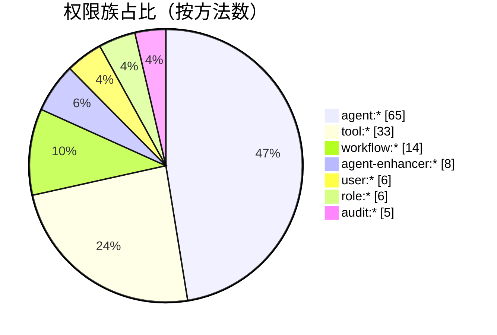
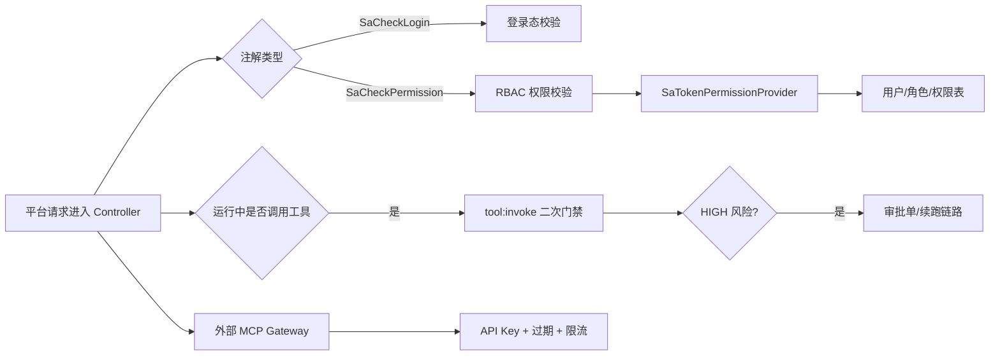

# 鉴权权限矩阵（Controller × Permission）

> 统计口径：基于 `ai-mcp-knowledge-trigger/src/main/java/com/xbk/knowledge/trigger/http/*.java` 中注解扫描。  
> 统计时间：2026-02-27。  
> 配套文档：[`鉴权链路从0到1.md`](./鉴权链路从0到1.md)、[`API-接口索引.md`](./API-接口索引.md)。

## 1. 快速概览

- `@SaCheckPermission` 标注的方法数：`137`
- 涉及权限码数量：`19`
- `@SaCheckLogin` 标注的方法数：`3`
- 外部 API Key 鉴权协议接口：`2`（MCP Gateway）
- XXL 接口：无统一 `@SaCheckPermission`，由 `XxlPermissionGuard` 在 Controller 内二次校验

## 2. 权限总览图

## 3. 权限码矩阵（方法级统计）

| 权限码 | 方法数 | 覆盖 Controller | 说明 |
|---|---:|---|---|
| `agent:write` | 35 | `AgentController` `AgentScheduleController` `AgentVersionController` `ChatSessionController` `ClientProfileController` `ModelConfigController` `PreheatController` `PromptTemplateController` `RagController` | Agent 主写权限 |
| `agent:read` | 23 | `AICallController` `AgentController` `AgentScheduleController` `AgentVersionController` `ChatSessionController` `ClientProfileController` `ModelConfigController` `PromptTemplateController` `RagController` | Agent 主读权限 |
| `tool:write` | 17 | `GatewayManageController` `McpServerConfigController` | 工具与网关配置写权限 |
| `tool:read` | 11 | `GatewayManageController` `McpServerConfigController` `McpToolController` | 工具与网关配置读权限 |
| `workflow:read` | 7 | `WorkflowController` `WorkflowRuntimeController` | Workflow 主读权限 |
| `workflow:write` | 5 | `PreheatController` `WorkflowController` | Workflow 写权限 |
| `audit:read` | 5 | `AuditEventController` `MetricsController` | 审计/指标只读 |
| `agent-enhancer:write` | 5 | `AgentEnhancerController` | Agent 增强器写权限 |
| `user:write` | 4 | `UserIdentityController` | 用户管理写权限 |
| `tool:approve` | 4 | `ApprovalController` | 工具审批权限 |
| `agent:publish` | 4 | `AgentVersionController` `PromptTemplateController` | 发布权限 |
| `role:write` | 3 | `RoleController` | 角色管理写权限 |
| `role:read` | 3 | `PermissionController` `RoleController` | 角色/权限读取 |
| `agent:invoke` | 3 | `AgentRuntimeController` | Agent 运行调用 |
| `agent-enhancer:read` | 3 | `AgentEnhancerController` | Agent 增强器读权限 |
| `user:read` | 2 | `UserIdentityController` | 用户管理读权限 |
| `workflow:publish` | 1 | `WorkflowController` | Workflow 发布权限 |
| `workflow:invoke` | 1 | `WorkflowRuntimeController` | Workflow 运行调用 |
| `tool:invoke` | 1 | `GatewayManageController` | 接口层工具调用权限（另有运行时二次门禁） |

## 4. 特殊门禁矩阵（非纯 `@SaCheckPermission`）

| 门禁类型 | 入口 | 位置 | 说明 |
|---|---|---|---|
| `LOGIN` | `/api/auth/logout` `/api/auth/me` `/api/workbench/summary` | `AuthController` `WorkbenchController` | 只要求登录态，不要求具体权限码 |
| `API Key` | `/api/gateway/{gatewayId}/mcp/sse` `/api/gateway/{gatewayId}/mcp/message` | `McpGatewayController` + `GatewaySessionService` | 外部 MCP 客户端接入鉴权，校验 key/过期/限流 |
| `XxlPermissionGuard` | `/api/xxl/**` | `XxlAdminController` | Controller 内部调用 `assertCanView/assertCanEdit`，对应 `workflow:read/workflow:write` |
| `工具二次门禁` | 运行时工具回调（非纯 HTTP 注解） | `GatewayToolCallbackProvider` `DynamicMcpToolCallbackProvider` | 再次检查 `tool:invoke`，并在 HIGH 风险时触发审批 |

## 5. 读图建议（排障顺序）

1. 先看接口有没有 `@SaCheckPermission` 或 `@SaCheckLogin`。  
2. 再看当前用户是否拥有对应权限码。  
3. 如果接口过了但工具调用失败，继续查“工具二次门禁”和审批状态。  
4. 如果是外部 MCP 客户端，优先查 API Key、过期时间、限流窗口。  
