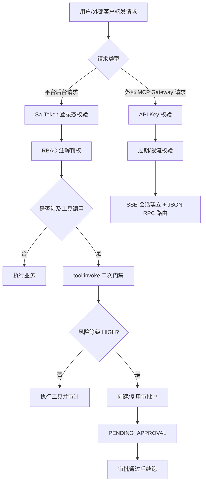
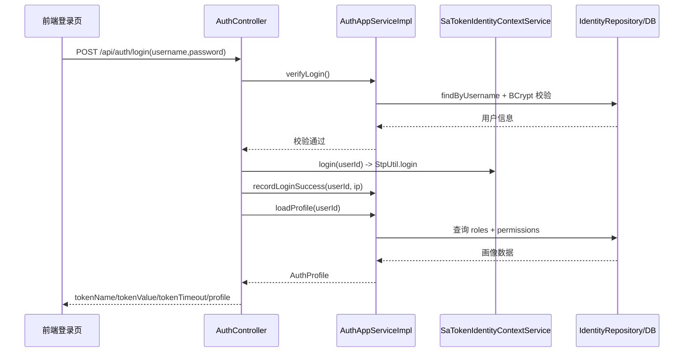
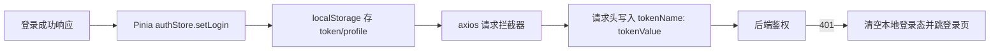
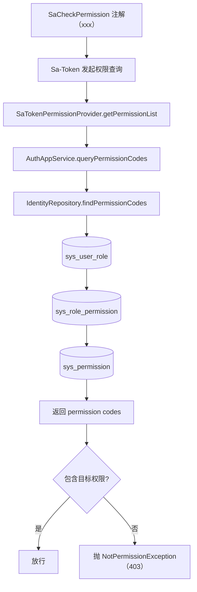
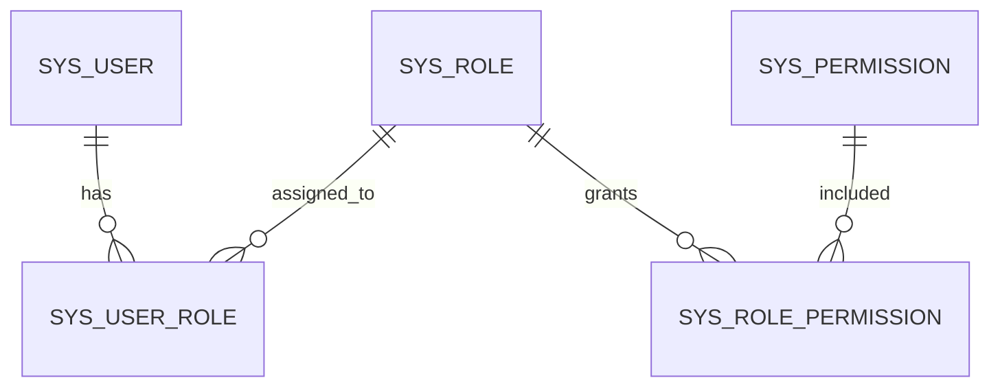
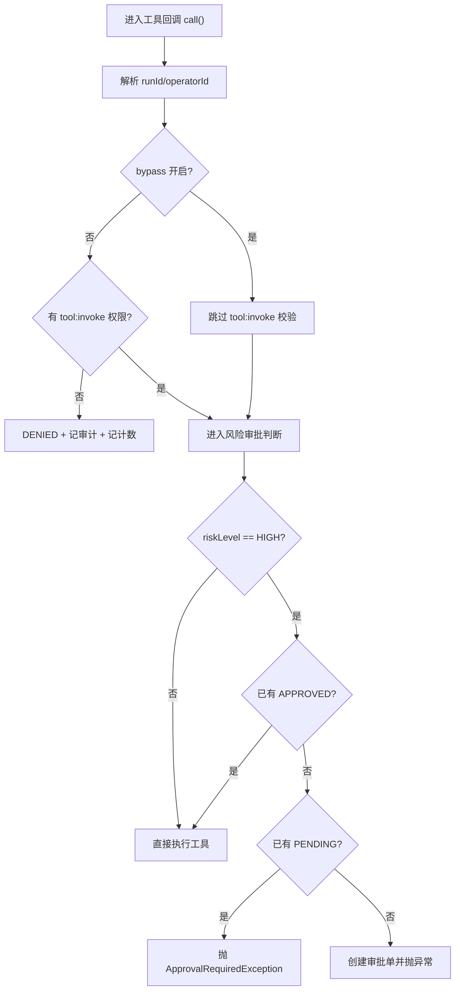
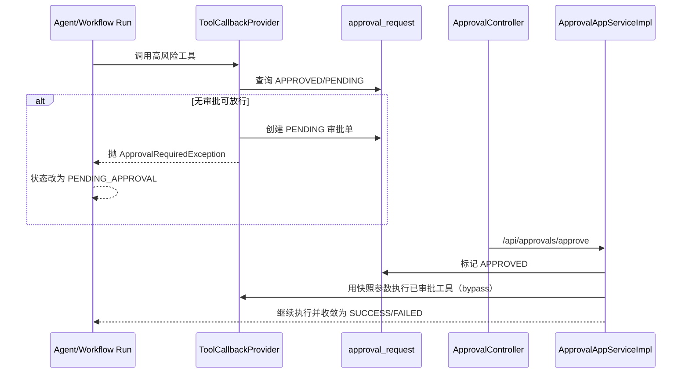
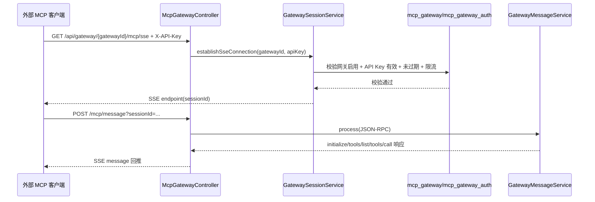
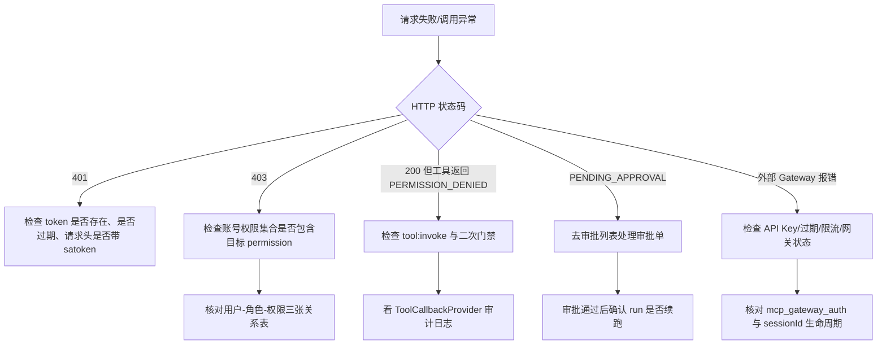

# 鉴权链路从0到1（大白话+图表版）

> 配套阅读：[`鉴权权限矩阵.md`](./鉴权权限矩阵.md)、[`API-接口索引.md`](./API-接口索引.md)

## 1. 先说结论：项目里有 4 层门禁

如果你只记一句话：这个项目不是“登录一次就完事”，而是“分层鉴权”。

1. 平台登录鉴权（你是谁）  
2. 平台 RBAC 鉴权（你能做什么）  
3. 工具调用二次门禁（运行时还能不能调工具）  
4. 外部 Gateway API Key 鉴权（外部客户端接入）  

---

## 2. 平台登录链路（你是谁）

### 2.1 登录时序图

### 2.2 大白话解释

后端 `AuthController.login` 干 5 件事：

1. 校验参数  
2. 校验用户名密码和账号状态（`AuthAppServiceImpl.verifyLogin`）  
3. 建立 Sa-Token 登录态（`StpUtil.login`）  
4. 记录登录时间/IP  
5. 返回 token + 用户画像（角色/权限）  

关键代码：
- `ai-mcp-knowledge-trigger/.../AuthController.java`
- `ai-mcp-knowledge-application/.../AuthAppServiceImpl.java`
- `ai-mcp-knowledge-infrastructure/.../SaTokenIdentityContextService.java`

---

## 3. 前端如何接住登录态

关键点：

1. 前端不是写死 `Authorization`，而是按后端返回的 `tokenName` 动态塞请求头。  
2. 响应拦截器拿到 401 会自动清理本地态并重定向登录页。  
3. 路由守卫 + 按钮权限只是“体验层”，真正安全边界在后端。  

---

## 4. RBAC 权限链路（你能做什么）

### 4.1 判权数据流图

### 4.2 数据关系图（简化）

### 4.3 一句话规则

用户没有直接挂权限，而是通过“用户-角色-权限”三跳拿到最终权限集合。  
超管（`is_super_admin=1`）直接拿全部启用权限。

---

## 5. 工具调用二次门禁（最容易漏）

为什么会出现“接口有权限，但工具调用还是被拦”？  
因为工具在运行时还有独立门禁，不只看 Controller 注解。

### 5.1 决策流程图

### 5.2 两个实现入口

1. `GatewayToolCallbackProvider`：HTTP Gateway 工具  
2. `DynamicMcpToolCallbackProvider`：动态 MCP 工具  

两者都会校验 `tool:invoke`，并写工具审计与调用计数。

---

## 6. 审批续跑链路（PENDING_APPROVAL 怎么恢复）

大白话：

1. 运行中遇到高风险工具就先挂起。  
2. 人工审批通过后，系统拿审批快照继续跑，不需要用户重新触发整条链路。  

---

## 7. 外部 MCP Gateway API Key 鉴权链路

### 7.1 建连 + 消息时序图

### 7.2 核心规则

1. `mcp_gateway_auth` 有启用记录时，API Key 必填。  
2. 支持 `expire_time` 过期控制。  
3. 限流按 `gatewayId + apiKey` 做分钟窗口计数。  

---

## 8. 权限与模块对照表（速查）

| 权限码 | 常见用途 | 典型接口 |
|---|---|---|
| `user:read` | 查用户 | `/api/users/list` |
| `user:write` | 改用户/重置密码/分配角色 | `/api/users/create` `/api/users/reset-password` |
| `role:read` | 查角色和权限 | `/api/roles/list` `/api/permissions/list` |
| `role:write` | 改角色/授予权限 | `/api/roles/grant-permissions` |
| `agent:invoke` | 调 Agent | `/api/agents/{agentCode}/chat` |
| `workflow:invoke` | 调 Workflow | `/api/workflows/{workflowCode}/run` |
| `tool:read` | 查工具和网关配置 | `/api/gateway/manage/tools/list` |
| `tool:write` | 改工具和凭证 | `/api/gateway/manage/auth/save` |
| `tool:invoke` | 调工具（二次门禁关键） | `/api/gateway/manage/tools/debug` + 运行时工具回调 |
| `tool:approve` | 审批高风险工具 | `/api/approvals/approve` |
| `audit:read` | 查审计日志/指标 | `/api/audit/events/list` |

---

## 9. 核心数据表速查

| 表名 | 用途 |
|---|---|
| `sys_user` | 用户主体（含 `is_super_admin`） |
| `sys_role` | 角色定义 |
| `sys_permission` | 权限定义 |
| `sys_user_role` | 用户-角色关系 |
| `sys_role_permission` | 角色-权限关系 |
| `sys_audit_event` | 统一审计事件 |
| `mcp_gateway` | 外部网关实例 |
| `mcp_gateway_auth` | 外部 API Key 凭证 |
| `mcp_tool_registry` | 工具注册（含 `tool_key`、`risk_level`） |
| `approval_request` | 高风险工具审批单 |

---

## 10. 排障决策图（建议按图排）

---

## 11. 当前实现注意点（读源码时必看）

1. 权限查询 SQL 主要依赖 `sys_permission.status=1`，排查角色禁用生效时要结合实际 SQL。  
2. 用户状态校验发生在登录时；已登录用户是否立即失效要结合 token 生命周期看。  
3. 外部 Gateway 的 API Key 当前是明文存储，生产环境建议加密/哈希治理。  
4. 工具审批是运行时门禁，不是接口注解的替代，而是补充。  

---

## 12. 一句话复盘

真正的完整链路是：

登录鉴权（身份） -> RBAC（接口权限） -> 工具二次门禁（运行时权限） -> 审批续跑（高风险治理） -> 外部 API Key 鉴权（网关接入）。

四层一起看，才是这个项目的完整安全闭环。
